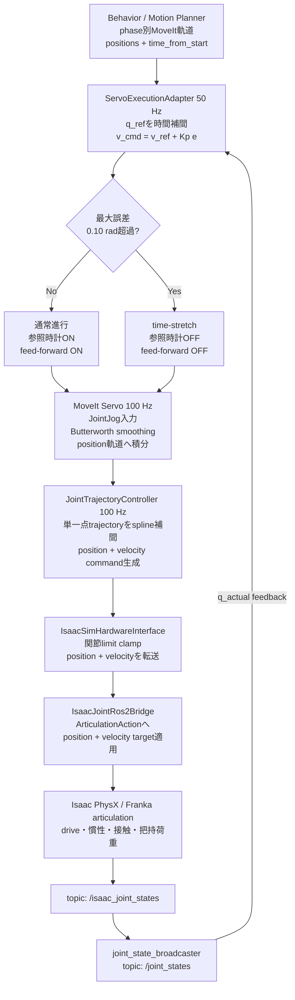
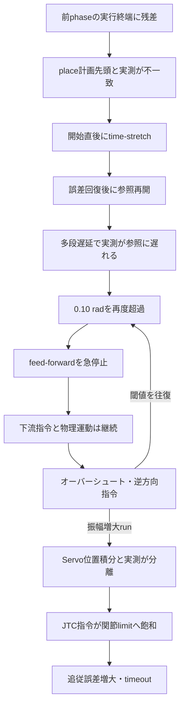
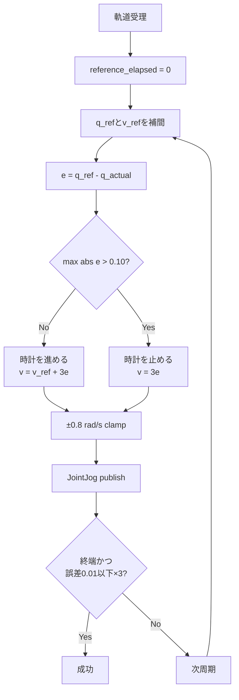

# Step 3-8-2 time-stretch・Servo/JTC追従発散の真因解析

**作成日**: 2026-07-17  
**対象**: Step 3-8 修正6の時間同期JointJog実行  
**範囲**: 原因・発生メカニズムの特定のみ。対策設計・実装は本レポートの対象外。

## 1. Overview

### 1.1 結論

Step 3-8で観測したplace追従発散の真因は、単一モジュールの符号誤りや関節角の不連続ではない。**同じ関節軌道に対して、上流から下流まで複数段の時間整形・補間・閉ループ制御を直列に重ねた遅延系へ、0.10 radを境に参照時計とfeed-forwardを不連続にON/OFFするtime-stretchを追加したこと**が真因である。

具体的には次の因果鎖で発生する。

1. place軌道は、計画時に想定した前phase終端を先頭点とするが、実行時のpull終端はServo、JTC、Isaac物理の追従誤差を残す。
2. そのためplace開始時点で`q_ref(0)`と`q_actual`にすでに0.10 radを超える接続ずれがあり、time-stretchが開始直後から発火する。再計測runではjoint2で**0.214462 rad**だった。
3. 接続ずれを解消した後も、動作中の参照は実測より約0.09〜0.10 rad先行する。adapterの参照進行、Servoの平滑化・position積分、JTCのspline補間、Isaac articulationの物理応答という多段遅延に対し、0.10 radという閾値が定常追従遅れとほぼ同じ値だからである。
4. 誤差が0.10 radを超えると、参照時計を止めるだけでなくfeed-forwardを即座に0へ落とす。出力は「軌道速度＋位置feedback」から「位置feedbackのみ」へ不連続に切り替わる。
5. 下流には切替前の位置・速度指令と物理運動が残っているため、実測はすぐには止まらない。誤差が縮小してもオーバーシュートし、adapterは逆方向を指令する。
6. 逆方向指令もServoで平滑化・位置積分され、JTCで再補間されるため遅れてIsaacへ届く。閾値を跨ぐたびに同じ切替を繰り返し、リミットサイクルになる。
7. 振幅が大きいrunでは、Servoが生成するJTC位置指令が実測で再基準化されないまま速度指令を積分し続ける。指令位置と実測位置の差が拡大し、最終的に関節上限付近へ飽和してtimeoutする。

したがって、**time-stretchは発散を防ぐ安全機構として意図されたが、現在の多段遅延系では「追従遅れの結果」として頻繁に発火し、その不連続切替が新たな励振源になっている**。

### 1.2 全体アーキテクチャ

文字サイズを確保するため、制御経路を縦方向に示す。

### 1.3 現象の俯瞰

## 2. 入出力と現行挙動

### 2.1 入力信号

- `phase_motion_plan.trajectory`: MoveItが生成した関節位置列、速度列、`time_from_start`。adapterの時間参照の正本。
- `/joint_states`: ros2_controlがIsaac実測から公開する関節位置・速度。`q_actual`およびtime-stretch判定に使用する。
- `/joint_trajectory_controller/joint_trajectory`: MoveIt Servoが生成したJTC向けposition trajectory。診断上の`q_jtc`。
- `/isaac_joint_commands`: JTC→hardware interfaceを経てIsaacへ実際に渡すposition・velocity指令。診断上の`q_hardware`、`v_hardware`。

### 2.2 出力信号

- `/tomato_harvest/moveit_servo/delta_joint_cmds`: adapterが50 Hzで出す`JointJog`。`speed_units`なのでrad/s。
- `execution_status`: running、succeeded、abortedと最大誤差。
- `servo_joint_tracking_sample`: target、参照、実測、Servo出力、hardware出力を同一sequenceで比較する診断ログ。

### 2.3 モジュール内の処理概要

## 3. 発生メカニズムの詳細解析

### 3.1 なぜ最初のtime-stretchが発生したか

再計測run `.artifacts/step3-8-2/root-cause-command-path-retry/e2e` では、place target受理直後に以下を観測した。

| 信号 | joint2 [rad] |
|---|---:|
| place軌道先頭 `q_first = q_ref(0)` | -0.005193 |
| 実測 `q_actual` | +0.209268 |
| 初期誤差 | **-0.214462** |

閾値0.10 radの2倍を超えているため、place開始の最初の制御周期から参照時計は停止した。この差はtarget差し替えではない。place軌道が想定するphase接続状態と、pullをServo経由で実行した実到達状態の差である。

前runでもplace開始時にjoint4で約0.107 radの接続差を観測しており、関節と大きさはrun依存だが「先頭点と実測が一致しない」現象は再現している。全phaseを計画軌道上の終端で接続しても、各phaseを遅延のある別の閉ループ系で実行する限り、実行時の接続点は計画値と一致しない。

### 3.2 なぜ通常追従中にもtime-stretchが繰り返すか

pregraspの正常追従区間でも、次の関係が継続していた。

| 代表値 | adapter `v_cmd` | hardware `v_hardware` | 追従誤差 |
|---|---:|---:|---:|
| sequence 3 | -0.728779 rad/s | -0.410864 rad/s | 0.097926 rad |
| sequence 7 | -0.734859 rad/s | -0.402248 rad/s | 0.099953 rad |
| sequence 8、time-stretch発火 | -0.304771 rad/s | -0.407587 rad/s | 0.101590 rad |

adapterが約0.73 rad/sを要求しても、JTCからIsaacへ届く速度は約0.40 rad/sだった。Servo smoothing、position trajectory化、JTC spline補間を経て、上流参照の進行速度と下流実効速度に差がある。誤差は0.10 rad付近まで自然に蓄積し、閾値を周期的に跨ぐ。

sequence 8ではadapterがtime-stretchにより出力を約-0.30 rad/sへ落とした後も、同時点のhardware速度は約-0.41 rad/sだった。これは下流が切替前の運動を継続している定量的証拠であり、time-stretchが即時ブレーキとして働かないことを示す。

### 3.3 なぜ誤差回復指令と反対方向へ実測が動くか

placeの反転区間では次を観測した。

| sequence | q_ref | q_actual | v_cmd | v_hardware | 状態 |
|---:|---:|---:|---:|---:|---|
| 89 | -0.131436 | -0.226819 | +0.307206 | +0.045451 | 復帰指令へ反転開始 |
| 91 | -0.131014 | -0.328980 | +0.593897 | +0.247925 | hardwareも正方向だが実測は負方向継続 |
| 93 | -0.131014 | -0.420711 | +0.800000 | +0.428043 | 正方向飽和中も実測は負方向 |
| 95 | -0.131014 | -0.461447 | +0.800000 | +0.457093 | 実測が負側ピーク |
| 98 | -0.131014 | -0.417263 | +0.800000 | +0.457133 | 遅れて実測が反転 |

adapter、JTC/hardwareの指令符号はどちらも正しく正方向へ反転している。それでも実測は約0.5秒間負方向へ進み続けた。したがって符号変換、joint name対応、joint_states wrapは原因ではない。Servo/JTCの平滑化と補間、およびIsaac articulationの物理応答による位相遅れが原因である。

### 3.4 なぜServo/JTC位置指令が実測から離れるか

MoveIt Servoは`JointJog`速度を直接hardwareへ渡していない。設定は`publish_joint_positions: true`、`publish_joint_velocities: false`であり、Servo内部で速度入力を位置trajectoryへ積分する。JTCはそのpositionを受けて、さらにposition・velocity commandを生成する。

time-stretch中も位置誤差feedbackは最大0.8 rad/sで継続する。実測が遅れている間、Servoは毎周期その速度を積分するため、`q_jtc`は実測より先へ進む。失敗runではjoint1について以下となった。

| sequence | q_ref | q_actual | q_jtc | v_cmd |
|---:|---:|---:|---:|---:|
| 89 | -0.088242 | -0.295147 | -0.120884 | +0.620716 |
| 123 | -0.088242 | -1.707564 | +1.583205 | +0.800000 |
| 147 | -0.088242 | -1.763547 | +2.790885 | +0.800000 |

`q_ref`は固定なのに、`q_jtc`はjoint1上限付近まで増加した。これは「参照軌道が先へ進んだ」のではなく、**誤差feedback速度をServoの出力位置生成器が開ループ積分した結果**である。Servoの積分基準は各周期の`q_actual`へ戻されず、command側状態として連続するため、実測との分離が累積する。

### 3.5 なぜrunごとに成功と発散が分かれるか

同じ構成でも再計測runはplaceを完了し、先行runはtimeoutした。これは原因が消えたのではなく、閾値切替を含む非線形遅延系が初期条件に敏感なためである。

- phase切替時の残差は、把持・pull中の接触力、payload姿勢、各callbackとphysics tickの位相で変わる。
- 0.10 rad閾値は通常時の追従誤差とほぼ同じなので、数ms・数十mradの差でfeed-forwardのON/OFF系列が変わる。
- 下流が追従できる速度は代表的に約0.40〜0.46 rad/sで、adapter上限0.8 rad/sより低い。飽和継続時間の差がServo位置積分の蓄積量を変える。
- 小振幅なら遅れて回復し、placeを完了する。大振幅ではcommand/actual分離が次の逆転をさらに大きくし、関節limit飽和とtimeoutへ進む。

これはランダムな単発故障ではなく、同じ構造から「減衰する振動」と「増大する振動」の両方が現れる境界安定状態である。

## 4. 真因の階層整理

| 階層 | 要因 | 判定 |
|---|---|---|
| 直接現象 | Servo/JTC position commandと実測の分離 | 確認済み |
| 励振要因 | 0.10 radで参照時計・feed-forwardを不連続切替 | 確認済み |
| 初回トリガ | phase境界で軌道先頭と実到達状態が不一致 | 確認済み、最大0.214462 rad |
| 反復トリガ | 上流参照速度より下流実効速度が低く、通常誤差が閾値付近まで成長 | 確認済み |
| 増幅要因 | Servoのposition積分が実測へ再基準化されない | ログと設定から確認済み |
| 動特性 | Servo smoothing＋JTC spline＋Isaac physicsの多段位相遅れ | 実指令と実測の反転遅延で確認済み |
| 非該当 | target再受理、IK枝フリップ、joint_states jump/wrap、符号反転 | 今回事象では棄却 |

### 真因の一文定義

**計画時間を正本に進む外側の軌道追従器と、速度入力を位置へ積分するServo、位置を再補間するJTC、遅れて応答するIsaac物理系を直列化したにもかかわらず、外側追従器が下流のcommand/actual状態差を持たず、定常遅れと同程度の固定閾値で参照とfeed-forwardをリレー切替していること。**

## 5. モジュール責務と実装から逆起こした要件

### 5.1 責務の現状

- Motion Planner: 幾何学的・時間的に連続な理想軌道を生成する。
- ServoExecutionAdapter: 理想軌道を時刻補間し、実測誤差からJointJogを生成する。time-stretchも所有する。
- MoveIt Servo: JointJogを平滑化し、JTC向けposition trajectoryへ変換する。
- JTC: Servo出力をros2_controlのposition・velocity interfaceへ補間する。
- Isaac hardware/bridge: commandを関節limit内へクランプし、Isaac articulationへ渡す。
- Isaac articulation: 物理時間で指令へ追従し、実測を返す。

### 5.2 実装から読み取れる要件

- phase開始時に、軌道先頭と実測状態の差を扱えること。
- 参照進行判定は`q_ref - q_actual`だけでなく、下流へ蓄積されたcommandと実測の差を区別できること。
- 参照停止時に、下流の平滑化・補間・物理運動が即時停止しないことを前提にすること。
- 同一の速度指令をadapterとServoの双方で時間積分する場合、積分状態の所有者と再同期条件が一意であること。
- time-stretchの閾値は正常時の定常追従誤差より十分大きいか、速度・遅延に応じた動的値であること。
- controller間でposition・velocity・時間のどれを正本にするかが一意であること。

これらは現象から逆起こした要件であり、本レポートでは満たし方や対策案の選定は行わない。

## 6. 検証記録

### 6.1 artifact

- 発散再現・同一sequence計測: `.artifacts/step3-8/review-hypothesis-cut-confirm/e2e`
- hardware実指令の初回計測: `.artifacts/step3-8-2/root-cause-command-path/e2e`
- place到達・hardware実指令の再計測: `.artifacts/step3-8-2/root-cause-command-path-retry/e2e`

初回hardware計測runはpull中にterminal `failed`、再試行はplace成功後にterminal `failed`となった。いずれもcycle completion markerがないため総合E2Eは不合格であるが、真因解析に必要なcommand pathの時系列は取得できた。

### 6.2 静的検証

- 全単体テスト: **280 passed, 2 skipped**
- `python3 -m py_compile`: **成功**
- `git diff --check`: **成功**

### 6.3 本解析で追加した観測

`servo_execution_adapter.py`へ`/isaac_joint_commands`の診断購読を追加し、`q_hardware`と`v_hardware`を既存の同一sequenceログへ含めた。制御則、time-stretch条件、各controller設定は変更していない。
