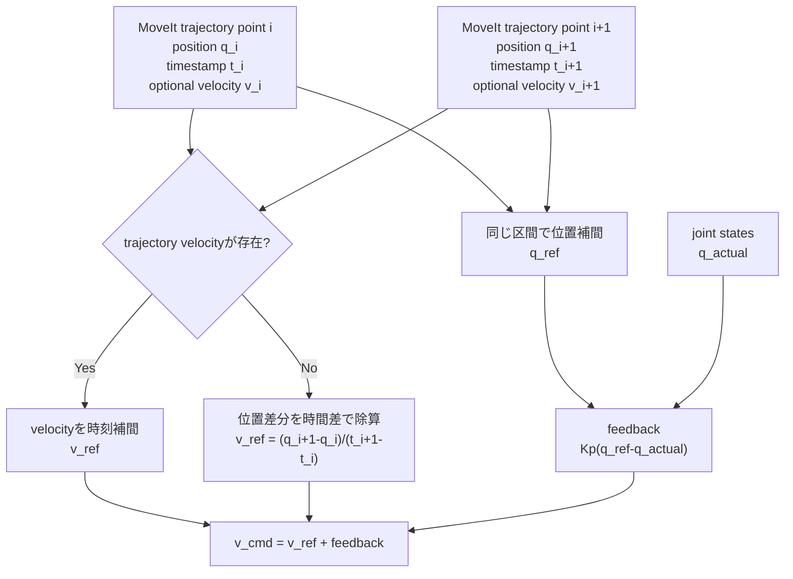
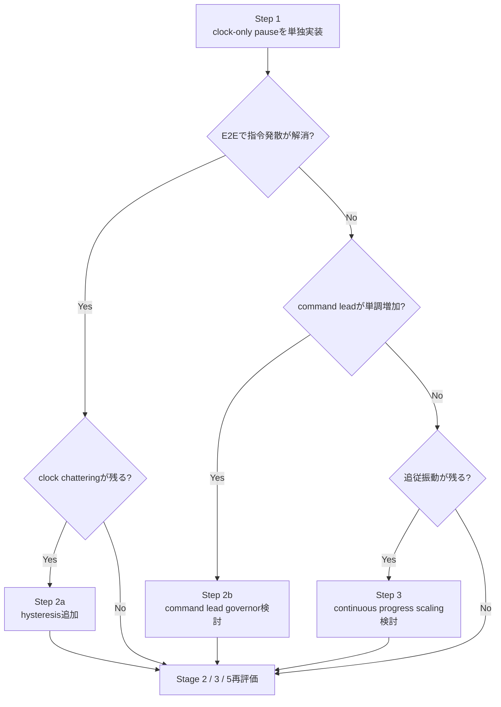

# Step 3-8-3 time-stretch追従安定化の対策案

**ステータス**: Evaluated（2026-07-17 実装・E2E評価反映）  
**作成日**: 2026-07-17  
**前提レポート**: `step3-8-2_time_stretch_root_cause_analysis.md`  
**対象範囲**: 対策方式の比較、Option Aの実装、rebuild付きphysics E2E評価。

> 共通要件文書`PROJECT.md`は現時点で存在しない。このため本レポートでは、Step 3-8-2の実測結果と既存実行契約から局所要件`S38-3-REQ-*`を定義する。

## 1. Executive summary

ユーザー提案の次の方式を第一対策として実装・評価した。単体テストでは意図どおりに成立し、E2Eでは従来の継続的なcommand leadを抑制できた。一方、place軌道で`v_ref`とfeedbackが相殺する停止平衡を実測したため、**Option A単独では総合E2E合格に至らず、不採用（追加対策が必要）**と判断する。

1. `v_ref`は目標軌道の時間微分から求める。
2. `Kp(q_ref-q_actual)`をfeedback成分として別に加える。
3. 追従誤差が閾値を超えたら、参照時間だけを一時停止する。
4. 停止中もfeed-forwardとfeedbackの算出式を変更しない。
5. 誤差が閾値内へ戻ったら、同じ指令式のまま参照時間を再開する。

変更前実装も、`v_ref`の算出元についてはすでにこの構成であった。今回、time-stretch時だけ`v_ref`を強制的に0へ置換していた分岐を撤去した。

```text
現行通常時:
v_cmd = v_ref + Kp * (q_ref - q_actual)

現行time-stretch時:
v_cmd = 0     + Kp * (q_ref - q_actual)

評価した第一対策:
v_cmd = v_ref + Kp * (q_ref - q_actual)  # 常に同じ
参照時間tauだけを停止・再開する
```

前版レポートでは「参照時間を停止したまま非ゼロ`v_ref`を維持すると、停止位置と速度参照が矛盾する」として本案を棄却した。しかしこれは、参照時間を停止し続ける連続系だけを評価し、**誤差が閾値内へ戻った瞬間に参照時間が再開するハイブリッド制御**を考慮していなかった。前版のOption A判定を撤回し、本レポートで訂正する。

## 2. 現行`v_ref`の生成方法

### 2.1 結論

`v_ref`は参照位置と現在位置から求めていない。現在位置を使うのはfeedback成分だけである。



### 2.2 実装上の事実

`trajectory_reference_at()`は、現在の仮想参照時間`tau`が属する2点を選び、次の処理を行う。

- `q_ref`: 隣接するtrajectory positionsの区分線形補間。
- `v_ref`: trajectory velocitiesが両点にあれば、その区分線形補間。
- velocityがなければ、`(q_next-q_prev)/(t_next-t_prev)`。

`decide_time_synchronized_joint_jog()`が別途`q_ref-q_actual`を計算し、次式で合成する。

```text
v_cmd = v_ref + Kp * (q_ref - q_actual)
```

したがって、ユーザーが示したfeed-forwardとfeedbackの責務分離は、time-stretch分岐を除けば現行実装と一致している。

## 3. なぜ「参照時計だけ停止」で成立するか

### 3.1 2つのモード

簡単化のため1関節、理想的に`q_actual_dot = v_cmd`とする。誤差を`e=q_ref-q_actual`とする。

#### 通常追従モード

参照時間が進み、`q_ref_dot=v_ref`となる。

```text
v_cmd = v_ref + Kp * e
e_dot = q_ref_dot - q_actual_dot
      = v_ref - (v_ref + Kp * e)
      = -Kp * e
```

feed-forwardが目標軌道速度を担い、feedbackが誤差を0へ収束させる。

#### time-stretchモード

参照時間だけを止めるため`q_ref_dot=0`だが、指令式は変えない。

```text
v_cmd = v_ref + Kp * e
e_dot = 0 - (v_ref + Kp * e)
```

軌道進行方向と追従誤差の方向が同じ通常の「robotが参照より遅れている」状態では、`v_ref`と`Kp e`が同じ方向になる。robotは停止した参照へ速やかに追いつく。

誤差が再開閾値内へ入った時点で通常モードへ戻るため、停止モードの定常点`-v_ref/Kp`まで進み続けるわけではない。モード復帰後は再び`e_dot=-Kp e`となる。

### 3.2 なぜ現行より指令段差が小さいか

現行は閾値を跨ぐとfeed-forwardを0へ置換するため、理論上の指令差は`-v_ref`になる。

```text
発火直前: v_cmd = v_ref + Kp e
発火直後: v_cmd =         Kp e
差分:     delta v_cmd = -v_ref
```

提案方式では発火前後で式が変わらない。

```text
発火直前: v_cmd = v_ref + Kp e
発火直後: v_cmd = v_ref + Kp e
差分:     delta v_cmd = 0  # 状態変化分を除く
```

Step 3-8-2で確認したServo smoothing、JTC spline、Isaac physicsの多段遅延系へ新たな速度段差を入れないため、リミットサイクルの励振源を直接除去できる。

## 4. 成立条件と残るリスク

提案方式は成立するが、どの状態でも無条件に安全とは限らない。time-stretch中に誤差が減少する条件を明示する。

### 4.1 誤差減少条件

多関節では誤差エネルギーを次で表す。

```text
V = 1/2 * e^T e
V_dot = -e^T (v_ref + Kp e)
```

停止中に誤差ノルムが減る条件は次である。

```text
e^T (v_ref + Kp e) > 0
```

通常の追従遅れでは`e`と`v_ref`が同方向なので成立する。一方、次の場合は確認が必要になる。

- phase開始時に軌道先頭と実測が大きくずれ、補正方向と軌道接線`v_ref`が逆方向。
- ある関節の最大誤差で全体の時計を停止したとき、別関節はすでに参照より先行している。
- 参照区間が折り返し点・速度反転点の近傍にある。

このため、実装時にはtime-stretch中の`V_dot`相当値、または各関節の`e_i * v_cmd_i`を診断記録する。第一対策では直ちに別制御へ切り替えず、成立条件が破れるケースの有無をE2Eで確認する。

### 4.2 phase開始時の先頭点ずれ

Step 3-8-2ではplace開始時に最大0.214462 radの先頭点ずれを観測した。これは通常の軌道追従遅れとは異なる。

- 小さい残差で、`v_ref`と補正方向が一致する場合: clock-only pauseで吸収可能。
- 大きな残差、または`v_ref`が補正を妨げる場合: 古い軌道先頭へ戻すのではなく、現在実測からのsuffix replan候補。

第一対策のE2Eでは、phase開始時について`q_first`、`q_actual`、`v_ref`、`e*v_cmd`を必ず記録し、通常追従中のtime-stretchと分けて判定する。

### 4.3 Servo/JTC command lead

feed-forward段差をなくすことで発散の主な励振は減ると予測するが、ServoがJointJogをpositionへ積分し、JTCが再補間する構造は残る。

したがって、次の値は引き続き観測する。

```text
e_track = max_abs(q_ref - q_actual)
e_lead  = max_abs(q_command - q_actual)
```

ただし第一対策では`e_lead`を新しいfeedbackへ混ぜない。まずclock-only pauseだけを変更し、command leadが自然に有界化するかを分離評価する。これで不十分だった場合だけ、Step 2としてcommand lead governorを追加する。

## 5. 対策案

### Option A: clock-only pause、指令式不変

#### 概要

ユーザー提案。time-stretch中に参照時計のみ停止し、`v_ref`とfeedbackの算出式を変更しない。

```text
if tracking_error > pause_threshold:
    tau_next = tau
else:
    tau_next = tau + dt

v_cmd = v_ref(tau) + Kp * (q_ref(tau) - q_actual)
```

#### メリット

- 追従制御則が全モードで一貫する。
- 閾値通過時のfeed-forward段差を除去できる。
- 現行実装からの変更が小さく、原因と対策の対応が明確。
- Servo/JTC所有権、collision monitoring計画、status契約を変更しない。

#### デメリット・リスク

- phase先頭ずれで`v_ref`と補正方向が反対の場合、収束を遅らせる可能性。
- globalなpauseにより、limiting joint以外が参照位置を先行する可能性。
- clockの停止・再開自体は閾値付近で反復する可能性がある。

#### 判定

**第一推奨。最初に単独実装・評価する。**

### Option B: clock-only pause＋ヒステリシス

#### 概要

Option Aにpause閾値とresume閾値の差を持たせる。

```text
pause  if error > e_pause
resume if error < e_resume
e_resume < e_pause
```

#### メリット

- 閾値付近の時計chatteringを抑えられる。
- JointJogの算出式は変えない。

#### デメリット・リスク

- resumeまでの停止時間が長くなる。
- 非ゼロ`v_ref`を出す停止時間が延びるため、phase先頭ずれではOption Aより悪化し得る。
- bandの同定が必要。

#### 判定

Option Aでclock chatteringが観測された場合の追加候補。最初から混ぜない。

### Option C: 連続progress-rate scaling

#### 概要

誤差に応じて参照進行率を0〜1で連続化し、`tau_dot`とfeed-forwardの双方を同じ率で縮退する。

```text
s = smooth_scale(error)
tau_next = tau + s * dt
v_cmd = s * v_ref + Kp * e
```

#### メリット

- 参照位置の壁時計微分とfeed-forwardが厳密に一致する。
- clock切替も連続化できる。

#### デメリット・リスク

- ユーザー提案より変更範囲が大きい。
- 現在の問題がfeed-forward段差だけで解消するかを分離できない。
- scale関数とbandの同定が必要。

#### 判定

Option Aで振動が残る場合の第二候補。

### Option D: command lead governor

#### 概要

JTC desiredとactualの差を監視し、command leadが増大した場合に参照進行またはJointJogを制限する。

#### メリット

- Step 3-8-2で観測したServo/JTC位置積分の発散を直接検出できる。
- 関節limit飽和前の防護層になる。

#### デメリット・リスク

- 外側feedbackが一段増え、Option Aの効果を単独評価できなくなる。
- controller stateの鮮度、未受信、joint name対応の契約が必要。

#### 判定

Option A後も`q_command-q_actual`が単調増加する場合だけ追加する。

### Option E: FollowJointTrajectory直接実行

MoveIt軌道をJTC actionへ直接渡し、Servoの速度→位置積分を経由しない。時間所有者は明確になるが、Servo/JTC排他所有権とServo collision monitoringを再設計する必要があるため、今回の第一対策にはしない。

## 6. 案比較

| 評価軸 | A clock-only | B hysteresis | C progress scaling | D lead governor | E JTC直接 |
|---|---:|---:|---:|---:|---:|
| 指令式を維持 | ○ | ○ | × | △ | × |
| FF段差除去 | ○ | ○ | ○ | △ | ○ |
| 原因との対応が単純 | ○ | ○ | △ | △ | × |
| phase先頭ずれ | △ | △ | △ | △ | ○ |
| command lead防護 | × | × | △ | ○ | ○ |
| 変更規模 | 最小 | 小 | 中 | 中 | 大 |
| 推奨順 | **1** | 2 | 3 | 4 | 将来 |

## 7. Decision

### 評価対象とした第一対策

**Option A: clock-only pause、`v_cmd = v_ref + Kp e`を全モードで維持する。**

変更対象は、現行の次の分岐に限定する。

```text
reference_velocities =
    zero velocities if error > pause threshold
    else trajectory reference velocities
```

これを撤去し、time-stretch中も`reference.velocities_rad_s`を使用した。参照時計の停止条件、速度clamp、終端判定、deadline、status契約は維持した。評価結果は12章のとおりであり、Option A単独は総合E2E不合格とする。

### 段階的な追加条件



複数対策を最初から同時投入せず、Step 3-8-2で特定したfeed-forward段差を1変更で除去し、因果関係を保ったまま評価する。

## 8. 局所要件とモジュール対応

| 要件ID | 要件 | 主担当 |
|---|---|---|
| S38-3-REQ-01 | `v_ref`はtrajectory velocityまたは位置・timestamp差分から求める | `TrajectoryInterpolator` |
| S38-3-REQ-02 | feedbackは`Kp(q_ref-q_actual)`としてfeed-forwardと分離する | `JointJogLaw` |
| S38-3-REQ-03 | time-stretch時は参照時計だけを止め、指令式を変えない | `ReferenceClock` |
| S38-3-REQ-04 | threshold通過時にfeed-forward由来の`v_cmd`段差を作らない | `JointJogLaw` |
| S38-3-REQ-05 | phase開始時に誤差減少条件を観測できる | `TrackingObservation` |
| S38-3-REQ-06 | `q_command-q_actual`を診断し、発散有無を判定できる | `TrackingObservationPort` |
| S38-3-REQ-07 | 終端0.01 rad×3、gripper、status、Servo JTC排他所有を維持する | `ExecutionLifecycle` |

### Clean Architecture確認

- `TrajectoryInterpolator`: MoveIt messageではなく内部trajectory値から`q_ref`と`v_ref`を返す責務。
- `ReferenceClock`: 仮想時間の停止・進行だけを所有し、速度指令を加工しない。
- `JointJogLaw`: 常に同じfeed-forward＋feedback式を適用する。
- `TrackingObservation`: ROS topicを内部観測値へ変換するが、制御ポリシーを持たない。
- 依存方向はROS/MoveIt/ros2_control adapterから上記pure policyへ向け、その逆依存を作らない。

## 9. 将来実装時の検証計画

### 9.1 単体テスト

- trajectory velocityがある場合、その補間値を`v_ref`に使う。
- velocityがない場合、位置差とtimestamp差から`v_ref`を求める。
- pause前後で同じ`q_ref`、`q_actual`、`v_ref`なら`v_cmd`が変わらない。
- pause中も`v_cmd=v_ref+Kp e`になる。
- pause中は`tau`だけが進まない。
- errorが閾値内へ戻ると`tau`が再開する。
- 終端では従来どおりfeed-forward 0、0.01 rad×3で成功する。

### 9.2 E2E観測

- `q_ref`、`q_actual`、`v_ref`、feedback、`v_cmd`を別fieldで記録する。
- `time_stretch_active`と参照時間の停止・再開時刻を記録する。
- 発火前後の`delta v_cmd`を比較する。
- pause中の`e^T(v_ref+Kp e)`を記録し、正であることを確認する。
- phase開始時と通常追従中のpauseを分類する。
- `q_jtc`、`q_hardware`、`q_actual`の最大差が単調増加しないことを確認する。
- Stage 2/3/5合格後にのみ修正5aへ進む。

## 10. Consequences

### Positive

- ユーザーが意図したfeed-forwardとfeedbackの責務分離を維持できる。
- Step 3-8-2で確認した最大の不連続入力を最小変更で除去できる。
- 追加governorの必要性を、Option Aの結果を見てから判断できる。

### Negative

- phase先頭ずれで軌道接線と補正方向が逆の場合は、Option Aだけで十分とは限らない。
- Servo/JTC command leadの構造自体は残るため、観測継続が必要。
- clock chatteringが残る場合はヒステリシス等の次段対策が必要。

## 11. References

- MoveIt Servo, Realtime Servo: https://moveit.picknik.ai/main/doc/examples/realtime_servo/realtime_servo_tutorial.html
- ros2_control Jazzy, JointTrajectoryController: https://control.ros.org/jazzy/doc/ros2_controllers/joint_trajectory_controller/doc/userdoc.html
- ros2_control Jazzy, Trajectory Representation: https://control.ros.org/jazzy/doc/ros2_controllers/joint_trajectory_controller/doc/trajectory.html
- Isaac Sim, Articulation Action API: https://docs.isaacsim.omniverse.nvidia.com/latest/py/source/deprecated/isaacsim.sensors.physics/docs/index.html

## 12. 実装・評価結果（2026-07-17）

### 12.1 実装内容

`servo_execution_adapter.py`のtime-stretch分岐を最小変更し、誤差が0.10 radを超えてもfeed-forwardを0へ置換せず、常に次式を使うようにした。

```text
v_cmd = clamp(v_ref + Kp * (q_ref - q_actual))
```

参照時計は従来どおり、最大追従誤差が0.10 radを超える間だけ停止する。加えて、E2Eで構成要素を分離できるよう次を診断記録した。

- `v_ref_rad_s`
- `v_feedback_rad_s`
- `v_cmd_rad_s`
- `time_stretch_active`
- `error_reduction_metric = e * v_cmd`
- `q_ref_rad`、`q_actual_rad`、`q_jtc_rad`、`q_hardware_rad`

### 12.2 自動テスト

| 検証 | 結果 |
|---|---|
| Option Aの回帰テスト | PASS。time-stretch中もfeed-forward `(0.8, -0.8)` を維持 |
| ServoExecutionAdapter単体 | PASS、18件 |
| 全pytest | PASS、280件、skip 2件 |
| `py_compile` | PASS |
| `git diff --check` | PASS |
| C++ rebuild | PASS、`franka_ros2_control` 1 package |

### 12.3 Option A単独のrebuild付きphysics E2E

実行条件:

```bash
CI_ARTIFACT_ROOT="$PWD/.artifacts/step3-8-3/clock-only-feedforward" \
CI_HEADLESS_STEPS=7000 \
CI_E2E_TIMEOUT_SEC=2400 \
CI_GRASP_MODE=physics \
bash ./scripts/ci/run_e2e.sh
```

結果は**FAIL**。pregrasp、grasp、保持、detach、pullを通過し`moving_to_place`まで到達したが、placeがtimeoutした。

| 観測項目 | 結果 |
|---|---|
| pregrasp | PASS、約7.924秒 |
| physics grasp / hold / pull | PASS |
| place | FAIL、Servo target timeout |
| 継続的command lead | 改善。過渡最大約0.513 radから約0.011 radへ収束 |
| completion marker | 未検出 |

停止時のlimiting jointは`panda_joint4`で、次の平衡を観測した。

```text
reference_elapsed_sec = 1.892592
q_ref                 = -1.289535 rad
q_actual              ≈ -1.434535 rad
e                     ≈ +0.145 rad
v_ref                 = -0.435 rad/s
Kp * e                ≈ +0.435 rad/s
v_cmd                 ≈ 0 rad/s
```

すなわち、参照時計を止めてもfeed-forwardを維持した結果、軌道速度とfeedbackが相殺し、

```text
e_equilibrium = -v_ref / Kp = 0.145 rad
```

で停止した。この値は時計再開閾値0.10 radより大きいため、参照時計もrobotも再開できない。3.1節で「通常の追従遅れ」を前提にした成立性は確認できたが、placeの軌道反転区間ではその前提が成立しなかった。

### 12.4 方向条件付きclock pauseの探索評価

上記停止平衡を切り分けるため、制御式は変えず、`e * v_ref < 0`なら「参照の進行が誤差を減らす」とみなして時計を進める探索版も評価した。この変更は最終実装には採用していない。

2回のrebuild付きphysics E2E結果:

| 試行 | 到達点 | 結果 |
|---|---|---|
| 1 | grasp後のdetaching | physics detach失敗、972/7000 stepで早期終了 |
| 2 | `moving_to_place → placed` | tomato配置判定失敗、1555/7000 stepで早期終了 |

試行2ではplace中にJTC command差が最大約0.80 radへ拡大した。`q_actual`、`q_hardware`、`q_jtc`の位相差が大きい区間でpause/resume判断が反転し、時計を進めるだけではcommand leadを安全に制限できなかった。このため方向条件版は**安全上棄却**し、コードをOption A単独へ戻した。

### 12.5 Stage 2 / 3 / 5再判定

| Stage | 判定 | 根拠 |
|---|---|---|
| Stage 2: 軌道実行・追従 | FAIL | placeで0.145 radの停止平衡。方向条件版ではcommand lead最大約0.80 rad |
| Stage 3: physics grasp / detach / hold | 条件付きPASS | Option A単独でgrasp、hold、detach、pullを通過。ただし探索試行1ではdetachの物理揺らぎあり |
| Stage 5: tray配置・完走 | FAIL | Option A単独はplace timeout、探索試行2はplaced後に配置判定失敗 |

総合E2Eが未合格のため、既定順序どおり**修正5a（Servo collision monitoring有効化）には進まない**。

### 12.6 結論と次の対策条件

今回の評価で次を確定した。

1. `v_ref`は軌道時間微分から生成されており、この責務分離は正しい。
2. time-stretch時のfeed-forward強制0は撤去でき、指令段差と従来の継続的command leadは改善した。
3. ただし、時計停止中に非ゼロ`v_ref`を維持すると、`v_ref + Kp e = 0`の停止平衡が再開閾値外に存在し得る。
4. 時計のpause条件だけを方向判定へ変えても、複数の遅延状態間のcommand leadを防護できない。

したがってOption Aは有効な部分改善だが、単独対策としては不十分である。次は制御式へ場当たり的な分岐を追加せず、`q_ref`、Servo積分位置、JTC desired、hardware actualのどれを追従誤差とclock governorの正本にするかを定義したうえで、Option Dのcommand lead governorまたはOption EのJTC直接実行を比較する必要がある。
