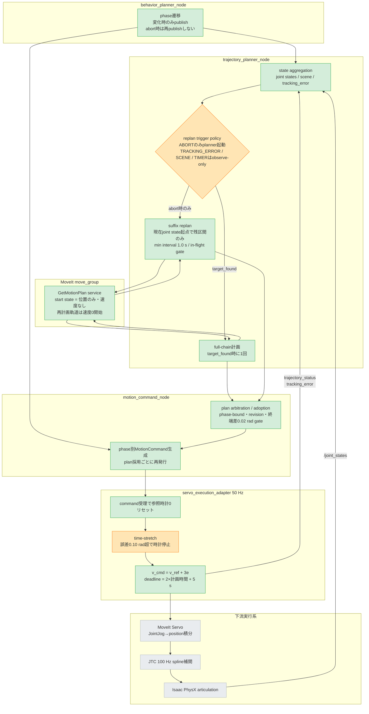

# Step 3-8-4 MoveIt軌道生成の現状調査と逐次リプラン対策の妥当性評価

**ステータス**: Investigated（2026-07-17 コード調査完了、実装・E2E評価は未実施）
**作成日**: 2026-07-17
**前提レポート**: `step3-8-2_time_stretch_root_cause_analysis.md`、`step3-8-3_time_stretch_countermeasure_options.md`
**対象範囲**: (1) MoveItの目標軌道生成が現在いつ・どの条件で行われているかのコード調査。(2) 「その時々の実測状態を開始点として逐次リプランし続ければ追従誤差は無限に大きくならない」というユーザー仮説にもとづく逐次リプラン対策の妥当性評価。実装は本レポートの対象外。

## 1. Executive summary

### 調査質問1: MoveItの目標軌道生成は常に行われているか

**行われていない。** 軌道生成は次の3イベントに限定されたイベント駆動であり、実行中の周期的・逐次的な再計画は存在しない。

1. `target_found`時（scene snapshot到着待ち合わせあり）の全phase一括計画。
2. 実行abort時のみのsuffix replan（自由空間phase限定、現在joint stateを開始点に残区間だけ再計画）。
3. `RETURNING_HOME`進入時の能動的home計画。

追従誤差0.10 rad以上を検知する`TRACKING_ERROR`トリガとscene変化トリガは実装されているが、**observe-only**（記録するだけでplannerを起動しない）に意図的に制限されている。周期timerトリガも意図的に無効化されている。したがって、time-stretchで参照時計が停止平衡に陥っても（Step 3-8-3 §12.3）、deadline超過でabortするまで軌道は一切更新されない。

### 調査質問2: 逐次リプラン対策は妥当か

**条件付きで妥当。** ただし「常時（周期）リプラン」ではなく「停止検知イベント駆動のsuffix replan解禁」として行うべきである。

- ユーザー仮説のとおり、実測状態を開始点に再計画すれば`q_ref - q_actual`はリプラン時点で計画レイテンシ相当（実測26〜298 ms × 実効速度約0.4 rad/s ≒ 0.01〜0.12 rad）へリセットされ、有界化される。特にStep 3-8-3で不合格の直接原因になった**停止平衡（e = 0.145 rad、再開閾値0.10 radの外側で参照もrobotも動けない状態）を、現在状態からの再計画で直接解消できる**。
- しかも、リプラン採用→motion command再発行→adapterの参照時計リセットという配管は**現行実装にすべて存在し、E2Eで動作実績がある**（abort時に通っている経路そのもの）。塞がれているのはトリガーポリシー1関数だけである。
- 一方、**周期的な常時リプランは不適**。再計画軌道は常に速度0から始まる。start stateへ現在速度を渡すことはメッセージ仕様上可能だが、時間パラメータ化を担うTOTGが静止開始前提であり、非ゼロ初期速度対応は公式に「not planned」でクローズ済みのため、渡しても効かない（§4.3）。移動中に高頻度で継ぎ替えるとstop-and-go化し、OMPLの非決定性による経路ふらつきとcancel-and-replace往復（Issue #46で廃止した構造）を再導入する。
- また、Step 3-8-2で確認した発散の増幅要因である**Servo内部のposition積分（command lead）は、参照軌道を差し替えても再基準化されない**。逐次リプランは誤差の「入力側」を有界化する対策であり、command lead構造そのものの対策（Option D/E）の代替ではなく補完である。ただしOption A実装後のcommand leadは実測0.011 radまで収束しており、停止平衡さえ解消すれば総合E2E合格の見込みは高い。

## 2. 全体アーキテクチャと調査範囲

凡例: 緑=本調査でコード確認済みのノード、橙=逐次リプラン化での変更候補、灰=今回変更しない。



### 検証目的と次ステップへのつながり

- 検証目的: Step 3-8-3でOption A（clock-only pause）単独が停止平衡で不合格となったため、次の対策候補として「実測状態からの逐次リプラン」が現行アーキテクチャ上で成立するか、何を変えれば成立するかを確定する。
- 次ステップへのつながり: 本調査の結論（イベント駆動suffix replanの解禁が最小変更で停止平衡を解消できる）は、Step 3-8-5以降の対策実装（トリガーポリシー変更＋E2E評価）の設計入力になる。Option D（command lead governor）/ Option E（JTC直接実行）との比較判断もここで整理する。

## 3. 調査結果: 軌道生成のトリガー全数調査

### 3.1 計画が起動するイベント（実装確認済み）

| # | イベント | 計画の種類 | 開始点 | 根拠 |
|---|---|---|---|---|
| 1 | `target_found`（snapshot到着後） | full-chain（pregrasp→grasp→pull→place一括） | 最新`/joint_states` | `node.py` `_on_phase` / `should_plan_on_snapshot_arrival` |
| 2 | 実行abort（`trajectory_status`の`aborted`） | 自由空間phaseはsuffix replan、それ以外はfull-chain | 最新`/joint_states` | `node.py` `_evaluate_replan_trigger` → `trigger_starts_planner` |
| 3 | `RETURNING_HOME`進入 | home区間のsuffix replan（関節空間goal） | 最新`/joint_states` | `should_plan_home_on_entry` |

suffix replan対象phaseは`MOVING_TO_PREGRASP` / `MOVING_TO_GRASP` / `MOVING_TO_PLACE` / `RETURNING_HOME`。`DETACHING`は接触支配区間として意図的に対象外（RESEARCH.md §17）。

### 3.2 計画が起動しないイベント（意図的な設計判断）

`replan_trigger.py`のトリガー評価は`trajectory_status`受信ごと（実質50 Hz）に走るが、planner起動は次のとおり制限されている。

```text
trigger_starts_planner():
    return trigger is ReplanTrigger.ABORT
```

| トリガー | 発火条件 | 現在の扱い | 制限の理由（コード内コメント） |
|---|---|---|---|
| `ABORT` | 実行系のaborted status | **planner起動**（唯一） | — |
| `TRACKING_ERROR` | 追従誤差 ≥ 0.10 rad | observe-only | 「実行中の軌道追従補正はMoveIt Servoが担うため、planner側でcancel-and-replaceを起こさない」(Issue #46) |
| `SCENE_CHANGE` | scene generation更新 | observe-only | 同上 |
| `TIMER`（周期） | — | **無効化** | 「periodic replanning is intentionally disabled. Planner work is driven by explicit execution events to avoid cancel-and-replace churn」(Step 7) |

さらにbehavior_planner側も、abort時にphaseを再publishしない（古いplanでのcommand再生成とabortの高速往復ループを防ぐため）。つまり**通常実行中、軌道はphase開始時に固定され、実行終了イベントまで一切更新されない**。

### 3.3 停止平衡が放置される時間の定量化

Step 3-8-3 §12.3の停止平衡（`e = -v_ref/Kp = 0.145 rad`）が発生した場合の現行復旧経路は次のとおり。

1. adapterは`running`のままJointJogを出し続ける（`v_cmd ≈ 0`）。
2. `TRACKING_ERROR`トリガは毎周期発火するがobserve-only。
3. deadline（`計画時間×2.0 + 5.0秒`）超過で初めて`servo_target_timeout` abort。
4. abortで初めてsuffix replanが走る。

place軌道の計画時間を約8秒とすると、**停止からabortまで約21秒間、robotは実質静止したまま**であり、E2Eのstep予算（7000 steps）を使い切る。Option A評価runの「place timeout・completion marker未検出」はこの構造の帰結である。復旧機構自体は存在するが、起動が遅すぎる。

### 3.4 逐次リプランに必要な配管は既に存在する

mid-phaseでのplan差し替え経路は実装・動作済みである。

1. plannerが`plan_from_phase()`で現在joint state起点の残区間を再計画（最大3回試行、pose goal失敗時は採用済みplan終端への関節空間goal fallback）。
2. 終端差0.02 rad未満の候補は棄却（`evaluate_suffix_update`）、in-flight gateで二重起動抑止、最小間隔1.0秒。
3. 採用planはphase-bound契約（`planned_from_phase`が現在phaseと一致する場合のみ採用）でstale planを排除。
4. `motion_command_node`がplan採用ごとに同phaseのMotionCommandを再発行。
5. adapterの`_on_command`が新targetで`CommandLifecycle.start()`し、**参照時計を0へリセット**。新軌道の先頭は再計画時点の実測状態なので、接続誤差は計画レイテンシ中の移動量だけになる。

実測レイテンシ（Step 4計測）: suffix replan 26.2〜41.8 ms、full-chain 297.8 ms（いずれもservice応答。planning budgetは`allowed_planning_time` 1.0秒、service timeout 1.5秒）。

**結論: 逐次リプランは新規機構の追加ではなく、既存のabort復旧経路を早期トリガーで起動する変更である。**

## 4. ユーザー仮説の評価

> 目標軌道がその時々の各状態を開始点として逐次プランニングし続けていれば、追従誤差が無限に大きくなることはない。

### 4.1 成立する部分

リプラン間隔を`T`、計画〜採用レイテンシを`L`、実効関節速度を`v`とすると、参照と実測の接続誤差はリプラン直後に`≈ v×L`へリセットされ、次のリプランまでの成長も高々`v×T`＋定常追従遅れに抑えられる。`L ≈ 0.05〜0.3秒`、`v ≈ 0.4 rad/s`なら初期接続誤差は0.02〜0.12 radであり、Step 3-8-2で観測したphase境界の接続ずれ0.214 radより小さい。

Step 3-8-2/3で特定した3つの発症経路への効き方:

| 発症経路 | 逐次リプランの効果 |
|---|---|
| phase開始時の先頭点ずれ（最大0.214 rad） | **解消**。phase開始時にも現在状態起点で計画すれば先頭点ずれは原理的に消える |
| 停止平衡（`e = -v_ref/Kp = 0.145 rad` > 再開閾値0.10 rad） | **解消**。現在状態からの新軌道で`e(0) ≈ 0`となり、参照時計が再始動する。停止中はrobotがほぼ静止しているため、速度0開始の新軌道との接続も無矛盾 |
| Servo position積分によるcommand lead発散 | **間接的に抑制**。誤差が有界ならfeedbackが飽和(0.8 rad/s)し続けないため積分乖離も有界に留まる（Option A実測0.011 rad）。ただし積分状態自体はリプランで再基準化されない（§4.2） |

### 4.2 成立しない・注意が必要な部分

1. **速度0開始の継ぎ替え**: `_new_motion_plan_request`のstart stateは関節位置のみで速度を渡していないが、仮に渡しても標準パイプラインでは尊重されない（§4.3）。MoveItの時間パラメータ化は静止開始・静止終了の軌道を返すため、**移動中（v ≈ 0.4 rad/s）の周期リプランは毎回`v_ref`を0へ落とすstop-and-go参照を生む**。誤差の有界化と引き換えに実行時間が伸び、deadline超過abortを誘発し得る。MoveIt Hybrid Planningがlocal plannerによるblend機構を持つのはこのためであり（RESEARCH.md §16）、blendなしの周期リプランはHybrid Planningの劣化コピーになる。
2. **OMPL非決定性**: リプランごとに別経路・別IK枝が返り得る。緩和策（seed付きIKの最近傍枝選択、全arm関節窓2.2 rad、終端差0.02 rad未満の採用棄却、最小間隔1.0秒）は実装済みだが、経路中間形状の入れ替わりまでは防げない。CI実績でも、自由空間phaseへの高頻度な再計画注入はOMPL非決定性起因のflakeを誘発した経緯がある。
3. **command leadの非リセット**: Servoは速度指令を内部commandステートへ積分し続け、参照軌道の差し替えではこの積分状態は再基準化されない。Step 3-8-3 §12.4（方向条件版でJTC command差が0.80 radへ拡大）が示すとおり、下流状態の乖離が大きい局面ではリプランだけでは防護できない。command leadの独立監視（`e_lead`診断）は継続し、単調増加が再発する場合のみOption Dを追加する、というStep 3-8-3の段階条件を維持する。
4. **接触phaseには不適**: `DETACHING`は接触力支配であり、経路差し替えは逆効果になり得る（既存設計判断のとおり対象外を維持）。
5. **cancel-and-replace往復の再導入リスク**: Issue #46でtracking errorトリガーをobserve-onlyにしたのは、abortとreplanの高速往復ループを断つためだった。無条件でトリガーを解禁すると同じ往復が再発し得るため、解禁条件は「参照時計の停止が持続している」ことに限定する必要がある（§5）。

### 4.3 現在速度を渡す「移動中開始」リプランは可能か（追加調査 2026-07-17）

「start stateに現在速度も渡せば、速度0開始問題は解消できるのではないか」を一次情報で確認した。

#### 事実（確認済み）

- **メッセージ仕様上は渡せる**: `MotionPlanRequest.start_state`は`moveit_msgs/RobotState`であり、その`joint_state`（`sensor_msgs/JointState`）は`velocity`フィールドを持つ。本リポジトリのbridgeが埋めていないのは実装上の選択ではあるが、埋めること自体は1行の変更でできる。
- **しかし標準パイプラインでは効かない**: OMPLは幾何（位置）空間の経路のみを解き、時間付けは応答adapterのTOTG（TimeOptimalTrajectoryGeneration）が後処理で行う。MoveIt公式ドキュメントはTOTGの制約として「**robotは静止で開始し静止で終了しなければならない**」を明記している。したがってstart stateに速度を入れても、出力軌道は速度0開始のまま変わらない。
- **非ゼロ初期速度対応は公式に不採用**: TOTGへの非ゼロ初期速度サポートのfeature requestは moveit2 Issue #3457 として起票されたが、**「not planned」としてクローズ済み**（2026-07時点）。同種の制約はROS 1時代のmoveit Issue #2538から続く既知の限界である。なお、Humble→Jazzyで出力軌道先頭点の速度・加速度の数値が変わる報告（Issue #3014）があるが、これはサンプリング微分の扱いの差であり、初期速度指定機能ではない。

#### 移動中開始リプランを実現する場合の選択肢

| 選択肢 | 内容 | 評価 |
|---|---|---|
| a. MoveIt Hybrid Planning導入 | global plannerの静止開始軌道を、local plannerが実行中軌道へblendする公式アーキテクチャ | 本命だが導入規模が大きい。Servo/JTC所有権の再設計が必要で、Step 3-8-3のOption E相当以上の変更 |
| b. adapter側の参照blend（自前実装） | `ServoExecutionAdapter`が参照補間を所有しているため、新軌道採用時に旧参照と新参照を短いblend窓（例0.3〜0.5秒）で線形合成し、`v_ref`の段差を除去する | 最小実装。MoveIt側は無変更。ただしblend中の合成参照は衝突チェック外になる点に注意（旧軌道・新軌道とも検証済み経路であり、その近傍内挿である限りリスクは小さい） |
| c. Ruckigで接続区間を生成 | jerk制限付きオンライン軌道生成のRuckigは任意の初期状態（位置・速度・加速度）から目標状態への軌道を解ける。現在(q, q̇)から新軌道上の点への接続区間だけをRuckigで作り、以降は新軌道へ乗せる | bと同系統だがjerk連続性の保証が強い。依存追加（ruckigライブラリ）が必要 |
| d. 未来点起点の計画（plan-ahead splice） | 実行中軌道上の「計画レイテンシ＋マージン先」の未来点をstart stateにして計画し、到達した瞬間に切り替える | 位置の接続ずれは消えるが、切替点の速度不連続（旧軌道は非ゼロ速度、新軌道は0）は残るため、単独では不十分。b/cとの併用が前提 |

#### 本題への含意

- 「速度を渡すだけ」の変更では移動中開始リプランは成立しない。成立させるにはa〜cのいずれかの追加機構が必要で、これは常時（周期）リプランを選ぶ場合のコストである。
- 一方、**§5で推奨する停止検知イベント駆動のsuffix replanでは、発火時点でrobotがほぼ静止している（`v_cmd ≈ 0`の停止平衡）ため、静止開始のTOTG軌道と物理状態が最初から整合しており、追加機構なしで成立する**。この非対称性が「常時リプランは不適・イベント駆動は妥当」という§4.4の判定の技術的根拠である。
- 将来、移動中の連続的な経路更新（例: 動的障害物回避）が要件になった場合は、b（参照blend）を最小の足がかりとして導入し、要件が強まればa（Hybrid Planning）へ移行するのが段階的である。

### 4.4 判定

| 方式 | 判定 | 理由 |
|---|---|---|
| 常時（周期）リプラン（例: 1 Hz以上で無条件） | **不採用** | 速度0開始のstop-and-go化、OMPL非決定性、cancel-and-replace churnの再導入。誤差有界化は得られるが実行成立性を壊す |
| 停止検知イベント駆動のsuffix replan | **推奨** | 停止平衡・先頭点ずれという実測済みの2発症経路を直接解消。発火時はrobotがほぼ静止しているため速度0開始と整合。既存配管の再利用で変更はトリガーポリシーに局所化 |

## 5. 推奨する対策設計（Step 3-8-5への入力）

制御式（Option A: `v_cmd = v_ref + Kp e`、clock-only pause）は変更せず、次を追加する。

### 5.1 変更点

1. **停止持続の観測**: adapterが`time_stretch_active`の連続継続時間（または参照時計が進んでいない経過秒）を`trajectory_status`へ載せる。現在も`tracking_error_rad`は載っているが、「一時的な閾値跨ぎ」と「停止平衡」を区別できない。
2. **トリガー解禁**: `trigger_starts_planner`を変更し、`TRACKING_ERROR`系トリガーのうち「参照時計停止が`T_stall`（案: 1.0〜2.0秒。正常なpause/resumeの数周期より十分長く、deadlineより十分短い値）以上持続」した場合のみ、SUFFIX_REPLAN_PHASES限定でsuffix replanを起動する。
3. **既存ガードの維持**: 最小間隔1.0秒、in-flight gate、終端差0.02 rad採用gate、phase-bound採用契約、`DETACHING`除外はそのまま使う。
4. **診断**: リプラン発火回数/phase、発火時の`e`と停止継続時間、採用後の接続誤差`e(0)`、`e_lead = max|q_jtc - q_actual|`を記録し、command lead単調増加の有無でOption D追加要否を判定する。

### 5.2 期待効果と成功条件

- Step 3-8-3の停止平衡run再現条件で、`T_stall`経過後にsuffix replanが発火し、place軌道が再始動して総合E2E（Stage 2/3/5）が合格すること。
- リプラン発火が停止平衡時のみに限定され、正常追従区間で発火しないこと（cancel-and-replace往復の非再発）。
- `e_lead`が単調増加しないこと。増加する場合はOption D（command lead governor）を追加検討し、それでも不足ならOption E（FollowJointTrajectory直接実行）を再評価する。

## 6. 検証記録

- 本レポートはコード調査のみで、実装・E2E実行は行っていない。
- 調査対象コード（当branch時点）:
  - `src/tomato_harvest_sim/robot/motion_planner/node.py`（トリガー評価・suffix replan起動）
  - `src/tomato_harvest_sim/robot/motion_planner/replan_trigger.py`（トリガーポリシー、observe-only制限、周期無効化）
  - `src/tomato_harvest_sim/robot/motion_planner/phase_suffix_replan.py`（対象phase、採用gate、in-flight gate）
  - `src/tomato_harvest_sim/robot/motion_planner/moveit_service_bridge.py`（`plan_from_phase` / `plan_suffix_trajectory`、start state構築=位置のみ）
  - `src/tomato_harvest_sim/robot/execute_manager/plan_adoption.py` / `plan_arbitration.py`（phase-bound採用契約）
  - `src/tomato_harvest_sim/robot/execute_manager/motion_command.py`（plan採用ごとのcommand再発行）
  - `src/tomato_harvest_sim/robot/execute_manager/servo_execution_adapter.py`（command受理での参照時計リセット、time-stretch、deadline）
  - `src/tomato_harvest_sim/robot/behavior_planner/node.py`（phase変化時のみpublish、abort時の再publish抑止）
- 定量値の出典: 停止平衡・command lead実測はStep 3-8-3 §12、接続ずれ・実効速度はStep 3-8-2 §3、計画レイテンシ実測はStep 4（Issue #12）計測。

## 7. References

- MoveIt Hybrid Planning concepts: https://moveit.picknik.ai/main/doc/concepts/hybrid_planning/hybrid_planning.html
- MoveIt Trajectory Processing（TOTGは静止開始・静止終了が前提）: https://moveit.picknik.ai/main/doc/concepts/trajectory_processing.html
- moveit2 Issue #3457「TOTG non-zero initial velocity」（closed: not planned、確認日2026-07-17）: https://github.com/moveit/moveit2/issues/3457
- moveit Issue #2538「TOTG assumes zero for initial velocities/accelerations」: https://github.com/moveit/moveit/issues/2538
- moveit2 Issue #3014（Humble/Jazzy間の先頭点velocity/acceleration差異の報告）: https://github.com/moveit/moveit2/issues/3014
- Ruckig（任意初期状態からのjerk制限オンライン軌道生成）: https://arxiv.org/pdf/2105.04830
- MoveIt Servo, Realtime Servo: https://moveit.picknik.ai/main/doc/examples/realtime_servo/realtime_servo_tutorial.html
- ros2_control Jazzy, JointTrajectoryController: https://control.ros.org/jazzy/doc/ros2_controllers/joint_trajectory_controller/doc/userdoc.html
- 既存調査: `.codex/docs/RESEARCH.md` §16（suffix replanのcurrent state境界）、§17（自由空間phase一般化とDETACHING除外）、§18（producer複線化）
