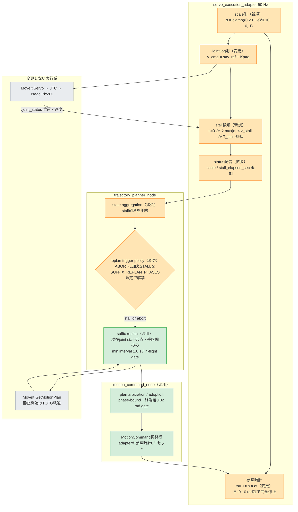
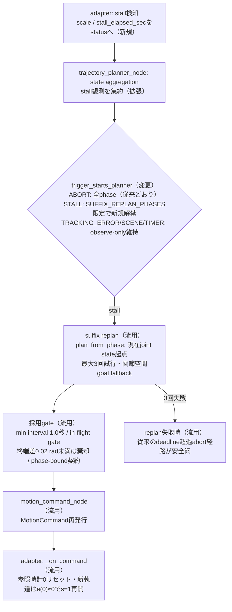
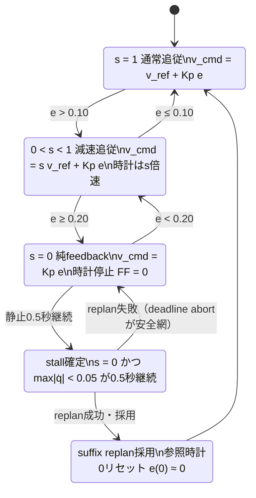

# Step 3-8-5 連続progress scaling＋停止検知suffix replanの対策設計

**ステータス**: Evaluated（2026-07-17 実装・rebuild付きphysics E2E評価反映）
**作成日**: 2026-07-17
**前提レポート**: `step3-8-2_time_stretch_root_cause_analysis.md`、`step3-8-3_time_stretch_countermeasure_options.md`、`step3-8-4_sequential_replan_feasibility.md`
**対象範囲**: Step 3-8-3 Option C（連続progress-rate scaling）と停止検知イベント駆動suffix replanの設計、実装、単体・回帰テスト、rebuild付きphysics E2E評価。

## 1. Executive summary

Step 3-8で観測した追従発散への次期対策として、次の2つを組み合わせて実装する。

1. **連続progress scaling（Option C具体化）**: 追従誤差バンド **[0.10, 0.20] rad** で参照時計の進行率`s`を1→0へ線形に縮退し、feed-forwardも同じ`s`で縮退する。これにより、Step 3-8-3で実測した「参照時計を止めたのに凍結した非ゼロ`v_ref`を出し続ける」参照生成側の矛盾を構造的に解消する。**時計が完全停止する瞬間にはfeed-forwardも正確に0**になるため、再開閾値の外側で`v_ref + Kp·e = 0`が釣り合う停止平衡（Option A不合格の直接原因、e = 0.145 rad）は原理的に存在できなくなる。
2. **停止検知suffix replan**: `s = 0`（誤差0.20 rad以上）かつ全関節角速度が閾値以下の状態が継続した場合、「純粋feedbackを出しているのにrobotが動かない＝制御則では回復不能」と判定し、現在状態を開始点とするsuffix replanを起動する。発火時点でrobotはほぼ静止しているため、静止開始のMoveIt軌道（TOTG制約、Step 3-8-4 §4.3）と物理状態が整合し、追加のblend機構なしで接続できる。リプラン採用→command再発行→参照時計リセットの配管はStep 3-8-4で動作実績を確認済みの既存経路を流用する。

バンドを[0.10, 0.20]とする設計根拠: バンド下端0.10はStep 3-8-2で実測した正常巡航時の定常追従誤差（約0.098 rad）の直上にあり、**巡航速度を落とさない**（deadline影響なし）。同時に、従来0.10 radで起きていたリレー的なON/OFF切替が、バンド進入時のなだらかな減速に置き換わり、リミットサイクルの励振源を除去する。バンド上端0.20はphase先頭ずれの実測最大値0.214 radとほぼ同等であり、それを超える異常は対策2のreplanが受け持つ。

## 2. 全体アーキテクチャと変更範囲

凡例: 橙=本対策で変更するノード、緑=既存実装を流用するノード（Step 3-8-4で動作確認済み）、灰=変更しないノード。



### 検証目的と次ステップへのつながり

- 検証目的: (1) feed-forward段差と停止平衡という2つの実測済み励振・固着要因を、制御則の連続化1つで同時に除去できるか。(2) 制御則で回復不能な物理的停止を、deadline超過（約21秒）を待たずにsuffix replanで早期復旧できるか。
- 次ステップへのつながり: 本対策のE2E合格（Stage 2/3/5）が、保留中の修正5a（Servo collision monitoring有効化）へ進む条件になる。`e_lead`（command lead）が単調増加する場合のみOption D（lead governor）またはOption E（JTC直接実行）の追加検討へ分岐する（Step 3-8-3 §7の段階条件を維持）。

## 3. 対策1: 連続progress scaling

### 3.1 制御則

```text
e      = max_j |q_ref_j(tau) − q_actual_j|          # 従来と同じ最大追従誤差
s(e)   = clamp((E_ZERO − e) / (E_ZERO − E_START), 0, 1)
         E_START = 0.10 rad, E_ZERO = 0.20 rad

tau_next = tau + s(e) × dt                          # 参照時計はs倍速
v_cmd_j  = clamp(s(e) × v_ref_j(tau) + Kp × e_j, ±0.8)   # FFも同じsで縮退
```

- `e ≤ 0.10`: `s = 1`。従来の通常追従と完全に同一（`v_cmd = v_ref + Kp·e`）。
- `0.10 < e < 0.20`: `s`が線形に減少。参照は減速しつつ進み続け、feed-forwardも比例して弱まる。
- `e ≥ 0.20`: `s = 0`。参照時計は完全停止し、**同時にfeed-forwardも正確に0**。指令は純粋feedback `Kp·e`のみ。
- 終端判定（`reference.final`かつ誤差0.01 rad以下×3周期）、速度clamp±0.8 rad/s、deadline、gripper、status契約は変更しない。

### 3.2 なぜ参照矛盾と停止平衡が消えるか

参照位置の実時間微分は`d/dt q_ref(tau) = s·v_ref`であり、feed-forward成分`s·v_ref`と常に厳密に一致する。理想プラント（`q̇_actual = v_cmd`）では、

```text
ė = s·v_ref − (s·v_ref + Kp·e) = −Kp·e
```

となり、**sの値によらず誤差は常に収束方向を向く**。Option Aで生じた「時計停止中の凍結`v_ref`とfeedbackの綱引き」は、s=0でFFが同時に消えるため構造的に発生しない。

停止平衡の不動点解析（Step 3-8-3 §12.3の実測値 `v_ref = −0.435 rad/s`、`Kp = 3`、誤差とFFが逆方向のケース）:

```text
v_cmd = 0 の条件:  s × 0.435 = 3e   →  e = 0.145 × s
バンド内のs:       s = (0.20 − e) / 0.10 = 2 − 10e
連立解:            e ≈ 0.118 rad, s ≈ 0.82
```

この点で指令速度は0になるが、**参照時計は82%速で進み続ける**ため`q_ref`と`v_ref`が変化し、系の不動点にならない。robotが一時的に待つ間に参照が反転区間を通過し、`v_ref`の向きが揃った時点で追従が再開する。Option Aのデッドロック（時計完全停止＋再開閾値外の平衡）は、「s=0 ⇒ FF=0 ⇒ 純feedbackの平衡点はe=0 ⇒ 必ずs>0域へ戻る」という構造により、どのパラメータでも存在できない。

### 3.3 バンド[0.10, 0.20]の設計根拠

| 選択 | 根拠 |
|---|---|
| 下端 E_START = 0.10 rad | Step 3-8-2実測の正常巡航時定常誤差（約0.098 rad）の直上。**巡航中はs≈1を維持し、実行速度とdeadline（計画時間×2.0＋5秒）に影響を与えない**。従来この値でON/OFFリレーが起きていた境界が、なだらかな減速開始点に変わる |
| 上端 E_ZERO = 0.20 rad | phase先頭ずれの実測最大0.214 radとほぼ同等。これ以下の過渡は制御則内で吸収し、これを超える／張り付く異常は対策2のreplanへ引き渡す責務分界 |
| 線形（C0連続） | 閾値跨ぎのFF段差（従来最大|v_ref|≒0.44 rad/s）を除去。C1が必要になるほどのチャタリングが観測された場合のみsmoothstep化を検討 |

留意点: 下端0.10が定常誤差0.098に近いため、巡航中に誤差が0.10へ触れるたびにsがわずかに1を割る（例: e=0.11でs=0.9）。これは従来「時計完全停止」だった応答が「10%減速」に置き換わるということであり、リミットサイクル励振の除去そのものである。実行時間への影響はE2Eで観測項目とする（§7）。

## 4. 対策2: 停止検知suffix replan

### 4.1 発火条件

```text
stall  :=  s == 0                                  # 誤差0.20 rad以上
       ∧  max_j |q̇_actual_j| < V_STALL_RAD_S      # 全関節がほぼ静止
       が T_STALL_SEC 以上継続

V_STALL_RAD_S = 0.05 rad/s（案。巡航実効速度0.40〜0.46 rad/sの約1/8）
T_STALL_SEC   = 0.5 秒（案。50 Hzで25周期。plannerの最小間隔1.0秒より短く、
                 deadline≒21秒より2桁短い）
```

設計意図: `s = 0`ではadapterは`Kp·e ≥ 0.6 rad/s`の純粋feedbackを指令している。**それでも全関節が静止しているなら、原因は下流の飽和・物理的拘束・command lead乖離のいずれかであり、制御則の内側では回復できない**。この状態こそ現在状態からの再計画（軌道の作り直し）が正しい復旧手段である。逆に、feedbackでrobotが動いている間（誤差縮小中）はreplanを発火させず、制御則に任せる。

発火時点でrobotがほぼ静止していることは、**静止開始しか生成できないMoveIt軌道（TOTGの静止開始・静止終了制約、Step 3-8-4 §4.3で確認済み）との接続整合を自動的に保証する**。移動中スプライスに必要なblend機構（Hybrid Planning等）を導入せずに済むのはこの発火条件の設計による。

### 4.2 配管（既存経路の流用と変更点）



- **変更はトリガーポリシーとstatus契約のみ**。suffix replan本体（`plan_from_phase`）、採用契約（phase-bound、revision、終端差gate）、command再発行、参照時計リセットはStep 3-8-4 §3.4で動作確認済みの既存実装をそのまま使う。
- `DETACHING`（接触支配区間）と`HOLD`系commandは従来どおりreplan対象外。stallトリガーはplanner側で`SUFFIX_REPLAN_PHASES`（MOVING_TO_PREGRASP / MOVING_TO_GRASP / MOVING_TO_PLACE / RETURNING_HOME）に限定する。
- adapterの`/joint_states`購読は現在位置のみ取り込んでいるため、velocityフィールドの取り込みを追加する（Isaacのjoint_state_broadcasterはvelocityを配信済み）。
- replanが3回とも失敗した場合は何もしない。従来のdeadline超過abort（→abortトリガーのfull-chain/suffix replan）が安全網として残る。

### 4.3 想定復旧シナリオ

| シナリオ | 従来の帰結 | 本対策後の期待挙動 |
|---|---|---|
| place反転区間の追従遅れ（e ≈ 0.12〜0.15） | 時計完全停止→停止平衡→deadline超過（約21秒静止）→step予算切れ | s≈0.5〜0.8で減速通過。停止平衡は不動点にならず、replan発火にも至らない |
| phase先頭ずれ 0.214 rad | 開始直後からtime-stretch発火、FF ON/OFFの励振開始 | s=0の純feedbackで軌道先頭へ引き込み（e<0.20でs>0へ復帰）。引き込み中に静止が0.5秒続けばreplanが現在状態起点の軌道へ差し替え |
| 物理的拘束・下流飽和で静止（従来の「物理固着」類） | deadline超過まで放置 | 0.5秒＋計画レイテンシ（実測26〜42 ms）で新軌道へ復旧 |

## 5. 制御モードの状態遷移



すべての遷移で指令式は`v_cmd = s·v_ref + Kp·e`の1本であり、モード間の指令段差は存在しない（S38-3-REQ-04を強化した形で維持）。

## 6. 局所要件とモジュール対応

| 要件ID | 要件 | 主担当 | 変更/流用 |
|---|---|---|---|
| S38-5-REQ-01 | `s(e)`は[0.10, 0.20] radで1→0の線形、範囲外はclamp。C0連続 | `ProgressScale`（pure function） | 新規 |
| S38-5-REQ-02 | 参照時計は`tau += s·dt`で進む。二値のpause/resume分岐を持たない | `CommandLifecycle.update_reference_clock` | 変更 |
| S38-5-REQ-03 | `v_cmd = s·v_ref + Kp·e`を全モードで維持。s=0のときFF成分が正確に0 | `decide_time_synchronized_joint_jog` | 変更 |
| S38-5-REQ-04 | sの算出に使う誤差と、status報告・時計進行に使う誤差は同一周期の同一値 | adapter `_control_step` | 変更 |
| S38-5-REQ-05 | `/joint_states`のvelocityを取り込み、`s=0 ∧ max\|q̇\|<0.05 rad/s`が0.5秒継続でstall確定。途中で条件が破れたら継続時間をリセット | `StallDetector`（pure class） | 新規 |
| S38-5-REQ-06 | statusへ`scale`、`stall_elapsed_sec`を追加配信。既存フィールドとの互換維持 | `execution_status_payload` | 拡張 |
| S38-5-REQ-07 | stallトリガーは`SUFFIX_REPLAN_PHASES`限定でsuffix replanを起動。他phaseではobserve-only。最小間隔1.0秒・in-flight gate・終端差0.02 rad採用gate・phase-bound契約を維持 | `replan_trigger` / `node.py` | 変更（policy 1関数） |
| S38-5-REQ-08 | replan採用時のcommand再発行で参照時計が0リセットされ、新軌道でs=1から再開する（既存動作の維持） | `_on_command` / `CommandLifecycle.start` | 流用（回帰確認） |
| S38-5-REQ-09 | 終端判定0.01 rad×3、gripper gate、Servo/JTC排他所有、deadline安全網を変更しない | `ExecutionLifecycle` | 流用 |
| S38-5-REQ-10 | `scale`、`stall_elapsed_sec`、replan発火回数、採用直後の`e(0)`、`e_lead = max\|q_jtc − q_actual\|`を診断記録する | `TrackingObservation` | 拡張 |

### Clean Architecture確認

- `ProgressScale`と`StallDetector`はROS非依存のpure policyとして実装し、既存の`decide_time_synchronized_joint_jog`と同様に単体テスト可能にする。
- トリガーポリシーの変更は`trigger_starts_planner`（pure function）に閉じ、node側のphase分岐を増やさない。
- 依存方向はROS adapter → pure policyのまま。逆依存を作らない。

## 7. 検証計画

### 7.1 単体テスト（実装前に作成、TDD）

ProgressScale / 制御則:

- `e ≤ 0.10`で`s = 1`、`e = 0.15`で`s = 0.5`、`e ≥ 0.20`で`s = 0`、区間内の線形性。
- 同一の`q_ref`、`q_actual`、`v_ref`に対し、eがバンド境界を跨いでも`v_cmd`が連続（段差なし）。
- `e = 0.15`のとき参照時計が`0.5×dt`だけ進む。`e ≥ 0.20`で時計が進まず、かつFF成分が0。
- `s = 1`域では従来実装（Option A）と完全に同一の`v_cmd`（回帰）。
- 終端では従来どおりFF 0・0.01 rad×3で成功（回帰）。

StallDetector:

- `s = 0`かつ全関節`|q̇| < 0.05`が0.5秒継続でstall確定。
- 1関節でも`|q̇| ≥ 0.05`なら継続時間リセット。`s > 0`へ戻ってもリセット。
- velocity未受信（フィールド空）ではstall判定しない（fail-closed）。

トリガーポリシー:

- stall観測で`SUFFIX_REPLAN_PHASES`のphaseのみplanner起動。`DETACHING`等では起動しない。
- 最小間隔1.0秒内の再発火は抑制。abortトリガーの既存挙動は不変（回帰）。

### 7.2 E2E観測項目と成功条件

実行条件は従来のrebuild付きphysics E2E（`CI_GRASP_MODE=physics`、7000 steps）を使う。

| 観測項目 | 成功条件 |
|---|---|
| Stage 2: 軌道実行・追従 | place反転区間を停止平衡なしで通過。`scale`の時系列で減速通過を確認 |
| Stage 3: physics grasp / hold / detach / pull | 従来どおりPASS（制御則変更の副作用なし） |
| Stage 5: tray配置・cycle完走 | completion marker検出 |
| FF段差 | バンド境界跨ぎ時の`delta v_cmd`にFF起因の段差がない |
| stall replan | 正常追従区間で発火ゼロ。発火した場合は採用直後の`e(0) ≤ 0.05 rad`かつ新軌道でs=1復帰 |
| command lead | `e_lead`が単調増加しない（増加時のみOption D検討へ分岐） |
| 実行時間 | 巡航減速によるphase実行時間の増加が deadline（計画×2.0＋5秒）内に収まる |

## 8. リスクと未対応事項

- **command lead構造は残る**: Servoの速度→位置積分はreplanでも再基準化されない（Step 3-8-4 §4.2）。本対策は飽和継続時間を減らすことで間接的にleadを抑えるが、`e_lead`診断の継続とOption D/Eへの分岐条件（§7.2）を維持する。
- **多関節一律スケール**: 最大誤差関節でグローバルな`s`を決めるため、他関節も一律に減速する。経路形状の一貫性のため一律を維持し、関節別スケールは導入しない。
- **OMPL非決定性**: stall replanは既存の緩和策（seed付きIK最近傍枝、終端差0.02 rad採用gate、最小間隔）に乗るが、経路中間形状の入れ替わりは残る。発火が停止時に限定されるため、移動中の経路差し替えによるflake（CI実績）は避けられる見込み。
- **バンド下端と定常誤差の近接**: 巡航誤差（約0.098）がE_START=0.10に近く、巡航中に軽微なスケーリング（s≈0.9）が断続的に入る。実行時間への影響が想定超過の場合はE_STARTを0.12へ広げる余地を残す（E_ZERO=0.20は固定）。
- **paramの暫定性**: `V_STALL_RAD_S = 0.05`、`T_STALL_SEC = 0.5`は実測巡航速度とplanner最小間隔からの初期値であり、E2Eの発火ログで再調整する。

## 9. Consequences

### Positive

- FF段差（リレー切替）と停止平衡という、Step 3-8-2/3で実測した2つの故障メカニズムを、連続化1つで同時に除去できる。
- 指令式が全モードで1本になり、Option Aの設計意図（S38-3-REQ-04）を弱めずに強化する。
- 制御則で回復不能な停止からの復旧が、deadline超過（約21秒）から約0.5秒＋計画レイテンシへ短縮される。
- 変更がpure policy（scale則・stall検知・トリガー1関数）に局所化され、MoveIt・Servo・JTC・C++側は無変更。

### Negative

- 高誤差過渡では参照が減速するため、その区間の実行時間は延びる（deadline内であることを観測条件とする）。
- stall検知のパラメータ2つ（速度閾値・継続時間）が新たな同定対象になる。
- command lead構造への直接対策は含まれない（診断と分岐条件で管理）。

## 10. References

- 前提レポート: `step3-8-2_time_stretch_root_cause_analysis.md`（多段遅延・定常誤差0.098 rad・先頭ずれ0.214 radの実測）、`step3-8-3_time_stretch_countermeasure_options.md`（Option A評価・停止平衡e=0.145の実測・Option C原案）、`step3-8-4_sequential_replan_feasibility.md`（イベント駆動replanの配管確認・TOTG静止開始制約）
- MoveIt Trajectory Processing（TOTGは静止開始・静止終了が前提）: https://moveit.picknik.ai/main/doc/concepts/trajectory_processing.html
- MoveIt Hybrid Planning concepts（移動中blendの公式アーキテクチャ、本対策では不採用の根拠）: https://moveit.picknik.ai/main/doc/concepts/hybrid_planning/hybrid_planning.html
- ros2_control Jazzy, JointTrajectoryController: https://control.ros.org/jazzy/doc/ros2_controllers/joint_trajectory_controller/doc/userdoc.html

## 11. 実装・評価結果（2026-07-17）

### 11.1 実装内容

設計どおり、次を実装した。

- `progress_scale(e)`をROS非依存のpure functionとして追加。
  - `e ≤ 0.10 rad`: `s=1`
  - `0.10 < e < 0.20 rad`: 線形補間
  - `e ≥ 0.20 rad`: `s=0`
- 参照時計を`tau += s×dt`へ変更。
- JointJog則を`v_cmd = s×v_ref + Kp×e`へ変更。
- `/joint_states.velocity`を取得し、`s=0`かつ全関節速度が0.05 rad/s未満の状態が0.5秒継続した場合にstallを確定する`StallDetector`を追加。
- execution statusへ`scale`、`stall_elapsed_sec`、`stalled`を追加し、`trajectory_monitor_node`からplannerへ中継。
- stallをrising-edgeのgenerationとして集約し、`SUFFIX_REPLAN_PHASES`だけで既存suffix replanを起動。
- abort、tracking error、scene changeの既存優先順位とobserve-only方針、最小間隔1秒、in-flight gate、phase-bound採用契約は維持。

### 11.2 自動テスト結果

| 検証 | 結果 |
|---|---|
| ProgressScale境界・線形性 | PASS |
| `tau += s×dt` | PASS |
| `s×v_ref + Kp×e` | PASS |
| `s=0`でFFが0 | PASS |
| StallDetector 0.5秒継続・reset・velocity未受信fail-closed | PASS |
| status互換・monitor中継 | PASS |
| stall rising-edge・自由空間phase限定trigger | PASS |
| 関連テスト | 62件PASS |
| 全pytest | 293件PASS、2件skip |
| `py_compile` | PASS |
| `git diff --check` | PASS |
| C++ rebuild | 2試行ともPASS、`franka_ros2_control` 1 package |

### 11.3 rebuild付きphysics E2E条件

```bash
CI_HEADLESS_STEPS=7000 \
CI_E2E_TIMEOUT_SEC=2400 \
CI_GRASP_MODE=physics \
bash ./scripts/ci/run_e2e.sh
```

artifact:

- `.artifacts/step3-8-5/progress-scaling-stall-replan/e2e`
- `.artifacts/step3-8-5/progress-scaling-stall-replan-retry1/e2e`

物理配置判定の揺らぎを切り分けるため、同条件で2回実行した。両試行とも軌道制御は`moving_to_place → placed`まで到達し、その直後のtomato配置判定で`placed → failed`となった。

| 試行 | pregrasp | grasp/hold/detach/pull | place軌道 | cycle完走 |
|---|---|---|---|---|
| 1 | PASS | PASS | `moving_to_place → placed` | FAIL、1482/7000 step |
| 2 | PASS（約7.924秒） | PASS | `moving_to_place → placed` | FAIL、1490/7000 step |

### 11.4 progress scalingの実測

初回place開始時に、従来のphase先頭ずれに相当する誤差を連続減速で吸収した。

```text
e = 0.170134 rad
s = 0.298655
v_ref = +0.042258 rad/s
v_feedback = -0.510403 rad/s
v_cmd = -0.497783 rad/s
```

その後、一時的に最大誤差0.521534 radで`s=0`となったが、実測hardware速度が約0.457 rad/sで動いていたためstallとは判定せず、純feedbackで回復した。

```text
高誤差過渡:
e = 0.521534 rad
s = 0
stall_elapsed_sec = 0
stalled = false

回復後:
e = 0.106879 rad
s = 0.931208
v_cmd = +0.386084 rad/s
```

Option Aで観測した`e=0.145 rad`の停止平衡には張り付かず、参照時計が自力再開した。設計した「`s=0`ならFFも0」の効果をE2Eで確認できた。

### 11.5 stall replan評価

2回の正常シナリオではstall発火は0回だった。高誤差時もrobotが0.24〜0.46 rad/sで動いていたため、設計どおり誤発火しなかった。

実stallを故意に注入するfault injectionは今回の通常physics E2E条件には含めていないため、suffix replanのruntime採用は未観測である。一方、次の配管は単体・結合境界テストで確認した。

- 0.5秒継続判定
- 条件解除時reset
- velocity未受信時に発火しない
- statusとtrajectory monitorのfield中継
- stall rising-edge generation
- `MOVING_TO_PREGRASP / MOVING_TO_GRASP / MOVING_TO_PLACE / RETURNING_HOME`でplanner起動
- `DETACHING`でobserve-only
- 最小間隔内の抑制とabort既存挙動

### 11.6 command lead

place過渡で`max|q_jtc-q_actual|`は試行1で約0.445 rad、試行2で約0.454 radまで増えたが、その後それぞれ約0.011 rad、約0.008 radへ収束した。単調増加ではなく、Option Aの停止平衡も再現しなかった。

ただし過渡peakは小さくないため、Option Dのlead governorを直ちに追加するのではなく、配置失敗と独立に継続監視する。

### 11.7 Stage 2 / 3 / 5再判定

| Stage | 判定 | 根拠 |
|---|---|---|
| Stage 2: 軌道実行・追従 | PASS | 2試行ともplace反転区間を停止平衡・timeoutなしで通過し`placed`へ到達。scale 0→0.93→1の回復を確認 |
| Stage 3: physics grasp / hold / detach / pull | PASS | 2試行ともgrasp、hold、detach、pullを通過 |
| Stage 5: tray配置・cycle完走 | FAIL | 2試行とも`placed`直後にtomato配置判定がfailed。completion marker未検出 |

### 11.8 結論

連続progress scalingは、Step 3-8-3 Option Aの停止平衡を解消し、Stage 2を合格へ戻した。stall detectorも正常動作中に誤発火せず、suffix replan配管を既存契約のまま追加できた。

総合E2EはStage 5の物理配置判定で未合格である。2試行とも制御上は`placed`まで到達しているため、次の切り分け対象はtime-stretchではなく、release時のtomato位置・速度、tray境界、gripper openタイミングを含む配置判定である。

既定の合格条件はStage 2/3/5すべてのPASSであるため、**修正5a（Servo collision monitoring有効化）にはまだ進まない**。
