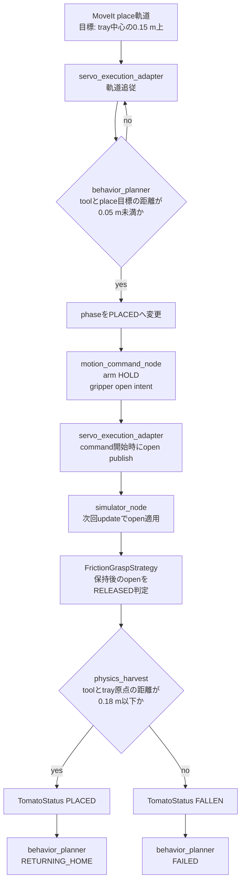
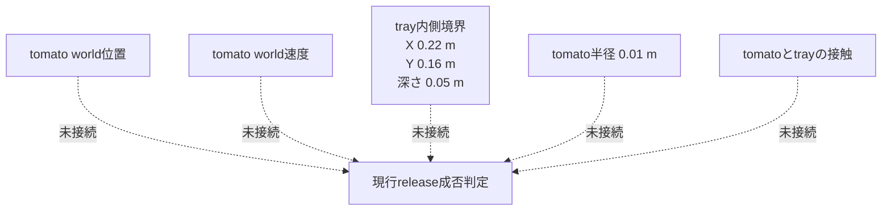
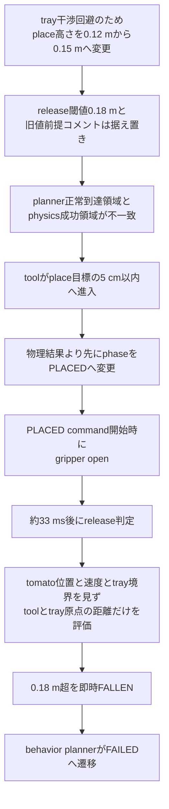
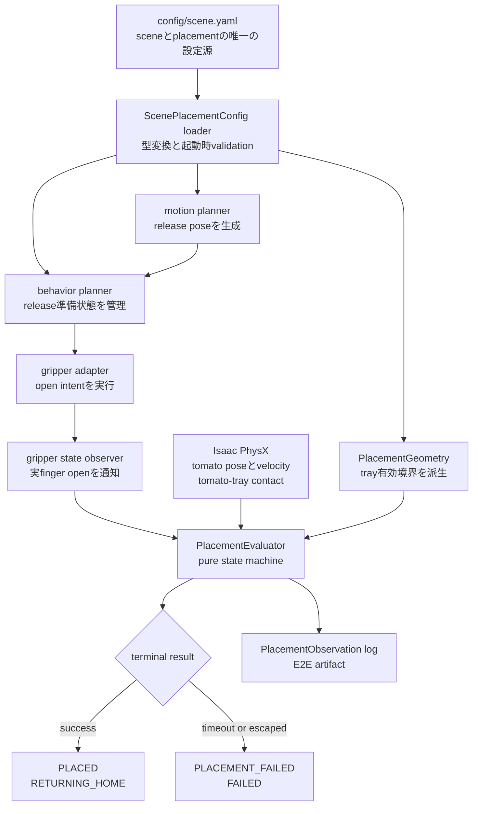
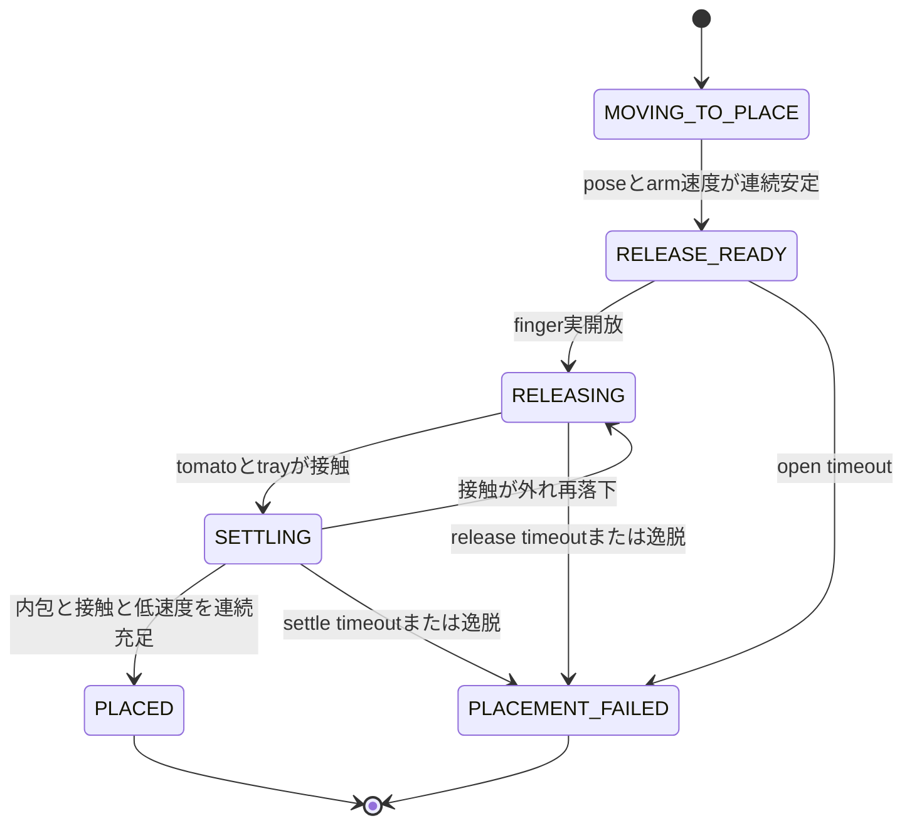

# Step 3-8-6 release配置判定失敗の原因解析

**ステータス**: Countermeasure designed（2026-07-17、実装・評価未実施）  
**作成日**: 2026-07-17  
**前提レポート**: `step3-8-5_progress_scaling_stall_replan_plan.md`  
**対象artifact**:

- `.artifacts/step3-8-5/progress-scaling-stall-replan/e2e`
- `.artifacts/step3-8-5/progress-scaling-stall-replan-retry1/e2e`

## 0. Executive summary

Step 3-8-5のStage 5失敗は、time-stretchや搬送軌道の未完了ではない。2試行ともtoolがplace到達条件を満たして`moving_to_place → placed`へ進み、その約33 ms後にgripper openを契機としてtomatoが`FALLEN`に分類され、`placed → failed`となった。

直接原因は、physics modeのrelease判定が次の1条件だけで即時確定することである。

```text
distance(robot_tool_pose, tray_pose) <= 0.18 m
  true  -> PLACED
  false -> FALLEN
```

この判定には、依頼された切り分け対象のうち、**tomato位置、tomato速度、tray内側境界、tomatoとtrayの接触・静定状態が一つも入力されていない**。したがって、ログに現れた`FALLEN`は「tomatoがtray外へ物理的に落下したことを観測した結果」ではなく、gripperを開いた最初のphysics判定でtool中心がtray原点から0.18 m以内かを評価した代理判定である。

さらに、現在のplace目標高さはStep 3-8のtray干渉回避変更により`tray.z + 0.15 m`だが、`PLACE_DISTANCE_M = 0.18 m`の根拠コメントと閾値設計は旧値`0.12 m`のままである。behavior plannerはplace目標から5 cm未満で`PLACED`へ進むため、許容されるtool位置のtray原点距離は理論上`0.10〜0.20 m`となる。つまり、**plannerが正常到達と認める領域の一部（0.18〜0.20 m）をphysics release判定が失敗とする不整合**がある。

真因は「配置完了」を次の異なる意味で二重定義し、共通の配置成立条件を持っていないことである。

1. behavior planner: toolがrelease poseの5 cm以内へ入ったこと
2. physics bridge: gripper open時のtool–tray原点距離が18 cm以内であること
3. 本来確認すべき物理結果: tomatoがtray内側に入り、許容速度まで静定したこと

前半で原因を特定し、§11以降で対策を設計する。判定ロジックやタイミングの対策実装はまだ行わない。

## 1. 入出力、振る舞い

### 1.1 入力信号

| 入力 | 意味・単位 | 現行の配置判定での使用 |
|---|---|---|
| `SceneSnapshot.robot_tool_pose` | world座標系のtool pose、位置はm | 使用。place到達とrelease成否の両方に使用 |
| `HarvestMotionPlan.place_pose` | tray中心上空のtool目標pose | behavior plannerの到達判定に使用 |
| `SceneSnapshot.tray_pose` | tray rootのworld pose、位置はm | tool–tray距離の中心として使用 |
| `SceneSnapshot.tomato_pose` | tomato中心のworld pose、位置はm | snapshotには存在するがrelease成否には未使用 |
| tomato rigid-body velocity | PhysXから取得するworld速度、m/s | debug観測で速さのみ算出するがrelease成否には未使用 |
| `SceneSnapshot.gripper_closed` | gripperのclose/open intent | `false`になった時点でreleaseを即時判定 |
| tray接触力積 | PhysX contact report、N·s | 現状はgripper/hand対trayだけを集計。tomato対trayではなく、判定にも未使用 |
| `tray_inner_size_m` | `[0.22, 0.16, 0.05] m` | scene生成とMoveIt衝突物には使用するがrelease成否には未使用 |
| `tomato_radius_m` | `0.01 m` | tomato形状には使用するがrelease成否には未使用 |

### 1.2 出力信号

| 出力 | 意味 |
|---|---|
| behavior phase `PLACED` | 現状は「配置物理結果」ではなく、toolがplace pose近傍へ到達したことを表す |
| `gripper_closed=false` | `PLACED` phaseのmotion command開始時にpublishされるopen intent |
| `TomatoStatus.PLACED` | release時のtool–tray距離が0.18 m以下なら即時設定 |
| `TomatoStatus.FALLEN` | 同距離が0.18 mを超えると、落下・接触・静定を待たず即時設定 |
| behavior phase `FAILED` | `PLACED`中に`TomatoStatus.FALLEN`を受信すると遷移 |

### 1.3 モジュール内の処理概要

1. `behavior_planner_node`は、`MOVING_TO_PLACE`中にtoolと`place_pose`の3次元距離が5 cm未満になると`PLACED`へ遷移する。
2. `motion_command_node`は`PLACED`を受けると、armをholdし、`gripper_closed=false`のcommandを生成する。
3. `servo_execution_adapter`はcommand開始時にgripper intentをpublishする。armの静定、tomato速度、tray内包を待つgateはない。
4. `simulator_node`は次のupdateでopen intentをscene runtimeへ適用する。
5. physics modeの`FrictionGraspStrategy`は、保持履歴がある状態でopenを観測すると`RELEASED`を返す。
6. `IsaacPhysicsHarvestBridge`は同一physics finalize内でtool–tray原点距離だけを評価し、`PLACED`または`FALLEN`を確定する。
7. 次のscene snapshotを受けたbehavior plannerが`FALLEN`を見て`FAILED`へ遷移する。

## 2. モジュール内の構成

全体を縦方向に示す。



現行経路の外にある未使用情報を示す。



### 2.1 各モジュールの責務

- `behavior_planner/node.py`: phase状態機械への入力を作る。現在の`place_reached`はtool位置だけから作られる。
- `behavior_planner/phase_machine.py`: `MOVING_TO_PLACE → PLACED`と、`PLACED + FALLEN → FAILED`を実行する。
- `execute_manager/motion_command.py`: phaseごとのarm/gripper intentを宣言する。`MOVING_TO_PLACE`はclose、`PLACED`はopenである。
- `execute_manager/servo_execution_adapter.py`: command開始時にgripper intentをpublishする。
- `simulator/simulator_node.py`: ROS gripper intentをscene runtimeへ適用し、snapshotをpublishする。
- `simulator/grasp_strategy.py`: friction graspの保持履歴を管理し、保持後のopenを`RELEASED`として通知する。
- `simulator/physics_harvest.py`: `RELEASED`をtomato statusへ変換する。ただし現状はtool–tray距離だけで結果を確定する。
- `simulator/isaac_viewer.py`: trayの実形状を`tray_inner_size_m`とwall厚から生成する。release classifierとは接続されていない。

## 3. E2Eで起きた現象

### 3.1 2試行の時系列

| 試行 | `moving_to_place → placed` | `placed → failed` | phase間隔 | E2E結果 |
|---|---:|---:|---:|---|
| 1 | `1784264063.766795943` | `1784264063.799725737` | 32.930 ms | 1482/7000 stepでFAIL |
| 2 | `1784264188.287685297` | `1784264188.321284110` | 33.599 ms | 1490/7000 stepでFAIL |

両試行で同じ約33 msの遷移列を再現している。これは、tomatoがrelease後にtrayへ落下し、衝突し、静定した結果を判定する時間スケールではなく、phase変更、open command伝播、次のsnapshot受信というソフトウェア周期に対応する。

### 3.2 確認できた事実

- Stage 2は2試行ともPASSし、place軌道はtimeoutせず`PLACED`到達条件まで進んだ。
- Stage 3は2試行ともPASSし、friction graspの`HELD`、detach、搬送を通過した。
- `PLACED`の約33 ms後に`FAILED`へ遷移した。
- `PLACED`中に`FAILED`へ進む実装上の入力は`TomatoStatus.FALLEN`だけである。
- friction modeで保持後にgripperを開いた場合、`RELEASED`はtool–tray距離だけで`PLACED`か`FALLEN`へ変換される。

### 3.3 artifactから確認できない値

今回のartifactにはrelease瞬間の次の値が保存されていない。

- tomatoのworld `x, y, z`
- tomatoのworld速度ベクトル `vx, vy, vz`
- toolのworld `x, y, z`
- tomato中心からtray内側境界までのmargin
- tomatoとtray base/wallの接触

`[PhysicsObs]`はdebug環境変数が有効な場合だけstdoutへ出るが、今回のE2E artifactには含まれない。また現行formatが記録するtomato位置は`z`だけ、速度はノルムだけであり、境界判定に必要な`x/y`と速度方向を復元できない。`trayF`は名称からtomato接触に見えるが、実装上は**gripper/handとtrayの接触力**である。

したがって「release瞬間のtomatoが実際にtray境界の外だった」「速度が過大だった」という結論は現artifactからは出せない。反対に、現行classifierがそれらを観測せず`FALLEN`を出したことはコードから確定できる。

## 4. tomato位置、速度、tray境界、openタイミングの個別解析

### 4.1 tomato位置

tray rootは`(0.35, -0.35, 0.45) m`、内寸は`(0.22, 0.16, 0.05) m`、tomato半径は`0.01 m`である。軸並行かつtomato全体が内側へ収まるための水平中心範囲は、少なくとも次になる。

```text
X: tray.x ± (0.22 / 2 - 0.01) = tray.x ± 0.10 m
Y: tray.y ± (0.16 / 2 - 0.01) = tray.y ± 0.07 m
```

現行判定はtomato中心ではなくtool中心を使い、水平と垂直を合成した半径0.18 mの球で判定する。この球はtrayの長方形内側境界と一致しない。そのため次の両方が起こり得る。

- tomatoがtray水平境界内でも、toolの高さを含む3D距離が0.18 mを超えて`FALLEN`
- toolが球内でも、tomatoが狭いY方向の内側境界を越えて`PLACED`

### 4.2 tomato速度

PhysXからtomato rigid-body速度を取得する処理はあるが、release classifierには渡されない。gripper open時点で、搬送由来の水平速度や下降速度が残っていても、現在位置だけで即時確定する。

また、判定はtray接触前に行われ得るため、release直後に一度`PLACED`となっても、その後の跳ね返りやwall越えを配置判定が再評価する契約はない。逆に今回の`FALLEN`も、実落下を待った結果ではない。

### 4.3 tray境界

tray geometryは内寸とwall厚を使って正しく生成され、MoveItのcollision objectにも反映される。一方、配置成否だけは`tray_inner_size_m`、wall上端、tomato半径を参照しない。経路計画の衝突モデルと、タスク成功判定の幾何モデルが分離している。

なおviewer上のtray baseはroot `z=0.45 m`を中心に厚さ`0.012 m`で生成されるため、base上面は約`0.456 m`、wall上端は約`0.506 m`である。place tool目標は`z=0.60 m`であり、releaseはtray接触・静定を確認する位置ではなく、tray上空から落下させる操作である。

### 4.4 gripper openタイミング

`MOVING_TO_PLACE`中のgripperはclose、`PLACED` commandではopenである。phase遷移直後に生成されたcommandをadapterが開始すると、その時点でopen intentをpublishする。

到達条件は次の1条件だけである。

```text
distance(tool, place_pose) < 0.05 m
```

armの実速度、tomato速度、連続静定sample、tray内包marginは条件にない。今回の約33 msという再現性の高い`PLACED → FAILED`間隔は、openが到達判定直後に伝播し、release classifierが直ちに結果を確定した実装と整合する。

## 5. 0.15 m目標と0.18 m判定の数値的不整合

現在値:

```text
tray.z                 = 0.45 m
place vertical offset  = 0.15 m
place target tool.z    = 0.60 m
place reach tolerance  = 0.05 m
release distance limit = 0.18 m
```

place targetはtray原点から0.15 m離れている。到達誤差ベクトルを`e`とすると、

```text
norm(e) < 0.05 m
tool relative to tray = (0, 0, 0.15) + e
```

よってbehavior plannerが正常到達と認める領域のtool–tray距離は、三角不等式から`0.10〜0.20 m`になり得る。一方、physics classifierは`0.18 m`までしか成功と認めない。

`physics_harvest.py`のコメントは「place offset 0.12 m + tolerance 0.05 m + margin = 0.18 m」と説明しているが、実際のplanner defaultは0.15 mへ変更済みである。コメント、閾値、planner設定の更新単位が分かれた結果、正常領域が包含されなくなった。

この不整合から確定できることは、「正常なplace到達後でもFALLENになり得る」ことである。release瞬間のtool座標がartifactにないため、各試行が0.18 mを何mm超えたかまでは確定できない。

## 6. 原因発生メカニズム



### 6.1 5 Whys

1. **なぜStage 5がfailedになったか**  
   `PLACED` phase中に`TomatoStatus.FALLEN`を受信したため。
2. **なぜrelease直後にFALLENになったか**  
   friction graspのrelease classifierがtool–tray原点距離0.18 m超を即時FALLENへ写像するため。
3. **なぜ正常なplace到達後でも0.18 mを超え得るか**  
   place目標がtray上0.15 m、到達許容が5 cmで、正常領域が最大0.20 mまで広がるため。
4. **なぜtomatoの実配置結果で補正されないか**  
   tomato位置、速度、tray内側境界、tomato接触、静定待ちがclassifier入力・状態機械に存在しないため。
5. **なぜこの不整合が構造的に生じたか**  
   「release pose到達」「gripper open」「tomato配置成立」を独立した状態として扱わず、`PLACED`という1 phaseとtool距離の代理指標へ集約しているため。

## 7. 真因と寄与要因

### 7.1 真因

**配置成功のドメイン条件が一元定義されておらず、tool到達、open intent、tomato物理結果を別々の代理条件で判定していること。**

### 7.2 直接トリガ

`PLACED` command開始時のgripper openにより、friction strategyが`RELEASED`を返し、physics bridgeが同期的に二値分類したこと。

### 7.3 再現性を高めた設定不整合

place offsetを0.12 mから0.15 mへ上げた一方、release閾値0.18 mを旧前提のまま維持したこと。

### 7.4 観測上の欠落

release瞬間のtomato `x/y/z`、速度ベクトル、tomato–tray接触、境界marginをartifactへ残していないため、物理軌跡の事後検証ができないこと。ただしこれはfailureを発生させた直接原因ではなく、原因を定量化できない要因である。

## 8. 事実と推定の分離

### 8.1 実装・artifactから確認済みの事実

- 2試行とも`moving_to_place → placed → failed`で、後半2遷移の間隔は約33 ms。
- `PLACED`中の`FALLEN`が`FAILED`遷移を起こす。
- physics modeのrelease成否はtool–tray距離0.18 mだけで決まる。
- place目標offsetは0.15 m、behavior到達許容は0.05 m。
- release判定はtomato位置、速度、tray内寸、tomato–tray接触を使わない。
- 現artifactにはrelease瞬間の必要な物理量がない。

### 8.2 妥当な推定

- 約33 msでのfailureは実落下・静定結果ではなく、ROS/scene/physicsの更新周期で代理判定が伝播した結果である可能性が極めて高い。
- 両試行のrelease時tool–tray距離は0.18 mを超えた可能性が高い。`PLACED`中にopenした直後の`FALLEN`を生成する現行経路と一致するためである。

### 8.3 現時点で断定しない事項

- release瞬間のtomatoがtray水平境界の内側だったか外側だったか。
- tomato速度が配置失敗を起こすほど大きかったか。
- release後に待てばtomatoがtray内へ収まったか。
- tool–tray距離が0.18 mを超えた方向が、Z、X/Y、またはその合成のどれか。

## 9. 実装から逆起こしした現行要件と欠落要件

### 9.1 現行実装が満たす要件

- toolがplace poseから5 cm未満へ到達した時に、搬送phaseを終了できること。
- 搬送中にgripperを閉じ、place到達後にopen intentへ切り替えられること。
- friction grasp保持後のopenをrelease eventとして検出できること。
- release時のtoolがtray原点から18 cm以内なら`PLACED`、それ以外なら`FALLEN`を通知できること。

### 9.2 配置結果を物理的に評価するために欠けている要件

以下は対策案ではなく、現行契約に存在しない判定要件の整理である。

- 配置判定はtomato中心と半径を用いてtray内側境界への内包を確認できること。
- release前後のtomato速度ベクトルを観測できること。
- release intentと、fingerが実際に開いたことを区別できること。
- release後、tomato–tray接触と速度収束を一定期間観測してからterminal statusを確定できること。
- `RELEASE_READY`、`RELEASING`、`SETTLING`、配置成功/失敗を意味上区別できること。
- E2E artifactにrelease時刻、tool pose、tomato pose/velocity、tray margin、接触状態、最終判定理由を保存できること。

## 10. 結論

Step 3-8-5のStage 5失敗は、配置物理現象そのものの失敗を証明していない。現行実装は、place目標近傍へtoolが入ると直ちにgripperを開き、約33 ms後にtool–tray原点距離だけでtomatoを`FALLEN`へ分類している。

特に、place高さを0.15 mへ変更した後も0.12 m前提の0.18 m閾値が残り、behavior plannerの正常到達領域とphysics classifierの成功領域が一致しなくなったことが、今回の再現性あるfailureを説明する直接的な設定不整合である。その背後の真因は、tomato位置・速度・tray境界・接触・静定を含む共通の「配置成立」定義がなく、tool poseを代理にした複数の局所判定へ分散していることである。

次段では、不足観測を追加してrelease瞬間から静定までの物理軌跡を定量化し、その証跡に基づいて§11以降の配置状態機械と初期設定値を確定する。本レポートでは対策実装・閾値変更・追加E2Eは実施していない。

---

## 11. 対策方針（2026-07-17追記）

### 11.1 対策の目的

対策は、単に`PLACE_DISTANCE_M`を0.18 mから別の値へ変更するものではない。次の3点を同時に解消する。

1. tool到達とtomato配置完了が同じ`PLACED` phaseで表される意味の混在
2. gripper open intentを実開放・物理releaseとみなすタイミングの混在
3. place高さ、到達許容、tray寸法、tomato寸法、配置判定値が複数ファイルへ分散する設定不整合

成功条件は「toolが所定位置へ到達した」ではなく、**実際のtomatoがtray内側へ入り、trayと接触し、許容速度以下で連続して静定したこと**とする。

### 11.2 外部一次情報の反映

- Isaac Simのphysics-based sensorはphysics rateでprimのvelocity等を取得できるため、release後のtomato速度を連続評価できる。
- Contact SensorはPhysX Contact Report APIを基盤にcontact pairを取得できるため、現行のgripper–tray接触ではなくtomato–tray接触を識別できる。
- ROS 2 parameterはYAMLから初期値を与えつつ、node側で型、値域、追加制約を宣言できるため、設定の重複や不正値を起動時に拒否できる。

参照:

- [Isaac Sim 6.0.1 Contact Sensor](https://docs.isaacsim.omniverse.nvidia.com/6.0.1/sensors/isaacsim_sensors_physics_contact.html)
- [Isaac Sim Physics-based sensors](https://docs.isaacsim.omniverse.nvidia.com/latest/sensors/isaacsim_sensors_physics.html)
- [ROS 2 Jazzy Parameters](https://docs.ros.org/en/jazzy/Concepts/Basic/About-Parameters.html)

## 12. 対策案比較

| 案 | 概要 | メリット | デメリット | 判定 |
|---|---|---|---|---|
| A: 距離閾値だけ同期 | place offset 0.15 mと到達許容0.05 mからtool–tray閾値を再計算 | 変更が最小。今回のfalse failureを短期的に避けやすい | tomato位置・速度・tray境界を見ない。false positive/negativeと即時判定が残る。次の高さ変更で再発し得る | 不採用 |
| B: release時のtomato幾何判定 | open時にtomato中心がtray水平境界内なら成功 | tool proxyを除去できる。tray形状とtomato半径を使える | release直後の速度、接触、跳ね返りを評価しない。一瞬だけ内側でも成功になる | 単独では不採用 |
| C: staged placement評価 | release準備、実開放、落下/接触、静定を別状態にし、幾何・接触・速度を連続評価 | 配置という物理結果を直接評価できる。実機向けgripper actionにも責務を対応させやすい | 状態と観測契約の追加が必要。E2E時間がsettle分延びる | **推奨** |

案Cを採用する。案Aは暫定修正としても実施せず、旧`PLACE_DISTANCE_M`自体を最終的に削除する。これにより一時的にE2Eを緑化して根本問題を隠すことを避ける。

## 13. 推奨アーキテクチャ

### 13.1 全体構成



### 13.2 責務分離

- `ScenePlacementConfig`: raw設定の読み込みと相互制約検証だけを担う。
- `PlacementGeometry`: tray pose、内寸、wall厚、tomato半径から有効境界とmarginを計算する。ROS、Isaac Sim、時間状態を持たないpure moduleとする。
- `PlacementEvaluator`: 観測系列から`RELEASING / SETTLING / SUCCEEDED / FAILED`を遷移するpure state machineとする。
- behavior planner: task phaseを管理し、evaluatorのterminal resultだけを`RETURNING_HOME / FAILED`へ変換する。幾何計算を持たない。
- gripper adapter/state observer: command intentと物理到達を分ける。simではfinger joint state、実機ではFranka gripper action resultと実測widthを入力にする。
- physics bridge: PhysX ground truthを読み、観測値を構築する。成功条件そのものをベタ書きしない。

単一責任と依存方向は次に限定する。

```text
ROS node / Isaac adapter
  -> PlacementEvaluator
  -> PlacementGeometry
  -> immutable config/value objects
```

pure policy層からROS message、USD/PhysX API、nodeへ逆依存させない。

## 14. 配置状態機械

### 14.1 状態

| 状態 | 意味 | entry action | 遷移条件 |
|---|---|---|---|
| `MOVING_TO_PLACE` | release poseへ搬送中 | gripper close維持 | release-ready条件を連続充足 |
| `RELEASE_READY` | toolとarmが開放可能な状態 | open commandを1回発行 | 実finger open観測 |
| `RELEASING` | tomatoがfingerから離れる過程 | release timeout開始 | tomato–tray接触で`SETTLING`、明確な作業領域逸脱で失敗 |
| `SETTLING` | tray接触後の静定観測 | settle counter開始 | 内包・接触・速度条件を連続充足して成功 |
| `PLACED` | tomato配置成立 | なし | `RETURNING_HOME` |
| `PLACEMENT_FAILED` | release/settle timeoutまたはtray逸脱 | reason記録 | `FAILED` |

既存の`PLACED`をrelease開始に使わない。新規phaseを外部契約へ直ちに増やす影響が大きい場合は、behavior planner内のplacement substateとして導入してもよいが、ログとstatusには上記状態名を必ず公開する。

### 14.2 状態遷移



## 15. 成功条件

### 15.1 release-ready条件

tool到達だけでopenしない。次を同じsampleで満たし、設定された連続sample数だけ維持した場合に`RELEASE_READY`へ進む。

```text
position_error(tool, release_pose) <= release_ready.position_tolerance_m
max_abs_joint_velocity            <= release_ready.max_joint_speed_rad_s
tomato_status                     == DETACHED
gripper_measured_state            == CLOSED
```

`position_tolerance_m`は従来のbehavior planner定数を移設する。arm速度条件を加えることで、place poseを通過中にopenすることを防ぐ。

### 15.2 gripper実開放条件

`gripper_closed=false` publishはintentであり、`RELEASING`開始条件にしない。次のいずれかをhardware adapterが共通の`GripperState.OPEN`へ変換する。

- sim: 両finger jointの実測gapがopen threshold以上
- 実機: gripper actionの`reached_goal=true`かつ実測widthがthreshold以上

open command発行時刻と実開放確認時刻を別々に記録する。

### 15.3 tray内包条件

trayがworld軸に対して回転する将来変更に備え、tomato centerをtray local frameへ変換して評価する。現行のaxis-aligned world座標比較へ固定しない。

球近似tomatoがtray内側へ安全margin付きで収まる水平条件:

```text
abs(tomato_local.x) <= inner_x / 2 - tomato_radius - boundary_margin
abs(tomato_local.y) <= inner_y / 2 - tomato_radius - boundary_margin
```

垂直方向は、tomato底面がbase上面より下へ貫通しておらず、静定時のtomato中心がwall上端を不当に超えていないことを確認する。base上面とwall上端はtray pose、内寸、wall厚から派生させ、別数値を設定しない。

### 15.4 接触条件

contact pairにtomato rigid bodyとtrayの`Base`または各`Wall`が含まれることを要求する。現行`trayF`のgripper–tray contactは別名へ変更し、配置成功には使用しない。

```text
tomato_tray_contact == true
```

raw PhysX contact reportは剛体が静定した際に通知されなくなる場合があるため、release episode中に一度確認したtomato–tray接触を`PlacementEvaluator`で保持する。接触確認後は、tray内包とlinear/angular speedの連続条件で静定を判定する。これにより「未接触のままtray内座標へ偶然入った状態」は成功させず、静止接触の通知停止にも影響されない。

### 15.5 速度・静定条件

tomatoのworld速度ベクトルからlinear speedを計算し、必要ならangular speedも評価する。

```text
linear_speed(tomato)  <= settling.max_linear_speed_m_s
angular_speed(tomato) <= settling.max_angular_speed_rad_s
```

tray内包、tomato–tray接触、速度条件を`settling.required_consecutive_steps`だけ連続充足した時だけ`PLACED`とする。1 sample合格では確定しない。

### 15.6 失敗条件

- open command後、実finger openを`open_timeout_sec`以内に確認できない
- release後、tomato–tray接触を`release_timeout_sec`以内に確認できない
- `settle_timeout_sec`以内に連続静定条件を満たせない
- tomato中心がtray外周に加えた`escape_margin_m`を越え、回復不能領域へ入る
- tomato pose/velocity/contactの必須観測が連続欠落する

単に一時的に水平内包条件を外れただけでは即時`FALLEN`にせず、明確な逸脱またはtimeoutで失敗とする。

## 16. 設定値の一元管理

### 16.1 原則

- 配置関連の調整値は`config/scene.yaml`の`placement` sectionを唯一のsource of truthとする。
- Python class default、module-level定数、テストfixtureへ同じ値を複製しない。
- planner、behavior planner、physics bridgeは同一の`load_scene_placement_config()`を利用する。
- tray有効境界、base上面、wall上端、最大許容release高さ等の**計算可能な値は設定せず派生させる**。
- 設定schemaはimmutable dataclassで表し、起動時に全nodeが同じvalidationを実行する。
- runtime変更を必要としない値はread-onlyとして扱う。変更は再起動を伴う明示的なconfiguration changeとする。

### 16.2 YAML案

数値は初期候補であり、実装前のunit testとinstrumented E2Eで確定する。重要なのは配置場所と依存関係である。

```yaml
scene:
  tomato_radius_m: 0.01
  tray_inner_size_m: [0.22, 0.16, 0.05]
  tray_wall_thickness_m: 0.012

placement:
  release_pose:
    vertical_offset_m: 0.15
    hover_offset_m: 0.10

  release_ready:
    position_tolerance_m: 0.05
    max_joint_speed_rad_s: 0.05
    required_consecutive_steps: 6

  gripper_open:
    measured_gap_threshold_m: 0.07
    timeout_sec: 1.0

  containment:
    boundary_margin_m: 0.005
    escape_margin_m: 0.03

  settling:
    max_linear_speed_m_s: 0.03
    max_angular_speed_rad_s: 0.5
    required_consecutive_steps: 12
    release_timeout_sec: 1.5
    settle_timeout_sec: 3.0
```

`tomato_radius_m`、`tray_inner_size_m`、`tray_wall_thickness_m`は既存のscene geometry設定を再利用する。`placement`側へコピーしない。

### 16.3 typed config

```text
ScenePlacementConfig
  scene_geometry
    tomato_radius_m
    tray_inner_size_m
    tray_wall_thickness_m
  release_pose
  release_ready
  gripper_open
  containment
  settling
```

各consumerは必要なsub-configだけを受け取る。

```text
MoveItStylePreGraspPlanner <- ReleasePoseConfig
ReleaseReadinessEvaluator  <- ReleaseReadyConfig
GripperStateObserver       <- GripperOpenConfig
PlacementGeometry          <- SceneGeometryConfig + ContainmentConfig
PlacementEvaluator         <- SettlingConfig + PlacementGeometry
```

これにより「全設定をどのmoduleからでも参照できるglobal object」にはせず、単一設定源と最小依存を両立する。

### 16.4 起動時validation

最低限、次をfail-fastで検証する。

```text
tomato_radius_m > 0
tray inner dimensions > 0
tray wall thickness > 0
2 * (tomato_radius + boundary_margin) < tray inner X and Y
release vertical offset > tray wall top relative height + tomato radius
all speed and timeout values > 0
required consecutive steps >= 1
escape margin >= boundary margin
```

さらに、`release_ready.position_tolerance_m`を含むtool到達領域と、gripper/tray衝突回避領域が矛盾しないことをgeometry testで検証する。従来のように「plannerの正常領域最大0.20 m、physics成功閾値0.18 m」という不整合は起動時またはunit testで検出する。

### 16.5 廃止するマジックナンバー

| 現在値 | 現在位置 | 対応 |
|---|---|---|
| `0.15` place offset | `pregrasp_planner.py` constructor default | `placement.release_pose.vertical_offset_m`へ移設 |
| `0.10` hover offset | 同上 | `placement.release_pose.hover_offset_m`へ移設 |
| `0.05` place到達許容 | `behavior_planner/node.py` | `placement.release_ready.position_tolerance_m`へ移設 |
| `0.18` release距離 | `physics_harvest.py` | **削除**。tomato内包・接触・速度判定へ置換 |
| `0.05` soft fallback place許容 | `scene_runtime.py` | physics成功判定から削除。非physics demoを残す場合も同じpolicyを使用 |
| `0.03` placed tomato Z offset | `scene_runtime.py` | 強制配置を廃止。必要なtest fixture値はgeometryから派生 |

## 17. 観測・ログ契約

releaseからterminalまで、physics stepごとに次を同じsequence IDで記録する。

```text
placement_state
open_commanded
gripper_measured_state
tool_xyz
tool_position_error_m
max_joint_speed_rad_s
tomato_xyz
tomato_linear_velocity_xyz
tomato_linear_speed_m_s
tomato_angular_speed_rad_s
tomato_local_xyz_in_tray
tray_margin_x_m
tray_margin_y_m
tray_vertical_margin_m
tomato_tray_contact
tomato_tray_contact_force_n
settle_consecutive_steps
elapsed_since_open_sec
placement_decision
placement_reason
```

既存`trayF`は`gripper_tray_contact_force_n`へ改名し、新たに`tomato_tray_contact_force_n`を追加する。E2E終了時にはrelease開始からterminalまでをCSVまたはJSONLでartifactへ保存し、stdout debug環境変数に依存させない。

## 18. 実装順序

1. `config/scene.yaml`へ`placement` sectionを追加し、typed loaderとcross-field validationを実装する。
2. `PlacementGeometry`のpure moduleを追加し、tray local変換、有効境界、margin、escape判定をunit testする。
3. tomato velocity vectorとtomato–tray contactを取得し、`PlacementObservation`へ集約する。判定はまだ切り替えずobserve-onlyでE2Eを1回取得する。
4. `GripperState`をintentから分離し、実finger open観測を追加する。
5. `PlacementEvaluator`のpure state machineをTDDで実装する。
6. behavior plannerへrelease/settling substateまたは明示phaseを接続する。
7. 旧`PLACE_DISTANCE_M`、即時`FALLEN`判定、physics soft fallbackの独自place判定を削除する。
8. unit、integration、rebuild付きphysics E2Eの順に評価する。

observe-onlyを先行する理由は、初期候補の速度閾値やtimeoutを推測だけで確定せず、実際のrelease軌跡から設定するためである。設定場所と判定構造は先に固定し、値だけを証跡に基づいて調整する。

## 19. テスト計画と受け入れ条件

### 19.1 unit test

- YAMLの正常loadと全validation error
- tray rotationを含むworld-to-local変換
- tomato半径とmarginを含むX/Y境界の内側、境界上、外側
- base上面、wall上端の派生値
- open intentだけでは`RELEASING`へ進まない
- 実openで`RELEASING`へ進む
- 接触前は成功しない
- 接触しても速度過大なら成功しない
- 連続静定sample不足では成功しない
- contact grace内の1-step欠落では継続する
- timeout、escape、観測欠落でreason付き失敗
- 旧0.18 m tool距離が判定入力に存在しない

### 19.2 integration test

- 1つのYAML変更がplanner release poseとevaluator geometryへ同時反映される
- invalidなscene/placement組合せで関連nodeが起動失敗する
- `PLACED` publish前に実open、tomato contact、settleが順番に観測される
- status/logのsequence IDでROS phaseとphysics observationを対応付けられる

### 19.3 rebuild付きphysics E2E

Step 3-8-5と同じ条件で最低3回評価する。

```bash
CI_HEADLESS_STEPS=7000 \
CI_E2E_TIMEOUT_SEC=2400 \
CI_GRASP_MODE=physics \
bash ./scripts/ci/run_e2e.sh
```

受け入れ条件:

| Stage | 条件 |
|---|---|
| Stage 2 | place軌道がtimeoutせずrelease-readyへ到達 |
| Stage 3 | grasp、hold、detach、搬送中にtomatoを失わない |
| Release | open intent後に実finger openを確認 |
| Geometry | terminal成功時にtomato全体がtray内側margin内 |
| Contact | tomato–tray contactを観測 |
| Settling | linear/angular speedが連続sample条件を満たす |
| Stage 5 | `PLACED → RETURNING_HOME → COMPLETE`、completion marker検出 |
| Repeatability | 同一条件3試行すべてPASS |
| Evidence | 全試行でplacement JSONL/CSVをartifactへ保存 |

### 19.4 回帰条件

- non-physics demo modeを維持する場合も、別の距離マジックナンバーで成功判定しない。
- grasp・detach用のfriction state machineをplacement evaluator変更で破壊しない。
- Step 3-8-5のprogress scaling、stall detector、suffix replanの単体・E2E観測を維持する。
- tray poseや寸法を変更したtest configでも、コード変更なしに派生境界が追従する。

## 20. 対策後の完了定義

本対策は、E2Eが一度`COMPLETE`になっただけでは完了としない。次をすべて満たした時点をStep 3-8-6完了とする。

- 配置関連設定が`config/scene.yaml`へ一元化され、コード内の重複defaultと旧距離閾値が削除されている。
- 設定のcross-field validationがあり、不整合構成を起動前に検出できる。
- gripper intentと実開放が分離されている。
- tomato位置、速度、tray内包、tomato–tray接触、静定を使って成功判定している。
- `PLACED`がtool到達ではなくtomato配置成立を意味する。
- rebuild付きphysics E2Eを3回連続で完走し、各試行の物理証跡が保存されている。

## 21. 実装結果（2026-07-17）

### 21.1 実装した対策

- `config/scene.yaml`の`placement` sectionを唯一の設定源とし、release pose、到達許容、実finger gap、tray margin、速度、連続sample数、timeoutを集約した。
- immutable dataclassによるtyped loaderとcross-field validationを追加した。
- plannerのrelease/hover offsetとbehavior plannerのplace到達許容を同じ設定から読むようにした。
- command intentの`gripper_commanded_closed`と、finger jointから観測した`gripper_closed`を分離した。open commandだけでは実open済みと扱わない。
- tomato–tray contactをgripper–tray contactから分離して収集した。
- `PlacementGeometry`でtomato centerをtray local frameへ変換し、tomato半径とmarginを含む水平内包・escapeを判定した。
- `PlacementEvaluator`で接触履歴、linear/angular speed、連続静定sample、release/settle timeoutを評価した。旧`PLACE_DISTANCE_M`は削除した。
- USD `physics:angularVelocity`のdegree/sを設定契約のrad/sへ境界で変換した。
- `RELEASING` phaseを追加し、tool到達時はrelease待ち、物理評価が`TomatoStatus.PLACED`を確定した後だけROS phaseを`PLACED`へ遷移させた。

最終phase順序は次のとおりである。

```text
MOVING_TO_PLACE
  -> RELEASING
  -> PLACED       (tomato–tray接触、内包、速度、12連続sample成立後)
  -> RETURNING_HOME
  -> COMPLETE
```

### 21.2 切り分け中に判明した追加真因

初回実装後のE2Eでは、tomatoがtray base上にありlinear speedも閾値内にもかかわらず`settling_timeout`となった。原因は次の2点だった。

1. USD `physics:angularVelocity`はdegree/sだが、値をrad/s閾値`0.5`へ無変換で比較していた。
2. raw contact reportが静定直前に停止したsampleを非接触として扱い、連続静定counterをresetしていた。

単位変換後の実測角速度は約`0.20–0.49 rad/s`であり、設定した`0.5 rad/s`以内だった。接触はrelease episode中に実観測した事実を保持し、その後の成功にはtray内包と低速度の連続成立を要求する方式へ変更した。

### 21.3 unit / integration test

```text
306 passed, 2 skipped
```

追加した主要test:

- YAML load、設定不整合のfail-fast
- tray回転を含むlocal-frame内包判定
- 接触前の成功禁止、速度超過によるcounter reset、timeout
- raw contact通知停止後も、事前接触と静定条件が揃えば成功
- degree/sからrad/sへの単位変換
- command intentと実finger stateの分離
- `PLACED`が物理配置確定前にpublishされないphase遷移

### 21.4 rebuild付きphysics E2E

配置評価実装の同一条件3試行はすべてPASSした。

| 試行 | 配置確定seq | release後確定時間 | tomato位置 [m] | linear speed [m/s] | angular speed成分 [rad/s] | 終了 |
|---|---:|---:|---|---|---|---|
| retry3 | 1500 | 1.3833 s | `(0.25801, -0.41369, 0.47200)` | 約0.0079 | `(-0.16884, 0.22245, 0)` | COMPLETE |
| retry4 | 1648 | 2.5083 s | `(0.25636, -0.41139, 0.47200)` | 約0.0089 | `(0.44327, 0.21177, 0.00003)` | COMPLETE |
| retry5 | 1686 | 2.5167 s | `(0.26198, -0.41388, 0.47200)` | 約0.0077 | `(-0.08876, 0.17888, -0.00030)` | COMPLETE |

`RELEASING` phase追加後にも最終E2Eを実施し、次を確認した。

```text
moving_to_place -> releasing
releasing -> placed
placed -> returning_home
returning_home -> complete
```

最終試行ではseq `1518`、release後`1.5750 s`、12連続sampleで`settled_in_tray`となり、tomato位置`(0.25981, -0.41372, 0.47200)`、linear speed約`0.0079 m/s`、angular speed成分`(-0.14384, 0.21791, 0) rad/s`だった。その後seq `2572/7000`で早期`COMPLETE`した。

artifact:

- `.artifacts/step3-8-6/placement-evaluator-retry3/e2e/`
- `.artifacts/step3-8-6/placement-evaluator-retry4/e2e/`
- `.artifacts/step3-8-6/placement-evaluator-retry5/e2e/`
- `.artifacts/step3-8-6/releasing-phase-final/e2e/`

### 21.5 結論

release時のtool距離だけで成功/失敗を決める旧判定を廃止し、実finger open後のtomato–tray接触、tray local内包、linear/angular speed、連続静定sampleで配置を確定する方式へ移行した。設定値は`config/scene.yaml`へ集約され、planner、behavior、simulatorが同じtyped configurationを参照する。再現性3試行とphase意味整合の最終試行はいずれも`COMPLETE`し、Step 3-8-6の配置失敗対策は合格と判定する。
