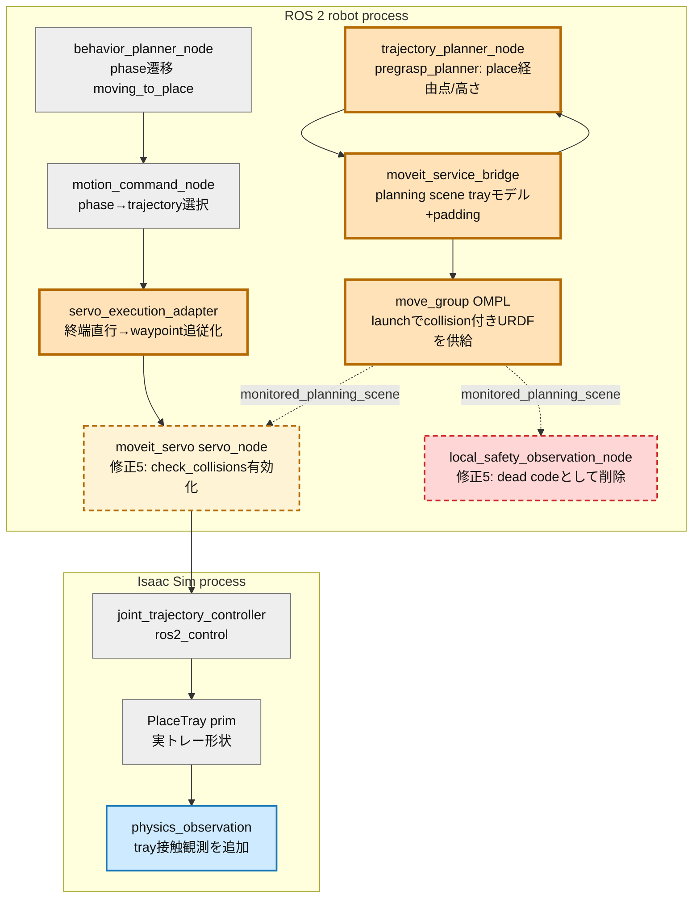
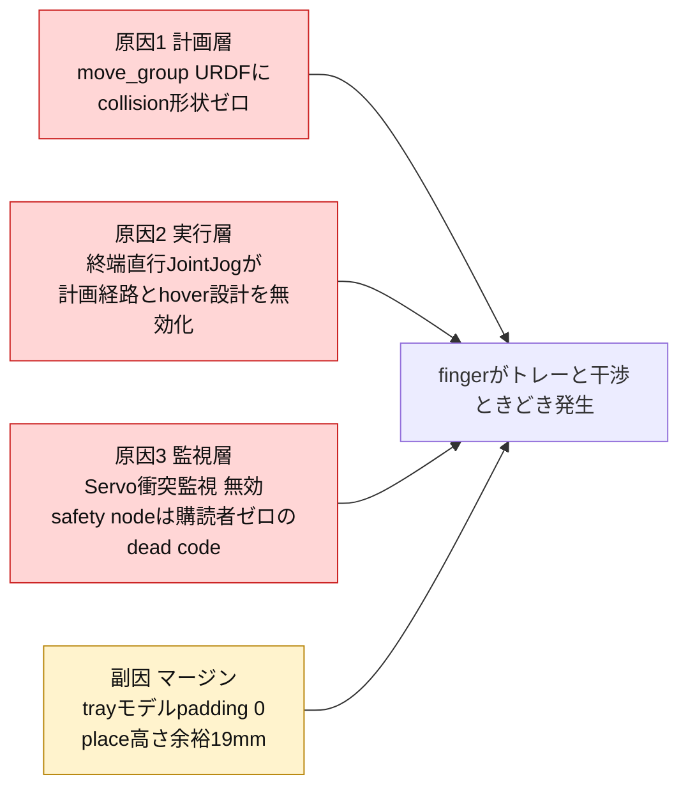
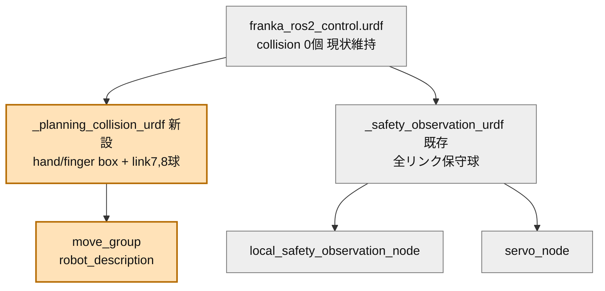
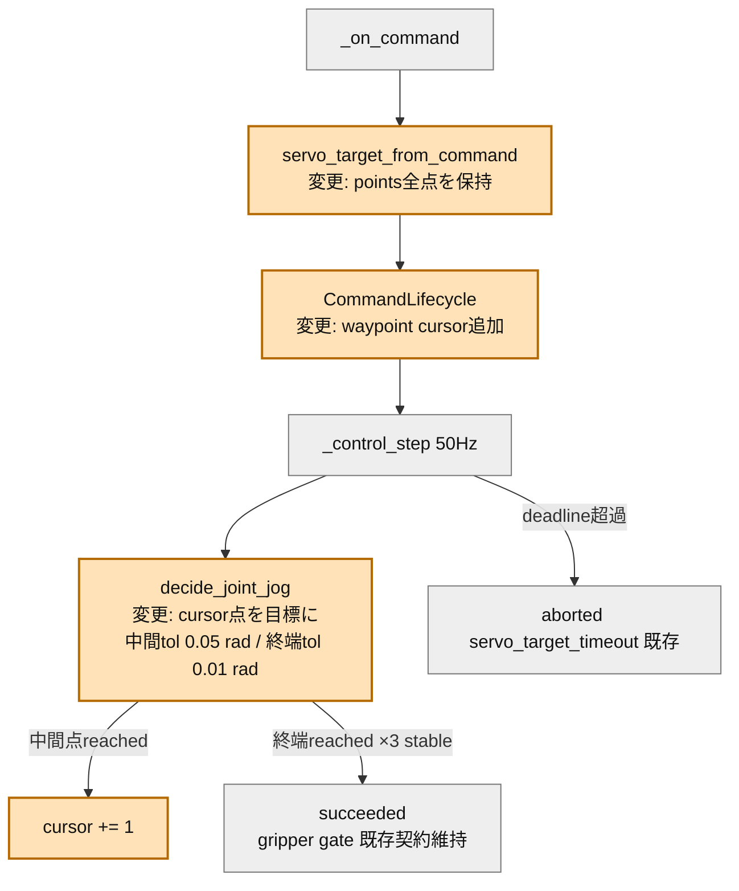
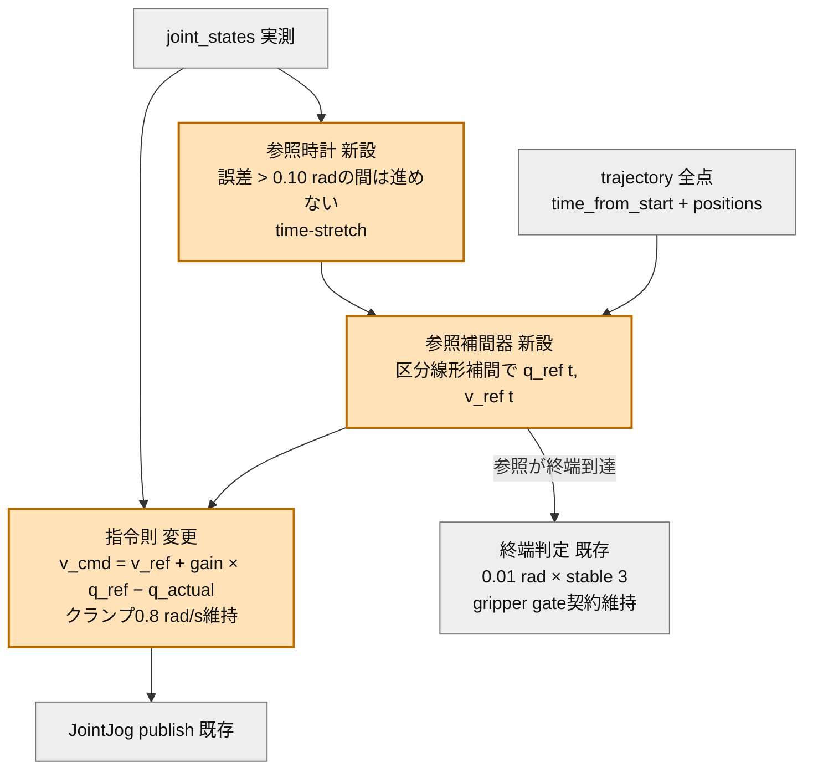

# Step 3-8 トレー干渉回避の見直しと修正プラン

## 目的

トマト把持後、`moving_to_place` でトレーへ搬送中に finger がトレー（壁・縁）と干渉することがある。本Stepでは、現状の干渉回避ロジックをコードから棚卸しし、干渉が起こり得る構造要因を特定して、修正プランを定義する。実装は本文書の承認後に行う（本Stepでは変更しない）。

本文書はコードから確認した事実と、そこからの推測を分離して記載する。

## 全体アーキテクチャと変更対象範囲

凡例: 橙 = 本プランで変更するノード、橙点線 = オプション修正（修正5: 前提条件つき）、赤点線 = 削除するノード、青 = 検証の観測に使うノード（修正4で観測項目を追加）、灰 = 今回は無変更。ROS nodeとIsaac側を大枠(subgraph)で示す。

変更モジュールは5修正: `franka_ros2_control/launch/move_group.launch.py`（修正1）、`robot/execute_manager/servo_execution_adapter.py`（修正2）、`robot/motion_planner/moveit_service_bridge.py` と `robot/motion_planner/pregrasp_planner.py`（修正3）、`simulator/physics_observation.py`（修正4）、`franka_ros2_control` の Servo 設定と safety 観測ノード群（修正5）。

## 現状の干渉回避ロジックの棚卸し（確認済みの事実）

### F1. planning scene のトレーモデルは実形状と外形一致している

`moveit_service_bridge.py` の `_tray_collision_objects()` は、トレーを底板1枚＋壁4枚の box collision object として `/apply_planning_scene` へ毎phase適用する。寸法は `TRAY_INNER_SIZE_M = (0.22, 0.16, 0.05)`、`TRAY_WALL_THICKNESS_M = 0.012` で、`config/scene.yaml` と Isaac 側 `isaac_viewer.py:_add_tray()` の実形状と一致する。壁上端は両モデルとも `tray_z + 0.056`（tray_z = 0.45 なので z = 0.506）である。**モデル形状の不一致は干渉原因ではない。** padding（安全マージン）は 0 である。

### F2. move_group の URDF に collision 形状が 1 つも無い

`move_group.launch.py` は `franka_ros2_control.urdf` をそのまま move_group の `robot_description` に渡している。この URDF に `<collision>` 要素は **0 個**である（`grep -c collision` = 0）。primitive collision（リンク球 + finger box）を付与する `_safety_observation_urdf()` は存在するが、その適用先は `local_safety_observation_node` と `servo_node` だけで、**計画本体の move_group には渡っていない**。

含意: ロボットリンクに衝突形状が無いため、planning scene にトレーを正確に登録していても、OMPL の経路衝突チェック（robot対world）は**常に合格**する。つまり計画段階でトレー干渉は一切検査されていない。

### F3. 実行は計画軌道を捨てて終端へ直行している

`servo_execution_adapter.py` の `servo_target_from_command()` は、MoveIt が返した joint trajectory から **`trajectory.points[-1]`（終端点）だけ**を取り出し、`decide_joint_jog()` が比例ゲイン（gain 3.0、上限 0.8 rad/s）で現在構成から終端構成へ各関節を独立に収束させる。中間 waypoint は使われない。

含意: pregrasp_planner が設計した「pre_place（トレー直上 hover）を経由して垂直降下する」接近は、`plan_phase_trajectories()` で pre_place→place の連結軌道として計画されても、実行では**終端 place 構成へ斜めに直行**する。pull 位置（x=0.54, y=0, tool z=0.62）からトレー（x=0.35, y=−0.35）への大移動で、各関節が独立レートで収束する実行経路は計画経路とは別物であり、トレー壁の上をかすめる・横切る経路になり得る。干渉が「ときどき」なのは、開始構成（把持時のIK枝・pull後の姿勢）に依存するためと推測する。

### F4. 実行時の衝突監視は2系統とも機能していない

実行時（計画後）にトレー接近を検知できる仕組みは2つ存在するが、どちらも現在は効いていない。

**(a) MoveIt Servo 内蔵の衝突監視（`check_collisions: false` で無効）**

Servo の `check_collisions` は、指令周期ごとに monitored planning scene 上でロボット現在状態と障害物の最近接距離を計算し、`scene_collision_proximity_threshold`（設定値 0.02 m）を下回ると指令速度を減速→停止させる**実行時ブレーキ**である。経路を迂回させる機能ではない。

`true` にするだけでは解決しない理由が3つある。

1. **迂回はしない**: 干渉コースの指令のまま有効化しても、halt → deadline 超過 → abort に変わるだけで、搬送は失敗する。干渉「回避」の主対策はあくまで修正1（計画で避ける）＋修正2（計画どおり動く）である。
2. **把持と両立しない**: planning scene には tray だけでなく tomato・branch・stem も入っている。grasp 接近では finger がトマトへ距離 0 まで近づく必要があり、そのまま有効化すると**把持前に必ず halt する**。phase に応じた除外（`target_tomato` の ACM 許可または監視対象からの除外）の設計が前提になる。
3. **yaml のコメントは古い**: 「CI URDF に collision geometry が無いため有効化すると恒久 halt」とあるが、現在の launch は servo_node に collision 付き URDF（`_safety_observation_urdf`）を渡しており、この前提は解消済みである。ただし保守半径の球で誤減速・誤 halt が出ないかは未検証で、修正4の接触観測を物差しにした E2E 検証が要る。

以上から、`check_collisions: true` は修正1・2が入った後の**二重防護（最後の砦）**として意味を持つ。修正5として計画する。

**(b) `local_safety_observation_node`（dead code）**

collision 付き URDF で planning scene を監視し、最近接距離と Jacobian 系の観測を `/tomato_harvest/local_safety_status` へ 20 Hz で publish する C++ ノード。しかしこの topic の**購読者はリポジトリ内にゼロ**である（`topics.py` の定数 `LOCAL_SAFETY_STATUS_TOPIC` は定義のみで import 箇所なし、CI・スクリプトでも未使用）。`motion_planner/node.py` の replan trigger も `observe_only_under_servo` として planner を起動しない扱いであり、この観測は制御にも診断にも接続されていない。**publish 先のない dead code** なので、修正5で削除する。

### F5. MoveIt 失敗時の fallback は干渉源ではない（搬送失敗になる）

place 計画が失敗した場合、`MoveIt2ServiceBridgePlanner.plan()` は幾何プラン（`MoveItStylePreGraspPlanner`）で補完するが、幾何プランは joint trajectory を持たないため、servo adapter は `missing_trajectory` で abort する。衝突チェック無しの軌道が実行されることはない。

### F6. 高さマージンは薄い

現状幾何（`config/scene.yaml` + `pregrasp_planner.py` + bridge 定数から算出）:

| 項目 | 値 | 出典 |
|---|---:|---|
| トレー位置 (x, y, z) | (0.35, −0.35, 0.45) | `scene.yaml` |
| トレー壁上端 z | 0.506 | 両モデル一致（F1） |
| place目標 (runtime tool) z | 0.57 | tray_z + `place_vertical_offset_m` 0.12 |
| pre_place目標 z | 0.67 | place + `place_hover_offset_m` 0.10 |
| finger pad中点 z（place到達時） | 0.525 | tool − 0.045（= 0.1034 − 0.0584） |
| **pad中点と壁上端の余裕** | **19 mm** | 指先端はpad中点よりさらに数mm下 |
| 把持トマト下端 z | 0.515 | pad中点 − 半径0.01 |
| **トマト下端と壁上端の余裕** | **9 mm** | |

これに対する誤差予算: MoveIt goal 位置許容 10 mm ＋ 姿勢許容 0.10 rad（panda_hand→指先レバー約0.10 mで約10 mm）＋ Servo 終端関節許容 0.01 rad/関節（上腕関節では数mm）で、**余裕19 mmは通常誤差で使い切り得る**。ただしこれは終端での話であり、主要因は搬送中の経路（F2・F3）である。

## 根本原因の整理

「トレー干渉回避ロジック」は planning scene へのトレー登録として存在するが、(1) 計画はロボット側に衝突形状が無く検査が空振りし、(2) 実行は計画経路を捨て、(3) 実行時監視も無効、という**3層すべてで実効性を失っている**。トレーモデルの精度やマージンの問題はその次の層である。

## 修正プラン

優先度順に5件。各修正は独立に検証可能な単位に分割し、段階ごとにE2Eで効果を確認する。

### 修正1: move_group に手先collision付きURDFを供給する（計画層・最優先）

`move_group.launch.py` で、move_group の `robot_description` に collision 形状付き URDF を渡し、OMPL の経路衝突チェックを実効化する。

**案A（推奨・最小）: 手先のみ collision を持たせる**
`panda_hand`（box近似）、`panda_leftfinger` / `panda_rightfinger`（既存 `_safety_observation_urdf` と同じ box 0.018×0.018×0.05、origin z=0.025）、`panda_link7` / `panda_link8`（球 r=0.055）に限定した `_planning_collision_urdf()` を新設する。トレー干渉の実体は手先であり検出には十分。上腕リンクは形状を持たないため、既存の pregrasp / grasp / pull 計画の成功率への影響（自己衝突誤検出・計画時間増）を最小化できる。

**案B: 全リンク保守球（`_safety_observation_urdf` をそのまま move_group にも渡す）**
モデルが安全観測nodeと一致する利点はあるが、保守半径の球は非隣接リンク間（例 link3–link5）で恒常的に重なる可能性があり、SRDF の `disable_collisions`（現在23ペア）の追加整備なしでは**計画が全滅するリスク**がある。

推奨は案Aで開始し、E2Eで計画成功率の非退行を確認した後に案Bへの拡張を判断する。

変更モジュール詳細（`move_group.launch.py`）:

- 受け入れ条件: place 計画の GetMotionPlan 応答で、手先がトレー壁 box を貫通する経路が返らないこと。既存10ケースの計画成功率が退行しないこと。
- リスク: 手先 collision の追加で grasp phase（トマト・枝への接近）が「衝突」と判定され計画不能になる可能性。既存実装はトマトを `target_tomato` として world→attached に切り替えており、grasp 接近時は tomato が world 側にいる。必要なら grasp phase のみ ACM（AllowedCollisionMatrix）で finger↔target_tomato を許可する処置を追加する。この確認を実装第1段に置く。

### 修正2: servo_execution_adapter を waypoint 追従化する（実行層）

終端直行をやめ、MoveIt が返した joint trajectory の中間点を順次サブゴールとして追従する。これにより修正1で計画された回避経路（pre_place hover 経由の降下を含む）が実行に反映される。

変更モジュール詳細（`servo_execution_adapter.py`）:

- `ServoTarget.positions_rad`（終端のみ）を `waypoints: tuple[tuple[float, ...], ...]` へ拡張し、`CommandLifecycle` に cursor を持たせる。
- 中間点は粗い許容（例 0.05 rad、通過判定のみ・stable不要）で進め、終端のみ現行の 0.01 rad × stable 3 を維持する。deadline は現行どおり計画総時間＋margin。
- `terminal_pose_tracking` 付き phase（moving_to_grasp）は、最終 waypoint 到達後に現行の pose tracking へ切り替える（既存契約維持）。
- execution_status / gripper_closed の JSON 契約・publish タイミングは変更しない（Step 3-5/3-6 の回帰を壊さない）。
- 受け入れ条件: 単体テストで waypoint 通過順序・終端 stable 判定・timeout。E2E で pre_place 直上経由の降下が GUI と `[PhysicsObs]` の hand 位置系列で確認できること。

### 修正3: トレーモデル padding と place 高さのマージン設計（計画余裕）

- `moveit_service_bridge.py` に `TRAY_COLLISION_MARGIN_M = 0.010〜0.015` を新設し、planning scene のトレー box を外側・上方へ膨張する（壁高さ +margin、壁厚 +2×margin、底板 +2×margin）。Isaac 側の実形状・視覚は変更しない。
- `pregrasp_planner.py` の `place_vertical_offset_m` を 0.12 → **0.15** へ引き上げる（pad中点と壁上端の余裕 19→49 mm）。トマトのリリース落下高さは約7 cm→10 cmに増えるため、果実損傷が問題になる場合は Step 4（果実物性）で「トレー内へ下ろす」動作を再検討する。トレードオフとして記録する。
- padding と place 高さは独立に変更せず同時に整合させる（padding だけ増やすと現行 place 目標が goal 不能になり得る: pad中点 0.525 に対し padded 壁上端 0.506+0.015=0.521 で余裕 4 mm）。

### 修正4: tray 接触の観測と E2E 回帰条件（検証基盤）

`physics_observation.py` の `[PhysicsObs]` に finger/hand とトレー prim 群（`/World/PlaceTray/*`）の接触力（または最近接距離）を追加し、E2E の合格条件に「`moving_to_place`〜`placed` の間、トレー接触力 = 0（place 接地時の意図接触を除く）」を加える。Step 3-7 でトマト接触に使った接触観測系を tray prim へ拡張する形で実装する。

### 修正5: 実行時ブレーキの有効化と dead code 削除（監視層・修正1/2の後）

F4 で確認した実行時監視の2系統を、それぞれ「有効化」と「削除」で整理する。

**(a) Servo 衝突監視の有効化（二重防護）**

修正1・2の完了を前提に、`moveit_servo.yaml` の `check_collisions` を `true` へ変更し、古くなったコメント（collision geometry 不在の記述）を現状に合わせて書き直す。これは計画・実行が正しくなった後も残る想定外（scene snapshot の遅延、JTC 追従誤差など）に対する最後の砦であり、干渉回避の主対策ではない。

- 前提条件1: 修正1・2が E2E で合格していること（有効化はブレーキであり、干渉コースを迂回させないため）。
- 前提条件2: grasp 接近と両立する除外設計。トマトへの意図接近で halt しないよう、(i) grasp phase 中は `target_tomato` を planning scene の ACM で finger と許可する、または (ii) proximity 監視対象から除外する、のいずれかを実装第1段で選定する。branch・stem は除外しない（実干渉対象のため）。
- 検証: 修正4の tray 接触観測と `[PhysicsObs]` 系列を物差しに、(1) grasp〜place の全 phase で誤 halt ゼロ、(2) 意図的に place 高さを下げた干渉誘発ケースで halt が発火、の2条件を E2E で確認する。誤減速が出る場合は `scene_collision_proximity_threshold`（現行 0.02 m）を調整する。

**(b) `local_safety_observation_node` の削除（dead code）**

購読者ゼロ（F4）のため、以下を削除する。

| 削除対象 | 場所 |
|---|---|
| ノード実装 | `franka_ros2_control/src/local_safety_observation_node.cpp` |
| ライブラリ実装 | `src/local_safety_observation.cpp`、`include/franka_ros2_control/local_safety_observation.hpp` |
| テスト | `tests/test_local_safety_observation.cpp` |
| ビルド定義 | `CMakeLists.txt` の `local_safety_observation` / `local_safety_observation_node` / `test_local_safety_observation` 各エントリ |
| launch 起動 | `move_group.launch.py` の `safety_observation_node` |
| topic 定数 | `topics.py` の `LOCAL_SAFETY_STATUS_TOPIC` |

**残すもの**: `_safety_observation_urdf()` は削除しない。servo_node への collision 付き URDF 供給（修正5aの前提）と、修正1の `_planning_collision_urdf()` の下敷きとして引き続き使うため、削除後は役割に合わせて `_collision_urdf()` 等へ改名する。将来この観測が必要になった場合は、Servo 内蔵監視（修正5a）と修正4の physics 側観測で代替できるため、復活ではなくそちらを拡張する。

実施順序は **修正4 → 修正1 → 修正2 → 修正3 → 修正5** を推奨する。先に観測を入れて現状の干渉頻度・接触力をベースライン化し、各修正の効果を同じ物差しで確認する。修正5b（削除）だけは独立しており、どの段で実施してもよい。

## 修正とモジュールの対応表

| 修正 | 層 | 変更モジュール | 主な変更点 | 検証 |
|---|---|---|---|---|
| 修正4 | 観測 | `simulator/physics_observation.py` | tray接触力/距離を`[PhysicsObs]`へ追加 | 単体 + E2Eベースライン取得 |
| 修正1 | 計画 | `franka_ros2_control/launch/move_group.launch.py` | `_planning_collision_urdf`新設、move_groupへ供給 | URDF加工の単体 + 計画成功率回帰 |
| 修正2 | 実行 | `robot/execute_manager/servo_execution_adapter.py` | waypoint追従（cursor付きlifecycle） | 単体（通過順序/終端/timeout）+ E2E |
| 修正3 | 余裕 | `robot/motion_planner/moveit_service_bridge.py` `robot/motion_planner/pregrasp_planner.py` | `TRAY_COLLISION_MARGIN_M`新設 `place_vertical_offset_m` 0.12→0.15 | 単体（寸法/高さ）+ E2E |
| 修正5a | 監視 | `franka_ros2_control/config/moveit_servo.yaml` | `check_collisions: true` + grasp除外設計（修正1/2合格が前提） | E2E（誤haltゼロ+干渉誘発ケースで発火） |
| 修正5b | 削除 | `franka_ros2_control` の safety観測ノード一式 `msg/topics.py` | dead code削除（購読者ゼロ）。`_safety_observation_urdf`は改名して存置 | colcon build + 既存テスト全通過 |

## 段階検証計画

| 段 | 変更 | 合格観測 |
|---|---|---|
| 0 | 修正4のみ（観測） | 現状E2Eでtray接触の発生有無・接触力をベースライン記録 |
| 1 | 修正1（計画層） | place計画が壁貫通経路を返さない。既存計画成功率の非退行 |
| 2 | 修正2（実行層） | 実行経路がpre_place hover経由になる。tray接触力 = 0 |
| 3 | 修正3（マージン） | padding込みでも計画成功。接触力 = 0 を維持 |
| 4 | 修正5a（実行時ブレーキ） | 全phaseで誤haltゼロ。place高さを意図的に下げた干渉誘発ケースでhalt発火 |
| 5 | 総合 | physics E2E（`CI_GRASP_MODE=physics`）でcycle completionまでtray干渉ゼロ |

修正5b（dead code削除）は独立タスクとしてどの段でも実施可能。colcon build と既存テスト全通過で確認する。

各段で単体テスト（`test_servo_execution_adapter` 系、`test_moveit_planner_backend`、`test_pregrasp_planner`）と headless E2E を回し、Step 3-6 の phase 遷移ログと修正4の接触観測で切り分ける。

## リスクと未確認事項

- **grasp接近との干渉（修正1）**: 手先collision追加でgrasp phaseの接近が自己都合で計画不能になる可能性。ACMでのfinger↔target_tomato許可が必要かを実装第1段で確認する。
- **計画開始状態のfinger開度**: 計画requestの start state は arm 7関節のみ（`DEFAULT_JOINT_NAMES`）。finger開度は move_group が `/joint_states`（finger含む・確認済み）から補完する想定だが、実際に把持中の開度が反映されるかは修正1後に `check_state_validity` で確認する。
- **Servo衝突監視の誤halt（修正5a）**: 保守半径の球とtray padding の組み合わせで、正常な place 降下が proximity threshold に触れて誤減速・誤haltする可能性。修正4の観測でクリアランス実測を取り、threshold（現行 0.02 m）を実測に合わせて調整する。grasp除外設計（ACM）の実装が漏れると把持前に必ずhaltするため、有効化は修正1/2の合格後に限定する。
- **waypoint追従の速度プロファイル（修正2）**: 比例JointJogでの逐次追従は計画の時間パラメータ（TOTG）を厳密には再現しない。区間ごとの速度上限は現行の 0.8 rad/s クランプを維持し、必要になった時点で time_from_start ベースの追従へ拡張する。
- **リリース落下高さ（修正3）**: place 0.15への引き上げで落下高さ約10 cm。果実損傷の扱いはStep 4の果実物性と合わせて再評価する。

## 次のステップへのつながり

- 修正2のwaypoint追従は、Step 3-7で残った「pull軌道の速度・加速度起因の動的滑り」の切り分けにも使える（pull区間の中間点追従で加速度が計画に近づく）。
- 修正4のtray接触観測は、place成功判定（トマトがトレー内に静止）の定量化に転用でき、Step 3本題のcycle completion判定を強化する。
- 修正5aのServo衝突監視は、収穫対象が複数になり枝との干渉が増えるStep 5以降の前提整備になる。修正5bで観測系をServo内蔵監視とphysics側観測（修正4）の2系統へ集約しておくことで、以降の安全機構追加はこの2点の拡張で済む。

## 実装・段階検証結果（2026-07-17）

### 実装結果

計画の実施順に修正4、修正1、修正2、修正3を実装し、独立タスクの修正5bも実施した。修正5aは修正1・2のE2E合格を有効化条件としていたが、後述のとおりplace実行がtimeoutしたため有効化していない。したがって `moveit_servo.yaml` の `check_collisions: false` は意図的に維持している。

| 修正 | 実装内容 | 主な変更箇所 |
|---|---|---|
| 修正4 | tomato/fingerのcontact reportからgripperと`/World/PlaceTray`間の接触impulseを集約し、`[PhysicsObs]`へ`trayF`として出力 | `physics_harvest.py`, `physics_observation.py` |
| 修正1 | move_group専用collision URDFを生成し、link7球、hand/finger boxを追加 | `move_group.launch.py` |
| 修正2 | trajectory全点を保持するwaypoint cursorを追加。中間点0.05 rad、終端0.01 rad、終端のみstable判定を維持。点数分のdeadline余裕を追加 | `servo_execution_adapter.py` |
| 修正3 | tray collisionを外側・上側へ15 mm膨張し、place vertical offsetを0.12 mから0.15 mへ変更 | `moveit_service_bridge.py`, `pregrasp_planner.py` |
| 修正5b | 購読者のいない`local_safety_observation_node`一式とtopic定数を削除。Servo用collision URDF生成は`_collision_urdf`へ改名して存置 | `franka_ros2_control`, `topics.py` |
| 前提回帰修正 | hand/tomato相対変位をhandローカル座標で評価し、手先姿勢変化だけで`FALLEN`になる誤判定を解消 | `grasp_strategy.py` |

move_group専用collisionでは、当初link8にも球を追加したが、grasp目標で`tomato_stem`と常時衝突して計画不能になった。計画ログに基づきlink8球のみ除外し、link7・hand・fingerのcollisionは維持した。Servoへ渡す保守collision URDFは変更していない。

### 段階検証結果

| 段 | 実行条件・artifact | 結果 | 判定 |
|---|---|---|---|
| 0 観測 | physics headless、`.artifacts/step3-8/stage0-observation/e2e` | 579 samplesで`trayF`を取得可能。既存経路はtray到達前にFALLENし、最大0 N | 観測実装は合格。旧E2Eは未完走 |
| 1 計画collision | `.artifacts/step3-8/stage1-planning-collision/e2e`と後続累積run | 初版はlink8↔stem衝突を検出。link8球除外後はpregrasp/grasp/placeの全GetMotionPlanが軌道を返し、collision checkingを維持 | 合格 |
| 2 waypoint追従 | `.artifacts/step3-8/stage3-cumulative-final/e2e` | pregrasp、grasp、detachを順に通過。終端直行ではなくtrajectory全点を順次目標化したが、placeでtimeout | 単体合格、E2E不合格 |
| 3 padding/place高さ | 15 mm padding、place offset 0.15 m、同累積runおよび最終run | padding込みでplace計画は成功。実行はplace途中で停止したため、tray近傍までの完全検証には未到達 | 計画合格、E2E未完 |
| 4 Servoブレーキ | 修正1・2のE2E合格後のみ実施する計画 | Stage 2未合格のため未有効化。依頼どおりfault injectionも実施していない | 前提未成立につき保留 |
| 5 総合 | `CI_GRASP_MODE=physics`, `--rebuild`, 7,000 steps、`.artifacts/step3-8/stage5-final/e2e` | `moving_to_pregrasp → moving_to_grasp → at_grasp → grasp_evaluation → detaching → moving_to_place`まで到達。placeで`servo_target_timeout`、cycle completion markerなし | 不合格 |
| 5b dead code | rebuildおよび全単体テスト | `franka_ros2_control`のcolcon build成功。削除後も275 passed / 2 skipped | 合格 |

### テスト詳細

- 対象単体テスト: 37 passed（waypoint lifecycle、place高さ、相対姿勢、tray接触集約、MoveIt/Servo構成）
- 全単体テスト: **275 passed, 2 skipped**
- `franka_ros2_control` rebuild: **成功**
- 最終physics E2E: **失敗**（cycle completion markerなし）
- 最終runのplace計画: 14 trajectory pointsを生成し、計画自体は成功
- 最終runの実行異常: `servo_target_timeout`。その後JTCがjoint 2でposition error 0.145689 rad（許容0.1 rad）、velocity error -0.740227 rad/s（許容0.05 rad/s）を報告し、別関節でもposition error -1.717211 radを記録
- 把持状態: attach、hold、detachまで成功し、手先姿勢変化に伴う誤`FALLEN`は再発しなかった
- tray接触: Stage 0および観測ログを取得できた累積runでは最大`trayF=0.0 N`。ただしplace完了前に停止したため、「cycle completionまで干渉ゼロ」の受け入れ条件を満たしたとは判定しない

### 評価と残課題

計画経路のcollision表現、tray padding、観測基盤は機能した。一方、MoveItの中間点を単純な逐次JointJogサブゴールとして追従すると、placeの長い姿勢変更で計画の`time_from_start`と速度プロファイルを再現できず、追従誤差が拡大することが分かった。deadlineを点数に応じて延長してもJTC許容差超過が発生したため、単なるtimeout延長では完走条件にならない。

次の修正では、waypoint cursorを残したまま各点の`time_from_start`とvelocityを使う時間同期追従へ変更するか、MoveIt軌道をFollowJointTrajectoryへ直接渡す実行方式を比較する必要がある。その修正でStage 2と総合E2Eが合格した後にのみ、修正5aのServo衝突監視を有効化する。

## 次プランの妥当性評価と代替プラン（2026-07-17 レビュー）

### 判定: 診断は妥当。ただし「2案の比較」という枠組みは不適切で、そのままでは総合E2E合格に届かない

失敗診断（逐次サブゴール比例JogはTOTGの時間法則を再現できず、各点で減速収束を繰り返して時間超過する）は実装diffとログに整合しており正しい。時間同期追従への変更という方向も正攻法である。一方で、提示された次プランには3つの問題がある。

**問題1: 案(b) FollowJointTrajectory直接渡しは、対等な比較候補ではない。**
`moveit_servo.yaml` に明記されているとおり、JTC のコマンド入力は **Servo が排他所有**する前提で構成されている（"The node is launched only when Servo has exclusive ownership of the JointTrajectoryController command input"）。案(b)は place 区間だけ Servo を迂回して JTC へ直接書き込むことになり、(i) 二重writerの競合（abort・recovery 時に Servo の hold 指令と直接軌道が衝突する。まさに今回 timeout 後に観測した種類の JTC 大偏差を作り込む）、(ii) **修正5a の Servo 衝突監視がトレー干渉の当事者である place 実行に効かなくなる**、という2点で本プランの3層防護設計（計画・実行・監視）を自分で崩す。案(b)を採るなら「Servo⇔JTC の所有権ハンドオフ設計」と「修正5aの適用範囲の再設計」が必須で、小さな比較実験ではない。

**問題2: 時間同期追従(案a)は、そのままでは追従誤差に上限がない。**
参照を `time_from_start` で進めると、実機が遅れた場合（Servo の特異点近傍減速・joint limit margin・smoothing 遅れ）に参照だけが先行し、誤差が拡大したまま 0.8 rad/s クランプで追いかける挙動になる。JTC 側は goal 0.10 rad / stopped_velocity 0.05 rad/s（`franka_controllers.yaml`）で監視しており、誤差の野放図な拡大は別の abort を誘発する。参照の進行を実測誤差に同期させるガードが要る。

**問題3: timeout 後の JTC 大偏差（joint2 0.146 rad、別関節 −1.717 rad）は追従方式と独立の異常であり、方式変更だけでは説明も解消もされない。**
−1.7 rad の position error は「現在位置から遠く離れた指令」を JTC が受けたことを意味し、Servo が現在状態からインクリメンタルに出す指令では原理的に生じにくい。timeout → aborted → behavior planner の復旧（suffix replan / home 直行軌道）経路のどこかに、実測位置とかけ離れた指令を流す箇所がある疑いが残る。place の timeout を無くせば顕在化しなくなるが、原因未特定のまま埋もれるため、独立の再現ケースとして切り分けるべきである。

### 代替プラン: 修正6（時間同期追従の具体化）＋付帯検証2件

案(a)を一次案として確定し、以下のとおり具体化する。案(b)は「移行条件」を満たした場合のみ起案する控えとする。

**修正6: servo_execution_adapter の時間同期軌道追従**

- **参照生成**: waypoint cursor を参照補間器に置き換え、`time_from_start` の区分線形補間で周期ごとの参照位置 `q_ref(t)`・参照速度 `v_ref(t)`（隣接点の差分から算出）を得る。MoveIt 軌道の velocities が入手できる場合はそれを優先する。
- **指令則**: `v_cmd = v_ref + SERVO_JOINT_GAIN × (q_ref − q_actual)`。feed-forward 項により waypoint ごとの減速収束（stop-and-go）が構造的に消える。クランプ 0.8 rad/s は維持。
- **遅れ同期ガード（time-stretch）**: `max|q_ref − q_actual| > 0.10 rad`（JTC goal 許容と同値）の間は参照時刻を進めない。これで追従誤差の上限が 0.10 rad に構造的に制限され、問題2を解消し JTC 側の監視とも整合する。
- **終端と契約**: 参照が終端到達後は現行の終端判定（0.01 rad × stable 3）・pose tracking 切替・gripper gate・execution_status JSON をすべて維持する（Step 3-5/3-6 回帰を壊さない）。
- **deadline**: `planned_duration × 2 + margin 5 s`（time-stretch 分を係数で見込む）。今回追加した「点数 × 0.5 s」のヒューリスティクスは撤去する。
- **単体テスト**: 補間の境界（t=0、終端超過、単一点軌道）、time-stretch の発火と解除、feed-forward 込みの指令値、終端 stable、status 契約の非退行。

**付帯検証1: timeout 後 JTC 大偏差の切り分け（問題3、修正6と独立）**

place timeout を人為的に再現（deadline を意図的に短縮した fault injection）し、aborted 後の復旧経路で JTC へ流れる指令列を記録する。「実測位置から遠い指令」の発生源（suffix replan の開始状態、home 直行軌道、Servo の hold）を特定し、必要なら復旧側を別修正として起票する。修正6で timeout 自体が消えても、この経路は abort 復旧のたびに通るため放置しない。

**付帯検証2: Servo 側の減速要因の観測**

place 実行中の `/tomato_harvest/moveit_servo/status` を E2E ログへ記録し、特異点近傍減速・joint limit margin による指令縮退が出ていないかを確認する。ここで恒常的な縮退が観測された場合が、案(b)検討の唯一の入口になる。

**案(b)への移行条件（これを満たさない限り起案しない）**

修正6の実装後 E2E で、(i) Servo 起因の指令縮退（付帯検証2で実測）により time-stretch が解除されず place が完了しない、または (ii) 50 Hz × 0.8 rad/s の指令帯域で TOTG（velocity scaling 0.2）の参照に構造的に追従できない、のいずれかが実測された場合のみ。その際は Servo⇔JTC 所有権ハンドオフと修正5a 適用範囲の再設計を含む別 ADR として扱う。

**実施順序**: 修正6 → 総合E2E（Stage 2/3/5 の再判定）→ 合格後に修正5a（Servo 衝突監視有効化）→ 付帯検証1は修正6と並行可。

## 修正6・再検証結果（2026-07-17）

### 修正6の実装

`servo_execution_adapter.py` のwaypoint cursor方式を時間同期追従へ置き換えた。

- `time_from_start`による区分線形位置補間を実装した。
- MoveIt軌道にvelocityがある場合はvelocityも補間し、無い場合は区間位置差から算出する。
- `v_cmd = v_ref + gain × position_error`を適用し、0.8 rad/sクランプを維持した。
- 最大誤差が0.10 radを超えた場合は参照時計を停止する。停止中はfeed-forwardも0にし、位置feedbackだけで復帰させる。
- 終端0.01 rad × 3 samples、pose tracking切替、gripper gate、execution status契約を維持した。
- deadlineを`planned_duration × 2 + 5 s`へ変更し、waypoint数依存のヒューリスティクスを削除した。
- timeout fault injection用にdeadline係数とmarginを環境変数で設定可能にした。
- ServoがJTCへ出力した軌道と現在位置の最大差を`jtc_command_observed`として記録する観測を追加した。

また、再検証中にplanning用`panda_hand` boxがhand frameを中心に上下対称配置され、実体のない上半分がstemと衝突してgrasp計画を不安定化させることが判明した。掌実体側へbox中心を30 mm移動し、finger側のcollision形状は維持した。

### TDD・単体検証

補間境界、終端超過、単一点、計画velocity優先、feed-forward＋feedback、time-stretch発火・解除、停止中feed-forward抑止、fault injection deadlineをテストした。

- 修正6関連・構成テスト: **25 passed**
- 全テスト: **280 passed, 2 skipped**
- `franka_ros2_control` rebuild: **成功**
- `git diff --check`: **成功**

### 総合E2EによるStage 2/3/5再判定

実行条件は`CI_GRASP_MODE=physics`、`--rebuild`、headless 7,000 stepsとした。artifactは以下に保存した。

- 初回: `.artifacts/step3-8/stage6-time-sync/e2e`
- hand collision修正後: `.artifacts/step3-8/stage6-time-sync-retry/e2e`
- time-stretch中feed-forward修正後: `.artifacts/step3-8/stage6-time-sync-final/e2e`

| Stage | 観測結果 | 再判定 |
|---|---|---|
| 2 実行層 | 最終runはpregrasp、grasp、detachを完了し、placeまで到達。stop-and-goは解消したが、place中に追従誤差が約0.15 radから5.14 radへ不連続に増加してtimeout | **不合格** |
| 3 padding/place高さ | padding込みのpre_place/place計画はいずれも成功。実行はplace途中で停止したためtray近傍の完了判定には未到達 | **計画合格、E2E未完** |
| 5 総合 | phaseは`moving_to_pregrasp → moving_to_grasp → at_grasp → grasp_evaluation → detaching → moving_to_place`まで到達。cycle completion markerなし | **不合格** |

最終runではJTCもtimeout後に最大11.407816 radのposition errorを記録した。したがって総合E2Eの合格条件は満たしていない。

### 修正5aのゲート判定

Stage 2/5が不合格のため、指定された実施順序に従いServo衝突監視は有効化していない。`moveit_servo.yaml`の`check_collisions: false`を維持した。未完走状態でブレーキを追加すると追従異常とcollision haltの原因が混在するためである。

### 付帯検証1: timeout後JTC大偏差

`TOMATO_HARVEST_SERVO_DEADLINE_STRETCH_FACTOR=0`、`TOMATO_HARVEST_SERVO_TIMEOUT_MARGIN_SEC=0.2`を設定し、意図的にpregraspをtimeoutさせた。artifactは`.artifacts/step3-8/ancillary1-timeout-injection/e2e`に保存した。

| 観測時点 | adapter target | JTC終端指令と実測の最大差 |
|---|---:|---:|
| timeout直前 | active | 0.008399 rad |
| abort 1.1 ms後 | inactive | 0.042853 rad |
| それ以降 | inactive | 継続的な遠方指令なし |

強制timeoutでは、suffix replan、home直行、Servo holdのいずれからも1 rad級の遠方指令は再現しなかった。このため、前回観測した大偏差は「abort後の復旧経路」が発生源ではなく、通常place実行中に発生する関節状態または角度表現の不連続へ切り分けられた。

### 残課題（2026-07-17 レビューで改訂）

初版の残課題は「角度wrap／MoveIt軌道内不連続／出力側積分不連続」の3仮説を並記していたが、レビューで以下の論理制約と定量チェックにより優先順位が誤っていることが分かったため、仮説と切り分け手順を改訂する。

**改訂の根拠となる制約（コードとURDFから確認した事実）**

- **単一target内で追従誤差は不連続にジャンプできない**: `q_ref` は区分線形補間で時間連続、しかも誤差0.15 radの時点でtime-stretchが発火済み（>0.10 rad）なので参照時計は凍結され `q_ref` は固定されていた。`q_actual` は物理量で連続。したがって0.15→5.14 radの不連続は、(a) **targetの差し替え**（`_on_command` によるlifecycle再スタートで参照が新軌道の先頭へ戻る）、(b) 報告される joint_states 自体の不連続、(c) 軌道データ内の隣接点間不連続、のいずれかでしか起こり得ない。初版リストは最有力の(a)を含んでいなかった。
- **11.408 radは物理的に不可能な値**: Panda の関節可動域は最大でも joint1/3/5/7 の全幅5.7946 rad（URDF実測）。JTCのposition error 11.408 radは実位置同士の差としてはあり得ず、「関節限界外の指令位置」（出力側積分の発散）か「観測ロジックの不具合」のどちらかを意味する。なお 5.14 + 2π = 11.42 と観測値の差は0.015 radであり、同一の5.14 rad不連続が2π表現差を伴って再観測された可能性も記録しておく。
- **角度wrap説はほぼ棄却できる**: 可動域がπを超えるのは joint6（上限3.7525）だけで、他の全関節は(−π, π)内に収まるためwrapは表現上発生しない。またwrapが起これば誤差は約2π（6.28 rad）となり、観測された5.14 radと一致しない。
- **5.14 radは遠隔IK枝と整合する**: joint1/3/5/7 の可動域全幅は5.79 radで、反対側リミット付近への枝フリップなら5.14 radの構成差は物理的に成立する。コード内にも「限界フリップ枝の関節差は約3.1 rad」の実測記載があり、`_plan_phase` の窓なしpose goal再試行は遠隔枝を選び得る。

**改訂した仮説（確度順）**

1. **A: target差し替えによる参照リスタート（最有力）**: time-stretchで進捗が停滞すると、`moving_to_place` はsuffix replan対象phaseのため replan_trigger → suffix plan採用 → motion_command再publish → adapter再スタート、という設計上のループが存在する。現行実装は同一軌道の再受理でも参照時計をt=0へ戻すため、差し替え時に誤差が不連続化する。差し替え後の軌道が窓なしpose goal由来の遠隔枝終端（上記4点目）であれば5.14 radも説明できる。
2. **B: Servo/JTC出力側の指令位置発散**（旧仮説3）: 11.408 radの説明として妥当。timeout後にadapterのjog停止とServoの内部状態が噛み合わず、限界外位置を指令した可能性。観測ロジック（`jtc_command_observed` の名前突き合わせ）の検証も含む。
3. **C: joint_states の不連続**（旧仮説1の実体）: Isaac bridge起因の状態異常一般として残す。ただし「角度wrap」は上記のとおりjoint6以外で起こり得ず、5.14 radの主因候補からは外す。
4. **D: 採用軌道内の関節値不連続**（旧仮説2）: 単一軌道はOMPL+TOTGで連続、連結部（`_concatenate_trajectories`）も時刻オフセット・接続構成とも正しいことをコードで確認済みのため、単独では低確度。Aの「差し替え後軌道が遠隔枝」の形で顕在化する複合要因として扱う。

**切り分け手順（優先順）**

1. **既存ログの突き合わせ（新規計測不要・最初に実施）**: 誤差ジャンプ発生時刻の前後で `servo_target_started` / `plan_adopted` / `plan_rejected` / `replan_trigger_evaluated` の各イベントを同一時系列に並べる。ジャンプと同時刻にtarget再スタートがあれば仮説Aで確定する。`.artifacts/step3-8/stage6-time-sync-final/e2e` のログで判定可能なはずである。
2. **同一sequence記録の追加（初版提案を拡張して維持）**: limiting joint名、`q_ref`、`q_actual`、`reference_elapsed_sec`、target識別子（受理時刻と軌道先頭点）、JTC終端指令を同一sequence idで記録し、仮説B/C/Dを判別する。
3. **仮説A確定時の修正候補**: (i) `_on_command` で同一trajectoryの再受理を検出して参照時計を維持する（restartではなくresume）、(ii) time-stretch中のreplan_trigger発火条件の見直し（追従停滞を「経路逸脱」と誤認して再計画ループに入らないようにする）。どちらも原因確定後に別修正として起票する。

この不連続を解消してStage 2/3/5が合格するまで、修正5aはゲート未通過として保留する（この判断は妥当なので維持する）。

## 改訂仮説に基づく原因切り分け結果（2026-07-17）

### 結論

改訂後の手順どおり既存ログの時系列確認と同一sequence計測を実施した結果、**仮説B（Servo/JTC出力側の指令位置発散）を確認した**。仮説Aのtarget差し替え、仮説Cの`joint_states`不連続、仮説Dの採用軌道内不連続は、今回観測したplace timeoutの発生原因ではなかった。

また、前節の「追従誤差が約0.15 radから5.14 radへ不連続に増加」という記述は、イベント間隔の粗い抽出結果による誤認だった。元ログを約20 ms周期で再確認すると、誤差は約0.01 radずつ連続的に増加していた。このため「不連続」を前提にした仮説Aの優先度は撤回する。

### 手順1: 既存ログの時系列突き合わせ

`.artifacts/step3-8/stage6-time-sync-final/e2e`を対象に、place実行中のtarget、計画採否、replan判定を同一時系列で確認した。

- `moving_to_place`の`servo_target_started`は1回だけで、開始時刻は`1784252131.302211596`だった。
- place実行中に`plan_adopted`、`plan_rejected`、新しいmotion commandのpublishはなかった。
- scene change由来のreplan要求は`observe_only_under_servo`、その他は主に`suppressed_minimum_interval`であり、suffix plan採用には至っていなかった。
- 追従誤差は約20 msごとに`3.595 → 3.606 → ... → 5.144 rad`と連続的に増加していた。

以上から、target差し替えによる参照リスタート（仮説A）は棄却した。

### 手順2: 同一sequence計測

診断用に`servo_joint_tracking_sample`を追加し、誤差が0.09 rad以上の区間で以下を同一sequence idへ記録した。

- target識別子（phaseと受理時刻）
- limiting joint
- `q_ref`、`q_actual`、軌道先頭点`q_first`
- ServoがJTCへ出力した最新終端位置`q_jtc`
- adapterがServoへ出した`v_cmd`
- `reference_elapsed_sec`と最大追従誤差

計測は最新JTC指令の保存とログ出力のthrottleを分離し、`q_jtc`が同時刻に近い指令を表すようにした。これは観測追加のみであり、制御則は変更していない。

#### 再現結果

確認runは`CI_GRASP_MODE=physics`、`--rebuild`相当、headlessで実行した。artifactは`.artifacts/step3-8/review-hypothesis-cut-confirm/e2e`に保存した。placeはtimeoutし、cycle completion markerがないためE2E判定は不合格だった。

place中はtarget idが`moving_to_place:4051506.714744`のまま変わらず、参照時計は`1.299644 s`、joint1の`q_ref`は`-0.088242 rad`で凍結していた。一方、adapterは実測が参照より負側にあるため、正方向の復帰速度を正しく指令していたが、ServoのJTC位置出力と実測位置は反対方向へ乖離した。

| sequence | q_ref [rad] | q_actual [rad] | q_jtc [rad] | v_cmd [rad/s] |
|---:|---:|---:|---:|---:|
| 89 | -0.088242 | -0.295147 | -0.120884 | +0.620716 |
| 90 | -0.088242 | -0.373214 | -0.080809 | +0.800000 |
| 91 | -0.088242 | -0.457958 | -0.025938 | +0.800000 |
| 93 | -0.088242 | -0.589713 | +0.074633 | +0.800000 |
| 123 | -0.088242 | -1.707564 | +1.583205 | +0.800000 |
| 137 | -0.088242 | -1.828879 | +2.278062 | +0.800000 |
| 147 | -0.088242 | -1.763547 | +2.790885 | +0.800000 |

`q_jtc`は最終的にjoint1上限付近の約`+2.791 rad`まで積み上がった一方、`q_actual`は一時`-1.83 rad`付近まで負方向へ動いた。`q_ref`、target id、`q_actual`はいずれも不連続ではなく、軌道先頭点も変化しなかった。

先行run（`.artifacts/step3-8/review-hypothesis-cut/e2e`）でも、固定された`q_ref`に対して実測がオーバーシュートして戻る同種の振動を観測した。このrunではplace自体は成功したが、その直後に`placed → failed`となりcycle completionには至らなかった。成功・失敗の振幅にはばらつきがあるものの、出力と実測が乖離する機構は共通している。

### 仮説判定

| 仮説 | 判定 | 根拠 |
|---|---|---|
| A target差し替え | **棄却** | place中のtarget開始は1回、target id不変、plan再採用なし |
| B Servo/JTC出力側発散 | **確認** | 固定`q_ref`に対し`q_jtc`が正方向へ積み上がり、`q_actual`は負方向へ移動して最大約4.6 rad乖離 |
| C `joint_states`不連続 | **棄却（今回事象）** | `q_actual`は各sample間で連続変化し、wrapや瞬時ジャンプなし |
| D 採用軌道内不連続 | **棄却（今回事象）** | `q_ref`と軌道先頭点が連続・固定で、target再受理もなし |

### 原因の具体化と次の課題

原因は、time-stretchで`q_ref`を停止した後も、adapterが実測誤差を回復するため最大`0.8 rad/s`のJointJogを出し続け、Servoのposition形式JTC出力がその速度指令を積分し続ける一方、ros2_control／Isaac側の実測状態が指令位置へ同じ速度で追従しないことである。結果としてServo内部の指令位置が実測から離れ、関節上限付近まで飽和し、追従誤差とtimeoutを増幅する。従来の11.408 rad級JTC errorも、target差し替えではなく、この出力側command/state分離を第一原因として扱う。

次の修正では、少なくとも以下を比較して制御責務を決める必要がある。

1. time-stretch中にServo出力積分状態を実測へ再同期する、またはJTC指令と実測の差が閾値を超えた時点でJointJogを停止・再初期化する。
2. Servoのposition積分を介さず、現在位置を基準にした明示的なposition delta／trajectory実行へ切り替える。その場合はServoとJTCの排他所有、修正5aの衝突監視適用範囲を合わせて設計する。

本切り分けでは原因確認までとし、制御ロジックの修正は実施していない。Stage 2/3/5は引き続き不合格、修正5aはゲート未通過として保留する。

### 検証結果

- 診断追加後の全単体テスト: **280 passed, 2 skipped**
- `python3 -m py_compile`: **成功**
- `git diff --check`: **成功**
- 確認E2E: **不合格**（place timeout、cycle completion markerなし）
