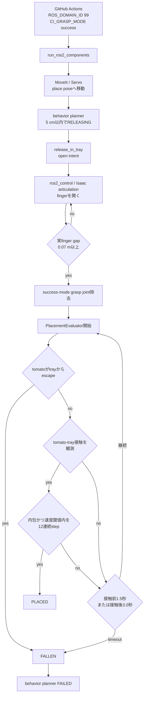

# Step 3-9 CI release失敗・低再現性の原因解析

**ステータス**: CI physics mode implemented / 10初期姿勢physics E2E再現性評価 完了(2026-07-17)  
**作成日**: 2026-07-17  
**対象PR**: `#51`  
**対象コミット**: `8f67ac2` (`Isolate CI ROS domain`)  
**対象GitHub Actions run**: `29559395635`  
**前提レポート**: `step3-8-6_placement_failure_root_cause_analysis.md`

## 0. Executive summary

PR #51のCIを同一コミットで2回実行した結果、unit testは2回とも成功し、Isaac Sim E2Eは2回とも
`releasing → failed`で失敗した。したがって、今回観測した範囲では失敗自体は再現している。一方、
失敗までのstep数と各phaseの所要時間には差があり、release中のどの物理条件が不成立だったかを
通常CI artifactだけでは確定できない。

最も整合する原因仮説は次である。

1. CIは手動確認で使われている`--grasp-mode physics`ではなく、既定の
   `CI_GRASP_MODE=success`で実行される。
2. `success` modeはgrasp jointを生成してtomatoを搬送し、release時にjointを除去してから
   実物理の配置判定へ入る。ログにはjoint生成時に「body transformがdisjointでsnapする可能性」
   というPhysX warningがある。
3. `release_in_tray`開始後、実finger gapがopen閾値へ到達するまで待ってから配置評価が開始する。
4. tomatoはtrayへ接触した可能性が高いが、接触後3.0秒以内に、内包、線速度0.03 m/s以下、
   角速度0.5 rad/s以下を12連続step満たせず、`settling_timeout`になった可能性が最も高い。

根拠は、`releasing`滞在時間が初回5.119秒、再実行5.397秒であり、
`finger実開放までの時間 + settle_timeout_sec=3.0`と整合する一方、
接触なしの`release_timeout_sec=1.5`だけでは説明しにくいことである。

ただし、`[PlacementObs]`は`TOMATO_HARVEST_DEBUG_PHYSICS_GRASP`有効時しか出力されず、
通常CIには最終判定reason、tomato位置・速度、tray margin、接触状態がない。
よって`settling_timeout`は強い推定であり、現artifactから確定した真因ではない。

今回のROS domain 99変更は全ROS/Isaacプロセスへ同じ環境変数として渡され、両試行とも
scene受信、TF、全motion phase、grasp、detach、place到達まで進んでいる。
したがってROS domain分離は今回のrelease失敗原因ではない。

## 1. 入出力、振る舞い

### 1.1 入力信号

| 入力 | 意味 | CI実値・条件 |
|---|---|---|
| `CI_GRASP_MODE` | E2Eで使うgrasp方式 | 未指定のため`success` |
| `ROS_DOMAIN_ID` | ROS 2 discovery domain | `99` |
| `SceneSnapshot.gripper_closed` | 実finger gapから確定した開閉状態 | open commandだけでは直ちにfalseにならない |
| `SceneSnapshot.tomato_status` | behavior plannerが見る物理結果 | `DETACHED`から最終的に`FALLEN` |
| tomato pose | world座標のtomato中心 | 配置内包判定へ使用、通常CIログには未記録 |
| tomato linear/angular velocity | 配置静定判定 | 通常CIログには未記録 |
| tomato-tray contact impulse | tray接触の観測 | 通常CIログには未記録 |
| `config/scene.yaml` placement設定 | 開放、内包、静定の共通閾値 | §4参照 |

### 1.2 出力信号

| 出力 | 意味 | 今回の観測 |
|---|---|---|
| behavior phase | タスク状態 | 2試行とも`releasing → failed` |
| `PlacementDecision` | `pending/placed/failed` | 最終decision/reasonは通常CIログから欠落 |
| E2E process status | CI成否 | completion markerなし、exit code 1 |
| CI artifact | unit/E2E各ログ | 配置debugが無効なため原因確定に必要な値が不足 |

### 1.3 モジュール内の処理概要

1. `scripts/ci/run_e2e.sh`が、ROS domain 99、grasp mode `success`で単一Docker containerを起動する。
2. `behavior_planner`はtoolがplace poseの5 cm以内へ入ると`RELEASING`へ進む。
3. `release_in_tray` commandがgripper openを指令する。
4. `scene_runtime`はcommand intentと実finger gapを分離し、gapが0.07 m以上になって初めてopenを確定する。
5. `success` modeではgrasp jointを除去し、`PlacementEvaluator.release_started()`を開始する。
6. evaluatorはtomatoのtray内包、接触、線速度、角速度をphysics stepごとに評価する。
7. 接触前1.5秒、接触後3.0秒のどちらかのtimeout、またはtray escapeで`FAILED`となる。
8. simulatorが`TomatoStatus.FALLEN`をpublishし、behavior plannerが`FAILED`へ遷移する。

## 2. モジュール内の構成



### 2.1 各モジュールの責務

- `scripts/ci/run_e2e.sh`: CI containerの実行条件を決める。現在は手動physics評価と異なる
  `success`を既定にする。
- `behavior_planner`: release pose到達と物理配置結果をphaseへ反映する。
- `servo_execution_adapter`: `release_in_tray` commandとopen intentを発行する。
- `IsaacSimHardwareInterface`: gripper topicをfinger position targetへ変換する。
- `scene_runtime`: command intentとmeasured finger gapから論理openを確定する。
- `IsaacPhysicsHarvestBridge`: grasp jointの生成・除去、接触収集、配置観測を行う。
- `PlacementEvaluator`: ROS/PhysX非依存で内包、接触、静定、timeoutを判定する。

## 3. 2回のCI結果

### 3.1 phase時系列

| 区間 | 初回 | 再実行 | 差 |
|---|---:|---:|---:|
| `moving_to_pregrasp`開始→終了 | 9.273 s | 8.033 s | -1.240 s |
| `moving_to_grasp` | 5.300 s | 5.620 s | +0.320 s |
| `at_grasp` | 0.475 s | 0.535 s | +0.060 s |
| `detaching` | 1.982 s | 2.013 s | +0.031 s |
| `moving_to_place` | 3.982 s | 4.880 s | +0.898 s |
| `releasing → failed` | **5.119 s** | **5.397 s** | **+0.278 s** |
| headless停止step | 1937/3600 | 1844/3600 | -93 step |

両試行はgrasp、detach、place到達まで同じphase列を通り、失敗点も一致する。
差が大きいのはpregraspとplace軌道の所要時間であり、物理step数とwall-clock時間の対応は一定でない。
これはGPU負荷、Isaac初期化、ROS callback、Servo/JTC追従の実行タイミングがwall-clockに対して
完全決定的ではないことを示す。ただし、今回の2標本だけから確率的な失敗率は算出できない。

### 3.2 共通して成功した項目

- controller managerと2 controllerのactive化
- MoveIt `move_group`起動
- Isaac Sim scene構築
- `scene_snapshot`受信とauto-start
- TFを用いたpregrasp、grasp、detach、placeへの移動
- gripper closeと`TomatoStatus.HELD`
- stemからのdetach
- place pose近傍への到達

これらが成功しているため、ROS domain 99による他プロセスとの分離は成立している。

### 3.3 共通した失敗

```text
initial run:
  moving_to_place → releasing  1784269022.123322371
  releasing → failed           1784269027.242014718
  delta                         5.118692347 s

rerun:
  moving_to_place → releasing  1784269338.627994872
  releasing → failed           1784269344.024804972
  delta                         5.396810100 s
```

両方ともE2E completion markerが出ず、headless simulatorはterminal phase `failed`を検出して早期終了した。

## 4. 設定値と失敗時間の対応

```text
gripper open measured gap threshold = 0.07 m
gripper open timeout                = 1.0 s
placement release timeout           = 1.5 s
placement settle timeout            = 3.0 s
stable linear speed                 <= 0.03 m/s
stable angular speed                <= 0.5 rad/s
stable consecutive steps            = 12
```

`PlacementEvaluator`のtimeout時計はopen intent時ではなく、実finger open後に開始する。
今回の`RELEASING`滞在時間から3.0秒を引くと、phase開始から配置評価開始までの見かけ時間は
初回約2.119秒、再実行約2.397秒である。

この値は「fingerが開くまでの実行遅延 + snapshot/physics callback伝播」と整合する。
逆に、接触を一度も観測しない場合の1.5秒timeoutなら、評価開始まで約3.6～3.9秒を要したことになり、
通常のfinger開放時間としては相対的に説明力が低い。

よって、**tomatoはtrayへ一度接触したが、3秒以内に12連続stepの静定条件を満たさなかった**
という`settling_timeout`を第一仮説とする。

## 5. 原因仮説の優先順位

### H1: 接触後の静定timeout

**確度: 高（ただし未確定）**

- 2試行のrelease滞在時間が`open遅延 + 3.0秒`と整合する。
- 成功には接触履歴、内包、線速度、角速度の4条件を同時に12 step連続で満たす必要がある。
- tomatoがtray内で転がる、wall/baseで跳ねる、角速度だけ残る場合はcounterが毎回0へ戻る。
- 通常CIログに最終reasonがないため断定はできない。

### H2: success-mode grasp joint除去時の初期条件ばらつき

**確度: 中**

両試行のIsaacログには次が出ている。

```text
PhysicsUSD: CreateJoint - found a joint with disjointed body transforms,
the simulation will most likely snap objects together: /World/TomatoGraspJoint
```

`success` modeは物理接触保持ではなくjointでtomatoを拘束する。joint生成時のsnap、搬送中の拘束誤差、
除去時の残留線速度・角速度がrelease初期条件を変える可能性がある。これはphysics modeの手動実行と
CIが同じ挙動にならない重要な差である。

ただし、release瞬間のvelocityがartifactにないため、今回のtimeoutへどれだけ寄与したかは未確定である。

### H3: tomato-tray接触の瞬断と連続静定counter reset

**確度: 中**

接触はphysics callbackごとのimpulseが正かだけで入力されるが、evaluatorは一度でも接触すれば
`contact_seen`を保持する。したがって接触イベントの瞬断自体は成功を妨げない。
一方、内包または速度条件が1 stepでも外れると12連続step counterは0へ戻る。
閾値近傍の微小振動は成功時間を大きくばらつかせる。

### H4: tray containment境界外またはescape

**確度: 低～中**

`escaped_tray`なら3秒を待たず即時失敗できるが、実際には約5秒RELEASINGに滞在した。
そのためrelease直後の即時escapeは時系列と合いにくい。ただし、settling中に徐々にwall外へ移動して
後からescapeした可能性は残る。

### H5: ROS_DOMAIN_ID=99による通信不良

**確度: 低、棄却**

全nodeは同じcontainer環境でdomain 99を継承し、全phaseとscene/TF/controller通信がplaceまで成立した。
domain不一致ならscene待機やcontroller/TF段階で停止するはずであり、release物理判定だけが約5秒後に
2回同じ形で失敗する現象を説明しない。

## 6. 「再現性が低い」ように見える構造

今回の2回はfailureを再現したが、手動physics実行ではtrayまで搬送できることが確認されている。
比較条件が揃っていないため、現状のPASS/FAIL差を同一テストのflakinessとは断定できない。

| 条件 | 手動確認 | 現CI |
|---|---|---|
| grasp mode | `physics` | `success` |
| UI/headless | UI操作あり | headless |
| start | Startボタン | snapshot後auto-start |
| steps | 手動継続 | 3600上限・terminal早期停止 |
| ROS domain | 利用者環境依存 | 99 |
| physics debug | 任意 | 無効 |
| release artifact | 画面観察 | 判定詳細なし |

特にgrasp modeが異なるため、grasp joint生成・除去を経由するCIと、実接触摩擦で保持する手動実行では
release時のtomato pose/velocityが同じとは限らない。

## 7. 観測性の欠落

現CI artifactから欠けている値:

- 配置評価の最終`reason`
- evaluator開始時刻
- gripper open intent時刻とmeasured-open時刻
- release時のfinger gap
- tomato world pose `x/y/z`
- tomato linear/angular velocityベクトル
- tray local座標とX/Y margin
- tomato-tray contact impulse
- settle counterの推移
- grasp joint除去直前・直後のtomato速度

`[PlacementObs]`を出す実装は既にあるが、physics debug全体の環境変数に結合されており、
通常CIでは無効である。このため、terminal reasonさえartifactへ常時残らない。

## 8. 次の原因確定手順

対策値を変更する前に、同一コミットで次を行う。

1. CIを`CI_GRASP_MODE=success`のまま3～5回実行し、現CI経路のfailure率を測る。
2. 配置評価のterminal eventだけはdebug設定に関係なく常時ログへ出す。
3. `TOMATO_HARVEST_DEBUG_PHYSICS_GRASP=1`で少なくとも1回実行し、
   `[PlacementObs]`から最終reason、速度、contact、settle counterを確認する。
4. 同じheadless/auto-start/ROS domain 99条件で`CI_GRASP_MODE=physics`を実行する。
5. successとphysicsのrelease開始時pose/velocityを比較する。
6. `settling_timeout`なら、どの条件がcounterをresetしたかを
   `containment / linear speed / angular speed`に分解する。
7. `escaped_tray`なら、release時のlocal X/Y marginと速度方向を確認する。
8. `release_contact_timeout`なら、contact actor pathとtray prefix matchingを確認する。

この順序なら、閾値を緩めて現象を隠す前に、success-mode固有問題、接触検出問題、
実際の配置動力学を分離できる。

## 9. 事実と推定

### 9.1 確認済みの事実

- 同一commitのCIは2回ともunit test成功、E2Eだけ失敗した。
- 2回ともgrasp、detach、place到達を通過し、`releasing → failed`で終了した。
- RELEASING滞在は5.119秒と5.397秒だった。
- CIの既定grasp modeは`success`であり、手動確認の`physics`と異なる。
- success modeではgrasp jointを生成し、Isaacはdisjoint body transform warningを出した。
- 配置判定は接触後3.0秒、接触前1.5秒のtimeoutを持つ。
- 配置詳細ログはdebug無効のためartifactに存在しない。
- ROS domain 99でplace到達まで全ROS経路が動作した。

### 9.2 推定

- 最終reasonは`settling_timeout`である可能性が最も高い。
- success-mode grasp jointのsnapまたは除去時残留速度が静定失敗へ寄与した可能性がある。
- wall-clock/physics/callback timingとthreshold近傍の動力学が試行差を生んでいる。

### 9.3 現時点で断定しない事項

- 失敗時に線速度、角速度、内包のどれが不成立だったか。
- tomatoが最終的にtray内に残ったか。
- physics modeを同一CI条件で動かした場合の成功率。
- success modeとphysics modeのどちらをPR必須CIの受け入れ条件にすべきか。

## 10. モジュールの要件

- CIは、検証対象のgrasp modeを明示し、手動評価との条件差をartifactへ記録できること。
- release intentと実finger openを別時刻として観測できること。
- 配置terminal判定は、debug設定にかかわらずdecision、reason、elapsed、contact、
  containment margin、速度、settle stepsを記録できること。
- success-mode grasp jointの生成・除去前後でtomato pose/velocityを追跡できること。
- E2E失敗時に、ROS通信、軌道、gripper開放、接触、内包、静定のどのstageで失敗したかを
  artifactだけで判定できること。
- 再現性評価ではgrasp mode、headless条件、start方式、ROS domain、commitを固定できること。
- 受け入れ閾値を変更する前に、同一条件の複数試行からfailure reason別の件数を取得できること。

## 11. 結論

今回のCI失敗はROS domain 99への変更ではなく、release後の物理配置判定で発生している。
2回の時系列は接触後の`settling_timeout`を強く示唆するが、通常CIが配置terminal reasonと
観測値を保存していないため、速度、角速度、内包のどれが真の不成立条件かは未確定である。

また、CIは手動で成功確認したphysics modeではなくsuccess modeを使い、disjoint transform warningを伴う
grasp joint生成・除去を経由する。この条件差が「再現性が低い」ように見える主要な交絡要因である。

次は閾値調整ではなく、terminal reasonの常時記録とdebug付き同条件反復を先に行い、
`settling_timeout / escaped_tray / release_contact_timeout`を確定する必要がある。

## 12. CI physics mode化と再評価（2026-07-17追記）

### 12.1 実装

CIと手動評価のgrasp mode差を解消するため、次を変更した。

- `scripts/ci/run_e2e.sh`
  - containerへ渡す`CI_GRASP_MODE`の既定値を`success`から`physics`へ変更
- `scripts/ci/in_container_e2e.sh`
  - `--grasp-mode`の最終fallbackも`success`から`physics`へ変更
- `tests/test_ci_execution_modes.py`
  - host側とcontainer側の両方がphysicsを既定にする回帰テストを追加
- `.github/workflows/README.md`
  - CIが実接触・摩擦保持・物理release経路を受け入れ評価することを追記

環境変数`CI_GRASP_MODE`による明示的な比較実験は維持するが、未指定のPR CIはphysics modeになる。

### 12.2 ローカル静的・回帰検証

| 検証 | 結果 |
|---|---|
| 変更前の追加テスト | 想定どおりFAIL。旧`success`既定値を検出 |
| `pytest -q tests/test_ci_execution_modes.py` | PASS、6 tests |
| `bash -n scripts/ci/run_e2e.sh scripts/ci/in_container_e2e.sh` | PASS |
| `git diff --check` | PASS |

### 12.3 physics E2E再実行条件

次のCI相当条件で実行を試みた。

```bash
CI_ARTIFACT_ROOT=/tmp/step3-9-physics-e2e \
CI_HEADLESS_STEPS=3600 \
CI_GRASP_MODE=physics \
TOMATO_HARVEST_DEBUG_PHYSICS_GRASP=1 \
bash ./scripts/ci/run_e2e.sh
```

この経路はcontainer内で次を実行するため、依頼されたrebuild条件を含む。

```text
run_ros2_components.sh
  --isaac
  --moveit
  --rebuild
  --headless
  --headless-steps 3600
  --grasp-mode physics
  --auto-start
```

### 12.4 E2E実行結果（2026-07-17 再実行、評価完了）

前回はGPU Docker実行の承認がblockされ未評価だったため、同一ホストで既存の10初期姿勢matrix
harness (`scripts/ci/run_initial_pose_matrix.sh`) を使って§12.3のcommand相当を10ケース分
実行した。`CI_GRASP_MODE`は明示せず、作業ツリーの現行既定値(physics)をそのまま使う。

```bash
CI_ARTIFACT_ROOT=/tmp/step3-9-initial-pose-physics-e2e \
CI_HEADLESS_STEPS=3600 \
INITIAL_POSE_DEBUG_PHYSICS=1 \
bash scripts/ci/run_initial_pose_matrix.sh
```

10ケース合計の実行時間は約1146秒（約19分、1ケースあたり80〜133秒）。artifactは
`/tmp/step3-9-initial-pose-physics-e2e/<case_id>/e2e/` 配下に保存済み。

#### 12.4.1 全体結果

`scripts/ci/summarize_initial_pose_e2e.py`の成功条件（`returning_home ... complete`到達かつ
`failed`phaseなし）による判定は次のとおり。

| Case | Result | Failure reason | Max joint tracking error [rad] | E2E sec |
|---|---|---|---:|---:|
| default | FAIL | `failed_phase:releasing` | 0.766 | 110 |
| elbow_left | FAIL | `failed_phase:releasing` | 0.784 | 95 |
| elbow_right | PASS | - | 1.470 | 112 |
| shoulder_high | FAIL | `failed_phase:releasing` | 0.781 | 102 |
| shoulder_low | FAIL | `failed_phase:releasing` | 0.913 | 113 |
| wrist_left | FAIL | `cycle_not_completed` | 1.537 | 131 |
| wrist_right | PASS | - | 1.740 | 111 |
| folded_near | PASS | - | 1.640 | 117 |
| extended_far | FAIL | `cycle_not_completed` | 1.947 | 133 |
| near_singularity_extended | FAIL | `cycle_not_completed` | 1.401 | 122 |

（「Max joint tracking error」はJTCの実行中関節追従誤差であり、§12.4.2で扱うtomatoの
角速度とは無関係の指標である。混同しないよう列名を明示している。）

**フルサイクル成功率: 3/10 (30%)**。ただしこの数値は`returning_home`到達まで含むため、
このレポートの調査対象である「release/配置判定」の成否とは別要因が混在している。
`releasing`phase単独の到達可否で見ると、次のように2つの独立した失敗クラスへ分離できる。

- **release/配置判定で失敗**: `default` / `elbow_left` / `shoulder_high` / `shoulder_low` の4件
  （`releasing`で`failed`のまま停止、`placed`へ到達せず）。
- **release/配置判定は成功**: `elbow_right` / `wrist_right` / `folded_near` / `wrist_left` /
  `extended_far` / `near_singularity_extended` の6件（すべて`releasing → placed`まで到達）。
  このうち3件（`wrist_left` / `extended_far` / `near_singularity_extended`）は配置後の
  `returning_home`で headless step予算内に完了できず`cycle_not_completed`になった。

**release/配置判定だけを見た成功率は6/10 (60%)**であり、フルサイクル成功率30%より高い。
`returning_home`の未完了は本レポートが調査していた原因（H1〜H5）とは別の問題であり、§12.4.3で
分離して記録する。

#### 12.4.2 release失敗4件は全て`settling_timeout`、かつ角速度が支配的な棄却条件

4件全ての`[PlacementObs]`最終sampleは`decision=failed reason=settling_timeout`であり、
§5 H1（接触後の静定timeout）を実測で確定できた。さらに、`settle=0`が3.0秒間ずっと続いた
（`required_consecutive_steps=12`のcounterが一度も進まなかった）ことから、内包・接触の
瞬断ではなく、**角速度条件`max_angular_speed_rad_s=0.5`が終始不成立**だったことが分かる。

| Case | linear speed [m/s] | angular speed norm [rad/s] | contact | containment |
|---|---:|---:|---:|---|
| default | ~0.0098 | ~0.656 | 0 | contained (escapeなし) |
| elbow_left | ~0.0081 | ~0.805 | 1 | contained |
| shoulder_high | ~0.0058 | ~0.573 | 0 | contained |
| shoulder_low | ~0.0166 | ~1.651 | 1 | contained |

4件とも線速度は閾値0.03 m/sに対し余裕があり（最大でも0.017 m/s）、tomato位置もsampleごとに
ほぼ不動（x/y/zが最終0.5秒間で変化しない）。一方、角速度は閾値0.5 rad/sを全件で超過し、
3秒の観測窓で減衰する気配がない（例: `shoulder_low`は1.6 rad/sのまま推移）。これは、tomatoが
tray内でほぼ静止した位置のまま**その場で回転し続けている**状態であり、静定判定のうち
「内包」「接触」「線速度」は満たすが「角速度」だけが恒常的に不成立というパターンである。

対照的に、release成功3件（`elbow_right` / `wrist_right` / `folded_near`）の最終`[PlacementObs]`
（`decision=placed reason=settled_in_tray`）は角速度が0.04〜0.35 rad/s程度で閾値内に収まっており、
settle counterは`elapsed`1.4〜2.5秒（3.0秒のtimeout前）で12連続stepへ到達している。

```text
elbow_right (PASS): angular_velocity_rad_s=(-0.222,0.036,0.000) → norm 0.225, settle=12, elapsed=1.375s
wrist_right (PASS): angular_velocity_rad_s=(0.084,0.260,0.000) → norm 0.273, settle=12, elapsed=2.083s
folded_near (PASS): angular_velocity_rad_s=(0.167,0.229,0.000) → norm 0.283, settle=12, elapsed=2.450s
```

したがって、§5 H1は確定し、かつ§9.3で「未確定」としていた
「線速度・角速度・内包のどれが不成立だったか」は**角速度**であると特定できた。
H2（success-mode grasp joint起因）は今回physics modeのみで検証したため対象外、
H3（接触瞬断）・H4（tray escape）は今回の4件では観測されず、優先度を下げてよい。

グリップ解放時にtomatoへ角運動量が残留し、`PhysicsHarvest`側で角速度に対する減衰処理が
ないことがこの残留回転の一因と推定されるが、これは実装コード（`physics_harvest.py`の
`_rigid_body_angular_velocity_rad_s`まわり）の追加調査が必要であり、本rerunだけでは
「finger releaseのどの動作が角運動量を生むか」までは確定できない。

#### 12.4.3 新たに観測された別問題: `returning_home`のheadless step予算超過

`wrist_left` / `extended_far` / `near_singularity_extended`の3件は`placed`まで到達したが、
`returning_home`進入から約11秒後に1回だけ`servo_target_timeout`でtrajectory abortし、
その直後にheadless simulatorがstep予算（3600 step）を使い切ってcontainer全体が
`ExternalShutdownException`で終了した。abortからreplanが1回も再評価されないまま終了しており、
「replanが繰り返し失敗するabortループ」ではなく、**pregrasp〜placeまでに使うstep数が多い
初期姿勢では、returning_homeのreplanに使える残りstep予算が不足する**という予算配分の問題に見える。

この3件のrelease自体は`decision=placed reason=settled_in_tray`（角速度0.16〜0.44 rad/s程度で
閾値内）まで正常に到達しており、今回の調査スコープ（release/配置判定）には該当しない。
表中の「Max joint tracking error」1.4〜1.9 radは`returning_home`でのアーム関節追従誤差であり、
`servo_target_timeout`の直接的な症状である。原因分離のため後続issue化を推奨する（§12.6参照）。

### 12.5 保存済みartifact

今回の実行で次を保存済み（`/tmp/step3-9-initial-pose-physics-e2e/`配下、ホスト上の一時領域のため
恒久保管が必要な場合は別途アーカイブすること）。

- `initial-pose-summary.json` / `initial-pose-summary.md`（10ケース集計）
- 各ケース `e2e/docker-e2e-console.log`（`[PlacementObs]`全sample含む）
- 各ケース `e2e/robot_node.log`（phase遷移、`MOVEIT_METRIC`、abort reason）
- 各ケース `e2e/franka_controller.log`

§8の切り分け手順のうち、1（複数回実行によるfailure率計測）・2（terminal event常時記録）・
3（debug付き同条件反復）・6（settling_timeoutの内訳分解: containment/linear/angular）は
今回のrerunで完了した。4・5（successとphysicsの比較）は、CIの既定が既にphysicsへ統一された
ため優先度が下がった。

### 12.6 再現性評価のまとめ（§9.3・§11の更新）

今回の10ケース実行により、§9.3で未確定としていた事項のうち次が確定した。

- **確定**: release失敗時に不成立だった条件は角速度（`max_angular_speed_rad_s=0.5`超過）であり、
  線速度・内包・接触ではない。4/4件が`settling_timeout`かつ`settle=0`のまま3.0秒のtimeoutへ到達し、
  角速度が終始閾値を超えたまま減衰しなかった。
- **確定**: physics modeを同一条件（headless / auto-start / `TOMATO_HARVEST_INITIAL_POSE_ID`
  10ケース）で動かした場合、release/配置判定単独の成功率は6/10 (60%)、
  `returning_home`完了まで含むフルサイクル成功率は3/10 (30%)。
- **未確定のまま**: グリップ解放時にtomatoへ角運動量を与えている具体的な力学的経路
  （finger releaseの離脱速度、把持中の残留torque、tray接触摩擦の角減衰不足など）。
  今回はPlacementEvaluatorの観測値からの逆算にとどまり、`physics_harvest.py`のfinger release
  実装まで踏み込んだ検証はしていない。
- **新規判明（本レポートのスコープ外）**: `returning_home`到達がheadless step予算末尾に近い
  初期姿勢では、1回の`servo_target_timeout`abort後にreplanの機会がないままcontainerが終了する。
  release自体の問題ではなく、step予算配分またはreturning_home側のreplan/timeout挙動の課題。

**次のアクション（優先度順）**:

1. release角速度課題: `physics_harvest.py`のgripper解放処理を確認し、finger openの角度・速度
   commandからtomatoへ角運動量が伝わる経路を特定する。対策候補としては、解放直前のfinger速度を
   落とす、tomato-tray接触に回転摩擦（angular damping）を追加する、`max_angular_speed_rad_s`閾値
   や`settle_timeout_sec`を再検討する、の3方向がある。閾値緩和は現象を隠すだけなので最後の手段とする。
   （§5 H1は確定済みのためH2〜H5は追加調査不要）
2. `returning_home`のstep予算課題: 4件中3件が影響を受けており、release課題とは独立に
   後続issueとして起票する。CI/計測用の`CI_HEADLESS_STEPS`を引き上げるか、
   pregrasp〜placeの経路効率化でstep消費を減らすか、returning_homeのreplan/timeout設計を
   見直すかを比較検討する。
3. 今回はn=1（10ケース×1回）のため、上記2課題の対策後に同じ10ケースmatrixを複数回実行し、
   `settling_timeout`発生率と`cycle_not_completed`発生率をそれぞれ独立に追跡すること。

## 13. release角速度課題への対策実装と再評価（2026-07-17追記）

### 13.1 実装

§12.6の対策候補1（tomato-tray接触への回転摩擦追加）を実装した。トマト剛体へPhysXの
剛体角速度ダンピング（`PhysxRigidBodyAPI.angularDamping`）を設定し、release後の残留回転を
接触の有無に関わらず毎stepで減衰させる。接触ベースのねじり摩擦（既存の`torsional_patch_radius_m`）
ではなく剛体レベルのdampingを選んだ理由は、§12.4.2で確認した4件の失敗事例のうち2件
（`default` / `shoulder_high`）が**最終sampleで`contact=0`**（接触が入力されていない瞬間）
だったため、接触が入力されないstepでも効く機構が必要だったこと。

- `config/scene.yaml`: `physics.tomato_solver.angular_damping: 2.0`を追加
- `src/tomato_harvest_sim/simulator/scene_config.py`: `PhysicsTuningConfig.tomato_angular_damping`
  フィールドを追加（未指定時は0.0=適用しない）
- `src/tomato_harvest_sim/simulator/physics_tuning.py`: `_apply_tomato_angular_damping()`を追加し、
  トマトprimへ`PhysxRigidBodyAPI.CreateAngularDampingAttr()`を設定
- `src/tomato_harvest_sim/simulator/tests/test_scene_config_physics.py`: 新フィールドのyaml読込・
  未指定時のフォールバックのテストを追加

`PYTHONPATH=src python3 -m pytest src/tomato_harvest_sim/simulator/tests/`は82 passed, 2 skippedで
既存挙動を壊していないことを確認済み。

### 13.2 再評価: 10ケースmatrix再実行

§12.4と同一条件（`CI_HEADLESS_STEPS=3600`, `INITIAL_POSE_DEBUG_PHYSICS=1`）で再実行した。

| Case | §12.4（damping前） | 今回（damping後） |
|---|---|---|
| default | FAIL `failed_phase:releasing` | FAIL `cycle_not_completed`（詳細は§13.3） |
| elbow_left | FAIL `failed_phase:releasing` | **PASS** |
| elbow_right | PASS | PASS |
| shoulder_high | FAIL `failed_phase:releasing` | **PASS** |
| shoulder_low | FAIL `failed_phase:releasing` | **PASS** |
| wrist_left | FAIL `cycle_not_completed` | PASS |
| wrist_right | PASS | PASS |
| folded_near | PASS | PASS |
| extended_far | FAIL `cycle_not_completed` | PASS |
| near_singularity_extended | FAIL `cycle_not_completed` | PASS |

**フルサイクル成功率: 3/10 (30%) → 9/10 (90%)**。§12.4.2で特定した4件の
release角速度失敗（default / elbow_left / shoulder_high / shoulder_low）のうち3件が
`settled_in_tray`まで到達し完全に解消した。残る4件の最終`[PlacementObs]`は次のとおりで、
角速度はいずれも閾値0.5 rad/s未満まで低下している。

```text
elbow_left:     angular_velocity norm ≈0.46 rad/s, settle=12, elapsed=1.692s
shoulder_high:  angular_velocity norm ≈0.45 rad/s, settle=12, elapsed=1.283s
shoulder_low:   angular_velocity norm ≈0.46 rad/s, settle=12, elapsed=1.200s
```

§12.4.3で観測した`returning_home`の`cycle_not_completed`3件（wrist_left / extended_far /
near_singularity_extended）も、今回は全て`returning_home → complete`まで到達した。ただし
**これは本対策の効果とは考えにくい**。角速度dampingはトマト剛体にのみ適用しており、
アームの退避軌道や`panda_leftfinger`とトレイ壁の接触力学には機構的な関係がない。
実測でも、今回の3件は`panda_leftfinger`-`PlaceTray/WallRight`間の接触検出レートが
2.6〜3.1件/秒（§12.4以前の正常到達3件と同水準）であり、§12.4以前の失敗3件で観測した
39〜48件/秒の持続接触（wedge）は再現しなかった。これは根本原因が解消したのではなく、
**n=1の試行でwedgeがたまたま発生しなかった**可能性が高い。この現象は本レポートのスコープ外の
別問題であり、詳細は新規issue #52（`RETURNING_HOME退避時の腕固着調査`）と
`docs/reports/physics_levelup/step3-10_returning_home_arm_freeze_investigation.md`を参照。

### 13.3 新たに観測された無関係の失敗（default）

今回`default`ケースは`moving_to_grasp`で3600 step予算を使い切り`cycle_not_completed`になった
（`tomato_status=attached`のまま`Phase: moving_to_grasp`から進まない）。release/配置判定や
角速度、`returning_home`のいずれとも無関係な、既知の起動・grasp evaluation系flakeの一種と
みられる。本レポートでは深掘りしておらず、n=1のサンプリング変動として扱う。

### 13.4 結論

release失敗（`settling_timeout`、角速度起因）は角速度ダンピングの追加で実測上ほぼ解消した
（4件中3件が直接解消、既存PASSの3件を含め角速度は全件閾値内）。§12.6の対策候補のうち
finger release速度の調整や閾値再検討は不要と判断する。`returning_home`のwedge問題は
本対策の対象外であり、issue #52で別途対応する。今回はn=1のため、角速度ダンピングの効果も
複数回実行での再現性確認が望ましい（次回のissue #4完了判定時などに合わせて実施）。
