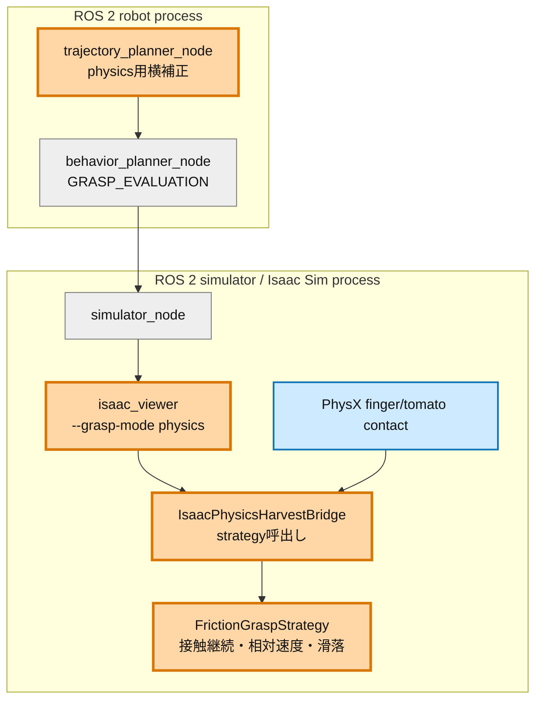
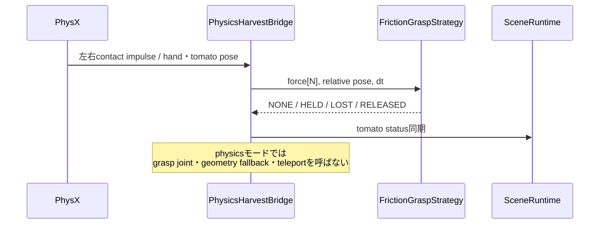

# Step 3検証レポート: 摩擦による保持

## 検証目的

人工FixedJoint、幾何fallback、テレポート復元を使わず、左右fingerの接触力と摩擦だけでトマトを把持し、0.1 m持ち上げて5秒保持できるかを検証する。これはStep 4以降でstem破断力と枝・果実の物性を現実へ近づける前提である。

## 全体アーキテクチャ

## PR変更差分

## 実装した判定

| パラメータ | 値 |
|---|---:|
| 両指最小力 | 1.0 N |
| 継続step | 3 |
| 最大相対速度 | 0.02 m/s |
| 最大滑落変位 | 0.005 m |

## 実測結果

総合判定: **未達（原因特定済み）**。

| 項目 | 結果 |
|---|---|
| grasp joint生成 | 0回 |
| 幾何fallback | 0回 |
| テレポート復元 | 0回 |
| 既定軌道での接触 | 右fingerのみ継続、左finger 0 N |
| finger gap | 約30.1 mm |
| 6D位置誤差 | AT_GRASP入口5.0 mm、静定後15.6 mm |
| 5秒保持 | 未成立 |
| 自然release | HELD未成立のため未評価 |

初回physics E2Eは`moving_to_grasp -> at_grasp -> grasp_evaluation -> failed`。右指のcontact impulseは約`0.1256 N·s/step`（60 Hz換算約7.5 N）で継続した一方、左指は0だった。したがってしきい値調整では解決せず、把持中心の整列が必要である。

横方向`+7 mm`補正の再試験はpregrasp軌道がabort/replanを繰り返し、graspへ到達しなかった。補正を全grasp waypointへ一括適用する方法は採用せず、次の試行ではfinger接触座標系に基づく終端局所補正へ限定する。

## 時系列グラフの扱い

5秒保持が一度も成立していないため、保持区間の相対変位・左右接触力・joint7速度グラフは生成不能である。未成立データから合格に見えるグラフは作らない。合格run取得後に5 mm線を含む3系列を追加する。

## 次の作業

1. Issue #33の6D診断とfinger contactを同一時刻で使い、終端だけを補正する。
2. 左右接触が各1 N以上となる位置を探索し、3回再現する。
3. HELD成立後、0.1 m liftと5秒holdを実行し、相対変位・接触力・joint7速度を保存する。
4. release自然落下と人工機構0回を最終確認する。

現時点ではIssue #4の完了条件を満たしていないため、PRはDraft扱いとする。
