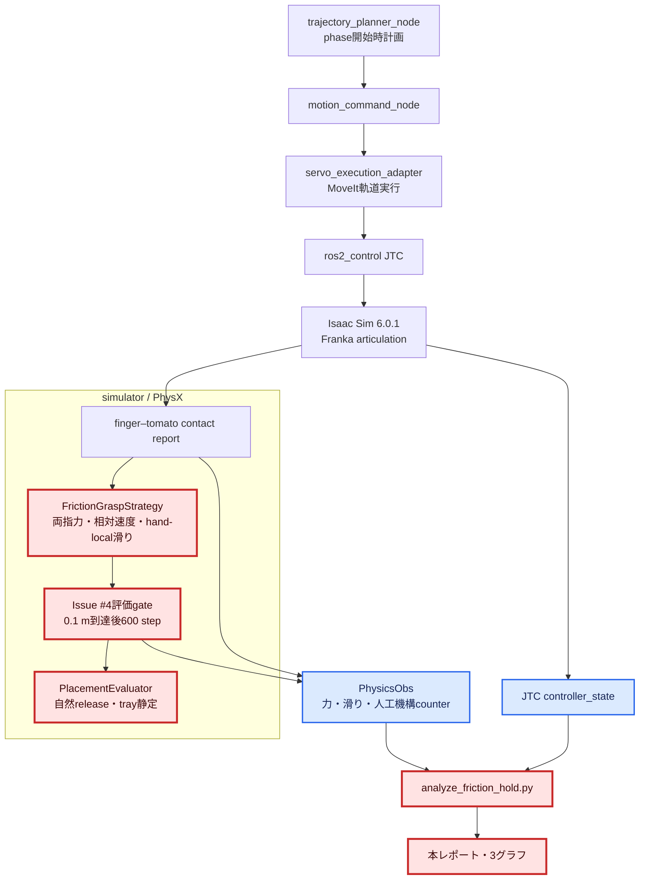
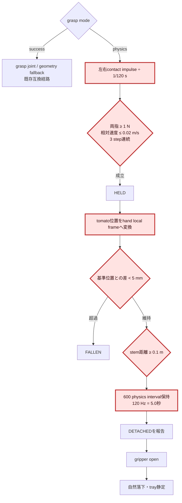
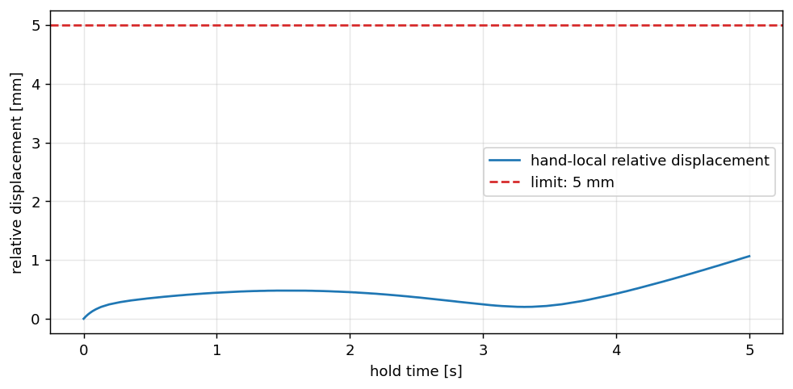
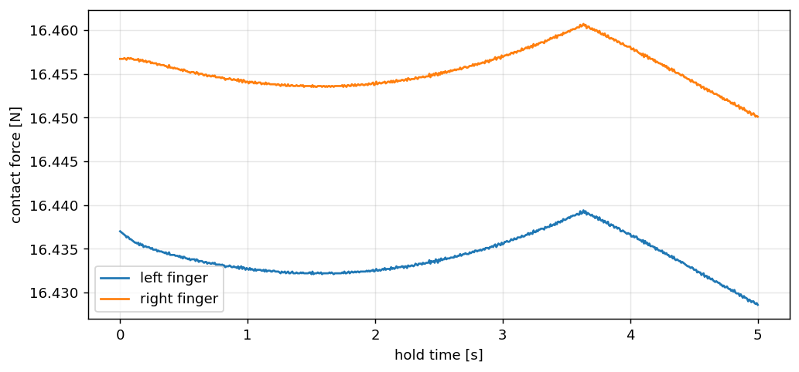
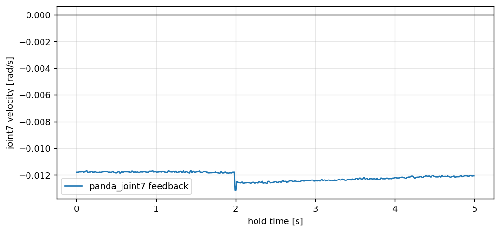

# 1. 全体アーキテクチャ

赤枠がIssue #4の実装・最終評価範囲、青枠が評価に利用した観測経路である。



# 2. 変更モジュールの詳細変更アーキテクチャ



# 3. 検証目的

本書はStep 3摩擦保持検証の最終評価結果を管理する正本である。評価方式の事前調査と
根拠は[`step3_issue4_current_friction_hold_evaluation_research.md`](step3_issue4_current_friction_hold_evaluation_research.md)
を参照し、最終的な実測値、合否判定、グラフ、および機械可読な評価結果は本書へ反映する。

人工FixedJoint、幾何fallback、テレポート復元を使わず、左右fingerの接触力と
摩擦だけでトマトを把持し、0.1 m以上持ち上げた後に5秒保持できることを確認する。
併せて、release後は人工操作なしで自然落下し、既存の収穫サイクルを完走できることを
同一runで確認する。

# 4. 現在の実装前提

2026-07-20、commit `e233d1d`を基準とし、Issue #4以降に統合された改善も含めた。

| 項目 | 現行値・方式 |
|---|---|
| grasp mode | CI既定`physics` |
| physics | 120 steps/s、TGS |
| tomato/finger solver | position 32、velocity 4 |
| finger drive上限 | 15 N |
| stem break force | 7.5 N |
| grasp高さoffset | 48 mm（finger接触点をtomato中央へ整列） |
| 把持成立 | 左右各1 N以上、相対速度0.02 m/s以下、3 step連続 |
| 滑落判定 | hand-local相対変位5 mm超過 |
| release判定 | 実finger open後、tray接触・内包・速度静定を観測 |

world座標の相対ベクトル差を使っていた旧滑落判定は、handとtomatoが一体回転しても
`FALLEN`となる欠陥があった。現在はhand local frameで評価するため、剛体回転と
実滑りを分離できる。

# 5. Issue #4専用評価方式

通常の収穫サイクルは`DETACHED`直後に搬送へ進むため、以下の環境変数を指定した
評価runだけ、物理成果を優先してDETACHING終点を維持した。通常実行の既定挙動は
変更しない。

```bash
CI_HEADLESS_STEPS=9000 \
CI_GRASP_MODE=physics \
CI_RECORD_HOME_DIVERGENCE_BAG=1 \
TOMATO_HARVEST_DEBUG_PHYSICS_GRASP=1 \
TOMATO_HARVEST_FRICTION_HOLD_EVAL_STEPS=600 \
TOMATO_HARVEST_FRICTION_HOLD_EVAL_MIN_LIFT_M=0.1 \
bash scripts/ci/run_e2e.sh
```

評価gateはstem–tomato距離が0.1 mへ到達したphysics stepを基準sampleとし、その後
600 physics intervalを数える。120 Hzなので評価時間は厳密に5.0秒である。
JTCの`succeeded`または終端静止判定timeoutが先に届いても、評価runでは物理hold完了を
優先する。`missing_trajectory`の契約違反は通常どおりfail-closedで扱う。

解析は`PhysicsObs`、JTC `controller_state`、phase rosbagを
`scripts/analysis/analyze_friction_hold.py`へ入力した。

# 6. 最終評価結果

最終artifact:
`.artifacts/issue4-friction-hold-final/e2e/`

総合判定: **PASS**

| 完了条件 | 実測 | 判定 |
|---|---:|---|
| physics mode | `grasp_mode=physics` | PASS |
| 持ち上げ距離 | 開始0.1004 m、hold中最大0.1575 m | PASS |
| 保持時間 | 600 interval / 5.0秒 | PASS |
| hand-local相対変位 | 最大1.065 mm（基準5 mm未満） | PASS |
| 左finger接触力 | hold中最小16.4286 N | PASS |
| 右finger接触力 | hold中最小16.4501 N | PASS |
| joint7残留速度 | 最大絶対値0.01314 rad/s | PASS（観測） |
| grasp joint生成 | 0回 | PASS |
| 幾何fallback | 0回 | PASS |
| テレポート復元 | 0回 | PASS |
| gripper open後の自然落下・tray静定 | `RELEASING → PLACED` | PASS |
| full cycle | `RETURNING_HOME → COMPLETE` | PASS |

機械判定結果は
[`assets/issue4/issue4_friction_hold_summary.json`](assets/issue4/issue4_friction_hold_summary.json)
に保存した。

# 7. 必須グラフ

## 7.1 hand–tomato相対変位



5秒後の相対変位は1.065 mmで、全区間を通して5 mm線より十分小さい。

## 7.2 左右finger接触力



左右とも約16.43〜16.46 Nで連続し、片側接触や瞬断は観測されなかった。

## 7.3 joint7速度



joint7速度の最大絶対値は0.01314 rad/sだった。約2秒地点の小さな変化を含めても
相対変位と接触力は安定しており、JTC残留振動による滑落は発生していない。

# 8. 単体・統合検証

- Issue #4評価ロジック、観測format、behavior gate、CI環境変数、解析集計:
  41 passed
- GPU physics E2E:
  0.1 m到達後5秒保持、自然release、tray配置、home復帰、complete
- rosbag:
  JTC controller state 8,484 rows、phase 12 rows
- 静的確認:
  `bash -n scripts/ci/run_e2e.sh scripts/ci/in_container_e2e.sh`

# 9. 試行履歴と再現性の扱い

最初のstrict runは実stem距離が最大0.0833 mで、0.1 m gateへ到達せず打ち切った。
これは計画offsetと物理実到達を同一視できないことを示す有効な失敗結果である。
次の0.08 m補助runは5秒保持とcycle completeを確認したが、Issue #4の合格証跡には
採用していない。最終runだけを合格証跡とし、0.1004 m到達後から5秒を再計測した。

単一runの完了条件は満たした。一方、初回に0.1 m未到達があったため、確率的な
MoveIt/物理実行を含む再現率の評価は別途複数run matrixで継続する価値がある。
Issue #4の要求は成功runの定量証跡であり、本レポートではその条件を満たす。

# 10. 次ステップとの関係

- Step 4ではstem破断力と破断方向を現実の離層物性へ近づける。
- Step 5では本runで確認した自然releaseを、果実損傷・tray内配置品質へ拡張する。
- 複数対象へ拡張する際も、hand-local滑り、左右接触力、人工機構counterを回帰指標として
  維持する。

# 11. 一次情報

- NVIDIA Isaac Sim 6.0.1 Contact Sensor:
  https://docs.isaacsim.omniverse.nvidia.com/6.0.1/sensors/isaacsim_sensors_physics_contact.html
- NVIDIA Isaac Sim Physics-based Sensors:
  https://docs.isaacsim.omniverse.nvidia.com/latest/sensors/isaacsim_sensors_physics.html
- NVIDIA Isaac Sim Joint State Sensor:
  https://docs.isaacsim.omniverse.nvidia.com/latest/sensors/isaacsim_sensors_physics_joint_state.html
- 詳細な評価方式調査:
  `docs/reports/physics_levelup/step3_issue4_current_friction_hold_evaluation_research.md`
