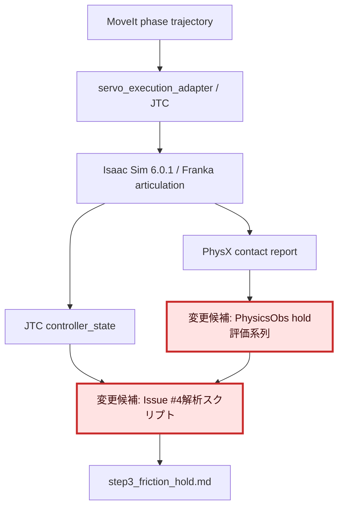
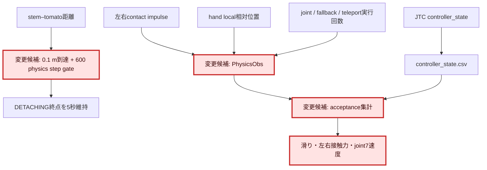

# 1. 全体アーキテクチャ

# 2. 変更モジュールの詳細変更アーキテクチャ

# 3. 調査目的

本書は、現行実装に適合する評価方式、判定基準、および実行条件を整理するための
事前調査資料であり、最終評価結果の正本ではない。GPU E2Eで得られた最終実測値、
合否判定、グラフ、および機械可読な評価結果は、必ず
[`step3_friction_hold.md`](step3_friction_hold.md)
へ反映する。両文書の記載が競合する場合は、最終評価正本である
`step3_friction_hold.md`を最新情報として扱う。

Issue #4の完了条件である「人工拘束なしのphysics modeで、0.1 m持ち上げ後に
5秒保持し、hand–tomato相対変位を5 mm未満に維持する」を、2026-07-20時点の
現行実装で再現可能かつ機械判定可能な評価へ落とし込む。

# 4. 調査条件

- Isaac Sim 6.0.1、physics 120 steps/s、TGS、physics grasp mode
- 現行pull offsetはx/z各0.08 mで、stem基準の終点移動距離は約0.113 m
- 現行E2Eは`DETACHED`観測またはpull軌道成功で直ちに`MOVING_TO_PLACE`へ進む
- 確認日: 2026-07-20

# 5. 確認済みの事実

- Isaac Sim 6.0.1のContact SensorはPhysX Contact Report APIを基盤とし、
  raw contactにはbody pair、position、normal、impulse、dtを含められる。
- physics-based sensorはphysics rateでground truthを生成する。Isaac Sim 6.0では
  旧`isaacsim.sensors.physics`はdeprecatedであり、
  `isaacsim.sensors.experimental.physics`が後継である。
- Joint State Sensorはarticulation全DOFのposition、velocity、effortをphysics stepで
  読める。現行E2Eには同等の実測としてJTC `controller_state` feedbackが存在する。
- 現行`PhysicsObs`は左右contact impulse/force、hand距離、stem距離を出力するが、
  hold区間、hand-local相対変位、人工機構実行回数を一つのrunで採点できない。
- 現行E2Eはfull cycleを完走できるが、0.1 m到達後に5秒静止するphaseを持たない。

# 6. 設計判断

- 評価用環境変数が明示された場合だけ、stem距離0.1 m到達後に600 physics step
  DETACHING終点を維持する。120 Hzで600 stepは5.0秒であり、通常E2Eへ影響しない。
- hold中の滑り量はworld座標差ではなくhand local frameの相対位置差で評価する。
  これにより手首の剛体回転を滑落と誤判定しない。
- contact forceは現行Contact Report impulseをphysics dtで割る経路を継続する。
- joint7速度はJTC `controller_state.feedback.velocities`をrosbagから取得する。
- grasp joint、幾何fallback、teleportはコード分岐の確認だけでなく、同一runの
  実行カウンタが全て0であることをacceptanceに含める。

# 7. 未解決事項

- 600 step中に実接触が継続するか、最大滑りが5 mm未満かはGPU E2E実測が必要。
- JTC feedbackのvelocityが実行環境で空の場合は、position差分による補完が必要。

# 8. 一次情報

- NVIDIA Isaac Sim 6.0.1 Contact Sensor:
  https://docs.isaacsim.omniverse.nvidia.com/6.0.1/sensors/isaacsim_sensors_physics_contact.html
- NVIDIA Isaac Sim Physics-based Sensors:
  https://docs.isaacsim.omniverse.nvidia.com/latest/sensors/isaacsim_sensors_physics.html
- NVIDIA Isaac Sim Joint State Sensor:
  https://docs.isaacsim.omniverse.nvidia.com/latest/sensors/isaacsim_sensors_physics_joint_state.html
