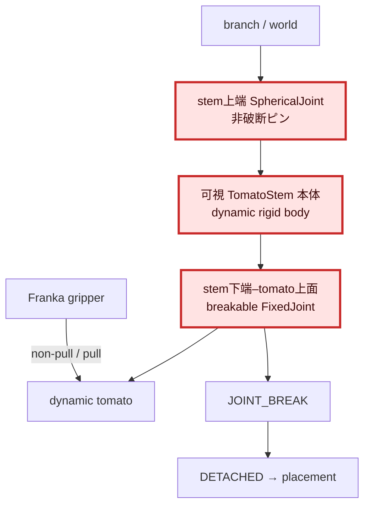
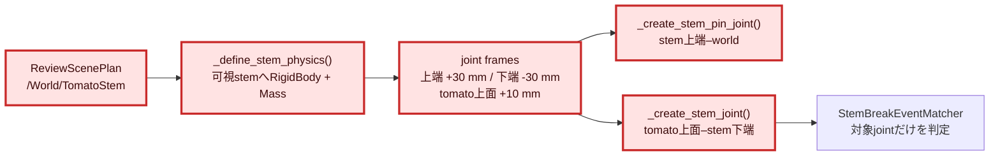

# 1. 全体アーキテクチャ

# 2. 変更モジュール詳細

# 3. 目的と初版の問題

Step 4ではtomatoをworldへ直接固定していたため、把持時のせん断荷重を避けるだけの
break forceではpull時にも破断しなかった。そこで、stem上端だけをピン固定してstemと
tomatoに回転自由度を与え、把持時には逃げ、pull時に初めて破断する構造を評価した。

初版は不可視の`/World/TomatoStemAnchor`だけを可動剛体にし、画面に見える
`/World/TomatoStem`を静的なまま残していた。このためGUIではstemが固定され、tomatoが
不可視bodyへ引かれるように見えた。初版のGPU結果は意図した構造の評価ではないため、
本版では無効として扱う。

# 4. 一次情報調査

確認日: 2026-07-22。

- OpenUSDの`UsdPhysicsSphericalJoint`は並進自由度を拘束し、回転自由度を残す。
- jointの`localPos0`と`localPos1`は各rigid body frameに対する相対位置である。
- `breakForce`はlinear DOFへ加わる力が閾値へ達したときにjointを破断する。

参照:

- OpenUSD `UsdPhysicsSphericalJoint`: https://openusd.org/release/api/class_usd_physics_spherical_joint.html
- OpenUSD `UsdPhysicsJoint`: https://openusd.org/release/api/class_usd_physics_joint.html
- OpenUSD Physics Schema: https://openusd.org/release/api/usd_physics_page_front.html

# 5. 修正内容

- 可視stem prim `/World/TomatoStem`そのものへRigidBody APIと5 gの質量を適用した。
- stem中心をbody原点とし、上端`z=+0.03 m`をworldのSphericalJointへ接続した。
- stem下端`z=-0.03 m`とtomato上面`z=+0.01 m`をbreakable FixedJointで接続した。
- reset時に可視stemのposeと速度を初期化する。
- 可視stemと物理stemが同じprimであること、および上下端frameをunit testで固定した。
- 今回はjoint構造単体を評価するためstem colliderを無効化した。collider有効時はgripperの
  接近と干渉し、non-pullを開始できなかったためである。見た目と剛体運動は有効で、
  gripperとの接触だけを除外している。

| 項目 | 値 |
|---|---:|
| stem length | 0.06 m |
| stem mass | 0.005 kg |
| tomato radius | 0.01 m |
| break force | 20 N（10/15/20 N sweep後の採用値） |
| break torque | 50 N·m |
| physics rate | 120 Hz |

# 6. GPU試験結果

## 6.1 10/15/20 N閾値スイープ

| break force | non-pull | pull | 総合判定 |
|---:|---|---|---|
| 10 N | seq 809で誤破断、held 15 samples | seq 777で破断、収穫cycle未完了 | FAIL |
| 15 N | held 1,672 samples後、seq 924で誤破断 | seq 805で破断、配置完了 | FAIL |
| 20 N | 1,695 held samples、無破断 | seq 1027で破断、配置完了 | PASS |

15 Nは要求下限1,200 samplesを超えた後もnon-pull試験中であり、その状態で自然破断した。
このため瞬間的な保持時間だけで合格とはせず、試験終了まで破断しない20 Nを採用した。
10 Nは把持直後に破断し、pull runも正常な収穫cycleへ移行できなかった。

## 6.2 旧23.625 N基準試験

| 試験 | JOINT_BREAK | 結果 | 判定 |
|---|---:|---|---|
| 23.625 N non-pull | 0件 | 1,753 held samples連続、無破断 | PASS |
| 23.625 N pull | seq 888で1件 | seq 893でDETACHED、その後トレイへ配置 | PASS |

同一設定で、non-pullでは要求する1,200 samplesを超えて接続を維持し、pullでは対象の
`/World/TomatoStemJoint`だけに`JOINT_BREAK`を観測した。pull runは収穫後のplacementまで
完了した。したがって「把持だけでは破断せず、pullによって初めて破断する」という
Step 4-2の狙いはheadless GPU試験で成立した。

Artifacts:

- `.artifacts/issue5-step4-2/visible-stem-no-collider-non-pull-23_625n/e2e/`
- `.artifacts/issue5-step4-2/visible-stem-no-collider-pull-23_625n/e2e/e2e/`

# 7. 評価と残課題

総合判定は **PASS（20 N、stem colliderなし）** である。

- stem上端だけがworldにピン固定され、可視stem本体は回転可能な剛体になった。
- tomatoはstem下端へbreak force付きで取り付けられた。
- non-pull保持とpull破断を同じ20 Nで両立した。
- 初版で見えた「固定stemと不可視anchorへの引力状挙動」は構造上解消した。

残課題はGUIで可視stemの揺動方向と上端位置を目視確認すること、およびstem colliderを
必要とする場合にgripperとのcollision filteringまたはstem形状を調整することである。
今回の自動試験は剛体・joint構造と収穫cycleを確認したが、GUIの見え方そのものは
ユーザー目視確認を受け入れ条件として残す。

Sweep artifacts:

- `.artifacts/issue5-step4-2/visible-stem-no-collider-{non-pull,pull}-10n/`
- `.artifacts/issue5-step4-2/visible-stem-no-collider-{non-pull,pull}-15n/`
- `.artifacts/issue5-step4-2/visible-stem-no-collider-{non-pull,pull}-20n/`
