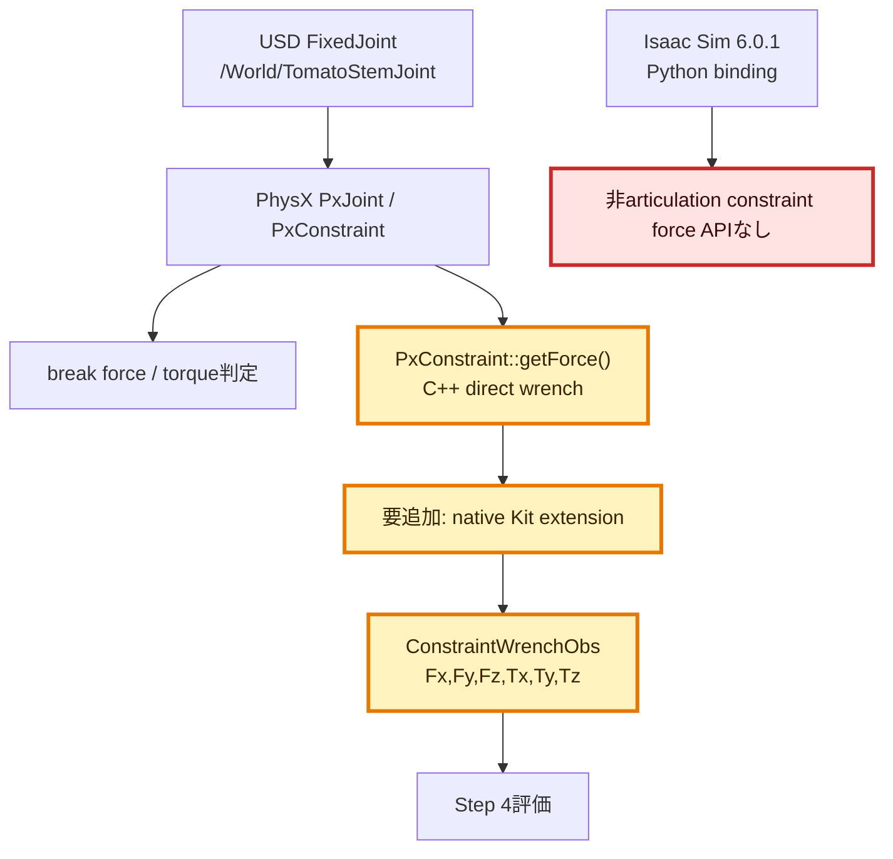
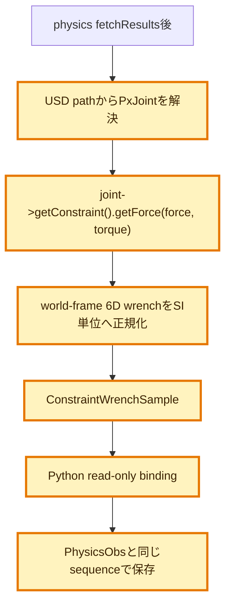

# 1. 全体アーキテクチャ

# 2. 変更候補モジュールの詳細アーキテクチャ

# 3. 調査目的

7.5 Nおよび10 Nのstem break forceで把持評価中の早期破断が発生したため、
接触力から計算した`stemF`ではなく、PhysX solverがFixedJointへ実際に適用した
constraint force / torqueの6成分を直接取得できるか確認する。

# 4. 一次情報で確認した事実

確認日: 2026-07-20。対象はIsaac Sim 6.0.1 / PhysX 110.1.11。

- PhysX C++の`PxConstraint::getForce(PxVec3 &linear, PxVec3 &angular)`は、
  constraint維持のため最後に適用された線形力とトルクを返す。
- standard PhysX jointでは`joint->getConstraint().getForce(force, torque)`で取得し、
  値はworld frameで表される。actorがsleep中は更新されない。
- `getForce()`はsimulation実行中の任意時点では読めず、`fetchResults()`後など
  許可された同期点で読む必要がある。
- Omni Physics Tensorの`ArticulationView.get_link_incoming_joint_force()`は
  articulation linkのincoming jointに対する6D wrenchを返すが、
  articulation jointはUSD jointのbreak force / torqueをサポートしない。
- したがって、breakableな通常の`UsdPhysics.FixedJoint`をarticulation tensorへ
  置き換える方法はIssue #5の要求を満たさない。

一次情報:

- NVIDIA PhysX `PxConstraint::getForce()`:
  https://nvidia-omniverse.github.io/PhysX/physx/5.1.3/_build/physx/latest/class_px_constraint.html
- NVIDIA PhysX Joints / Force Reporting:
  https://nvidia-omniverse.github.io/PhysX/physx/5.4.0/docs/Joints.html
- Omni Physics Tensor Python API:
  https://docs.omniverse.nvidia.com/kit/docs/omni_physics/107.3/extensions/runtime/source/omni.physics.tensors/docs/api/python.html
- Omni Physics Articulations:
  https://docs.omniverse.nvidia.com/kit/docs/omni_physics/latest/dev_guide/rigid_bodies_articulations/articulations.html

# 5. Isaac Sim 6.0.1 runtime実測

`SimulationApp`起動後に`omni.physx.bindings._physx`をintrospectionした。

| binding | force / joint / constraint関連の公開メソッド |
|---|---|
| `PhysX` | `force_load_physics_from_usd`のみ |
| `IPhysxSimulation` | `apply_force_at_pos`, `apply_force_at_pos_instanced`のみ |

非articulation FixedJointのconstraint force / torqueを読むPythonメソッドは
公開されていなかった。さらに配布コンテナのC++ includeを検索したが、
`PxConstraint`またはUSD pathからnative `PxJoint`へ到達するOmni PhysX SDKヘッダは
同梱されていなかった。確認できたPhysX sensor headerはrange sensor向けであり、
joint wrench APIを持たない。

# 6. 結論

現在のリポジトリとIsaac Sim 6.0.1配布コンテナだけでは、
`/World/TomatoStemJoint`のconstraint force / torqueをPythonから直接観測できない。
今回の調査で直接値を取得したとは判定しない。

`PhysicsObs.stemF`はtomatoの加速度等から求めた診断用推定値であり、
`PxConstraint::getForce()`の代替ではない。接触合力や逆動力学から再構成した値も
「直接観測」とは呼ばない。

# 7. 実現に必要な追加作業

直接観測を成立させるには、次を満たすnative Kit extensionが必要である。

1. Isaac Sim 6.0.1とABI互換なOmni PhysX SDK/extension development kitを用意する。
2. USD joint pathからnative `PxJoint` / `PxConstraint`を安全に解決する。
3. physics `fetchResults()`後の同期点で`getForce()`を呼ぶ。
4. world-frameの`Fx,Fy,Fz,Tx,Ty,Tz`とsimulation sequenceをread-onlyでPythonへ渡す。
5. joint破断後、stage reset後、actor sleep時の無効値を明示する。
6. 7.5 N / 10 Nのnon-pullとpullを再実行し、linear normとtorque normの
   どちらが閾値へ先着したかを比較する。

このnative extensionは現行Python実装よりビルド・配布範囲が広く、必要SDKも
現コンテナにないため、本調査では未実装とする。
