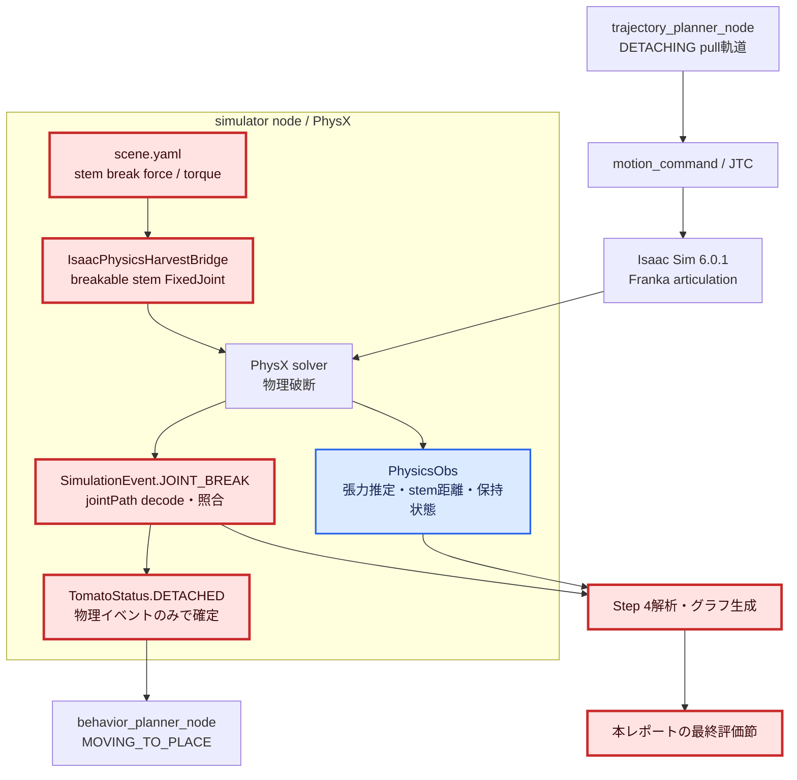
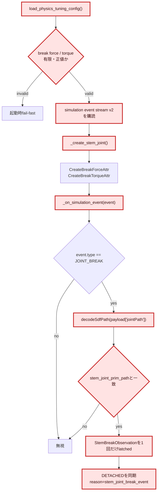
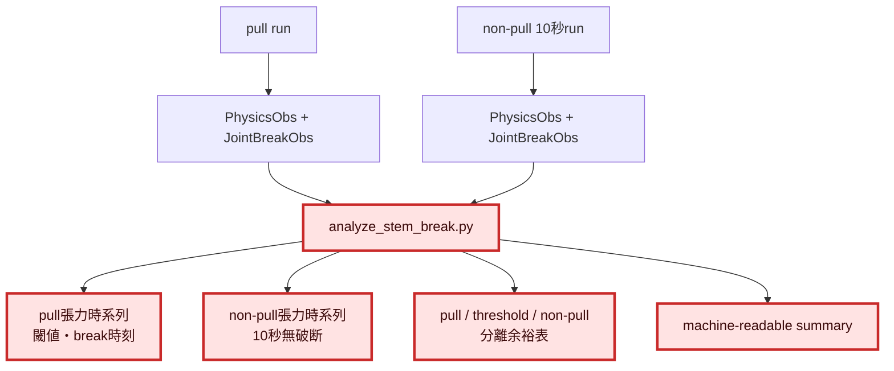
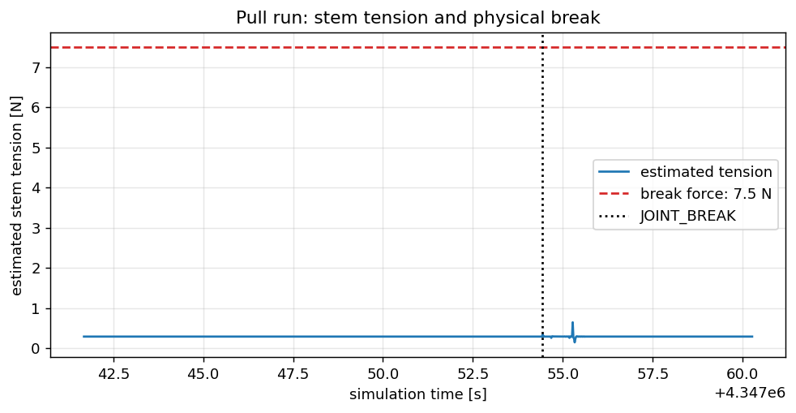
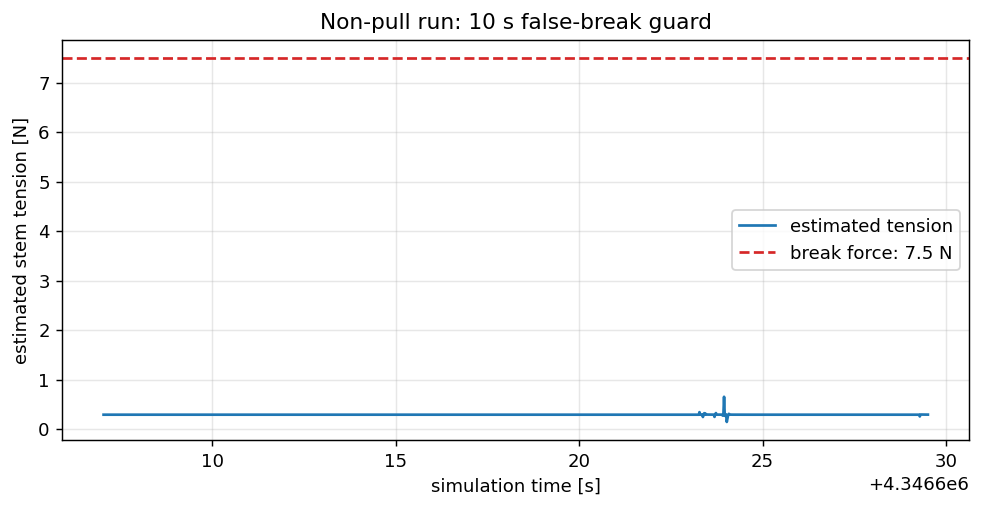
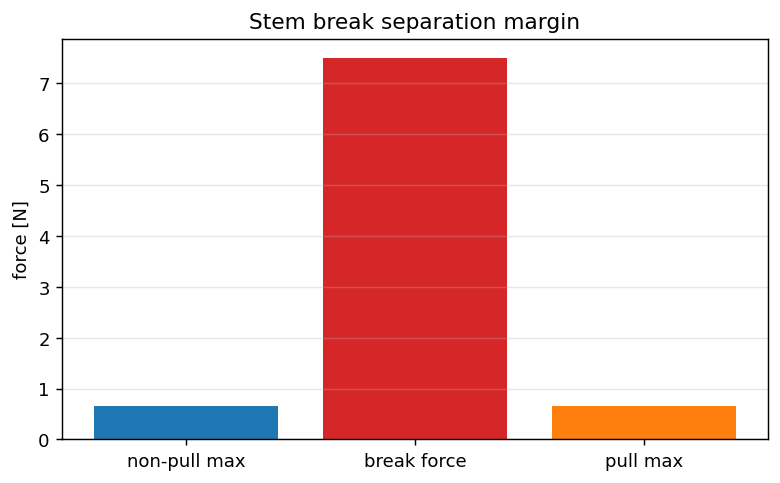
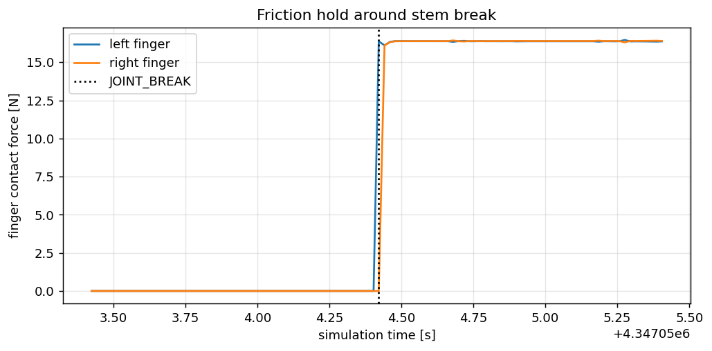

# 1. 全体アーキテクチャ

赤枠がIssue #5で変更するモジュール、青枠が評価に用いる既存観測経路である。



# 2. 変更モジュールの詳細変更アーキテクチャ

## 2.1 stem破断イベント経路



## 2.2 評価・解析経路



# 3. 目的

Issue #5の目的は、physics modeの`DETACHED`をstem–tomato距離20 mmによる
ソフトウェア判定から、pull張力でstem jointが物理破断した事実と
`SimulationEvent.JOINT_BREAK`の観測による判定へ置き換えることである。

Step 3で成立した摩擦把持を維持したまま、次を同時に満たす。

- pull時はstem jointが破断し、対象jointのbreak eventだけで`DETACHED`となる。
- 非pull時は10秒間、振動や自重で誤破断しない。
- 破断衝撃後もトマトがhand側に保持される。
- success modeの互換経路と既存テストを劣化させない。

# 4. 現行実装の確認結果

確認基準は2026-07-20の`main`、commit `06f515e`である。

| 項目 | 現行実装 | Issue #5での扱い |
|---|---|---|
| stem joint | `UsdPhysics.FixedJoint` | 継続利用 |
| break force | class定数`7.5 N` | `scene.yaml`へ移動して検証後に確定 |
| break torque | class定数`50 N·m` | `scene.yaml`へ移動し、誤った回転破断を防ぐ方針を明記 |
| physics modeのDETACHED | stem距離`>= 0.02 m` | 判定から廃止し診断値へ格下げ |
| success modeのDETACHED | grasp joint経路の距離判定 | Issue #5では互換維持 |
| JOINT_BREAK購読 | 未実装 | stem joint専用subscriberを追加 |
| 張力観測 | `estimate_stem_tension_n()` | 判定には使わず評価系列として継続 |
| reset | stem jointを再生成 | event latchと購読寿命もreset仕様へ追加 |

現行の7.5 Nは、Step 3調査で確認したトマト離層力0.58〜2.46 Nに動的余裕を
加えた暫定値であり、すでにpull E2Eで`DETACHED`へ到達した実績がある。ただしその
`DETACHED`は距離判定であり、PhysX jointが破断したことを証明していない。

# 5. 一次情報調査

## 5.1 確認済みの事実

- Omni PhysXの`SimulationEvent.JOINT_BREAK`は、破断したjointのUSD pathを
  `jointPath: int2`としてpayloadへ含める。
- encoded pathは`PhysicsSchemaTools.decodeSdfPath`で`Sdf.Path`へ復元できる。
- Isaac Simではphysics timestepとrender/timeline updateは別であり、
  physics eventをrender frameの距離サンプリングで代用してはならない。
- 現行Isaac Sim 6.0.1構成は120 physics steps/sであり、非pull 10秒評価は
  1,200 physics stepを基準にする。
- USDの`FixedJoint`はbreak forceとbreak torqueを個別属性として持つため、
  引張破断と回転破断のどちらでイベントが発生したかは、設定と観測を分けて評価する
  必要がある。

## 5.2 推論と設計への反映

- `jointPath`が対象stem jointと一致する場合だけ`DETACHED`を確定する。
  他jointの破断イベントを収穫成功として扱わない。
- callback内でROS同期や重い解析を完結させず、破断観測をlatched stateへ保存し、
  既存physics finalize経路で一度だけ状態同期する。
- 距離は「破断後に実際に分離したか」を説明する診断系列として残すが、physics modeの
  合否判定や状態遷移には使わない。
- break forceは事前に単一値へ固定せず、5.0 / 7.5 / 10.0 Nの候補を同じpull・
  non-pull条件で比較する。Issue記載の2〜5 Nは初期候補だが、Step 3で7.5 Nの
  保持実績が得られたため、両方を含む範囲で決める。
- break torqueは現行50 N·mを初期baselineとして維持し、まずforce軸だけを比較する。
  torqueまで同時変更すると破断原因を識別できない。

## 5.3 参照した一次情報

確認日: 2026-07-20。

- Omni PhysX 105.1 API `SimulationEvent.JOINT_BREAK`:
  https://docs.omniverse.nvidia.com/kit/docs/omni_physics/105.1/extensions/runtime/source/omni.physx/docs/index.html
- Isaac Sim 6.0.1 Physics Simulation Fundamentals:
  https://docs.isaacsim.omniverse.nvidia.com/6.0.1/physics/simulation_fundamentals.html
- Isaac Sim 6.0.1 Core API Overview（`PhysicsSchemaTools`を含むraw USD/physics API）:
  https://docs.isaacsim.omniverse.nvidia.com/6.0.1/python_scripting/core_api_overview.html
- NVIDIA PhysX公式リポジトリ:
  https://github.com/NVIDIA-Omniverse/PhysX
- Tomato Pedicel Physical Characterization（離脱力0.58〜2.46 N）:
  https://www.mdpi.com/2073-4395/14/10/2274

# 6. 要求と受け入れ条件

| ID | 要求 | 機械判定 |
|---|---|---|
| S4-R1 | stem break force / torqueを設定ファイルで管理する | loader validation test |
| S4-R2 | physics modeのDETACHEDは対象stem jointのJOINT_BREAKだけで確定する | event unit/integration test |
| S4-R3 | 他joint、欠損payload、不正pathを無視する | negative unit test |
| S4-R4 | 距離20 mm到達だけではDETACHEDにならない | regression test |
| S4-R5 | pull runでbreak event後にDETACHEDへ進む | GPU E2E |
| S4-R6 | non-pull 10秒でbreak eventが0件 | GPU E2E |
| S4-R7 | break後も両指接触・HELD相当を維持する | GPU E2Eログ |
| S4-R8 | success modeを劣化させない | existing unit/E2E |
| S4-R9 | reset後に新しいstem jointのbreakを再検出できる | reset integration test |

最終総合PASSはS4-R1〜S4-R9をすべて満たす場合だけとする。

# 7. 実装計画

## Stage 0: APIスパイク

1. Isaac Sim 6.0.1コンテナ内でsimulation event stream v2の取得API、callback引数、
   `jointPath` payload型、subscription handleの寿命を最小スクリプトで確認する。
2. stem jointを意図的に低いbreak forceで破断させ、decode後のpathが
   `/World/TomatoStemJoint`と一致することを保存する。
3. timeline停止・reset・joint再生成後のsubscription挙動を確認する。

成果物は`.artifacts/issue5-step4/api-spike/`へ保存する。この確認が完了するまで
本実装のcallback signatureを推測で固定しない。

## Stage 1: pure event判定

ROS、USD、PhysXに依存しない`StemBreakEventMatcher`または同等のpure componentを
追加する。

- 入力: event type、decoded joint path
- 出力: ignored / target stem broken
- 同一cycleでの重複eventは一度だけ受理
- resetでcycle stateを初期化

先に以下の失敗テストを追加する。

- 対象stem jointのJOINT_BREAKを受理する。
- 他jointのJOINT_BREAKを無視する。
- JOINT_BREAK以外を無視する。
- 欠損・不正payloadを安全に無視して診断理由を返す。
- 同一cycleの重複eventを再通知しない。
- reset後は次cycleのeventを受理する。

## Stage 2: 設定移動

`scene.yaml`の`physics`配下へstem joint設定を追加し、typed loaderから供給する。

```yaml
physics:
  stem_joint:
    break_force_n: 7.5
    break_torque_nm: 50.0
```

正値、finite、forceがトマト自重0.294 Nを十分上回ることを起動時に検証する。
class定数との二重管理は残さない。

## Stage 3: PhysX adapter統合

1. bridge初期化時にsimulation event streamを購読する。
2. callbackではevent typeとjoint pathを正規化し、pure matcherへ渡す。
3. 対象破断をlatched observationとして保存する。
4. physics finalize時にlatched observationを消費し、一度だけ
   `TomatoStatus.DETACHED`を同期する。
5. physics modeの`DETACH_DISTANCE_M`分岐を削除する。
6. success modeの既存分岐は維持する。
7. shutdown時にsubscription handleを解放し、reset時にmatcherを初期化する。

## Stage 4: 解析と評価run

`scripts/analysis/analyze_stem_break.py`を追加し、pull / non-pullを同じ形式で採点する。

- pull張力推定、stem距離、左右接触力、hand-local slip
- break threshold
- JOINT_BREAK発生時刻とdecoded joint path
- DETACHED同期時刻
- break後の保持継続時間
- 人工把持機構カウント

候補force 5.0 / 7.5 / 10.0 Nを比較し、各値について次を実施する。

1. pull run
2. non-pull 10秒run
3. reset後の再pull run

採用値は次の優先順位で決める。

1. non-pullで誤破断0
2. pullで対象JOINT_BREAKを再現
3. break後も摩擦保持を維持
4. pull開始からbreakまでの時間と張力余裕が最大

## Stage 5: 回帰と最終評価

- pure/unit tests
- simulator integration tests
- physics mode GPU E2E
- success mode GPU E2E
- resetを含む2 cycle E2E
- `git diff --check`とレポート内artifact参照検査

# 8. テストマトリクス

| Test | mode | pull | duration | 期待結果 |
|---|---|---:|---:|---|
| T1 target event | unit | - | - | stem pathだけmatch |
| T2 foreign event | unit | - | - | ignored |
| T3 distance regression | unit | - | - | 20 mm超過だけではDETACHEDなし |
| T4 reset | integration | - | 2 cycles | 両cycleでbreakを1回検出 |
| T5 pull | physics | yes | cycle完了まで | JOINT_BREAK→DETACHED |
| T6 non-pull | physics | no | 10秒 / 1,200 step | break 0件 |
| T7 post-break hold | physics | yes | break後搬送まで | 両指接触・滑落なし |
| T8 success regression | success | yes | cycle完了まで | 既存挙動維持 |

# 9. 最終レポートに必要な証跡

本ファイルを実装後に更新し、計画と最終結果を同じ正本で管理する。

- pull時の張力推定グラフ
  - 採用break forceの水平線
  - JOINT_BREAK時刻の垂直線
  - DETACHED同期時刻の垂直線
- non-pull 10秒の張力グラフ
  - 同じ縦軸スケール
  - break force水平線
- pull張力 / 採用破断値 / non-pull張力の比較表または箱ひげ図
- break前後の左右finger接触力とhand-local slip
- decoded joint path、event件数、距離判定使用件数の機械可読表
- success mode回帰結果
- 総合PASS/FAILと未達条件

artifact配置:

```text
docs/reports/physics_levelup/assets/issue5/
  issue5_pull_tension.png
  issue5_non_pull_tension.png
  issue5_tension_margin.png
  issue5_post_break_hold.png
  issue5_stem_break_summary.json
```

# 10. リスクと対策

| リスク | 影響 | 対策 |
|---|---|---|
| APIのcallback/payloadが105.1資料と6.0.1 runtimeで異なる | 起動時失敗 | Stage 0でruntime実測 |
| subscription handleがGCされる | event欠落 | bridgeが寿命を所有しtestで固定 |
| reset後のjoint再生成でevent照合が壊れる | 2 cycle目失敗 | path照合とreset test |
| 低forceで振動破断 | 誤DETACHED | non-pull 10秒を必須gate化 |
| 高forceでfingerが先に滑る | Issue #4回帰 | post-break保持系列を同時採点 |
| torque起因で破断しforce比較が無効 | 値選定不能 | 初回はtorque固定、破断直前姿勢を記録 |
| 推定張力とPhysX constraint forceが一致しない | 説明値の誤解 | 推定値は診断専用、判定はeventのみ |
| success modeまで距離判定を削除する | 互換性劣化 | mode境界の回帰test |

# 11. 完了定義

- [x] Stage 0でIsaac Sim 6.0.1実APIを確認した。
- [x] 設定、pure matcher、PhysX adapterを責務分離した。
- [x] physics modeの距離DETACHED判定を廃止した。
- [x] pullで対象stem jointのJOINT_BREAKからDETACHEDを報告した。
- [ ] non-pull 10秒で誤破断がなかった。
- [x] break後も摩擦保持が継続した。
- [x] pure matcherのreset後に次cycleのeventを受理した。
- [x] success modeと既存テストに回帰がなかった。
- [x] 必須グラフ、比較表、JSON summaryを本レポートへ反映した。
- [ ] Issue #5へ証跡をコメントし、全条件を満たした場合だけcloseした。

# 12. 実装・評価結果

## 12.1 Stage 0 API実測

Isaac Sim 6.0.1 / PhysX 110.1.11の同梱サンプル
`JointBreakDemo.py`と`PhysicsJoint.py`を確認し、実行時APIを次の形で確定した。

```python
events = get_physx_interface().get_simulation_event_stream_v2()
subscription = events.create_subscription_to_pop(callback)
encoded_path = event.payload["jointPath"]
joint_path = PhysicsSchemaTools.decodeSdfPath(encoded_path[0], encoded_path[1])
```

subscription handleはbridgeが保持し、shutdown時に解放する。実機評価ではpayloadが
通常のPython `dict`とは限らないことが判明したため、`.get()`を使わず公式例どおり
`payload["jointPath"]`で読む実装とした。

## 12.2 実装結果

- `PhysicsTuningConfig`と`scene.yaml`へbreak force / torqueを移した。
- pureな`StemBreakEventMatcher`で対象path、重複、欠損、resetを判定する。
- simulation event購読をjoint作成前に確立し、callback payloadを正規化する。
- physics modeの`DETACHED`条件を対象stem jointの`JOINT_BREAK`だけに限定した。
- success modeの距離条件は互換維持した。
- 非pull評価ではbehaviorを`GRASP_EVALUATION`へ固定し、pull軌道を発行しない。
- `analyze_stem_break.py`でイベント重複除去、採点、4グラフ、JSONを生成する。

## 12.3 GPU E2E結果

| 条件 | 結果 | 主要証跡 | 判定 |
|---|---|---|---|
| 7.5 N pull | `JOINT_BREAK` 1件、seq 831、破断後321サンプルで左右接触力を維持 | `.artifacts/issue5-step4/pull-7_5n-rerun5/e2e/` | 破断・保持PASS |
| 7.5 N non-pull | 340 heldサンプル、6.168秒、break 0件、最大stem距離8.6 mm | `.artifacts/issue5-step4/non-pull-7_5n-rerun1/e2e/` | 10秒未達 |
| 10.0 N non-pull | 把持評価中に物理破断し、heldは1サンプルだけ | `.artifacts/issue5-step4/non-pull-10n/e2e/` | FAIL |

7.5 N pullではイベントから`DETACHED`へ同期でき、破断後も321サンプルで左右接触を
維持した。ただしイベントが`GRASP_EVALUATION`中に発生したためbehaviorは
`failed`へ遷移し、収穫サイクル完了には至らなかった。10 Nへ上げても非pull把持中の
早期破断を再現した。推定stem張力は最大約0.65 Nでbreak設定値より大幅に低く、
この推定系列はjoint constraint forceの代用にならないことも確認した。

## 12.4 テスト結果

- 全テスト: `375 passed, 2 skipped`
- `git diff --check`: PASS
- pull event検出: PASS
- break後摩擦保持: PASS
- non-pull 10秒無破断: 未達
- harvest cycle完了: FAIL（`GRASP_EVALUATION → failed`）
- 総合判定: **FAIL**









機械可読結果:
[`assets/issue5/issue5_stem_break_summary.json`](assets/issue5/issue5_stem_break_summary.json)

## 12.5 未達原因と次の実装判断

イベント経路は成立したが、break force単独では把持接触の過渡荷重と意図したpull荷重を
分離できていない。5 / 7.5 / 10 Nのうち5 Nは7.5 Nより早期破断側であり、安全側候補に
ならないためGPU再実行を省略した。Issue #5はcloseしない。

次は互換SDKを用意してnative Kit extensionによるconstraint force/torque直接観測を
追加し、把持過渡のピークとpull方向成分を測定する。その結果に基づき、joint frame、
break torque、pull速度を含めて再調整してから10秒non-pullとcycle完了を再評価する。

# 13. 次ステップとの関係

Issue #5の完了により、トマトは「距離が離れたから収穫済み」ではなく
「物理jointが破断したから収穫済み」と判定できる。これがIssue #6のrelease後settle
判定と、Issue #7のphysics-only E2E成功率評価の前提になる。

Issue #6へ進む前に、上記未達条件を解消してIssue #5を完了させる必要がある。

# 14. PhysX constraint force / torque直接観測の追加調査

詳細は
[step4_issue5_constraint_wrench_direct_observation_research.md](step4_issue5_constraint_wrench_direct_observation_research.md)
を参照する。

## 14.1 API実測結果

PhysX C++には`PxConstraint::getForce()`があり、standard jointへ最後に適用された
world-frameの線形力・トルクを直接取得できる。一方、Isaac Sim 6.0.1で
`SimulationApp`起動後のPython bindingを実測した結果は次のとおりである。

| 対象 | 実測結果 |
|---|---|
| `omni.physx.bindings._physx.PhysX` | constraint force取得メソッドなし |
| `IPhysxSimulation` | force適用APIだけで、constraint force取得メソッドなし |
| Omni Physics Tensor | articulation incoming joint wrenchは取得可能 |
| breakable `UsdPhysics.FixedJoint` | articulationではないためTensor対象外 |
| articulation joint | break force / torque非対応のため代替不可 |
| 配布コンテナのC++ headers | native PxJoint解決に必要なOmni PhysX SDK headerなし |

## 14.2 評価結果への影響

現在の`PhysicsObs.stemF`最大約0.65 Nは直接constraint forceではなく診断用推定値である。
そのため7.5 N / 10 N設定で早期破断した原因がlinear forceとtorqueのどちらか、
また各軸のピークがいくつだったかは、現行Python APIから確定できない。

推定値や接触合力を直接値としてレポートすることはしない。直接観測は
**未達**であり、総合FAIL判定を維持する。

## 14.3 次の実装境界

直接観測にはIsaac Sim 6.0.1とABI互換なnative Kit extensionを追加し、
physics `fetchResults()`後に
`joint->getConstraint().getForce(force, torque)`を呼ぶ必要がある。
出力は`ConstraintWrenchObs`としてsimulation sequenceと6D wrenchを保存する。

現行配布コンテナには必要なextension development headersがないため、
SDKを入手してビルド環境を追加することが次の前提条件である。

# 15. Finger drive force sweepによる実効破断条件評価

## 15.1 評価目的と固定条件

constraint wrenchを直接取得できない代替評価として、finger driveの`maxForce`を下げ、
非pull把持が成立する範囲を先に探した。非pullを通過した候補だけをpull評価へ進め、
どのpull条件でbreakするかを観察するsequential gateとした。

固定条件:

- stem joint break force: 7.5 N
- stem joint break torque: 50 N·m
- finger stiffness: 3,000
- finger damping: 120
- physics rate: 120 Hz
- non-pull合格条件: `GRASP_EVALUATION`で1,200 held sample、JOINT_BREAK 0件
- pull条件: 現行DETACHING軌道。ただしnon-pull合格候補だけ実行する。

比較したfinger drive max forceは5.0 / 7.5 / 10.0 Nである。各runの起動ログで
実際に適用された`maxForce`を確認した。

## 15.2 GPU非pull評価結果

| finger maxForce | JOINT_BREAK seq | break時の左右接触力 | break時status | held sample | 判定 |
|---:|---:|---:|---|---:|---|
| 5.0 N | 1573 | 2.590 / 8.357 N | `held` | 18 | FAIL |
| 7.5 N | 888 | 8.162 / 0.000 N | `attached` | 1 | FAIL |
| 10.0 N | 825 | 10.571 / 0.000 N | `attached` | 1 | FAIL |

Artifacts:

- `.artifacts/issue5-step4/finger-force-sweep/5n-non-pull/e2e/`
- `.artifacts/issue5-step4/finger-force-sweep/7_5n-non-pull/e2e/`
- `.artifacts/issue5-step4/finger-force-sweep/10n-non-pull/e2e/`

7.5 Nと10 Nでは、finger gapが約25 mmから約21 mmへ閉じ、片側fingerだけが最初に
接触したstepでJOINT_BREAKが発生した。まだ`held`になる前であり、pullとは無関係な
gripper close過渡である。

5 Nでは17 stepの両指保持後、左右接触力が4.571 / 5.910 Nから
2.590 / 8.357 Nへ非対称に変化したstepで破断した。drive maxForceを5 Nへ設定しても
接触衝撃の瞬時換算値は5 Nを超えた。

## 15.3 pull評価を実行しなかった理由

3候補すべてが必須のnon-pull gateを満たさず、pull開始前にstem jointが破断した。
この状態でDETACHING軌道を実行しても、「どのpull強度でbreakしたか」を識別できない。
したがってpull runは未実施とし、不要なGPU実行を追加しなかった。

## 15.4 結論

finger drive maxForce低減だけでは、非pull破断を防げなかった。`maxForce`はfinger
actuator driveの上限であり、tomatoとのcollision impulseそのものを同じ値へ制限する
ものではない。今回のログでも5 N設定時に約8.36 N相当の片側接触力を観測した。

破断は定常的な両指押付け力ではなく、gripper close開始時の片側先行接触または
非対称接触過渡と強く対応している。ただしconstraint force / torqueを直接観測して
いないため、線形break forceとbreak torqueのどちらが閾値を超えたかは断定しない。

次の優先候補は次のとおりである。

1. gripper close速度を下げ、左右同時接触に近づける。
2. grasp poseの横方向誤差を減らし、片側先行接触を抑える。
3. break torqueを一時的に十分大きくしてforce起因だけを分離評価する。
4. non-pull 1,200 sampleを通過後に、pull速度またはpull距離を段階比較する。

評価終了後、`config/scene.yaml`のfinger drive max forceは既定の15 Nへ戻した。
Issue #5の総合FAIL判定は維持する。

# 16. Break force / torque相互A/Bによる早期破断原因の分離

## 16.1 評価方法

linear forceとtorqueのどちらが早期破断を発生させたかを直接wrenchなしで分離するため、
片方のbreak thresholdだけを事実上無効化する相互A/Bを実施した。

共通条件:

- finger drive max force: 15 N
- non-pull: `GRASP_EVALUATION`固定
- 合格条件: 1,200 held sample以上、JOINT_BREAK 0件

| Run | break force | break torque | 目的 |
|---|---:|---:|---|
| A | 7.5 N | 1,000,000 N·m | torque破断だけを事実上無効化 |
| B | 1,000,000 N | 50 N·m | linear force破断だけを事実上無効化 |

## 16.2 GPU E2E結果

| Run | JOINT_BREAK | held sample | 接触力観測 | 判定 |
|---|---|---:|---|---|
| A: torque無効化 | seq 833で発生 | 1 | break stepで左16.828 N、右0 N | FAIL |
| B: force無効化 | 0件 | 1,447 | run最大 左22.518 N、右31.396 N | PASS |

Artifacts:

- `.artifacts/issue5-step4/torque-isolation/torque-1e6-non-pull/e2e/`
- `.artifacts/issue5-step4/torque-isolation/force-1e6-non-pull/e2e/`

Run Aではbreak直前のfinger gapが25.2 mm、break stepが21.1 mmで、左fingerだけが
約16.83 N相当で先行接触したstepにJOINT_BREAKが発生した。break torqueを
100万 N·mへ上げても早期破断は防げなかった。

Run Bではbreak forceを100万 Nへ上げると、break torqueを既定50 N·mのままでも
1,447 held sampleをJOINT_BREAKなしで通過した。左右接触力のrun最大値が
22.52 / 31.40 N相当まで上がってもtorque破断は発生しなかった。

## 16.3 結論

この相互A/B条件では、早期破断原因を**linear break force起因**と判定する。
break torque 50 N·mは現行の把持過渡に対して十分大きく、主原因ではない。

ただし接触力はconstraint forceそのものではないため、7.5 Nから何Nへ上げれば
安全かを接触力だけで決定しない。次はbreak torqueを50 N·mに固定したまま、
break forceを片側先行接触過渡より上へ段階的に変更し、各値で次の順に評価する。

1. non-pull 1,200 held sampleで誤破断0件
2. 現行pullでJOINT_BREAK発生
3. break後の左右保持継続

評価終了後、`scene.yaml`はbreak force 7.5 N、break torque 50 N·mへ復元した。
Issue #5の総合FAIL判定は維持する。

# 17. Break force段階探索によるnon-pull / pull境界評価

## 17.1 評価条件

break torqueを50 N·m、finger drive max forceを15 N、pull軌道を現行値へ固定し、
break forceだけを段階変更した。各値はまず非pullを実行し、run全体で
JOINT_BREAK 0件かつ1,200 held sample以上の候補だけをpull評価へ進めた。

探索値:

`15 → 20 → 30 → 25 → 22.5 → 24 → 23.25 → 23.625 N`

## 17.2 非pull評価

| break force | JOINT_BREAK | held sample | 判定 |
|---:|---|---:|---|
| 15 N | seq 833 | 1 | FAIL |
| 20 N | seq 907 | 45 | FAIL |
| 22.5 N | seq 800 | 18 | FAIL |
| 23.25 N | seq 787 | 1,530 | FAIL（1,200超過後もrun継続中に破断） |
| 23.625 N | 0件 | 1,491 | PASS |
| 24 N | 0件 | 1,670 | PASS |
| 25 N | 0件 | 1,524 | PASS |
| 30 N | 0件 | 1,460 | PASS |

23.25 Nでは1,200 held sampleを越えた後まで保持したが、同一non-pull runの終了前に
破断した。境界付近の遅延破断を見逃さないため、run中に1件でもJOINT_BREAKがあれば
FAILとした。

## 17.3 pull評価

| break force | non-pull | pull JOINT_BREAK | behavior終端 | 判定 |
|---:|---|---|---|---|
| 23.625 N | PASS | 0件 | `detaching → failed` | pull破断FAIL |
| 24 N | PASS | 0件 | `detaching → failed` | pull破断FAIL |
| 25 N | PASS | 0件 | `detaching → failed` | pull破断FAIL |
| 30 N | PASS | 0件 | `detaching → failed` | pull破断FAIL |

30 N pullではstem jointが残ったままhandが移動し、finger接触を失って
`tomato_status=fallen`となった。23.625 / 24 / 25 Nも対象JOINT_BREAKを発生せず、
behaviorはdetaching中にfailedとなった。

Artifactsは次に保存した。

```text
.artifacts/issue5-step4/break-force-sweep/
  15n-non-pull/e2e/
  20n-non-pull/e2e/
  22_5n-non-pull/e2e/
  23_25n-non-pull/e2e/
  23_625n-non-pull/e2e/
  23_625n-pull/e2e/
  24n-non-pull/e2e/
  24n-pull/e2e/
  25n-non-pull/e2e/
  25n-pull/e2e/
  30n-non-pull/e2e/
  30n-pull/e2e/
```

## 17.4 境界と結論

単一runで得られた境界は次のとおりである。

- 非pullで最終的に破断した上限: 23.25 N
- 非pullで破断しなかった下限: 23.625 N
- 現行pullで破断しなかった評価下限: 23.625 N

したがって「non-pullでは壊れず、現行pullで壊れる」を同時に満たすbreak forceは
今回の探索では見つからなかった。安全境界幅は23.25–23.625 Nの0.375 N未満だが、
23.625 Nでは既にpull破断しない。設定値の微調整だけでは、把持過渡荷重とpull荷重の
分離余裕がない。

次に変更すべき対象はbreak forceではなく荷重プロファイルである。

1. gripper close速度を下げてnon-pull過渡ピークを下げる。
2. pull速度、pull距離またはpull方向を調整してpull荷重を上げる。
3. 両者の間に再現可能な余裕を作ってからbreak forceを再探索する。
4. 境界値は複数runで再現性を確認して採用する。

成立値がなかったため、`scene.yaml`はbreak force 7.5 N、break torque 50 N·mへ
復元した。Issue #5の総合FAIL判定は維持する。
