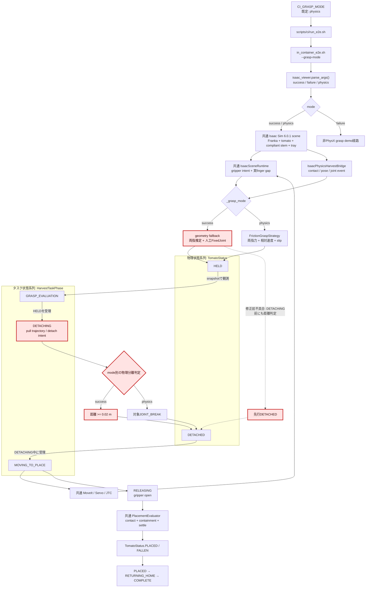
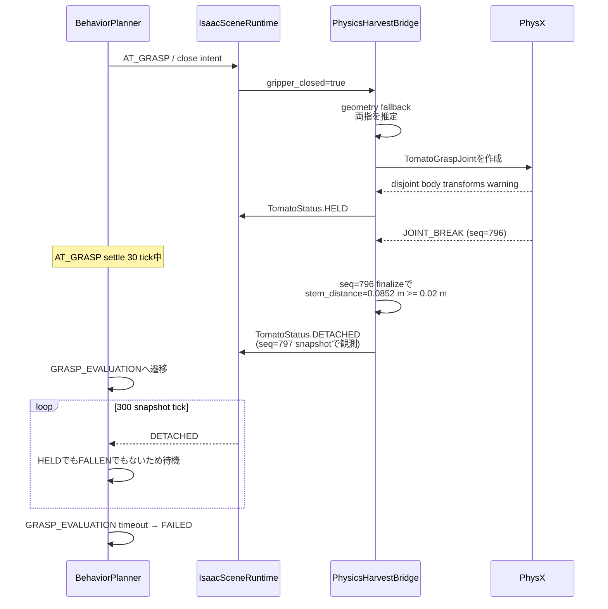
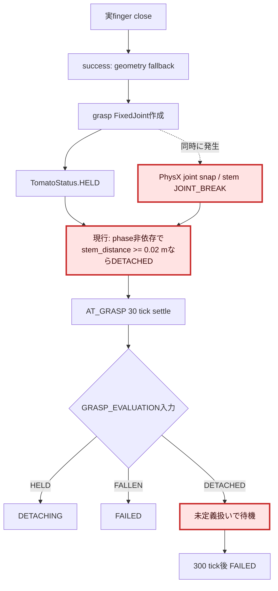
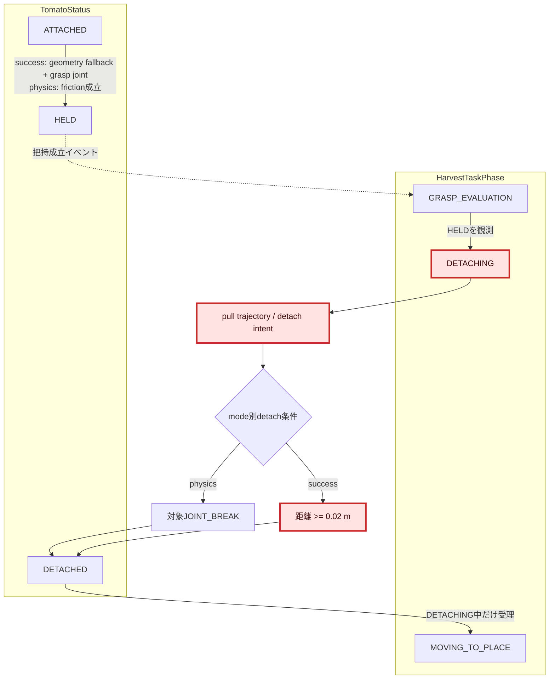
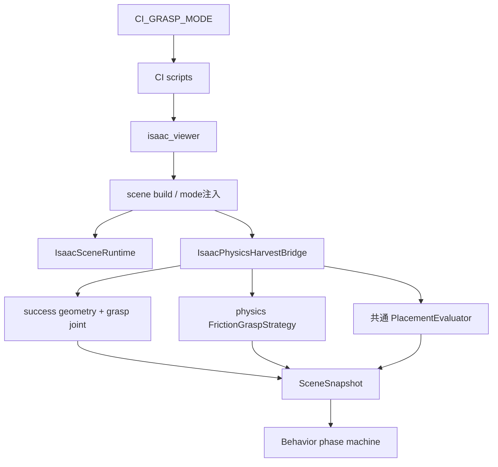
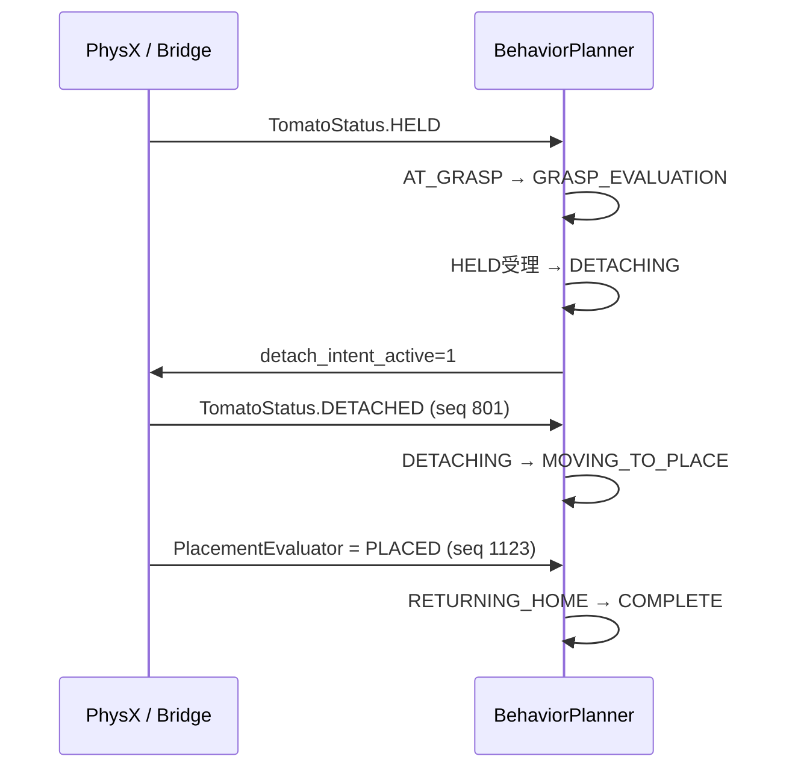

# 1. 全体アーキテクチャ

`success`と`physics`は別のsceneや別の上位フローではない。両modeとも同じIsaac Sim / PhysX scene、
同じ`IsaacSceneRuntime`、同じROS 2 behavior / motion pipelineを使用し、
`IsaacPhysicsHarvestBridge.finalize_physics_step()`内のgrasp成立・detach判定だけを切り替える。

ここで、`HarvestTaskPhase`と`TomatoStatus`は別の状態系列である。正常系では、
`GRASP_EVALUATION`が`TomatoStatus.HELD`を観測してタスクphaseを`DETACHING`へ進め、
pull実行中の物理分離を`TomatoStatus.DETACHED`として受理した後に
`MOVING_TO_PLACE`へ進む。赤枠はIssue #76で変更したモジュールと境界である。



## 2種類の状態系列

| 系列 | 型 | 正常な遷移 | 意味 |
|---|---|---|---|
| タスクphase | `HarvestTaskPhase` | `GRASP_EVALUATION → DETACHING → MOVING_TO_PLACE` | ロボットが評価、pull、搬送のどの作業を実行中か |
| tomato物理状態 | `TomatoStatus` | `ATTACHED → HELD → DETACHED` | トマトが枝、ハンドのどちらに拘束されているか |

両系列を対応付けるイベントは次の2つである。

1. `GRASP_EVALUATION`中に`TomatoStatus.HELD`を観測すると、タスクphaseを
   `DETACHING`へ進めてpull軌道を開始する。
2. `DETACHING`中に`TomatoStatus.DETACHED`を観測すると、タスクphaseを
   `MOVING_TO_PLACE`へ進める。

`HarvestTaskPhase.DETACHED`はenumに定義されているが、現行`phase_machine.advance()`では
遷移先として使用されていない。正常フローで受理する`DETACHED`は
`TomatoStatus.DETACHED`であり、`DETACHING`自体は実際にpull軌道を実行するタスクphaseである。

## mode別の責務境界

| 項目 | success mode | physics mode | 共通 |
|---|---|---|---|
| scene構築 | PhysX sceneを使用 | PhysX sceneを使用 | Franka、tomato、可動stem、breakable joint、tray |
| grasp成立 | geometryから両指接触を補完し人工`FixedJoint`を作る | 両指contact force、hand相対速度、slipを連続観測 | 実finger gapでclose/openを確定 |
| tomato保持 | `/World/TomatoGraspJoint`による人工拘束 | 摩擦接触のみ。grasp jointなし | `TomatoStatus.HELD`を上位へ通知 |
| detach観測（修正前） | stem attachmentとの距離`>= 0.02 m`。タスクphaseによるgateなし | 対象stem jointの`JOINT_BREAK` | `TomatoStatus.DETACHED`を上位へ通知 |
| detach状態遷移（実装済み） | `HELD`受理後に必ず`DETACHING`へ入り、その後だけ距離detachを許可 | `HELD`受理後に`DETACHING`へ入り、pull中の`JOINT_BREAK`を受理 | `DETACHING`中の`DETACHED`受理後だけ`MOVING_TO_PLACE`へ進む |
| release後 | 共通`PlacementEvaluator` | 共通`PlacementEvaluator` | tray接触、内包、低速連続sampleでPLACED/FALLEN |
| 主目的（現行実装からの推定） | 上位cycleを決定論的に回帰確認する互換経路 | 実接触・摩擦・破断を含む受け入れ経路 | motion / behavior / placementの共通回帰 |

# 2. 変更モジュールの詳細変更アーキテクチャ

## 2.1 現在のsuccess mode失敗シーケンス



## 2.2 問題箇所と修正境界



変更候補は`geometry fallback`のfinger pose取得ではなく、次の2境界である。

1. success modeが`HELD`を上位状態機械の評価期間より前に`DETACHED`へ進めてしまう
   `IsaacPhysicsHarvestBridge`のdetach許可条件。
2. `GRASP_EVALUATION`が入力`DETACHED`を扱わず、到達不能な`HELD`を300 tick待つ
   `phase_machine.advance()`の状態契約。

第一原因は1である。2だけで`DETACHED → DETACHING`等へ救済すると、graspを評価せずに
detach成功を受理するため、success modeの決定論的grasp契約を曖昧にする。

## 2.3 修正後に両modeで共通化する状態遷移



修正後もmode間で共通化するのは**状態遷移契約**であり、物理判定方法そのものではない。
successは距離判定、physicsは対象`JOINT_BREAK`を維持する。ただしsuccessの距離判定は
`DETACHING`開始を表す明示的なdetach intentを受けるまで評価してはならない。

## 2.4 現行の迂回遷移

現行`phase_machine.advance()`は`ExecutionSucceeded`を受けた場合、
`DETACHING → MOVING_TO_PLACE`へ直接進める。physicsのhold評価用環境変数が有効な場合だけ
node側がexecution resultを保留し、物理的な`TomatoStatus.DETACHED`を待つ。

したがって「必ず`DETACHING`を介し、`DETACHED`を受理してから搬送する」という契約を
両modeで保証するには、pull軌道の成功をdetach成功と同一視してはならない。
`ExecutionSucceeded`はpull動作の終了として保持し、`TomatoStatus.DETACHED`が観測されるまで
`DETACHING`へ留まる必要がある。有限時間で`DETACHED`が届かない場合はtimeoutとして失敗させる。

# 3. 現行コードの説明

## 3.1 入出力、振る舞い

### 入力信号

- `CI_GRASP_MODE`: CIから`success`または`physics`を選ぶ。`run_e2e.sh`の未指定時既定値は
  `physics`である。
- `--grasp-mode`: `isaac_viewer.py`へ渡る最終mode指定。viewer単体の既定値は`success`で、
  CI既定値とは異なる。
- `SceneSnapshot.gripper_closed`: 実finger gapがclose閾値へ到達した観測値。
- `PhysX contact report`: finger–tomato pairとimpulse。physics modeではforceへ換算し、
  success modeではgeometry fallback前の接触証拠としても保持する。
- hand / finger / tomato / stem attachment pose: success modeのgeometry contact推定と
  距離detachに使用する。単位はm。
- `JOINT_BREAK`: physics modeのdetachを確定する対象stem jointイベント。
- `HarvestTaskPhase.DETACHING`: pull軌道とdetach intentを有効化する上位タスクphase。
- `ExecutionSucceeded`: 現行では`DETACHING`から`MOVING_TO_PLACE`へ直接進める入力でもある。

### 出力信号

- `TomatoStatus.HELD`: successではgrasp joint作成時、physicsでは摩擦条件の連続成立時に出す。
- `TomatoStatus.DETACHED`: successでは距離条件、physicsでは対象`JOINT_BREAK`で出す。
- `TomatoStatus.PLACED / FALLEN`: release後の共通`PlacementEvaluator`が出す。
- `SceneSnapshot`: behavior plannerへ上記status、gripper状態、contact診断を渡す。
- `/tomato_harvest/phase`: behavior plannerが`GRASP_EVALUATION`、`DETACHING`等をpublishする。

### モジュール内の処理概要

- `success`と`physics`のscene/runtime生成条件は同じである。
- 分岐は`IsaacPhysicsHarvestBridge.finalize_physics_step()`内で、placement中でない場合に行う。
- successは`_augment_contacts_from_grasp_geometry()`後、両指latchとgripper closeが成立すると
  `_create_grasp_joint()`を呼ぶ。
- physicsは`_finalize_friction_grasp()`から`FrictionGraspStrategy.observe()`を呼ぶ。
- behavior phase machineは`GRASP_EVALUATION`中の`HELD`で`DETACHING`へ入り、
  `DETACHING`中の`DETACHED`で`MOVING_TO_PLACE`へ入る。
- `DETACHING`ではmotion commandが`pull_to_detach`となり、`pull_joint_trajectory`を実行する。
- 現行では`DETACHING`中の`ExecutionSucceeded`でも`MOVING_TO_PLACE`へ進めるため、
  `DETACHED`観測を必須とする契約には迂回経路が残っている。
- release後は両modeとも`_start_placement()`から同じ`PlacementEvaluator`へ入る。

## 3.2 モジュール内の構成



- CI scripts: 環境変数をCLI引数へ変換する。
- `isaac_viewer`: sceneを一度だけ構築し、bridgeへmodeを注入する。
- `IsaacSceneRuntime`: ROS command intentと実finger位置からscene stateを保持する。
- `IsaacPhysicsHarvestBridge`: PhysX観測をtomato statusへ変換するmode境界を所有する。
- `FrictionGraspStrategy`: physics modeの把持成立、slip、releaseをpure stateとして判定する。
- `PlacementEvaluator`: mode非依存のrelease後settle判定を所有する。
- behavior phase machine: tomato statusとexecution statusから上位phaseを進める。

## 3.3 実装から逆起こしした現行要件

- mode指定はscene全体を複製せず、grasp成立とdetach判定policyだけを切り替えられること。
- success modeは物理的な摩擦成立に依存せず、正常な上位cycleを再現可能であること。
- physics modeは人工grasp jointを作らず、実contact forceと相対運動で保持を判定できること。
- physics modeのdetachは対象stem jointの`JOINT_BREAK`だけで確定すること。
- success modeでも`HELD`を上位`GRASP_EVALUATION`が観測できる期間維持できること。
- 上位状態機械が要求するstatus順序は`HELD → DETACHED → PLACED`を飛び越えないこと。
- release後の`PlacementEvaluator`はmode間で共有し、physicsのPLACED/FALLEN判定を
  success修正から独立させること。

## 3.4 今回確定した変更要件

以下は現行実装からの推定ではなく、Issue #76の修正方針として今回確定した要件である。

- success / physicsの両modeで、`HELD`観測後に必ずタスクphaseを`DETACHING`へ進めること。
- success / physicsの両modeで、`DETACHING`中に`TomatoStatus.DETACHED`を受理した後だけ
  `MOVING_TO_PLACE`へ進めること。
- pull軌道の`ExecutionSucceeded`だけで物理的なdetach成功と判定しないこと。
- success modeの距離detach判定は`DETACHING`開始後だけ有効にすること。
- `GRASP_EVALUATION + TomatoStatus.DETACHED`を正常経路として救済せず、
  `DETACHING`を飛び越えた契約違反として診断できること。

# 4. 調査目的

Issue #76の実装前調査として、success modeとphysics modeの切替境界を明示し、
success modeがreleaseへ到達せず`GRASP_EVALUATION timeout`となる直接原因を特定する。

# 5. 調査条件

- 調査日: 2026-07-22
- 対象commit: `bfa7869` (`agent/step5-settle-monitor`)
- Isaac Sim: 6.0.1 container
- 初期姿勢: `default`
- physics rate: 120 Hz
- GitHub Issue: [#76](https://github.com/akodama428/trial_issac_sim/issues/76)
- 再現コマンド:

```bash
CI_ARTIFACT_ROOT=.artifacts/issue76-step5-2 \
CI_HEADLESS_STEPS=3600 \
CI_E2E_TIMEOUT_SEC=2400 \
TOMATO_HARVEST_DEBUG_PHYSICS_GRASP=1 \
CI_GRASP_MODE=success \
CI_EXPECT_PLACEMENT=placed \
bash scripts/ci/run_e2e.sh
```

- artifact:
  `.artifacts/issue76-step5-2/e2e/docker-e2e-console.log`、
  `.artifacts/issue76-step5-2/e2e/robot_node.log`

# 6. 確認できた事実

## 6.1 mode切替

1. `scripts/ci/run_e2e.sh`は`CI_GRASP_MODE`をcontainerへ渡し、CI未指定時は`physics`にする。
2. `scripts/ci/in_container_e2e.sh`は値を`--grasp-mode`へ変換する。
3. `isaac_viewer.py`は`success`と`physics`のどちらでも`use_physx_harvest=True`として
   同じ`IsaacPhysicsHarvestBridge`とphysics-enabled `IsaacSceneRuntime`を作る。
4. bridgeの`_grasp_mode`が`finalize_physics_step()`でsuccess geometry経路とphysics friction経路を分ける。
5. placement開始後はmode分岐より先に共通`_observe_placement()`へreturnする。

## 6.2 success再現ログ

| 順序 | 観測 | 判定 |
|---|---|---|
| 1 | seq 795、finger gap `0.0524 m`、geometry fallbackが`left/right`を推定 | geometry fallbackは成功 |
| 2 | `/World/TomatoGraspJoint`作成 | successの人工保持経路へ到達 |
| 3 | PhysXが`disjointed body transforms` warning | joint作成時にbodyをsnapする不整合あり |
| 4 | seq 796、`status=held`、`joint=1`、stem distance `0.0852 m` | grasp成立は成功したが距離閾値を超過 |
| 5 | 同seqで対象stem `JOINT_BREAK`、finalize末尾で距離detachを通知 | compliant stemへ衝撃が伝播し`HELD`を上書き |
| 6 | seq 797、stem distance `0.1269 m`、`status=detached` | 上位へ公開されるstatusは既にDETACHED |
| 7 | behaviorが約0.4秒後に`AT_GRASP → GRASP_EVALUATION` | `HELD`は評価開始前に消失済み |
| 8 | GRASP_EVALUATION中は`DETACHED`を300 tick観測 | 状態機械にDETACHED分岐なし |
| 9 | `GRASP_EVALUATION timeout → FAILED` | release / PlacementEvaluatorへ未到達 |

## 6.3 geometry fallbackの「finger位置 n/a」の解釈

Issue本文の調査仮説とは異なり、今回の再現ではfinger prim pose取得失敗は直接原因ではなかった。
`_infer_finger_contacts_from_geometry()`は最初にhand–tomato距離を評価し、`0.12 m`を超える場合は
finger poseを読む前にreturnする。その診断ログは未取得値を意図的に`n/a`と表示する。
grasp位置では実際にfinger gap `0.0524 m`を取得し、両指を推定してgrasp jointを作成できた。

## 6.4 regression境界

Step 4 commit `f3007d6`はstemを可動剛体化し、枝側SphericalJointとtomato側breakable FixedJointを
導入した。同時にsuccessの距離基準を旧stem anchorから可動stemの`TomatoAttachment`へ変更した。
一方、success経路はgrasp joint作成直後のdetach判定をphaseでgateしていない。
今回のrunではgrasp jointのsnapと同時にstem jointが破断し、可動attachment距離が閾値を超えた。

# 7. 根本原因

## 7.1 直接原因

`IsaacPhysicsHarvestBridge.finalize_physics_step()`のsuccess経路が、人工grasp joint作成で
`HELD`を出した次のphysics stepに、phase非依存のstem距離判定で`DETACHED`へ進める。
behavior plannerは`AT_GRASP`で30 snapshot tick待ってから`GRASP_EVALUATION`へ入るため、
評価開始時には`HELD`がすでに失われている。

## 7.2 timeoutを成立させる二次原因

`phase_machine.advance()`の`GRASP_EVALUATION`は`HELD`を`DETACHING`、`FALLEN`を`FAILED`へ
遷移させるが、`DETACHED`を扱わない。このため不正なstatus順序をfail-fastせず300 tick待つ。

ここで`GRASP_EVALUATION`へ`DETACHED`の正常遷移を追加することは修正方針としない。
正常な受理点は`DETACHING`であり、`GRASP_EVALUATION + DETACHED`は
「`DETACHING`を介さず物理状態が先行した」契約違反として扱う。

## 7.3 物理的な誘因

success用grasp `FixedJoint`のlocal frameが作成時の両body transformと整合せず、PhysXが
bodyをsnapするwarningを出す。この拘束衝撃がcompliant stem側へ伝わり、同じseqで
`JOINT_BREAK`、次seqでstem distance急増を発生させた。OpenUSDのjoint local poseは各rigid body
frame相対で、FixedJointは全自由度を拘束するため、joint frame整合はsuccess fixtureでも必要である。

## 7.4 test gap

- geometry unit testはfinger poseを辞書で差し替え、両指推定だけを確認する。
- detach unit testはsuccessの距離閾値単体だけを確認する。
- `grasp joint作成 → HELD保持 → GRASP_EVALUATION → DETACHING`をcompliant stemと共に検証する
  mode境界integration testがない。
- physicsのJOINT_BREAK限定testはあるが、successのstatus順序と上位phase contractを固定していない。

# 8. 修正方針（ユーザー確認済み設計判断）

1. success modeを上位正常cycleの決定論的fixtureとして維持する。
2. success / physicsで共通の必須遷移を
   `GRASP_EVALUATION --HELD--> DETACHING --DETACHED--> MOVING_TO_PLACE`
   として固定する。`DETACHED`は`TomatoStatus`であり、未使用の
   `HarvestTaskPhase.DETACHED`を新たな中間phaseとして使うことは前提としない。
3. success modeのdetachを「grasp成立直後の任意距離」ではなく、上位がgrasp成立を受理して
   `DETACHING`へ進んだ後だけ許可する。bridgeへbehavior phaseを直接依存させず、
   detach intentまたはmotion phaseを入力契約として渡す。
4. `DETACHING`中のpull軌道`ExecutionSucceeded`は動作終了として扱い、
   `TomatoStatus.DETACHED`を受理するまで`MOVING_TO_PLACE`へ進めない。
   detach未成立時は有限timeoutで`FAILED`へ進める。
5. success grasp jointのjoint frameを作成時のhand/tomato transformから整合させ、
   `disjointed body transforms` warningとstemへの拘束衝撃を除く。
6. `GRASP_EVALUATION + DETACHED`は正常救済にせず、status順序違反として診断可能にする。
7. integration testで少なくとも
   `ATTACHED → HELD`、`GRASP_EVALUATION → DETACHING`、
   `DETACHING + DETACHED → MOVING_TO_PLACE`、`release → PLACED`を固定する。
8. success修正後もphysics modeは人工jointなし、detachは対象`JOINT_BREAK`のみ、release後は共通
   `PlacementEvaluator`という境界を回帰testする。

# 9. 実装で確定した設計と残存課題

## 9.1 実装で確定した設計

- detach intentは新規messageを増やさず、simulatorが既存`/tomato_harvest/phase`を購読し、
  `HarvestTaskPhase.DETACHING`の間だけboolean intentへ変換してbridgeへ渡す。
  `SceneSnapshot.phase`は`ScenePhase`でありtask phaseではないためgateには使用しない。
- `TomatoStatus.DETACHED`を搬送開始の成果条件とする。DETACHEDがpull軌道終了より先に届けば
  即座に`MOVING_TO_PLACE`へ進み、pull軌道終了が先なら最大30 snapshot tickだけ
  `DETACHING`でDETACHEDを待つ。期限内に届かなければ`FAILED`へ進む。
- `GRASP_EVALUATION + TomatoStatus.DETACHED`は正常救済せず、従来どおり契約外入力とする。

## 9.2 残存課題

- success modeをどの程度「物理sceneを通るfixture」とするか。grasp jointは残しつつstemだけを
  fixture化するか、grasp / detach eventを完全に明示注入するかは実装設計で比較が必要である。
- success用grasp jointのframe不整合warningと、DETACHING前のstem `JOINT_BREAK`は残っている。
  今回はdetach通知のgateにより上位状態順序を回復したが、拘束衝撃そのものは別途解消が必要である。

# 10. 実装内容

## 10.1 detach intentの伝達

`isaac_viewer._run_simulator_node_main_loop()`がheadless / GUI共通で
`/tomato_harvest/phase`を購読する。`is_detach_intent_phase()`で`detaching`だけをTrueへ変換し、
`IsaacPhysicsHarvestBridge.set_detach_intent()`へ渡す。bridgeはcycle reset時にintentをFalseへ戻す。

## 10.2 mode共通のdetach gate

`IsaacPhysicsHarvestBridge._should_report_detached()`へ`detach_intent_active`を追加した。
intentがFalseなら、successの距離条件またはphysicsの`JOINT_BREAK`が既に成立していても
`TomatoStatus.DETACHED`を通知しない。intentがTrueになった後は従来どおり、successは
`stem_distance >= 0.02 m`、physicsは対象stem jointのbreak観測でDETACHEDを通知する。

## 10.3 pull軌道成功の扱い

`phase_machine.advance()`の`ExecutionSucceeded`遷移表から
`DETACHING → MOVING_TO_PLACE`を削除した。DETACHING中の軌道成功は
`detach_motion_complete=True`として記録し、物理DETACHEDを最大30 tick待つ。
DETACHEDを受理した場合だけMOVING_TO_PLACEへ進み、未受理なら
`detaching_execution_outcome_timeout`でFAILEDへ進む。

## 10.4 追加テスト

- successの距離条件がintent前にDETACHEDを返さないこと。
- physicsのJOINT_BREAKがintent前にDETACHEDを返さないこと。
- `detaching`だけがdetach intentを有効化すること。
- DETACHING軌道成功後もDETACHEDまでphaseを維持すること。
- DETACHEDが届かない場合は有限時間でFAILEDになること。

# 11. 評価結果

## 11.1 自動テスト

| 評価 | 結果 |
|---|---|
| 全Python test | `392 passed, 2 skipped` |
| 変更3モジュールの`py_compile` | PASS |
| `git diff --check` | PASS |

## 11.2 success mode GPU E2E

- artifact: `.artifacts/issue76-step5-2-fixed-success/e2e/`
- 結果: PASS、exit code 0、`1638 / 3600` stepで`COMPLETE`へ早期終了。
- behavior phase:
  `AT_GRASP → GRASP_EVALUATION → DETACHING → MOVING_TO_PLACE → RELEASING → PLACED → RETURNING_HOME → COMPLETE`。
- seq 773でsuccess用grasp jointの拘束衝撃によるstem `JOINT_BREAK`が先行したが、
  `TomatoStatus`はHELDのまま維持された。
- `detach_intent_active=1`の受信後、seq 801で初めて`TomatoStatus.DETACHED`を通知した。
- 共通`PlacementEvaluator`はseq 1123で`decision=placed`、`reason=settled_in_tray`を確定した。



## 11.3 physics mode GPU E2E

- artifact: `.artifacts/issue76-step5-2-fixed-physics/e2e/`
- 結果: PASS、exit code 0、`1927 / 3600` stepで`COMPLETE`へ早期終了。
- behavior phaseはsuccessと同じ必須順序を通過した。
- `detach_intent_active=1`の後、seq 1147で対象stem `JOINT_BREAK`を観測し、
  seq 1153で`TomatoStatus.DETACHED`を通知した。
- 共通`PlacementEvaluator`はseq 1411で`decision=placed`、`reason=settled_in_tray`を確定した。
- 人工grasp jointは作成されず、`joint_count=0`、`fallback_count=0`を維持した。

## 11.4 Issue #76受け入れ条件

| 受け入れ条件 | 評価 |
|---|---|
| successの正常cycleがreleaseまで到達 | PASS |
| 共通PlacementEvaluatorが`PLACED`を確定 | PASS（success seq 1123、physics seq 1411） |
| `RETURNING_HOME → COMPLETE` | PASS（両mode） |
| success modeの責務・目的を文書化 | PASS（本レポート） |
| physics modeの配置・settleを劣化させない | PASS（physics GPU E2E） |

# 12. ソース

確認日: 2026-07-22。

- GitHub Issue #76:
  https://github.com/akodama428/trial_issac_sim/issues/76
- NVIDIA Omni Physics Joints（joint frame不整合とjoint構成）:
  https://docs.omniverse.nvidia.com/kit/docs/omni_physics/latest/dev_guide/rigid_bodies_articulations/joints.html
- OpenUSD Physics Schema（joint local pose、break force / torque、FixedJoint）:
  https://openusd.org/release/api/usd_physics_page_front.html
- OpenUSD `UsdPhysicsFixedJointDesc`:
  https://openusd.org/release/api/struct_usd_physics_fixed_joint_desc.html
- NVIDIA Isaac Sim 6.0.1 Contact Sensor（PhysX Contact Report API、physics step contact）:
  https://docs.isaacsim.omniverse.nvidia.com/6.0.1/sensors/isaacsim_sensors_physics_contact.html
- 現行実装:
  `scripts/ci/run_e2e.sh`、`scripts/ci/in_container_e2e.sh`、
  `src/tomato_harvest_sim/simulator/isaac_viewer.py`、
  `src/tomato_harvest_sim/simulator/physics_harvest.py`、
  `src/tomato_harvest_sim/simulator/scene_runtime.py`、
  `src/tomato_harvest_sim/robot/behavior_planner/phase_machine.py`
