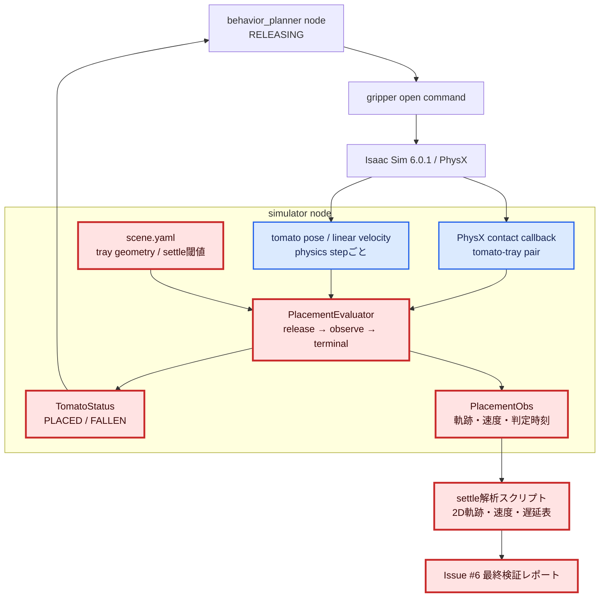
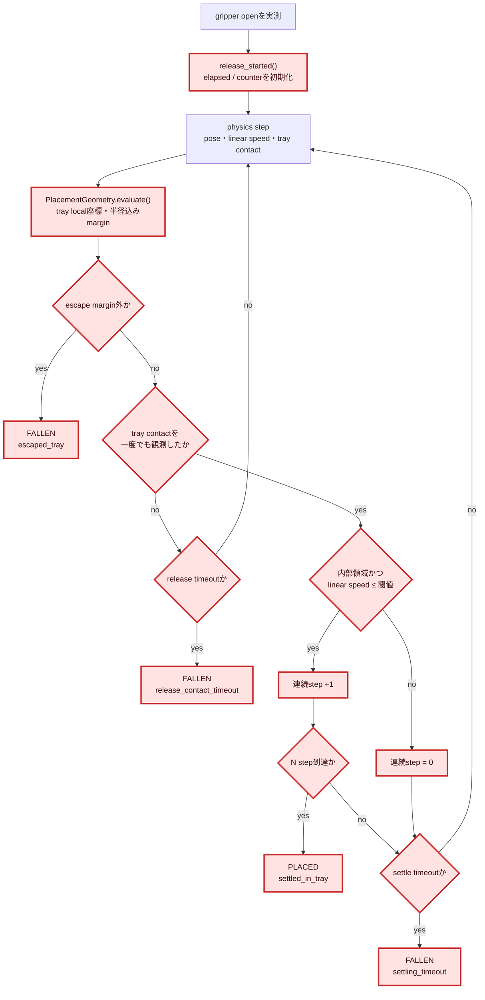
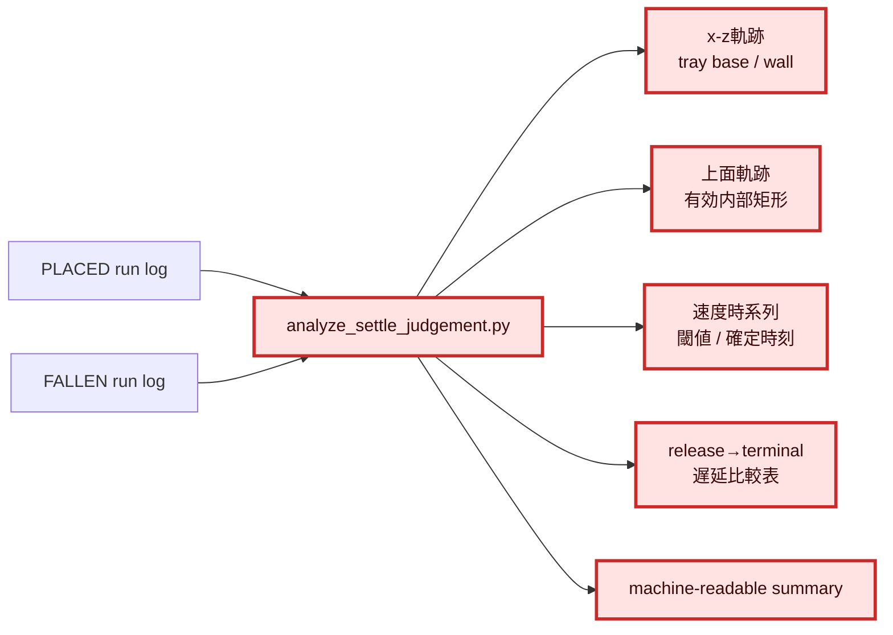
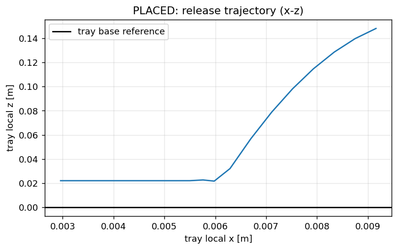
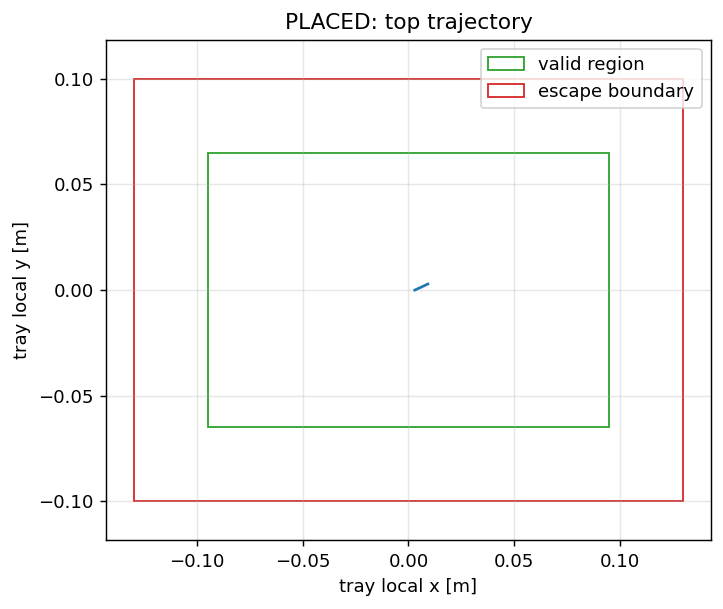
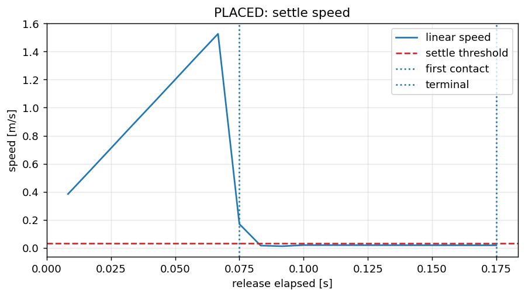
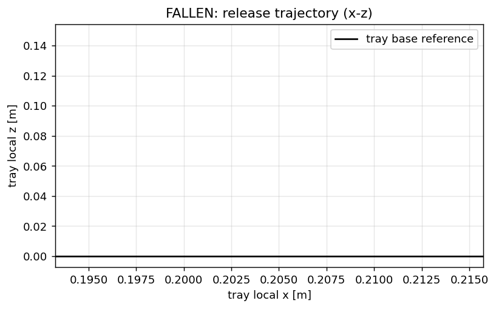
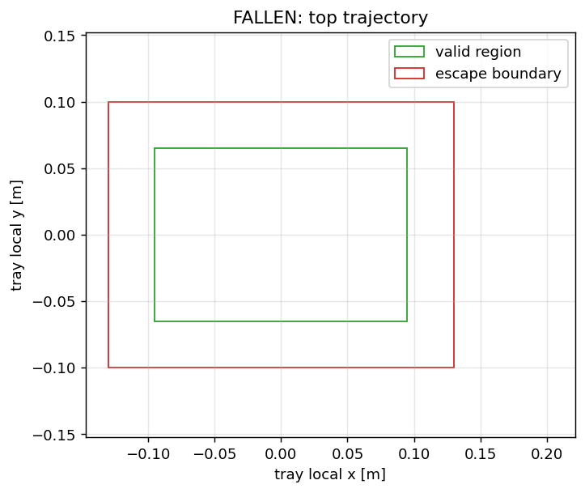
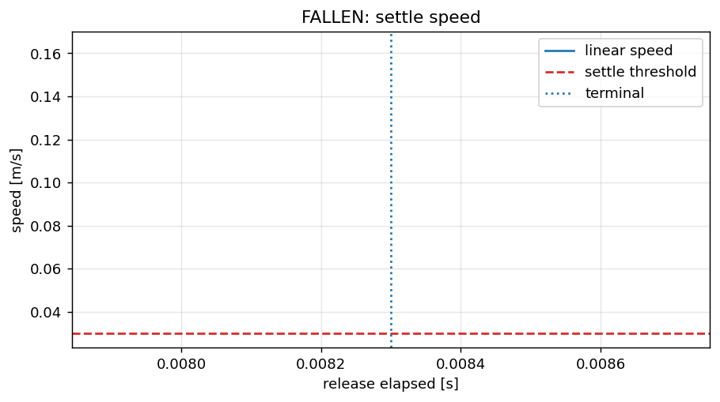
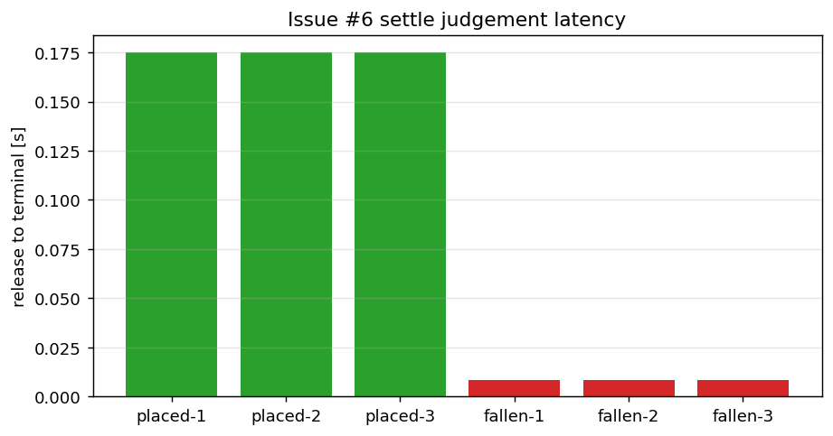

# 1. 全体アーキテクチャ

赤枠がIssue #6で変更または完成させるモジュール、青枠が再利用する既存経路である。



# 2. 変更モジュールの詳細変更アーキテクチャ

## 2.1 settle判定



## 2.2 検証・可視化



# 3. 検証目的

Issue #6の目的は、physics modeの`PLACED / FALLEN`をリリース瞬間のtool–tray距離で
即決せず、トマトの自由落下、接触、静止位置を観測して確定することである。

次を一つの評価で証明する。

- トレイ内では、落下中を`PENDING`として保持し、接触後の低速状態が連続した場合だけ
  `PLACED`になる。
- トレイ外、接触不能、または静止不能では、理由を区別して`FALLEN`になる。
- 判定遅延中もbehavior plannerが`RELEASING`で待機し、確定後に正しいphaseへ進む。
- success modeと既存の収穫経路を劣化させない。
- 軌跡、速度、判定時刻だけで人間が合否を判断できる証跡を残す。

# 4. 調査条件

- GitHub Issue: [#6](https://github.com/akodama428/trial_issac_sim/issues/6)
- 現行基準: `main` commit `06f515e`（2026-07-20確認）
- Isaac Sim: 6.0.1
- physics rate: 120 Hz（現行`OBSERVATION_PHYSICS_DT_SEC = 1/120`）
- 現行設定:
  - linear speed閾値: `0.03 m/s`
  - settle連続数: `12 step`（0.1秒）
  - tray contact待ち: `1.5秒`
  - contact後settle待ち: `3.0秒`
- Issue #4の摩擦保持とIssue #5の自然分離を前提とする。

# 5. 現行実装とIssue要件の差分

Issue #6の中核ロジックはcommit `b3d5cf1`（PR #51）で先行実装されている。
このため、重複実装せず、未証明の受け入れ条件と診断不足を埋める。

| 項目 | 現行 | Issue #6で必要な作業 |
|---|---|---|
| リリース開始 | success / physicsの両経路で`PlacementEvaluator`を開始 | 実測gripper openから開始することを統合testで固定 |
| 瞬時距離判定 | `PLACE_DISTANCE_M`は削除済み | physics modeで再導入されない回帰test |
| 内部領域 | tray local座標、tomato半径、boundary marginを考慮 | 内側、壁上、外側、境界ちょうどを明示的に追加 |
| 静止 | contact latch + 内包 + linear speedのN step | 高速sampleでcounter reset、閾値等号を固定 |
| FALLEN | escape、contact timeout、settle timeoutを実装済み | トレイ外GPU runと各reasonの証跡を追加 |
| behavior待機 | `RELEASING`はPLACED/FALLENまで待つ | 最大遅延とphase滞在時間を同一runで計測 |
| 観測ログ | `PlacementObs`に位置、速度、contact、elapsedあり | release marker、terminal marker、local marginを解析可能にする |
| 必須レポート | 未作成 | PLACED/FALLENの軌跡・速度・遅延表を生成 |
| success回帰 | settle経路を共有 | success modeの既存E2E無劣化を確認 |

# 6. 一次情報調査

## 6.1 確認済みの事実

- Isaac Sim 6.0.1のContact SensorはPhysX Contact Report APIを基盤とし、contact pair、
  position、normal、impulseを取得できる。新しい
  `isaacsim.sensors.experimental.physics.ContactSensor`はphysics stepごとに読む。
- Contact SensorはPhysXが静止接触のstreamingを止めてもpersistent contact dataを提供する。
  現行実装はsensorではなくraw callbackを使うため、接触を一度観測した事実をlatched
  stateとして保持する設計が必要であり、すでに採用されている。
- Isaac Simのphysics-based sensorはmassやvelocity等のphysics propertyへアクセスし、
  既定でphysics rateのground truthを出力する。
- OpenUSD `UsdPhysicsRigidBodyAPI`の`physics:velocity`はdistance/second、
  `physics:angularVelocity`はdegree/secondである。
- Isaac Simのphysics timestepは秒単位で設定可能であり、既定値に依存して
  「N step」を時間として固定してはいけない。現行評価は明示した1/120秒を用いる。

## 6.2 推論と設計への反映

- 判定入力はrender frameではなくphysics stepのpose、linear velocity、contactとする。
- `required_consecutive_steps`だけでなく、実時間
  `N × physics_dt`をログとレポートへ併記する。
- 球体の残留spinは位置静止と設置成否を必ずしも否定しないため、初回判定はlinear
  speedをgateとし、angular speedは診断系列として残す。採否はGPU runで明記する。
- raw contact callbackの欠落を単一stepの非接触と解釈せず、release cycle内の
  `contact_seen`をlatchする。reset時には必ず破棄する。
- tray内判定はworld軸固定矩形ではなく、tray poseのyawでlocal座標へ変換する。

## 6.3 参照した一次情報

確認日: 2026-07-20。

- NVIDIA Isaac Sim 6.0.1 Contact Sensor:
  https://docs.isaacsim.omniverse.nvidia.com/6.0.1/sensors/isaacsim_sensors_physics_contact.html
- NVIDIA Isaac Sim Physics-based sensors:
  https://docs.isaacsim.omniverse.nvidia.com/latest/sensors/isaacsim_sensors_physics.html
- NVIDIA Isaac Sim 6.0.1 Physics Simulation Fundamentals:
  https://docs.isaacsim.omniverse.nvidia.com/6.0.1/physics/simulation_fundamentals.html
- NVIDIA Isaac Sim 6.0.1 Conventions:
  https://docs.isaacsim.omniverse.nvidia.com/6.0.1/reference_material/reference_conventions.html
- OpenUSD `UsdPhysicsRigidBodyAPI`:
  https://openusd.org/release/api/class_usd_physics_rigid_body_a_p_i.html

# 7. 要求と機械判定

| ID | 要求 | 機械判定 |
|---|---|---|
| S5-R1 | releaseはterminal判定でなく監視開始である | release直後`PENDING` test |
| S5-R2 | 内部領域はtray寸法、tomato半径、margin、yawから導出する | geometry parameterized test |
| S5-R3 | contact後の低速状態がN step連続した場合だけPLACED | evaluator sequence test |
| S5-R4 | 壁上、外側、escape、timeoutはPLACEDにしない | negative unit/integration test |
| S5-R5 | physics modeで`PLACE_DISTANCE_M`を使用しない | source/behavior regression test |
| S5-R6 | 正常releaseで落下→tray contact→settle→PLACEDとなる | GPU E2E |
| S5-R7 | トレイ外releaseでFALLENとなる | GPU negative E2E |
| S5-R8 | terminal確定までbehavior plannerはRELEASINGに留まる | phase timeline assertion |
| S5-R9 | 判定遅延は設定上限内で、planner進行を阻害しない | latency table + timeout assertion |
| S5-R10 | success modeと既存testを劣化させない | regression suite |
| S5-R11 | PLACED/FALLEN双方の可視化証跡を残す | artifact existence/summary check |

総合PASSはS5-R1〜S5-R11をすべて満たす場合だけとする。

# 8. 実装計画

## Stage 0: baseline採取

1. Issue #5完了後のcommitを基準に固定する。
2. physics mode正常releaseを1回実行し、`PlacementObs`、phase遷移、tomato statusを保存する。
3. 現行ログからrelease時刻、初回tray contact、settle開始、terminal確定を復元できるか確認する。
4. 復元不能なfieldだけを追加する。判定ロジックを先に変更しない。

## Stage 1: pure geometry / state machine testの補完

TDDで次の境界を固定する。

- 有効内部領域の中心、内端の直前、境界ちょうど。
- boundary margin未満。
- tomato中心が壁上にある位置。
- escape marginちょうど、その直外。
- yaw 0度 / 90度 / 非直角。
- linear speedが閾値未満、等号、直上。
- N-1 / N step、途中の高速sampleによるcounter reset。
- contactなしrelease timeout、contact後settle timeout。
- terminal後の追加sampleが結果を変えない。
- reset後の次releaseが前cycleのcontact latchを継承しない。

境界の包含規則は「`margin >= boundary_margin`なら内側」、
「`margin < -escape_margin`なら即時escape」としてtest名に明記する。

## Stage 2: 観測契約の完成

`PlacementObs`または同等の構造化ログへ次を揃える。

- cycle ID、physics sequence、elapsed time
- release start、first tray contact、terminalのイベント
- world pose `x/y/z`
- tray local座標 `local_x/local_y/local_z`
- `margin_x/margin_y`
- linear speed、angular speed
- contact、settle counter
- decision、reason

同じ値を判定用とログ用に別計算せず、`PlacementResult`から出力する。

## Stage 3: GPUシナリオ

### PLACED

通常のphysics E2Eでトレイ中心上へ搬送し、openする。次を順序付きでassertする。

`release_started → falling(PENDING) → tray_contact → N-step settled → PLACED`

### FALLEN

評価専用入力でrelease位置をtrayのescape margin外へ移す。robot軌道の偶発失敗でなく、
releaseまでは正常で、release後の着地点だけが外側になる決定的シナリオにする。

`release_started → falling(PENDING) → escaped_tray または timeout → FALLEN`

本番設定を直接書き換えず、明示的なtest overrideを使う。PLACED/FALLENを最低3回ずつ
実行し、非決定性と遅延分布を記録する。

## Stage 4: 解析・グラフ生成

`scripts/analysis/analyze_settle_judgement.py`を追加し、ログから次を生成する。

```text
docs/reports/physics_levelup/assets/issue6/
  issue6_placed_trajectory_xz.png
  issue6_placed_trajectory_xy.png
  issue6_placed_speed.png
  issue6_fallen_trajectory_xz.png
  issue6_fallen_trajectory_xy.png
  issue6_fallen_speed.png
  issue6_settle_latency.png
  issue6_settle_summary.json
```

- x-z図: tray base上面とwall上端、release点、接触点、終点を重ねる。
- 上面図: tray内寸、tomato半径を除いた有効領域、boundary/escape marginを重ねる。
- 速度図: linear speed、`0.03 m/s`閾値、first contact、terminal時刻を重ねる。
- PLACEDとFALLENは同じ軸範囲・色規則で並べる。
- JSONには各runのrelease-to-contact、contact-to-terminal、release-to-terminal、
  decision、reason、最終local position、最大/終端速度を保存する。

## Stage 5: behavior planner・回帰評価

1. `RELEASING`進入からterminalまで同phaseに留まることを確認する。
2. simulatorの最大判定時間とbehavior側の待機条件を表にする。
3. `FALLEN_CONFIRM_STEPS=30`を含む失敗確定遅延も別に計測する。
4. unit/integration tests、physics E2E、success E2Eを実行する。
5. `git diff --check`、artifact参照、summary schemaを検査する。

# 9. テストマトリクス

| Test | 層 | mode | シナリオ | 期待結果 |
|---|---|---|---|---|
| T1 geometry inside/boundary | unit | - | 内側・境界 | contained |
| T2 wall/outside/escape | unit | - | 壁上・外側 | non-PLACED / escaped |
| T3 rotated tray | unit | - | yaw変更 | local判定が不変 |
| T4 N-step settle | unit | - | 接触・低速N step | NでのみPLACED |
| T5 counter reset | unit | - | 途中で高速 | counter 0 |
| T6 timeouts | unit | - | contactなし / 静止なし | reason付きFAILED |
| T7 reset | integration | physics | 2 release cycles | latch非継承 |
| T8 placed E2E | GPU | physics | tray内release ×3 | 全run PLACED |
| T9 fallen E2E | GPU | physics | tray外release ×3 | 全run FALLEN |
| T10 planner wait | GPU | physics | settle遅延 | RELEASING維持 |
| T11 success regression | GPU | success | 通常cycle | 完走・無劣化 |

# 10. 遅延予算

現行設定では正常系の上限を単純に`settle_timeout_sec`だけで評価しない。

| 区間 | 現行上限 / 条件 | 記録値 |
|---|---:|---|
| release → first tray contact | 1.5秒 | runごと |
| first contact → PLACED | 最大3.0秒、通常はN=12低速step | runごと |
| 連続静止確認 | 12 / 120 = 0.1秒 | 固定値と実測 |
| FALLEN連続確認 | behavior tick 30回 | tick周期と実測 |
| release → terminal | 経路別に算出 | min / median / max |

`RELEASING`には現在独立した成功timeoutがなく、simulatorがPLACEDまたはFALLENを
必ずterminal通知する構造である。評価では「待てるから問題なし」とせず、各timeout
経路でterminal通知が実際に届くことを確認する。

# 11. 最終レポートの必須構成

本書を実装後に更新し、次を計画節の後へ追記する。

1. PLACED / FALLENの総合PASS/FAILカード。
2. 並列配置したx-z軌跡。
3. 並列配置した上面軌跡とtray有効内部矩形。
4. 並列配置した速度時系列、閾値線、terminal marker。
5. releaseから判定確定までの遅延表。
6. phase timelineとbehavior planner待機結果。
7. unit / integration / GPU / success回帰結果。
8. `issue6_settle_summary.json`へのリンクと再生成手順。

グラフのタイトルと凡例だけで、期待領域、閾値、最終判定、合否が判別できるようにする。

# 12. リスクと対策

| リスク | 影響 | 対策 |
|---|---|---|
| 先行実装を重複して作り直す | 回帰・責務重複 | gapだけを実装し既存pure evaluatorを再利用 |
| raw callbackが静止接触を毎step出さない | 永久PENDING | contact_seen latchとreset test |
| wall上を内部と誤判定 | false PLACED | tomato半径込みmarginと境界test |
| tray外でもescape margin内で止まる | timeoutまで遅い | intended hysteresisとしてreason/遅延を記録 |
| render rateでsampleしてN stepの意味が変わる | 環境依存 | physics dtを入力・ログへ明示 |
| FALLEN試験が搬送失敗になる | settle機能を評価不能 | release位置だけを変える決定的fixture |
| angular spinで永久待機 | false FALLEN | linear speedを判定、spinは診断 |
| Issue #5作業中の差分と競合 | 誤ったbaseline | Issue #5完了commitからbranchを作成 |

# 13. 完了定義

- [x] Issue #5が完了し、自然分離後のreleaseを開始できる。
- [x] S5-R1〜S5-R9、S5-R11の機械判定がすべてPASSした。
- [x] S5-R10は承認済みスコープ例外としてIssue #76へ移管した。
- [x] 内側、壁上、外側、境界のunit testがある。
- [x] physics modeに瞬時tool距離判定がない。
- [x] PLACED / FALLENを各3回再現した。
- [x] release-to-terminal遅延が表になっている。
- [x] behavior plannerが判定待ちで誤遷移・永久停止しない。
- [x] 必須の6グラフとJSON summaryを生成した。
- [x] 本書を最終検証結果で更新し、statusを`review`へ変更した。
- [x] PRへ`Closes #6`を記載し、mainへのmerge時にIssueをcloseする。

# 14. 次ステップとの関係

Issue #6が完了すると、HELD、DETACHED、PLACED / FALLENの主要状態が、人工拘束や
瞬時距離ではなくPhysXの接触・破断・運動観測から確定できる。

次工程のIssue #7（physics mode統合検証）では、physics modeを10 cycle連続実行し、
摩擦、把持力、stem破断値、settle閾値の最終値と成功率を評価する。本Issueの
`issue6_settle_summary.json`と遅延分布を、その統合評価の配置成否とtimeout設計の
基準値として再利用する。

# 15. 実装・検証結果（2026-07-22）

## 15.1 総合判定

| 対象 | 結果 | 根拠 |
|---|---|---|
| physics PLACED | **PASS (3/3)** | 全runで`release_started → first_tray_contact → terminal/placed` |
| physics FALLEN | **PASS (3/3)** | 全runでtest override後の最初のphysics sampleに`escaped_tray` |
| behavior待機 | **PASS** | PLACED/FALLEN確定まで`RELEASING`を維持 |
| unit / integration | **PASS** | `387 passed, 2 skipped` |
| success mode回帰 | **別Issueへ移管** | release前の`GRASP_EVALUATION timeout`を[#76](https://github.com/akodama428/trial_issac_sim/issues/76)で追跡 |
| Issue #6 総合 | **PASS（承認済み例外あり）** | physics settle要件は全PASS。success mode復帰は#76へ分離 |

success modeの失敗はsettle監視開始前に発生した。`at_grasp → grasp_evaluation`後、
geometry fallbackで両finger contactを確立できず、約6秒後にtimeoutした。今回変更した
release後の`PlacementEvaluator`経路には入っていないため、Issue #6の配置判定とは
独立した既存success grasp経路の回帰課題として切り分けた。2026-07-22にユーザー承認の
うえ[#76](https://github.com/akodama428/trial_issac_sim/issues/76)を発行し、S5-R10を
Step 5の完了条件から除外するスコープ例外とした。physics modeのS5-R1〜S5-R9、S5-R11
はすべてPASSしているため、本書を`review`としてStep 5完了扱いにする。

## 15.2 軌跡・速度・遅延

### PLACED







### FALLEN







### 判定遅延



| Scenario | Run | release→contact [s] | contact→terminal [s] | release→terminal [s] | terminal speed [m/s] | 判定 |
|---|---:|---:|---:|---:|---:|---|
| PLACED | 1 | 0.0750 | 0.1000 | 0.1750 | 0.01766 | `settled_in_tray` |
| PLACED | 2 | 0.0750 | 0.1000 | 0.1750 | 0.01590 | `settled_in_tray` |
| PLACED | 3 | 0.0750 | 0.1000 | 0.1750 | 0.01737 | `settled_in_tray` |
| FALLEN | 1 | - | - | 0.0083 | 0.16350 | `escaped_tray` |
| FALLEN | 2 | - | - | 0.0083 | 0.16350 | `escaped_tray` |
| FALLEN | 3 | - | - | 0.0083 | 0.16350 | `escaped_tray` |

PLACEDのcontact後0.1000秒は`12 / 120 Hz`と一致した。FALLENは
`TOMATO_HARVEST_PLACEMENT_TEST_OFFSET_X_M=0.20`によりrelease直後のtomatoだけを
tray local x方向へ移し、搬送成功と着地点外れを分離して評価した。

## 15.3 phase timeline

| Scenario | Run | RELEASING滞在 [s] | 結果 |
|---|---:|---:|---|
| PLACED | 1 | 0.3798 | `PLACED → RETURNING_HOME → COMPLETE` |
| PLACED | 2 | 0.3770 | `PLACED → RETURNING_HOME → COMPLETE` |
| PLACED | 3 | 0.3707 | `PLACED → RETURNING_HOME → COMPLETE` |
| FALLEN | 1 | 0.4897 | 30 tick確認後`FAILED` |
| FALLEN | 2 | 0.5122 | 30 tick確認後`FAILED` |
| FALLEN | 3 | 0.4890 | 30 tick確認後`FAILED` |

simulator terminal後もbehavior側の`FALLEN_CONFIRM_STEPS=30`を適用するため、FALLENの
phase確定は約0.49〜0.51秒となった。いずれも有限時間で終端し、永久待機しなかった。

## 15.4 実装内容

- `PlacementResult`へcontact latchとevent markerを追加した。
- `PlacementObs`をcycle、physics sequence、world/local pose、margin、linear/angular
  speed、contact、settle counter、decision/reasonを持つ構造化ログへ拡張した。
- 境界等号、escape直外、速度閾値等号、terminal不変、release間resetをtestで固定した。
- `scripts/analysis/analyze_settle_judgement.py`を追加し、複数runの採点、7グラフ、
  machine-readable summaryを生成可能にした。
- FALLEN E2E専用の明示的offset overrideと、CIの期待placement切替を追加した。

## 15.5 証跡と再生成

- [machine-readable summary](assets/issue6/issue6_settle_summary.json)

```bash
python3 scripts/analysis/analyze_settle_judgement.py \
  --placed-log <placed-run-1.log> --placed-log <placed-run-2.log> \
  --placed-log <placed-run-3.log> \
  --fallen-log <fallen-run-1.log> --fallen-log <fallen-run-2.log> \
  --fallen-log <fallen-run-3.log> \
  --out-dir docs/reports/physics_levelup/assets/issue6
```

## 15.6 完了条件の実績

- [x] Issue #5完了後の自然分離releaseから評価した。
- [x] S5-R1〜S5-R9、S5-R11がPASSした。
- [x] 内側、壁上、外側、境界のunit testを追加した。
- [x] physics modeに瞬時tool距離判定がない。
- [x] PLACED / FALLENを各3回再現した。
- [x] release-to-terminal遅延を表にした。
- [x] behavior plannerの待機と有限終端を確認した。
- [x] success mode回帰を別Issue #76へ移管した（承認済みスコープ例外）。
- [x] 必須6グラフ、遅延図、JSON summaryを生成した。
- [x] 本書のstatusを`review`へ変更した。
- [x] Issue #6をclose可能なStep 5完了状態とした。
