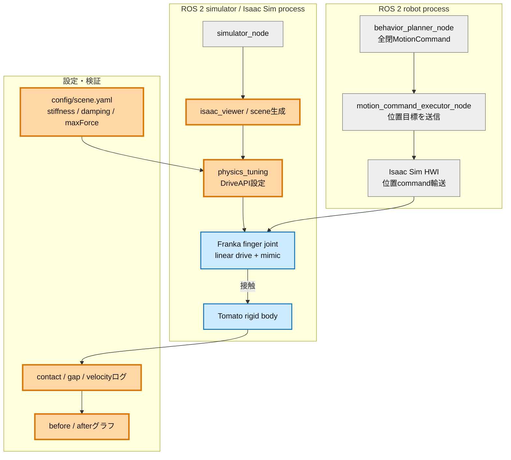
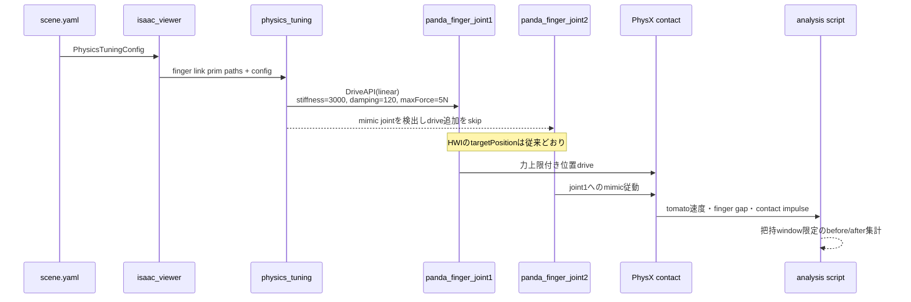
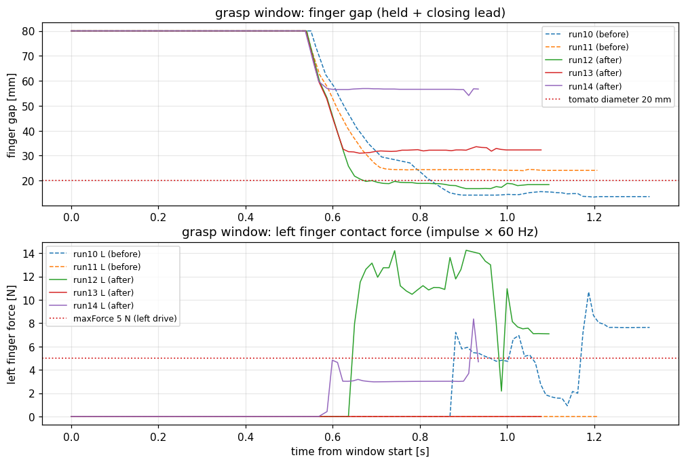

# Step 2検証レポート: finger駆動の力制御化

実施日: 2026-07-10（2026-07-13 Markdown・アーキテクチャ追補）  
対象: Issue #3 / `physics/step2-finger-force`

## 検証目的

位置目標を全閉`0.0 m`のまま維持しながら、finger driveの`maxForce`でトマトへの押付け力を制限できるか検証する。合格時の期待挙動は、トマトを弾き飛ばさず、finger gapが直径約`20 mm`で静定し、接触力が設定上限付近で飽和することである。

これは次のStep 3で人工grasp jointに頼らない摩擦保持へ進むための前提である。本検証で決めたdrive上限と、判明した把持位置ずれ・mimic拘束の課題をStep 3の入力とする。

## 改善対象を示す全体アーキテクチャ



橙色が今回の変更、青色が直接観測した物理対象、灰色が無変更である。変更ノードの大枠はIsaac Sim側であり、HWIとC++ executorは変更していない。

## PR変更差分の詳細アーキテクチャ



## 完了条件と判定

| 完了条件 | 実測結果 | 判定 |
|---|---|---|
| drive値を明示設定、HWI/C++無変更 | `scene.yaml`からjoint1へ適用。joint2はmimicを尊重 | PASS |
| 閉指令でトマトを弾かない | 閉じ込み区間に速度スパイクなし、E2E 5/5完走 | PASS |
| gapがトマト径近傍で静定 | run12で中央値`18.8 mm`。after再現率は1/3 | 部分実証 |
| 接触力がmaxForce近傍で飽和 | run14左指中央値`3.0 N`、p95 `6.2 N`。grasp joint成立時は拘束内力が混入 | 部分観測 |
| 既存テスト・success E2E無劣化 | unit 105件、before 2/2・after 3/3 | PASS |

## Before/After時系列グラフ



上段はfinger gapで、黒点線がトマト径`20 mm`である。after run12は`18.8 mm`近傍へ静定し、before run10の`14.8 mm`までのめり込みより改善した。下段は左finger接触力で、赤点線が`maxForce=5 N`である。run14は約`3 N`で平坦だが、run12は人工FixedJointの拘束反力が混入して上限を超える。

個別のトマト速度、gap、接触力の時系列は次の成果物に保存している。

- before: `img/run10_tomato_motion.png`、`img/run10_finger_gap.png`、`img/run10_contact_impulse.png`
- after: `img/run12_tomato_motion.png`、`img/run12_finger_gap.png`、`img/run12_contact_impulse.png`
- 全5 run: `img/run{10..14}_*.png`

## 把持windowの比較

| run | 条件 | gap中央値 [mm] | gap範囲 [mm] | 接触率 L/R | 解釈 |
|---|---|---:|---:|---:|---|
| 10 | before | 14.8 | 13.4–57.4 | 68% / 64% | 径より狭く、めり込み傾向 |
| 11 | before | 24.4 | 24.0–57.4 | 0% / 80% | 右片側接触 |
| 12 | after | **18.8** | 16.8–53.1 | 88% / 8% | トマト径近傍で静定 |
| 13 | after | 32.3 | 31.0–52.9 | 0% / 93% | 横ずれによる右片側接触 |
| 14 | after | 56.6 | 54.1–56.9 | 100% / 0% | 幾何fallbackでHELD、閉じ不足 |

## 接触力比較

接触力はcontact impulseをphysics周期`60 Hz`で換算した推定平均力であり、drive出力そのものではない。

| run | 条件 | 左中央値 [N] | 左p95 [N] | 右中央値 [N] |
|---|---|---:|---:|---:|
| 10 | before | 5.6 | 9.0 | 1.2 |
| 11 | before | 接触なし | 接触なし | 4.7 |
| 12 | after | 11.1 | 14.2 | 2.6 |
| 13 | after | 接触なし | 接触なし | 13.9 |
| 14 | after | **3.0** | **6.2** | 接触なし |

run12の上限超過は、HELD成立と同時に生成される人工FixedJointがトマトをhandへ溶接し、drive力以外の拘束反力がfinger接触へ混入するためである。したがって力飽和の確定試験はgrasp jointを生成しないStep 3で行う。

## 採用パラメータと根拠

| パラメータ | 採用値 | 根拠 |
|---|---:|---|
| `max_force_n` | `5.0 N` | トマト自重約`0.29 N`の17倍、Franka連続把持力`70 N`の約7%。beforeのめり込みを抑える安全側初期値 |
| `stiffness` | `3000 N/m` | 既定`400 N/m`では2 cm偏差時のばね力が8 Nで、上限へ確実に到達させる余裕が小さい |
| `damping` | `120 N·s/m` | 閉じ込み時の発振抑制。run14で目立つ振動がないことを確認 |

実アセットではjoint1に既存linear driveがあり、joint2は`PhysxMimicJointAPI`でjoint1へ従動する。joint2へdriveを追加すると二重拘束になるため、mimicを検出した場合は明示的にskipする。

## 結論と次ステップ

drive maxForceの設定機構、トマト速度の非悪化、E2E互換は合格した。gap静定と力飽和は個別runで改善を観測したが、把持位置のばらつきと人工grasp jointの拘束反力により再現性を確定できないため、総合判定は条件付き合格とする。

Step 3では次を実施する。

1. EEとgripper中心の約`1.4 cm`整列ずれを補正し、held中gap中央値`18–22 mm`を3/3で再現する。
2. grasp jointなしで両指接触を成立させ、接触力が5 N近傍で飽和することを再検証する。
3. joint2のmimic維持または独立drive化を、両指の力対称性を基準に判断する。

## 再現方法と成果物

- 設定: `config/scene.yaml`
- 適用: `src/tomato_harvest_sim/simulator/physics_tuning.py`
- 設定テスト: `src/tomato_harvest_sim/simulator/tests/test_scene_config_physics.py`
- 把持window分析: `scripts/plot_grasp_window.py`
- 生ログ: `docs/reports/data/{sim,robot}_run{10..14}.log.gz`
- 集計値: `docs/reports/img/step2_grasp_window_summary.json`

```bash
python3 scripts/plot_grasp_window.py
```
