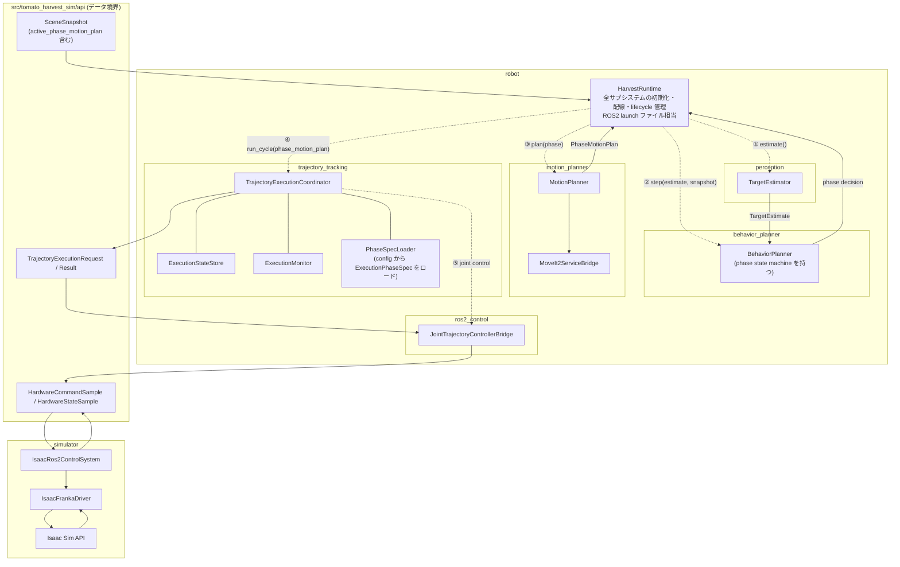
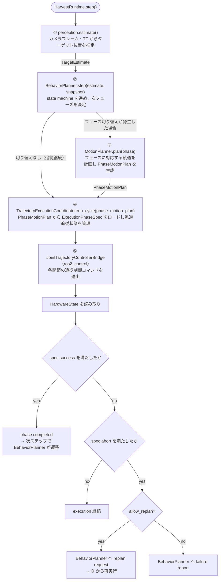

# Centralized Phase Execution Policy

## 目的
- `pregrasp / grasp / pull / place / home` の各フェーズについて、目標 pose、成功条件、timeout、abort、replan 条件を 1 箇所で定義する。
- `behavior_planner`、`trajectory_tracking`、`ros2_control`、`simulator` に分散している execution 意味論を整理し、責務境界を明確にする。
- `simulator` は Isaac Sim API の実現系に限定し、フェーズ判定や timeout 判定を持たない構成へ寄せる。

## 現状の問題
現状は各フェーズの execution 条件が複数箇所に分散している。

- `robot/runtime.py`
  - フェーズ遷移
  - `pregrasp` / `grasp` の成功判定
- `robot/trajectory_tracking/state_store.py`
  - snapshot から active target を再解釈
- `robot/trajectory_tracking/coordinator.py`
  - 実行 request の構成
- `robot/ros2_control/joint_trajectory_controller_bridge.py`
  - `goal_timeout`
  - `path_tolerance_violation`
  - controller 側の success / abort
- `simulator/scene_runtime.py`
  - `target_tool_pose`
  - waypoint 進行
  - pose tolerance

この構成だと次の問題が起こる。

- 同じフェーズに対して複数の成功条件が存在する。
- `phase goal` と `active waypoint` が同じ変数に押し込まれ、意味論が崩れる。
- timeout / abort のチューニング箇所が分散し、挙動変更の影響範囲が読めない。
- `runtime` が見ている目標と `trajectory_tracking` / `simulator` が追っている目標がずれる。
- `simulator` が execution policy を持ってしまい、責務境界が崩れる。

## 解決方針
各フェーズの execution 条件を `ExecutionPhaseSpec` に集約し、`trajectory_tracking` が config からロードする。上位計画（フェーズ管理・motion planning）と下位実行（軌道追従・到達判定）を分離する。

- `behavior_planner`
  - task の **phase state machine** を持つ。
  - `TargetEstimate` と `SceneSnapshot` と phase 実行結果から、フェーズ切り替えを判断する。
  - perception や `motion_planner` を直接呼ばない。行動決定のみを担い、計画実行は `runtime` が委譲する。
  - `PhaseExecutionIntent` は内部 artifact であり、境界 IF には出さない。
- `motion_planner`
  - `runtime` から呼ばれ、`BehaviorPlanner` が決定したフェーズに対応する `PhaseMotionPlan` を生成する。
  - MoveIt / 幾何計画 / `JointTrajectory` 生成を担当する。
- `runtime`
  - **robot システム全体のオーケストレーション層**。ROS2 の launch ファイルに相当する。
  - 各サブシステムを初期化・配線し、`step()` 内で以下を順に呼び出す。
    1. `perception.estimate()` → `TargetEstimate`
    2. `BehaviorPlanner.step(estimate, snapshot)` → フェーズ決定
    3. `MotionPlanner.plan(phase)` → `PhaseMotionPlan`
    4. `TrajectoryExecutionCoordinator.run_cycle(phase_motion_plan)` → 軌道追従・ros2_control 呼び出し
    5. （`ros2_control` は coordinator が内部で呼び出す）
  - phase state machine を持たない。`ExecutionPhaseSpec` の組み立てを行わない。
  - ビジネスロジック・判定ロジックを持たない。各サブシステムへの委譲のみ。
- `trajectory_tracking`
  - `PhaseMotionPlan` を受け取る。
  - `phase_id` をキーに config から `ExecutionPhaseSpec`（success / abort / replan 条件）をロードする。
  - 軌道追従制御と到達判定に集中する。
- `ros2_control`
  - `trajectory_tracking` が解釈した tolerance / timeout を controller semantics に適用する。
  - フェーズ名や収穫タスク状態は持たない。
- `simulator`
  - command を Isaac Sim に適用し、observation を返すだけに限定する。

## 変更後アーキ図

### コンポーネント構成とオーケストレーション

`HarvestRuntime` が全サブシステムを初期化・配線し、トップレベル関数を呼び出す（点線）。
サブシステム間のデータフローは実線で示す。



## フェーズ spec の責務
`ExecutionPhaseSpec` は 1 フェーズ分の execution contract を表す。

- 何を実行するか
- 何を success とみなすか
- どの条件で abort するか
- abort 後に replan するか

`TrajectoryExecutionCoordinator` は受け取った `PhaseMotionPlan` の `phase_id` をキーに、起動時に config からロードした `ExecutionPhaseSpec` を参照する。`BehaviorPlanner` / `runtime` は `ExecutionPhaseSpec` を組み立てない。

`PhaseSpecLoader`（`PhaseExecutionIntentBuilder` 相当）は `trajectory_tracking` 内部に置き、`yaml` から phase ごとの success / abort / replan 条件をロードする。正本は `yaml` とする。

## 提案する IF
`src/tomato_harvest_sim/robot/api` に次のような定義を置く。

```python
from dataclasses import dataclass
from enum import StrEnum

from tomato_harvest_sim.api.contracts import JointTrajectory, Pose3D


class PhaseId(StrEnum):
    MOVING_TO_PREGRASP = "moving_to_pregrasp"
    MOVING_TO_GRASP = "moving_to_grasp"
    PULL_TO_DETACH = "pull_to_detach"
    MOVING_TO_PLACE = "moving_to_place"
    RETURNING_HOME = "returning_home"


class PoseSemantics(StrEnum):
    TOOL_CENTER = "tool_center"
    GRASP_CENTER = "grasp_center"
    MOVEIT_LINK = "moveit_link"


class SuccessJudge(StrEnum):
    END_EFFECTOR_POSE = "end_effector_pose"
    JOINT_TRAJECTORY_COMPLETED = "joint_trajectory_completed"
    TOMATO_STATE = "tomato_state"


@dataclass(frozen=True)
class PhaseExecutionIntent:
    phase_id: PhaseId
    phase_goal_pose: Pose3D | None
    pose_semantics: PoseSemantics
    success: "SuccessPolicy"
    abort: "AbortPolicy"


@dataclass(frozen=True)
class PhaseMotionPlan:
    phase_id: PhaseId           # どのフェーズの計画か（coordinator が spec をロードするキー）
    phase_goal_pose: Pose3D | None
    active_waypoints: tuple[Pose3D, ...]
    joint_trajectory: JointTrajectory | None


@dataclass(frozen=True)
class SuccessPolicy:
    judge: SuccessJudge
    position_tolerance_m: float | None = None
    stable_steps: int = 1


@dataclass(frozen=True)
class AbortPolicy:
    nominal_timeout_sec: float | None = None
    stall_timeout_sec: float | None = None
    min_progress_delta_m: float | None = None
    joint_path_tolerance_rad: float | None = None
    allow_replan: bool = True


# trajectory_tracking 内部でのみ使用する（公開 IF ではない）
@dataclass(frozen=True)
class ExecutionPhaseSpec:
    phase_id: PhaseId
    intent: PhaseExecutionIntent    # config からロード（PhaseSpecLoader が生成）
    motion: PhaseMotionPlan         # coordinator が受け取った PhaseMotionPlan
```

## YAML 設定
`PhaseExecutionIntentBuilder` は phase ごとの execution 条件を `yaml` から読み込む。

- ここに置くもの
  - success judge
  - position tolerance
  - stable steps
  - nominal timeout
  - stall timeout
  - min progress delta
  - allow replan
  - pose semantics
- ここに置かないもの
  - goal pose
  - waypoint
  - `JointTrajectory`
  - MoveIt planning request の具体値

例:

```yaml
phases:
  moving_to_pregrasp:
    pose_semantics: tool_center
    success:
      judge: end_effector_pose
      position_tolerance_m: 0.03
      stable_steps: 1
    abort:
      nominal_timeout_sec: 3.0
      stall_timeout_sec: 0.5
      min_progress_delta_m: 0.005
      allow_replan: true

  moving_to_grasp:
    pose_semantics: grasp_center
    success:
      judge: end_effector_pose
      position_tolerance_m: 0.005
      stable_steps: 2
    abort:
      nominal_timeout_sec: 2.0
      stall_timeout_sec: 0.5
      min_progress_delta_m: 0.002
      allow_replan: true

  pull_to_detach:
    pose_semantics: grasp_center
    success:
      judge: tomato_state
    abort:
      nominal_timeout_sec: 2.0
      stall_timeout_sec: 0.5
      allow_replan: true

  moving_to_place:
    pose_semantics: tool_center
    success:
      judge: end_effector_pose
      position_tolerance_m: 0.05
      stable_steps: 1
    abort:
      nominal_timeout_sec: 3.0
      stall_timeout_sec: 0.5
      min_progress_delta_m: 0.005
      allow_replan: true
```

推奨配置:

```text
src/tomato_harvest_sim/robot/behavior_planner/config/phase_execution.yaml
```

## 重要な設計原則
### 1. `phase_goal_pose` と `active_waypoint_pose` を分ける
`phase_goal_pose` はフェーズ全体の最終目標であり、`active_waypoint_pose` は途中経由点である。  
今のように `target_tool_pose` 1 つに潰してはいけない。

### 2. success 判定は `ExecutionPhaseSpec` だけが決める
`behavior_planner`、`runtime`、`simulator`、`bridge` が独自に success を再定義しない。

### 3. abort 条件は `ExecutionPhaseSpec.abort` だけが決める
`goal_timeout`、`stall`、`path_tolerance_violation` の閾値は 1 箇所に集約する。

### 4. `simulator` は phase 判定を持たない
`scene_runtime` は active target を内部で決めず、受け取った command の適用と pose 同期だけを担当する。

## フェーズごとの spec 例
### `moving_to_pregrasp`
```text
phase_goal_pose:
  pregrasp_pose
active_waypoints:
  pregrasp_waypoints
joint_trajectory:
  pregrasp_joint_trajectory
success:
  judge=end_effector_pose
  position_tolerance_m=0.03
  stable_steps=1
abort:
  nominal_timeout_sec=trajectory_duration + margin
  stall_timeout_sec=0.5
  min_progress_delta_m=0.005
  allow_replan=true
```

### `moving_to_grasp`
```text
phase_goal_pose:
  grasp_pose
active_waypoints:
  grasp_waypoints
joint_trajectory:
  grasp_joint_trajectory
success:
  judge=end_effector_pose
  position_tolerance_m=0.005
  stable_steps=2
abort:
  nominal_timeout_sec=trajectory_duration + margin
  stall_timeout_sec=0.5
  min_progress_delta_m=0.002
  allow_replan=true
```

### `pull_to_detach`
```text
phase_goal_pose:
  pull_pose
success:
  judge=tomato_state
abort:
  nominal_timeout_sec=...
  stall_timeout_sec=...
  allow_replan=true
```

### `moving_to_place`
```text
phase_goal_pose:
  place_pose
success:
  judge=end_effector_pose
  position_tolerance_m=0.05
abort:
  nominal_timeout_sec=...
  stall_timeout_sec=...
  allow_replan=true
```

## 処理フロー

### HarvestRuntime.step() のオーケストレーション順序



## 変更後の責務分離
### `behavior_planner`
- task の **phase state machine** を持つ。
- `TargetEstimate` と `SceneSnapshot` と phase 実行結果から、次のフェーズへの切り替えを判断する。
- perception や `motion_planner` を**直接呼ばない**。行動決定のみを担い、計画・実行は `runtime` が委譲する。
- `PhaseExecutionIntent` は内部 artifact。`yaml` からロードするが、境界 IF には出さない。

### `motion_planner`
- `runtime` から呼ばれ、`BehaviorPlanner` が決定したフェーズに対応する `PhaseMotionPlan` を生成する。
- 幾何学的な target pose、waypoint、`JointTrajectory` を生成する。
- MoveIt を使った motion planning を担当する。
- `BehaviorPlanner` には依存しない（`runtime` を介してのみ呼ばれる）。

### `runtime`
- **robot システム全体のオーケストレーション層**。ROS2 の launch ファイルに相当する。
- 各サブシステムを初期化・配線し、`step()` 内で以下を順に呼び出す。
  1. `perception.estimate()` → `TargetEstimate`
  2. `BehaviorPlanner.step(estimate, snapshot)` → フェーズ決定
  3. フェーズ切り替え時のみ `MotionPlanner.plan(phase)` → `PhaseMotionPlan`
  4. `TrajectoryExecutionCoordinator.run_cycle(phase_motion_plan)` → 軌道追従・ros2_control 呼び出し
- lifecycle（boot / start / stop / reset）を管理する。
- ビジネスロジック・判定ロジック・phase state machine を持たない。`ExecutionPhaseSpec` を組み立てない。
- 各サブシステムへの委譲のみを行い、自身はデータを変換しない。

### `trajectory_tracking`
- `PhaseMotionPlan` を受け取る。
- `phase_id` から config の `ExecutionPhaseSpec`（success / abort / replan 条件）を内部でロードする。
- 軌道追従制御と到達判定に集中する。phase 固有の閾値をハードコードしない。

### `ros2_control`
- `ExecutionPhaseSpec` で与えられた tolerance / timeout を controller semantics に適用する。
- フェーズ名や収穫タスク状態は持たない。

### `simulator`
- state read / command write / debug 可視化だけを担当する。
- execution policy を持たない。

## `scene_runtime` の扱い
`scene_runtime` からは次を外すべきである。

- `MOTION_TARGET_TOLERANCE_M`
- `target_tool_pose` を success 判定に使う責務
- waypoint 進行を実行意味論として持つ責務

残してよいものは次だけである。

- debug 表示用の active target
- `robot_tool_pose` / `tomato_pose` / `gripper_closed` の scene 状態
- physics based な grasp / detach の scene 更新

つまり `scene_runtime` の active target は「可視化用 mirror」であり、execution owner ではない。

## 実装ステップ
1. `PhaseMotionPlan` に `phase_id: PhaseId` を追加する。
2. `BehaviorPlanner` に task の phase state machine を移植する（`HarvestRuntime` から）。
3. `BehaviorPlanner.step()` が `PhaseMotionPlan | None` を返す IF へ変更する（phase 切り替えがない場合は `None`）。
4. `trajectory_tracking` に `PhaseSpecLoader`（`PhaseExecutionIntentBuilder` 相当）を組み込む。
5. `TrajectoryExecutionCoordinator` の受け取り口を `PhaseMotionPlan` のみへ変更し、内部で `ExecutionPhaseSpec` を構成する。
6. `HarvestRuntime` から `ExecutionPhaseSpec` の組み立て処理を削除し、薄いオーケストレーション層へ簡略化する。
7. `state_store` の `target_pose` 中心設計を `phase_goal_pose` / `active_waypoint_pose` 分離へ変更する。
8. `scene_runtime.target_tool_pose` を execution の正本として使う設計をやめる。
9. `joint_trajectory_controller_bridge` の timeout / abort 判定を `ExecutionPhaseSpec.abort` 参照へ変更する。
10. `runtime` の `POSITION_TOLERANCE_M` / `GRASP_CLOSE_TOLERANCE_M` などの定数を削除し、`yaml` 由来の policy へ移す。

## この案の利点
- 各フェーズ条件が 1 箇所で読める。
- `pregrasp` と `grasp` の目標意味論が混ざらない。
- timeout と abort 条件の変更が追いやすい。
- replan の理由が phase spec と 1 対 1 に対応する。
- simulator を純粋な実現系へ戻せる。

## この案で最初に直すべき点
最優先は次の 3 点である。

1. `target_tool_pose` に `phase goal` と `active waypoint` を同居させている構造をやめる。
2. `grasp` フェーズの success / timeout / abort を `ExecutionPhaseSpec` へ集約する。
3. `scene_runtime` の tolerance 判定を execution owner から外す。

この 3 点が終わると、その後の `ros2_control` tuning や Cartesian servo 補正の議論が正しい責務境界の上でできるようになる。
