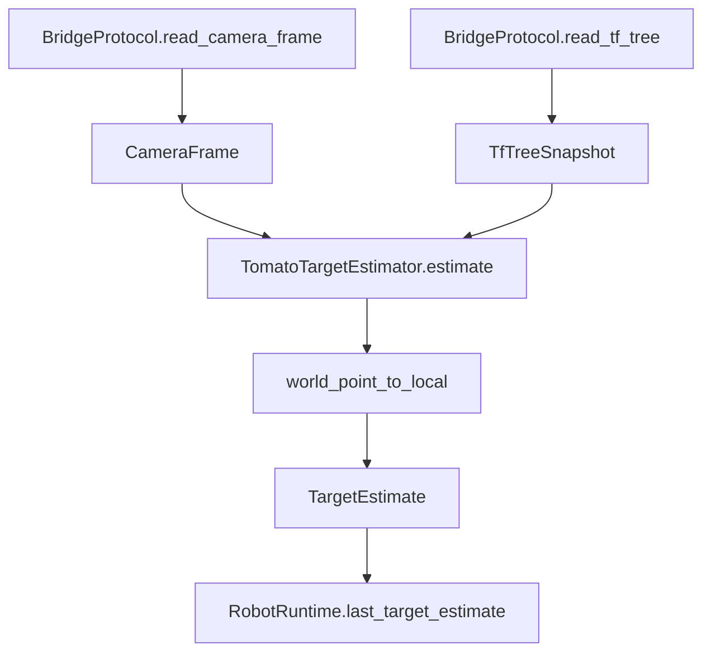

# Perception Detail

## 1. 入出力、振る舞い
### 入力信号
- `camera_frame: CameraFrame`: カメラ名、topic 名、camera pose、対象トマトの world pose を持つ入力。
- `tf_tree: TfTreeSnapshot`: robot base / camera / target の tf 情報。現実装では引数として受けるが、`TomatoTargetEstimator` 内では未使用。

### 出力信号
- `TargetEstimate`: 推定対象トマトの world pose、camera 座標系 pose、camera 名、信頼度を返す。

### モジュール内の処理概要
- `robot/api/perception.py` は `TargetEstimator` Protocol を定義し、perception 層の呼び出し契約を固定する。
- `robot/perception/target_estimator.py` の `TomatoTargetEstimator` は、`camera_frame.target_world_pose` を入力事実として扱い、`world_point_to_local()` で camera 座標系へ変換する。
- 信頼度は固定値 `0.99` を返す。
- 現実装は画像認識や複数候補比較を行わず、scene/runtime から与えられた target world pose を camera 座標へ射影し直す最小構成である。

## 2. モジュール内の構成
### アーキ図


### 制御フロー図
```mermaid
flowchart TD
  A[estimate(camera_frame, tf_tree)] --> B[target_world_pose を取得]
  B --> C[camera_pose を取得]
  C --> D[world_point_to_local で camera 座標へ変換]
  D --> E[target_camera_pose を生成]
  E --> F[confidence=0.99 を付与]
  F --> G[TargetEstimate を返す]
```

### サブモジュール
- `TargetEstimator`: runtime から見た perception の IF。
- `TomatoTargetEstimator`: 現在の具体実装。world pose を local pose へ変換する。
- `world_point_to_local`: 幾何変換ユーティリティ。perception 層の座標変換本体。

## 3. モジュールの要件
- camera frame から対象トマトの camera 座標系 pose を計算できること。
- 推定結果に `camera_name`、`target_world_pose`、`target_camera_pose`、`confidence` を含めること。
- planner には画像そのものではなく、幾何推定結果 `TargetEstimate` を渡すこと。
- 現実装では tf を受け取っても処理が破綻しないこと。
- 認識アルゴリズムが未実装でも、scene/runtime が与える既知 target pose を使って downstream を動かせること。

## 不明点
- `tf_tree` を将来どの段階で利用するかは実装上まだ固定されていない。
- `confidence=0.99` の根拠はコード上に明示されておらず、PoC 用の固定値と読むのが妥当。
