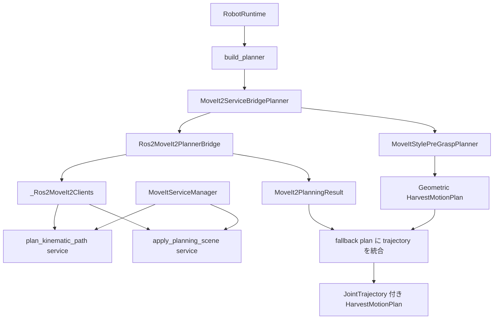
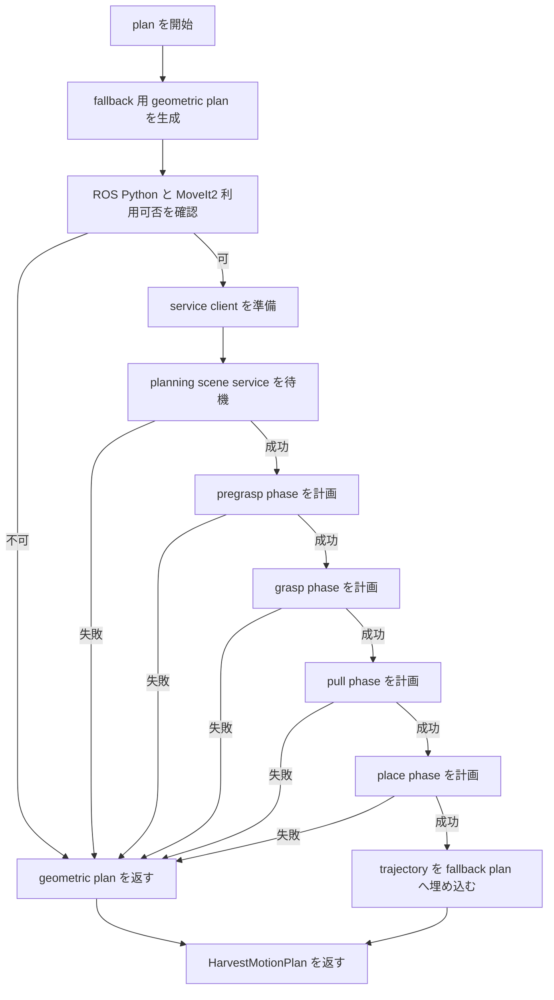

# Planner Detail

## 1. 入出力、振る舞い
### 入力信号
- `target_estimate: TargetEstimate`: perception が出した対象トマト推定。
- `joint_state: JointStateSnapshot`: planning 開始時点の関節角。
- `tf_tree: TfTreeSnapshot`: robot base frame など MoveIt request に必要な tf 情報。
- `scene_snapshot: SceneSnapshot`: branch、stem、tray、tomato の pose を持つ scene 状態。
- 環境変数:
  - `TOMATO_HARVEST_MOVEIT_SERVICE`
  - `TOMATO_HARVEST_MOVEIT_SCENE_SERVICE`
  - `TOMATO_HARVEST_MOVEIT_GROUP`
  - `TOMATO_HARVEST_MOVEIT_EE_LINK`
  - `TOMATO_HARVEST_MOVEIT_POSITION_TOLERANCE_M`
  - `TOMATO_HARVEST_MOVEIT_ORIENTATION_TOLERANCE_RAD`
  - `TOMATO_HARVEST_MOVEIT_ENFORCE_ORIENTATION`

### 出力信号
- `HarvestMotionPlan`: pregrasp / grasp / pull / place の pose と waypoint、および取得できた場合は phase ごとの `JointTrajectory` を返す。
- `PlannerBackendInfo`: planner backend 名と MoveIt2 利用可否を返す。
- `MoveIt2PlanningResult`: MoveIt 側 planning 成否、backend 名、phase ごとの trajectory、planning scene object ids を返す。

### モジュール内の処理概要
- `MoveItStylePreGraspPlanner` が target と tray から pose 系列と waypoint 系列を pure に組み立てる。
- `MoveIt2ServiceBridgePlanner` がその fallback plan を下敷きにし、MoveIt service bridge へ phase trajectory 生成を依頼する。
- `Ros2MoveIt2PlannerBridge` は planning scene を更新しながら `pregrasp -> grasp -> pull -> place` を順に計画する。
- MoveIt Python モジュールが使えない、service client が作れない、service が立っていない、各 phase 計画に失敗した、no-op trajectory が返る、といった場合は geometric plan のみを返す。
- `MoveItServiceManager` は必要時のみ `move_group` を自動起動する。

## 2. モジュール内の構成
### アーキ図

### 制御フロー図

### サブモジュール
- `MotionPlanner`: planner 層の公開 IF。
- `MoveItStylePreGraspPlanner`: target pose と tray pose から grasp sequence を幾何的に生成する pure planner。
- `MoveIt2ServiceBridgePlanner`: fallback plan と MoveIt trajectory を統合する adapter。
- `Ros2MoveIt2PlannerBridge`: planning scene 構築、MoveIt request 構築、service 呼び出しを担当する。
- `_Ros2MoveIt2Clients`: `rclpy` node と MoveIt service client を保持する ROS adapter。
- `MoveItServiceManager`: `move_group` の起動確認と自動起動を担当する。
- `ros_python.py`: `/opt/ros/.../site-packages` を `sys.path` に足して ROS Python module を解決する。

## 3. モジュールの要件
- perception が出した target と scene 状態から、pregrasp / grasp / pull / place の一連動作を planner として定義できること。
- MoveIt が使えない場合でも、幾何 pose/waypoint ベースの `HarvestMotionPlan` を返せること。
- MoveIt が使える場合は、各 phase の trajectory を phase 順に計画し、前 phase の終点関節角を次 phase の start state に使うこと。
- branch、stem、tray、tomato を planning scene へ反映して計画できること。
- pull/place phase では、トマトを end effector に attached collision object として扱えること。
- no-op trajectory を reject し、誤って「計画成功扱い」の静止 trajectory を downstream に流さないこと。
- `move_group` が未起動でも、必要時に自動起動して service backend を使えること。

## 不明点
- planner 選択は実質 MoveIt bridge 前提だが、別 planner backend を追加する切替戦略はまだない。
- `MoveItStylePreGraspPlanner` の各 offset は実装定数で、scene 条件に応じた自動調整はしていない。
