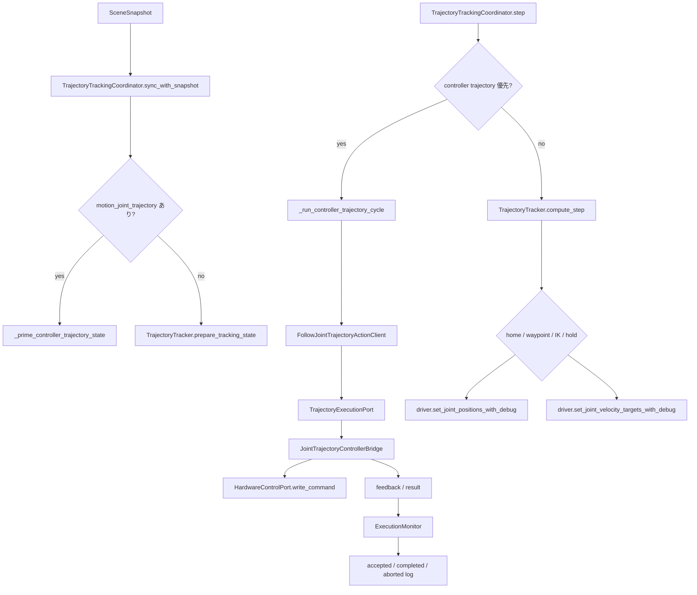
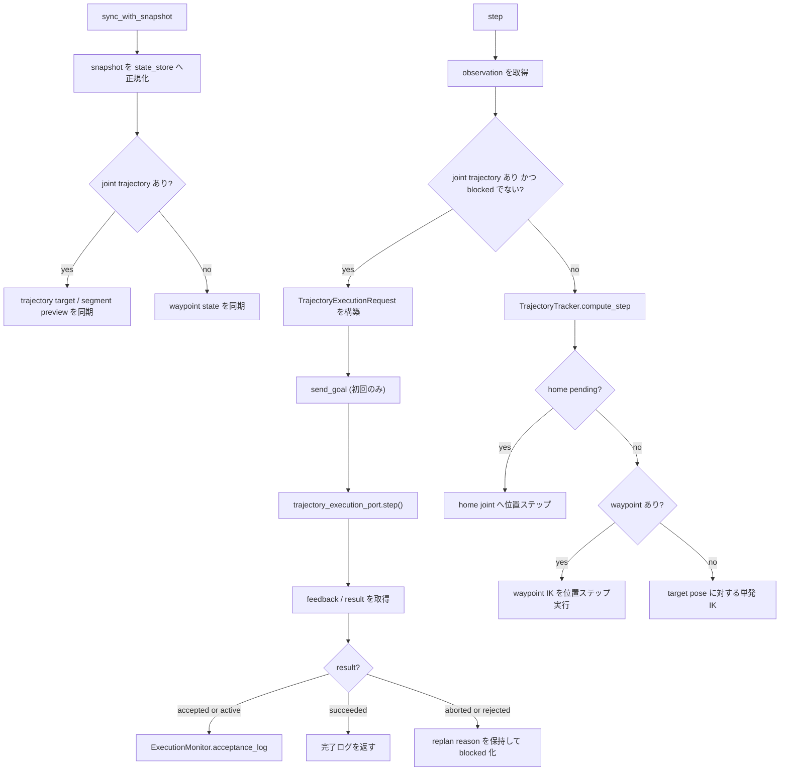

# Trajectory Tracking Detail

## 1. 入出力、振る舞い
### 入力信号
- `snapshot: SceneSnapshot`
  - planner が生成した `motion_joint_trajectory`
  - waypoint / target pose
  - gripper 状態
- `driver: FrankaExecutionDriverProtocol`
  - 現在 joint position / velocity
  - EE pose
  - IK
  - Isaac Sim 向け joint command 出力
- `hardware_control_port: HardwareControlPort`
  - trajectory 実行系が参照する read/write IF
- `trajectory_execution_port: TrajectoryExecutionPort`
  - `FollowJointTrajectory` 相当の goal / feedback / result IF
- 環境変数:
  - `TOMATO_HARVEST_DEBUG_TRAJECTORY`

### 出力信号
- `step()` の戻り値 `str | None`
  - accepted / completed / aborted / home / waypoint 実行ログ
- `FrankaMotionProgress`
- `consume_replan_request() -> str | None`
- 下位出力:
  - `trajectory_execution_port.send_goal()/step()/current_result()`
  - `driver.set_joint_positions_with_debug()`
  - `driver.set_joint_velocity_targets_with_debug()`

### モジュールの実際の振る舞い
- `TrajectoryTrackingCoordinator` が execution の入口であり、`joint trajectory` がある場合は controller 実行経路を最優先する。
- `TrajectoryTracker` は home 復帰、waypoint IK、単発 IK、replan 中 hold のみを担当する。
- `JointTrajectoryControllerBridge` は in-process の `joint_trajectory_controller` 相当として、時間補間、tolerance 判定、goal result 生成を担当する。
- coordinator は controller 側の `active_segment_index` を state に反映し、debug 表示と進捗追跡を同期する。
- trajectory abort 後は waypoint IK へ即フォールバックせず、`blocked_motion_signature` を立てて replanning を待つ。

## 2. モジュール内の構成
### アーキ図

### 制御フロー図

### サブモジュール
- `coordinator.py`
  - controller trajectory と tracker 系処理の切り替えを行う。
- `execution_monitor.py`
  - controller の feedback / result を user-facing log に変換する。
- `action_client.py`
  - `TrajectoryExecutionPort` を `FollowJointTrajectory` 相当の呼び口として束ねる。
- `tracker.py`
  - home、waypoint IK、単発 IK、replan hold を担当する。
- `reference_tracking.py`
  - segment 生成と trajectory reference sampling の pure 関数群。

## 3. モジュールの要件
- `motion_joint_trajectory` がある場合は、waypoint IK より controller trajectory を優先すること。
- trajectory 実行の成否判定は `trajectory_execution_port` 側に集約し、`trajectory_tracking` 側で二重管理しないこと。
- abort 時は同一 motion signature を blocked にし、planner へ replan を要求すること。
- home / waypoint / 単発 IK の fallback 経路は controller trajectory が使われない場合に限って動くこと。
- trajectory 実行中も gripper 状態を維持すること。
- active segment index を state に反映し、debug 可視化から現在進捗を追えること。

## 補足
- 現在の `robot/ros2_control` は外部 ROS ノード群ではなく、`HardwareControlPort` 上で `joint_trajectory_controller` の意味論を再現する in-process bridge として実装している。
- そのため標準 API の境界は維持しつつ、controller の更新周期そのものはこの Python プロセス内で進む。
