# ros2_control モードにおけるグリッパー制御 設計案

---

## 全体アーキテクチャ（変更前・現状）

`CENTRALIZED_PHASE_EXECUTION_POLICY.md` が対象とする `behavior_planner` / `trajectory_tracking` /
`ros2_control` / `simulator` の範囲において、**最新実装**を反映した全体構成図。

### コンポーネント構成図

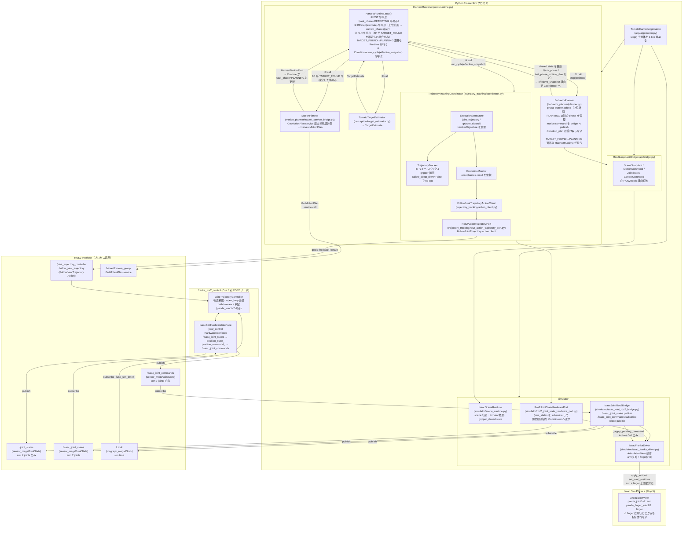

### 1 tick シーケンス（ros2_control モード）

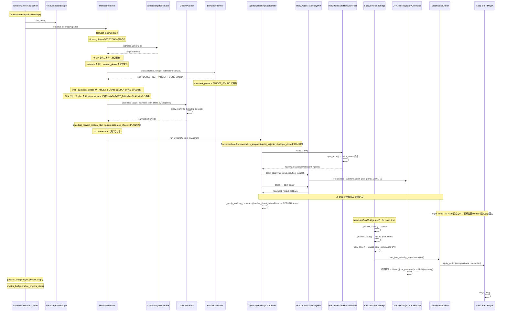

### グリッパー制御の詰まり箇所（問題の要約）

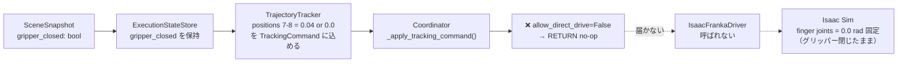

---

## 問題背景

ros2_control バックエンド導入時に `TrajectoryTrackingCoordinator` へ
`allow_direct_drive=False` を設定した。これは C++ `JointTrajectoryController (JTC)` と
Python ドライバーの直接書き込みが arm joints (indices 0–6) で競合するのを防ぐための修正。

しかし finger joints (indices 7–8, `panda_finger_joint1/2`) は JTC の制御対象外
（URDF には含まれない）にもかかわらず、同じ no-op ブランチに入ってしまう。
結果として finger joints がゼロ位置（closed = 0.0 rad）のまま固定され、
把持フェーズでグリッパーが開かない。

---

## 関節インデックス割付

| index | joint name | 制御者 |
|---|---|---|
| 0–6 | panda_joint1 〜 panda_joint7 | C++ JTC |
| 7 | panda_finger_joint1 | **現在誰も制御していない** |
| 8 | panda_finger_joint2 | **現在誰も制御していない** |

---

## 現状データフロー（問題あり）

### グリッパー指令パス（詰まっている）

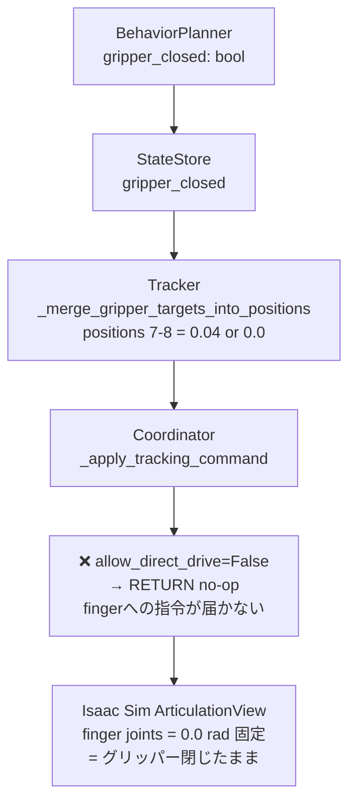

### アームパス（正常）

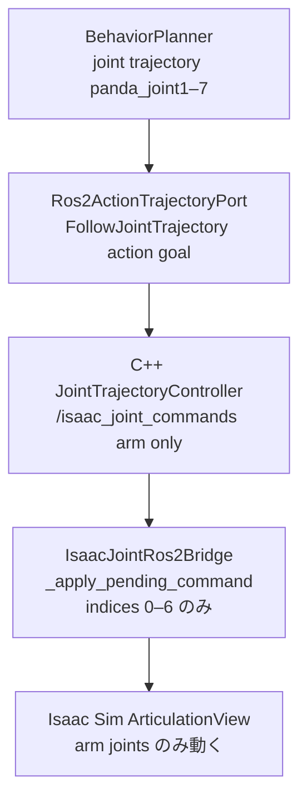

---

## Option A: Coordinator 内で finger を直接ドライブ

### 概要

`allow_direct_drive=False` のままで arm joints[0–6] への書き込みは引き続き no-op にする。
Coordinator に `allow_gripper_direct_drive` フラグを追加し、
`_apply_tracking_command()` が TrackingCommand から finger 部分（indices 7–8）だけを
抜き出して `IsaacFrankaDriver` へ直接書き込む。

JTC は arm のみを管理するため、finger への直接書き込みと競合しない。

### アーキテクチャ図

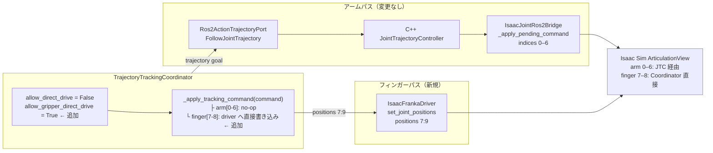

### データフロー

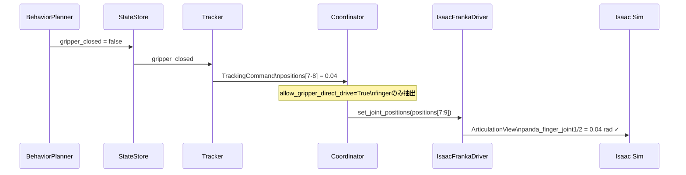

### 実装変更範囲

| ファイル | 変更内容 |
|---|---|
| `coordinator.py` | `allow_gripper_direct_drive: bool = True` パラメータ追加 `_apply_tracking_command()` に finger-only 書き込みパス追加 |
| `isaac_franka_driver.py` | 既存 `set_joint_positions_with_debug()` をそのまま利用（positions[7:9] だけ渡す） |
| `isaac_viewer.py` | 変更不要（デフォルト `True` を維持） |

### メリット・デメリット

| | 内容 |
|---|---|
| ✅ | 変更ファイルが最小（coordinator.py のみ実質変更） |
| ✅ | JTC との競合なし（finger は JTC 管理外） |
| ✅ | gripper_closed の真実が StateStore に一元化されたまま |
| ✅ | Tracker の step_toward_joint_positions 補間ロジックをそのまま再利用 |
| ⚠️ | Coordinator が Isaac Sim API を間接的に呼ぶ（レイヤー越え残存） |
| ⚠️ | `allow_direct_drive` / `allow_gripper_direct_drive` の 2 フラグが似た名前で混乱しやすい |

---

## Option B: IsaacJointRos2Bridge がグリッパーを管理

### 概要

グリッパー制御を Coordinator から完全に切り離し、`IsaacJointRos2Bridge` が
gripper_closed シグナルを受け取り、`step()` ごとに finger joints を直接ドライブする。

シグナルの受け渡しには `GripperStateHolder`（共有参照）を新設する（B-1案）。
または ROS2 topic `/gripper_command` で伝達する（B-2案）。

### アーキテクチャ図（B-1: 共有参照）

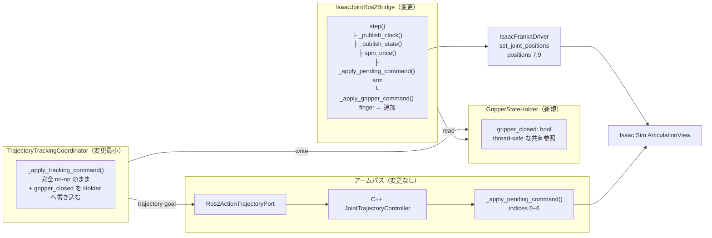

### データフロー（B-1: 共有参照）

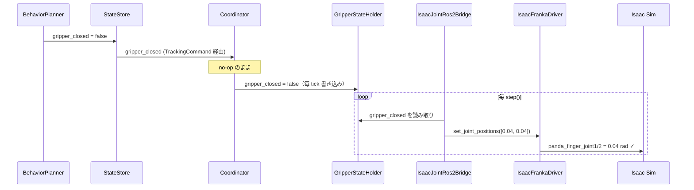

### データフロー（B-2: ROS2 topic）

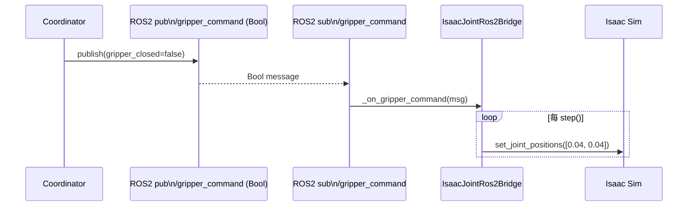

### 実装変更範囲

| ファイル | 変更内容 |
|---|---|
| `coordinator.py` | `_apply_tracking_command()` から GripperStateHolder へ `gripper_closed` を書き込む処理追加 |
| `isaac_joint_ros2_bridge.py` | `GripperStateHolder` 参照を受け取り `_apply_gripper_command()` メソッド追加 `step()` 末尾で呼び出し |
| `isaac_viewer.py` | `GripperStateHolder` インスタンスを生成し Coordinator と Bridge 両方へ渡す |
| `gripper_state_holder.py`（新規） | `GripperStateHolder` dataclass（1 ファイル） |

### メリット・デメリット

| | 内容 |
|---|---|
| ✅ | Coordinator が Isaac Sim API を一切呼ばない（レイヤー境界が明確） |
| ✅ | グリッパー制御が Bridge 内に集約される |
| ✅ | 将来 Franka gripper action server への差し替えが容易 |
| ⚠️ | 新しい通信チャネル（Holder または topic）が必要 |
| ⚠️ | 変更ファイル数が Option A より多い（3–4 ファイル） |
| ⚠️ | `gripper_closed` が StateStore と GripperStateHolder の 2 箇所に存在（同期ズレリスク） |
| ⚠️ | Tracker の step_toward_joint_positions 補間が使えない（Bridge 側で独自実装が必要） |

---

## 比較まとめ

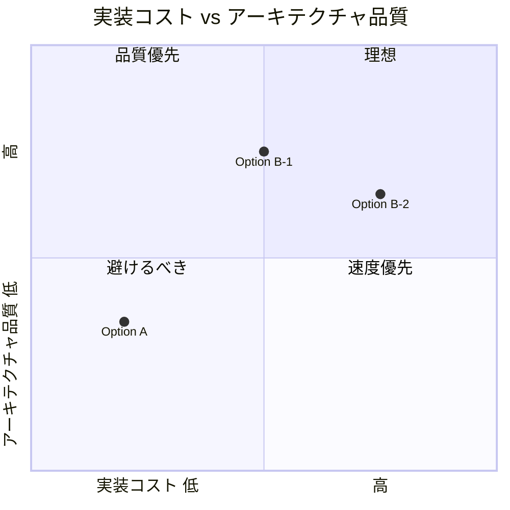

| 観点 | Option A | Option B-1 | Option B-2 |
|---|---|---|---|
| 変更ファイル数 | 1 | 3–4 | 3–4 |
| レイヤー境界 | finger のみ越える（残存）| 明確 | 明確 |
| gripper 補間ロジック再利用 | ✅ そのまま | ❌ 独自実装必要 | ❌ 独自実装必要 |
| gripper_closed の単一真実 | ✅ StateStore のみ | ⚠️ Holder と二重 | ⚠️ Holder と二重 |
| 将来 franka_gripper 差し替え | ❌ 難しい | ✅ 容易 | ✅ 容易 |
| 実装コスト | 低 | 中 | 高 |

**推奨**: 当面の動作確認を優先するなら **Option A**。
アーキテクチャの境界を重視するなら **Option B-1（共有参照）**。
