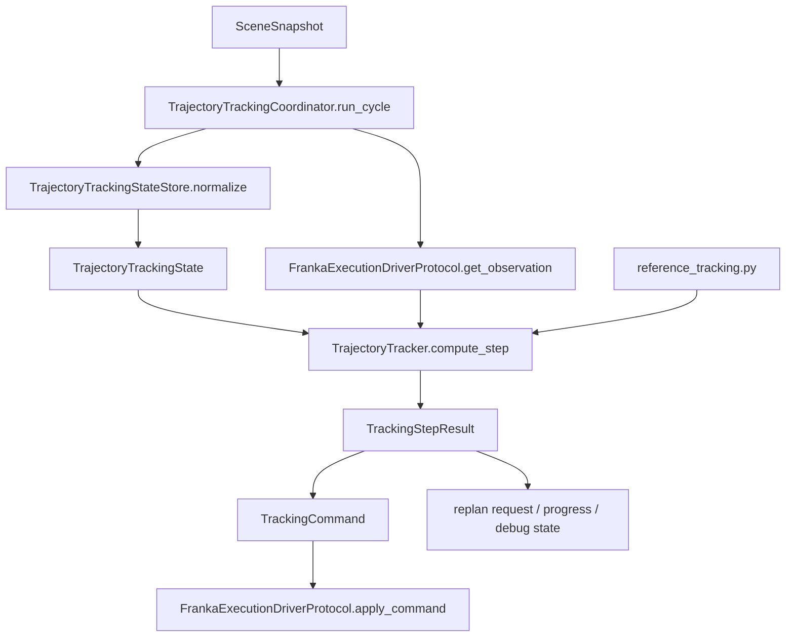
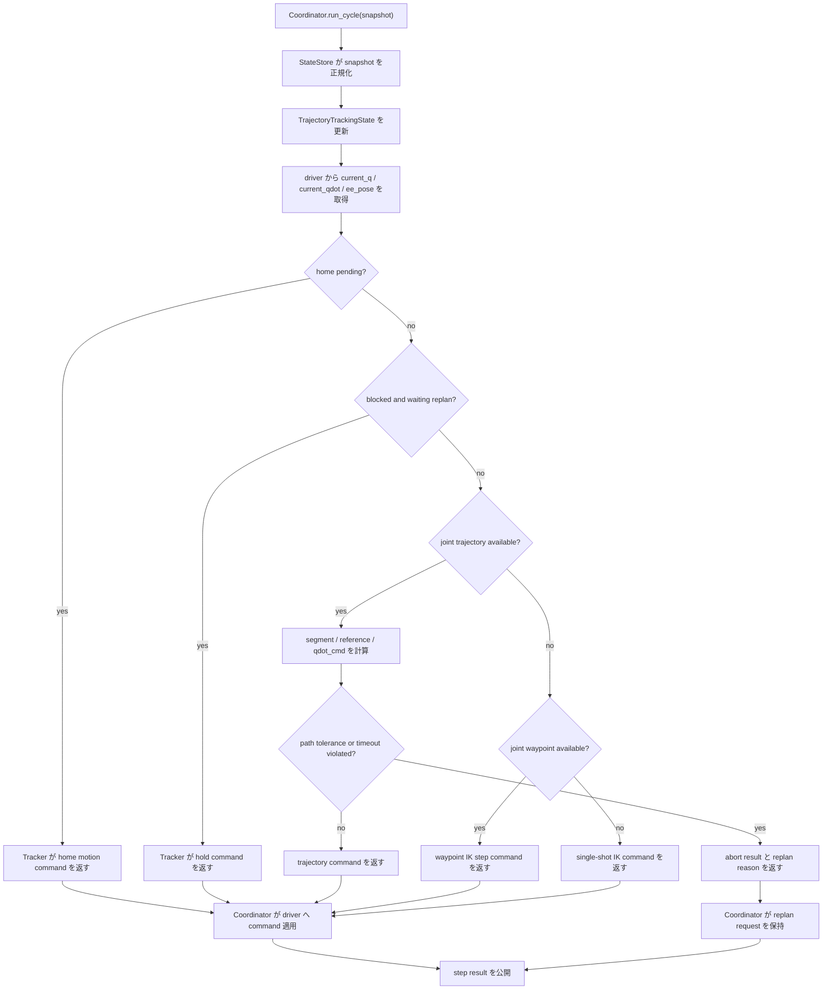

# Trajectory Tracking Refactor Plan

## 目的
- `trajectory_tracking` から「状態同期」と「制御実行」を分離する。
- `SceneSnapshot` 取り込みと `step()` 実行が同じクラスに同居している現状を解消する。
- 最終的に、trajectory tracking を `状態正規化 -> 制御計算 -> 実行調停` の 1 方向依存に整理する。

## 現状の問題
- `FrankaTrajectoryExecutionManager` が以下の責務を 1 クラスで持っている。
  - `SceneSnapshot` の解釈
  - waypoint / trajectory / home / replan の内部状態保持
  - IK / trajectory tracking の制御則
  - driver command 出力
  - debug / preview path の補助
- そのため、外部から見た入口が `sync_with_snapshot()` と `step()` の 2 つに分かれている。
- この 2 入口構造は、モジュール境界が崩れていることを図の上でも露呈させている。
- `trajectory_tracking` が controller ではなく、`snapshot adapter + state machine + tracker + executor` の塊になっている。

## リファクタ方針
- `SceneSnapshot` から tracking 用内部状態を作る層を独立させる。
- tracker 本体は「現在の tracking state」と「driver readback」だけを入力にして、1 周期分の制御出力を返す pure 寄りの責務へ縮める。
- simulator loop から見た調停役を別モジュールに出し、`snapshot 更新 -> driver readback -> tracker 実行 -> command 出力` を 1 箇所で統括する。
- 最終形では、外部から見える trajectory tracking の入口を `1 cycle = 1 call` に揃える。
- 既存の `reference_tracking.py` は pure 計算層として維持し、上位の stateful ロジックだけを分割する。

## 最終アーキテクチャ
### モジュール分割
- `trajectory_tracking/state_store.py`
  - `SceneSnapshot` を tracking 用 state に正規化する。
  - motion signature、waypoint、trajectory、home pending、blocked state を保持する。
- `trajectory_tracking/tracker.py`
  - tracking state と driver readback をもとに、1 step 分の制御決定を行う。
  - trajectory execution / waypoint IK / single-shot IK / home motion の分岐を担当する。
- `trajectory_tracking/coordinator.py`
  - 外部公開入口。
  - `run_cycle(snapshot) -> tracker 実行 -> replan request 管理 -> debug 出力` をまとめる。
- `trajectory_tracking/reference_tracking.py`
  - 現状維持。
  - pure 計算として segment 生成、reference 生成、qdot 計算を担当する。
- `robot/api/trajectory_tracking.py`
  - state / command / tracker result の IF を追加定義する。

### 外部公開形
- 最終的に simulator loop が呼ぶのは `TrajectoryTrackingCoordinator.run_cycle(snapshot)` だけにする。
- `run_cycle()` の内部で、state store 更新、driver readback 取得、tracker 実行、driver command apply を完結させる。
- 移行期間だけ `update_snapshot()` / `step()` の薄い adapter を残してよいが、最終アーキ図には出さない。

### 最終アーキ図

### 依存ルール
- `coordinator -> state_store, tracker, robot/api`
- `state_store -> robot/api, api/contracts`
- `tracker -> reference_tracking, robot/api, api/contracts`
- `reference_tracking -> robot/api, api/contracts`
- `tracker -> planner` は禁止
- `state_store -> driver` は禁止

## 最終制御フロー

## 詳細設計
### 1. `TrajectoryTrackingStateStore`
- 入力:
  - `SceneSnapshot`
- 出力:
  - `TrajectoryTrackingState`
- 責務:
  - snapshot から target pose、motion waypoints、joint trajectory、gripper 状態を抽出する。
  - `SceneSnapshot` の生データを controller が直接読まなくてよい形へ正規化する。
  - `cycle_id` と `ScenePhase` を見て home pending を立てる。
  - blocked motion signature の解消判定を行う。
- 持つべき state 例:
  - `target_pose`
  - `motion_waypoints`
  - `joint_trajectory`
  - `joint_waypoint_targets`
  - `joint_trajectory_segments`
  - `home_pending`
  - `blocked_motion_signature`
  - `pending_replan_reason`
  - `gripper_closed`

### 2. `TrajectoryTracker`
- 入力:
  - `TrajectoryTrackingState`
  - `ObservationData`
- 出力:
  - `TrackingStepResult`
- 責務:
  - どの制御モードを使うか決める。
  - home / hold / joint trajectory / waypoint IK / single-shot IK の 1 周期分 command を返す。
  - trajectory abort 条件を評価し、abort なら command と reason を返す。
- tracker が返すもの:
  - `TrackingCommand`
  - `reached`
  - `replan_reason`
  - `progress`
  - `debug_snapshot`

### 3. `TrajectoryTrackingCoordinator`
- 外部から見える唯一の stateful 入口にする。
- 公開メソッド候補:
  - `run_cycle(snapshot: SceneSnapshot) -> str | None`
  - `consume_replan_request() -> str | None`
  - `current_end_effector_pose() -> Pose3D | None`
  - `current_joint_state_snapshot() -> JointStateSnapshot | None`
- 責務:
  - `StateStore` と `Tracker` と `Driver` の配線。
  - `Driver.get_observation() -> ObservationData` を使って 1 周期分の観測を取得する。
  - tracker result を driver command に落とす。
  - simulator loop から見た `1 cycle` を完結させる。

### 4. 移行期間の互換層
- 既存 loop との差分を最小化するため、移行期間だけ `update_snapshot()` / `step()` を `run_cycle()` の facade として残してよい。
- ただしこの facade は simulator 互換のためだけに存在し、trajectory tracking の本来の公開設計ではない。
- 互換層を消せる状態になったら `execution.py` は削除し、`coordinator.py` を正式入口にする。

## 実装ステップ
1. `robot/api/trajectory_tracking.py` に `TrajectoryTrackingState`、`ObservationData`、`TrackingCommand`、`TrackingStepResult` を追加する。
2. `execution.py` から snapshot 解釈部分を切り出し、`state_store.py` を新設する。
3. `execution.py` から制御分岐部分を切り出し、`tracker.py` を新設する。
4. `execution.py` は `coordinator.py` に置き換え、最終的に `run_cycle(snapshot)` のみを公開する。
5. `isaac_viewer.py` は coordinator のみを呼ぶようにする。
6. debug visualization は state store / tracker result を参照する形に変更する。
7. テストを
   - state_store 単体
   - tracker 単体
   - coordinator 結合
   に分割する。

## テスト方針
- `state_store`:
  - snapshot から target / waypoint / trajectory が正しく正規化されること。
  - cycle 変化で home pending が立つこと。
  - blocked motion signature の解消判定が正しいこと。
- `tracker`:
  - trajectory available 時は trajectory command が返ること。
  - trajectory abort 時は replan reason が返ること。
  - waypoint only 時は IK step command が返ること。
  - target なし時は gripper hold / no-op が返ること。
- `coordinator`:
  - `run_cycle(snapshot)` で driver command が出ること。
  - replan request が consume できること。
  - debug / progress API が従来どおり使えること。

## 期待効果
- 外から見た入口が `Coordinator.run_cycle(snapshot)` の 1 つに揃い、`SceneSnapshot` と制御本体の関係が明確になる。
- `trajectory_tracking` の中で state 正規化と制御則を別々にレビューできる。
- trajectory abort 条件や qdot 制御則の変更が tracker 単体で閉じる。
- simulator loop 依存の調停ロジックが coordinator に閉じ、robot 制御アルゴリズムの境界が見えやすくなる。

## 補足
- これは構造リファクタであり、まず責務分離を優先する。
- 速度制御則そのものの改善は、この責務分離後に tracker 層へ限定して進める。
