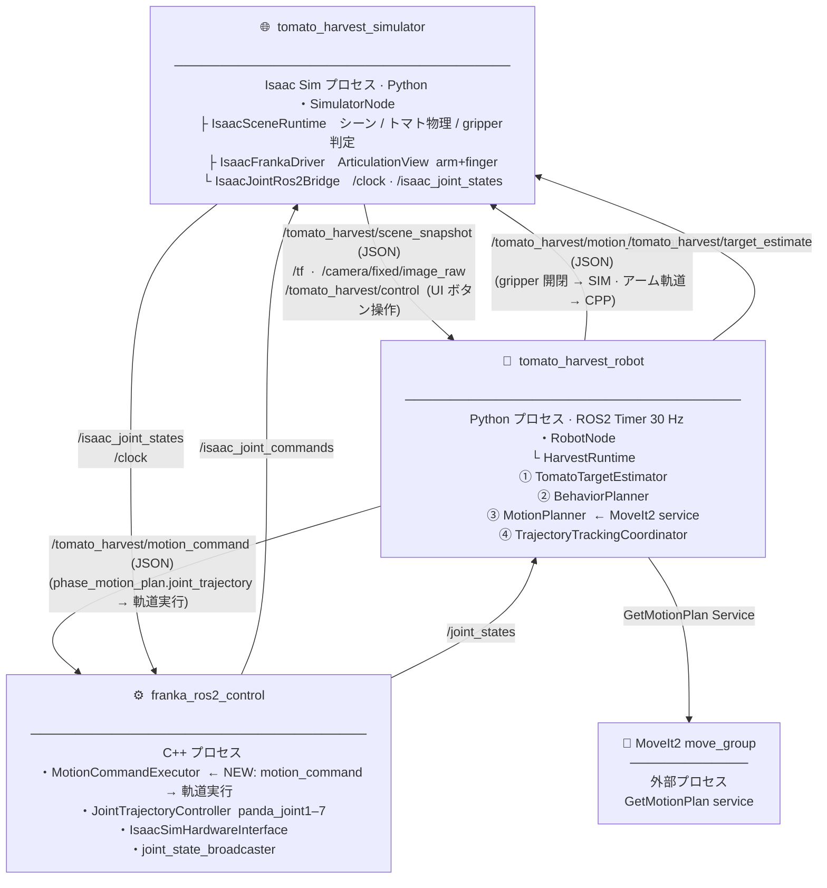
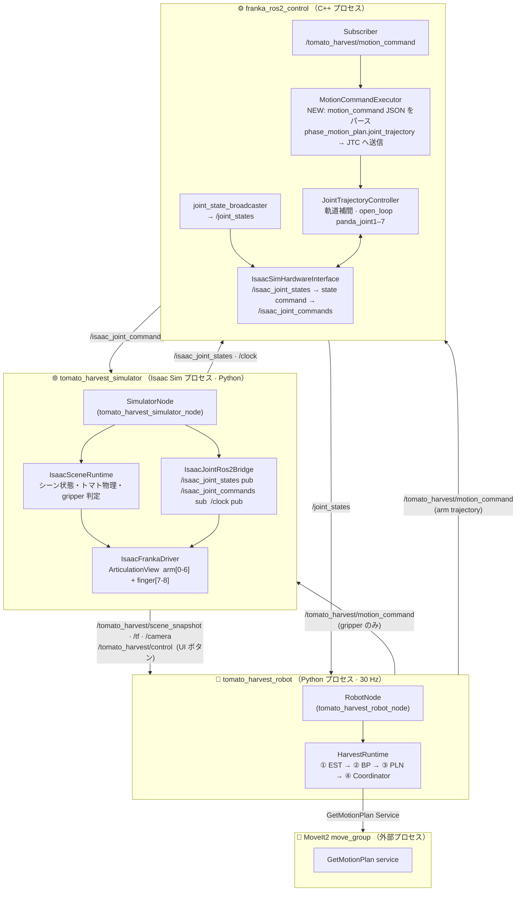
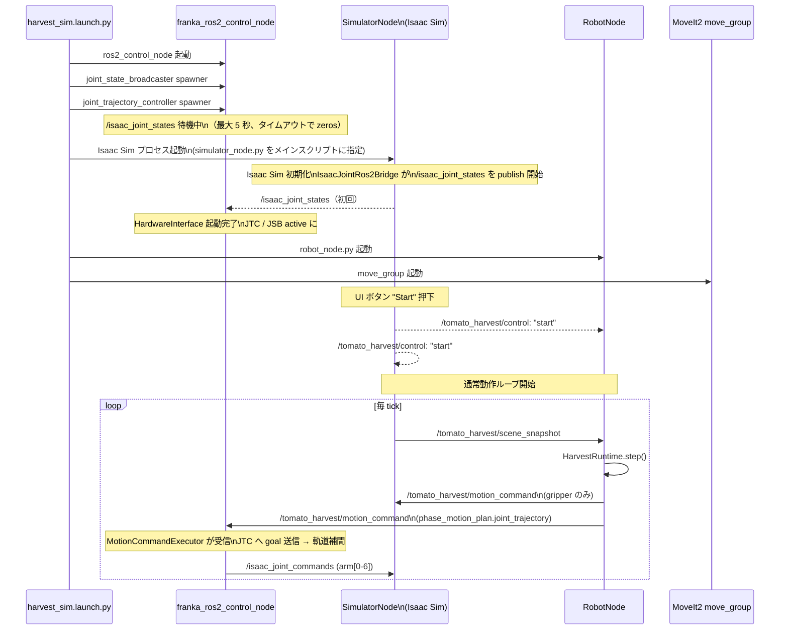
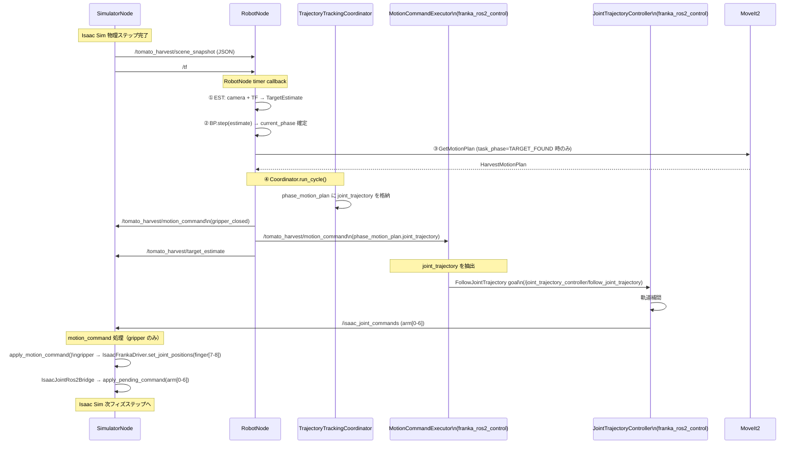

# ROS2 コンポーネントアーキテクチャ設計

## 概要

本ドキュメントは、現在の「単一 Python プロセス + 外部 C++ ノード」構成を、
**4 パッケージの独立した ROS2 ノード**構成へ移行する設計を定義する。

robot パッケージ・simulator パッケージをそれぞれ独立ノードとして分離し、
`app/` のオーケストレーション責務を ROS2 launch ファイルへ移管する。

---

## 目標パッケージ構成

```
src/tomato_harvest_sim/
├── launch/                                     # ROS2 launch ファイル群
│   ├── harvest_sim.launch.py                   # 全ノード一括起動（メイン）
│   └── franka_controllers.launch.py            # C++ コントローラーのみ起動
│
├── robot/                                      # ROS2 Python パッケージ
│   ├── package.xml
│   ├── setup.py
│   ├── config/
│   │   └── robot_node_params.yaml
│   └── tomato_harvest_robot/
│       ├── robot_node.py                       # rclpy.Node: tomato_harvest_robot_node
│       ├── runtime.py                          # HarvestRuntime（既存）
│       ├── behavior_planner/                   # 既存
│       ├── motion_planner/                     # 既存
│       ├── perception/                         # 既存
│       └── trajectory_tracking/               # 既存
│
├── simulator/                                  # ROS2 Python パッケージ（Isaac Sim 内で動作）
│   ├── package.xml
│   ├── setup.py
│   └── tomato_harvest_simulator/
│       ├── simulator_node.py                   # rclpy.Node: tomato_harvest_simulator_node
│       ├── scene_runtime.py                    # 既存
│       ├── isaac_franka_driver.py              # 既存
│       ├── isaac_joint_ros2_bridge.py          # 既存
│       ├── physics_harvest.py                  # 既存
│       └── scene_config.py                     # 既存
│
└── franka_ros2_control/                        # C++ ROS2 パッケージ（packages/ から移設）
    ├── package.xml
    ├── CMakeLists.txt
    ├── config/
    │   ├── franka_controllers.yaml
    │   └── franka_ros2_control.urdf
    ├── include/franka_ros2_control/
    │   └── isaac_sim_hardware_interface.hpp
    └── src/
        └── isaac_sim_hardware_interface.cpp
```

---

## 全体コンポーネント構成図

### パッケージ間通信概要



### パッケージ内部の詳細構成



---

## ROS2 インタフェース一覧

### Topics

| トピック名 | 型 | 方向 | 発行者 | 購読者 | 内容 |
|---|---|---|---|---|---|
| `/tomato_harvest/scene_snapshot` | `std_msgs/String` (JSON) | sim → robot | SimulatorNode | RobotNode | シーン状態 全フィールド |
| `/tomato_harvest/control` | `std_msgs/String` | sim → sim · robot | IsaacControlPanelWindow (SIM プロセス UI) | SimulatorNode · RobotNode | `start` / `stop` / `reset` |
| `/tomato_harvest/motion_command` | `std_msgs/String` (JSON) | robot → sim · cpp | RobotNode | SimulatorNode (gripper) · MotionCommandExecutor (arm trajectory) | gripper 開閉 / phase_motion_plan（arm 軌道を含む） |
| `/tomato_harvest/target_estimate` | `std_msgs/String` (JSON) | robot → world | RobotNode | (監視用) | 検出トマト位置 |
| `/camera/fixed/image_raw` | `sensor_msgs/Image` | sim → robot | SimulatorNode | RobotNode | 固定カメラ画像 |
| `/tf` | `tf2_msgs/TFMessage` | sim → robot | SimulatorNode | RobotNode | base / camera / tomato TF |
| `/joint_states` | `sensor_msgs/JointState` | JTC → robot | joint_state_broadcaster | RobotNode | arm 7 関節 実測値 |
| `/isaac_joint_states` | `sensor_msgs/JointState` | sim → HWI | IsaacJointRos2Bridge | IsaacSimHardwareInterface | arm 7 関節 Isaac Sim 実測値 |
| `/isaac_joint_commands` | `sensor_msgs/JointState` | HWI → sim | IsaacSimHardwareInterface | IsaacJointRos2Bridge | arm 7 関節 JTC 指令値 |
| `/clock` | `rosgraph_msgs/Clock` | sim → JTC | IsaacJointRos2Bridge | JTC (参考用) | Isaac Sim シミュレーション時刻 |

### Actions

| アクション名 | 型 | クライアント | サーバー | 内容 |
|---|---|---|---|---|
| `/joint_trajectory_controller/follow_joint_trajectory` | `control_msgs/FollowJointTrajectory` | MotionCommandExecutor (CPP 内部) | JointTrajectoryController | アーム軌道追従（CPP 内部の内部 I/F）|

### Services

| サービス名 | 型 | クライアント | サーバー | 内容 |
|---|---|---|---|---|
| `/move_group/get_motion_plan` | `moveit_msgs/GetMotionPlan` | MotionPlanner | MoveIt2 move_group | 軌道計画 |

---

## 各ノードの責務と内部構成

### SimulatorNode (`tomato_harvest_simulator_node`)

```mermaid
flowchart TB
  subgraph SN["SimulatorNode  (Isaac Sim Python 環境内)"]
    direction TB

    TIMER["Isaac Sim 物理ステップに同期したコールバック\n（omni.kit.app.update イベント）"]

    SCR["IsaacSceneRuntime\n・シーン状態管理\n・トマト把持判定\n・gripper_closed 状態"]

    JBDG["IsaacJointRos2Bridge\n・/clock publish\n・/isaac_joint_states publish\n・/isaac_joint_commands subscribe\n・apply_pending_command(arm[0-6])"]

    DRV["IsaacFrankaDriver\n・ArticulationView.apply_action()\n・arm + finger 全関節制御"]

    PUB_SS["Publisher\n/tomato_harvest/scene_snapshot"]
    PUB_CAM["Publisher\n/camera/fixed/image_raw"]
    PUB_TF["Publisher\n/tf"]
    SUB_CT["Subscriber\n/tomato_harvest/control"]
    SUB_MC["Subscriber\n/tomato_harvest/motion_command"]

    TIMER --> SCR
    TIMER --> JBDG
    SCR --> DRV
    JBDG --> DRV
    SCR -->|SceneSnapshot| PUB_SS
    SCR -->|camera frame| PUB_CAM
    SCR -->|TF| PUB_TF
    SUB_CT -->|ControlCommand| SCR
    SUB_MC -->|MotionCommand\n(gripper のみ)| SCR
  end
```

**責務:**
- Isaac Sim の物理ステップに同期して `IsaacSceneRuntime` を 1 tick 進める
- シーン状態（`SceneSnapshot`）を `/tomato_harvest/scene_snapshot` へ publish
- `MotionCommand`（gripper 開閉、ウェイポイント更新）を受け取りシーンへ適用
- `IsaacJointRos2Bridge` を通じて JTC との HW インタフェース通信を担う

---

### RobotNode (`tomato_harvest_robot_node`)

```mermaid
flowchart TB
  subgraph RN["RobotNode  (独立 Python プロセス)"]
    direction TB

    TIMER["ROS2 Timer コールバック\n（例: 30 Hz）"]

    RT["HarvestRuntime.step()\n① EST: トマト検出\n② BP: 上位計画（phase 確定）\n③ PLN: 下位計画（軌道生成）\n④ Coordinator: 軌道追従"]

    BP["BehaviorPlanner\nphase state machine\nPLANNING 以降の phase を管理"]
    PLN["MotionPlanner\nMoveIt2 GetMotionPlan 呼び出し"]
    EST["TomatoTargetEstimator\nカメラ + TF → TargetEstimate"]
    CO["TrajectoryTrackingCoordinator\njoint_trajectory / gripper_closed を管理\n軌道は phase_motion_plan に埋め込み → motion_command で送信"]

    SUB_SS["Subscriber\n/tomato_harvest/scene_snapshot"]
    SUB_JS["Subscriber\n/joint_states"]
    SUB_TF["Subscriber\n/tf"]
    SUB_CAM["Subscriber\n/camera/fixed/image_raw"]
    PUB_MC["Publisher\n/tomato_harvest/motion_command\n(gripper → SIM · arm trajectory → CPP)"]
    PUB_TE["Publisher\n/tomato_harvest/target_estimate"]

    TIMER --> RT
    RT --> BP & PLN & EST & CO
    SUB_SS -->|SceneSnapshot| RT
    SUB_JS -->|JointState| CO
    SUB_TF -->|TfTree| PLN & EST
    SUB_CAM -->|CameraFrame| EST
    CO -->|MotionCommand\n(phase_motion_plan.joint_trajectory)| PUB_MC
    BP -->|gripper / phase info| PUB_MC
    EST -->|TargetEstimate| PUB_TE
    PLN -->|GetMotionPlan| MV["MoveIt2 move_group"]
  end
```

**責務:**
- 30 Hz タイマーで `HarvestRuntime.step()` を駆動
- カメラ・TF からトマト位置を推定（EST）
- BehaviorPlanner で上位フェーズを決定（BP）
- MotionPlanner で軌道を生成（PLN、MoveIt2 経由）
- `TrajectoryTrackingCoordinator` で `phase_motion_plan.joint_trajectory` を管理
- `/tomato_harvest/motion_command` に軌道 + gripper 情報を載せて送信
  - gripper 開閉 → SimulatorNode が受け取り finger[7-8] を制御
  - arm 軌道 (`phase_motion_plan.joint_trajectory`) → franka_ros2_control が受け取り実行

---

### franka_ros2_control (`franka_ros2_control` C++ ノード群)

既存 `packages/franka_ros2_control` から移設し、`MotionCommandExecutor` を追加。

| コンポーネント | 型 | 役割 |
|---|---|---|
| `ros2_control_node` | C++ プロセス | controller_manager ホスト |
| `MotionCommandExecutor` | **NEW** rclcpp Node | `/tomato_harvest/motion_command` を subscribe し `phase_motion_plan.joint_trajectory` を JTC へ送信 |
| `IsaacSimHardwareInterface` | ros2_control HardwareInterface plugin | `/isaac_joint_states` → state, command → `/isaac_joint_commands` |
| `JointTrajectoryController` | controller plugin | アーム軌道補間・open_loop 追従（panda_joint1–7） |
| `joint_state_broadcaster` | controller plugin | `/joint_states` を publish |

**`MotionCommandExecutor` の責務:**
- `/tomato_harvest/motion_command` (JSON) を subscribe
- `phase_motion_plan` フィールドが存在し `joint_trajectory` を持つ場合、JTC の FollowJointTrajectory action へ goal として送信
- `phase_motion_plan` が null / `joint_trajectory` が null の場合は何もしない（gripper コマンドは SimulatorNode が処理）

---

## 起動シーケンス



---

## 1 tick データフロー（通常動作中）



---

## 現行実装との対応

| 現行クラス / モジュール | 配置先 | ノード化の要点 |
|---|---|---|
| `app/application.py` `TomatoHarvestApplication` | **`launch/harvest_sim.launch.py`** に解体 | `step()` ループ → ROS2 Timer に置き換え |
| `robot/runtime.py` `HarvestRuntime` | `robot/` パッケージ | 変更なし（RobotNode 内部クラス） |
| `robot/behavior_planner/` | `robot/` パッケージ | 変更なし |
| `robot/motion_planner/` | `robot/` パッケージ | 変更なし |
| `robot/perception/` | `robot/` パッケージ | 変更なし |
| `robot/trajectory_tracking/` | `robot/` パッケージ | 変更なし |
| `simulator/scene_runtime.py` | `simulator/` パッケージ | 変更なし |
| `simulator/isaac_franka_driver.py` | `simulator/` パッケージ | 変更なし |
| `simulator/isaac_joint_ros2_bridge.py` | `simulator/` パッケージ | 変更なし |
| `api/bridge.py` `Ros2LoopbackBridge` | **廃止** | topic/action に直接分解 |
| `api/bridge.py` `InMemoryRos2Bridge` | テスト用として残存 | ユニットテスト専用 |
| `api/contracts.py` | `tomato_harvest_msgs/` (共有型) に分離 推奨 | JSON シリアライズは当面継続 |
| `packages/franka_ros2_control/` | **`src/franka_ros2_control/`** に移設 | `MotionCommandExecutor` を新規追加（`/tomato_harvest/motion_command` subscriber） |
| `robot/trajectory_tracking/ros2_action_trajectory_port.py` | **廃止** | `franka_ros2_control` 側が直接 `motion_command` を受信するため不要 |

---

## 移行上の注意点

| 項目 | 現行 | 目標 |
|---|---|---|
| simulator と robot の同期 | 同一プロセス内 Python 関数呼び出し | ROS2 topic の非同期通信（1 tick ラグあり） |
| gripper 制御 | `allow_direct_drive=False` による no-op（未解決） | SimulatorNode が `/tomato_harvest/motion_command` で受け取り `finger[7-8]` を制御 |
| アーム軌道送信 | `Ros2ActionTrajectoryPort` → FollowJointTrajectory action | `motion_command` に `phase_motion_plan.joint_trajectory` を埋め込み `MotionCommandExecutor` が受信・実行 |
| `Ros2ActionTrajectoryPort` | RobotNode 内に存在 | **廃止** — `franka_ros2_control` 側が直接 motion_command を受信するため不要 |
| シーン snapshot の輸送 | JSON-over-String（現行の bridge と同じ） | 当面継続、将来は `tomato_harvest_msgs/SceneSnapshot` カスタムメッセージに移行 |
| テスト | `InMemoryRos2Bridge` を使うユニットテスト群 | 変更なし（robot パッケージ内テストとして継続） |
