# ROS2 コンポーネントアーキテクチャ設計

## 概要

本ドキュメントは、現在の「単一 Python プロセス(`robot_node.py`) + 外部 C++ ノード」構成を、
**5 つの独立した ROS2 Python ノード + franka_ros2_control C++ ノード群**構成へ移行する設計を定義する。

`robot_node.py` および `HarvestRuntime.step()` を廃止し、責務ごとに独立した ROS2 ノードへ分解する。
各ノードは `harvest_sim.launch.py` から個別に起動される。

---

## 目標パッケージ構成

```
src/tomato_harvest_sim/
├── msg/                                        # robot / simulator 共通の ROS2 メッセージ型定義
│   ├── contracts.py                            # MotionCommand / HarvestMotionPlan / Pose3D 等
│   └── hardware_control.py                     # HardwareCommandSample / HardwareStateSample 等
│   # bridge.py は廃止（BridgeProtocol/RobotNodeBridge 廃止、定数は msg/ へ移動）
│   # trajectory_execution.py は廃止（trajectory_tracking/ 廃止で参照元消滅）
│
├── launch/                                     # ROS2 launch ファイル群
│   ├── harvest_sim.launch.py                   # 全ノード一括起動（メイン）
│   └── franka_controllers.launch.py            # C++ コントローラーのみ起動
│
├── robot/                                      # ROS2 Python パッケージ
│   ├── package.xml
│   ├── setup.py
│   ├── config/
│   │   └── robot_params.yaml
│   ├── launch/
│   │   └── robot_nodes.launch.py               # robot パッケージの 5 ノードを一括起動
│   └── tomato_harvest_robot/
│       ├── msg/                                # robot 内部 ROS2 メッセージ型定義
│       │   ├── perception.py                   # TargetEstimator Protocol（tomato_detector_node が参照）
│       │   └── planner.py                      # MotionPlanner / MoveIt2PlannerBridge 等（trajectory_planner_node が参照）
│       │   # trajectory_tracking.py は廃止（trajectory_tracking/ 廃止で参照元消滅）
│       ├── tomato_detector_node.py             # rclpy.Node: tomato_detector_node
│       ├── behavior_planner_node.py            # rclpy.Node: behavior_planner_node
│       ├── trajectory_planner_node.py          # rclpy.Node: trajectory_planner_node
│       ├── trajectory_monitor_node.py          # rclpy.Node: trajectory_monitor_node
│       ├── motion_command_node.py              # rclpy.Node: motion_command_node
│       ├── behavior_planner/                   # BehaviorPlanner クラス（behavior_planner_node が import）
│       ├── motion_planner/                     # MotionPlanner クラス（trajectory_planner_node が import）
│       └── perception/                         # TomatoTargetEstimator クラス（tomato_detector_node が import）
│       # trajectory_tracking/ は廃止（coordinator.py / ros2_action_trajectory_port.py を削除）
│
├── simulator/                                  # ROS2 Python パッケージ（Isaac Sim 内で動作）
│   ├── package.xml
│   ├── setup.py
│   └── tomato_harvest_simulator/
│       ├── simulator_node.py                   # rclpy.Node: tomato_harvest_simulator_node
│       ├── scene_runtime.py                    # 既存
│       ├── isaac_franka_driver.py              # 既存
│       ├── isaac_joint_ros2_bridge.py          # 既存
│       ├── physics_harvest.py                  # 既存
│       └── scene_config.py                     # 既存
│
└── franka_ros2_control/                        # C++ ROS2 パッケージ
    ├── package.xml
    ├── CMakeLists.txt
    ├── config/
    │   ├── franka_controllers.yaml
    │   └── franka_ros2_control.urdf
    ├── include/franka_ros2_control/
    │   ├── isaac_sim_hardware_interface.hpp    # 実装済み
    │   └── motion_command_executor.hpp         # 未実装（新規追加予定）
    └── src/
        ├── isaac_sim_hardware_interface.cpp    # 実装済み
        └── motion_command_executor.cpp         # 未実装（新規追加予定）
        #   /tomato_harvest/motion_command sub
        #   /tomato_harvest/execution_status pub
```

---

## 全体コンポーネント構成図

### パッケージ間通信概要

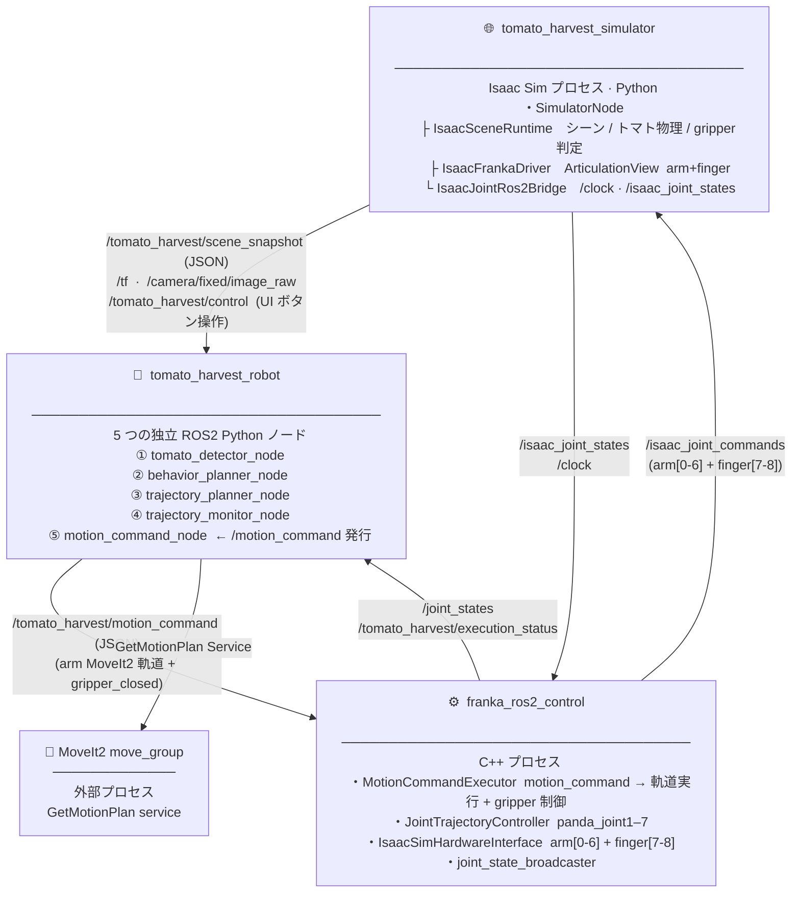

### パッケージ内部の詳細構成

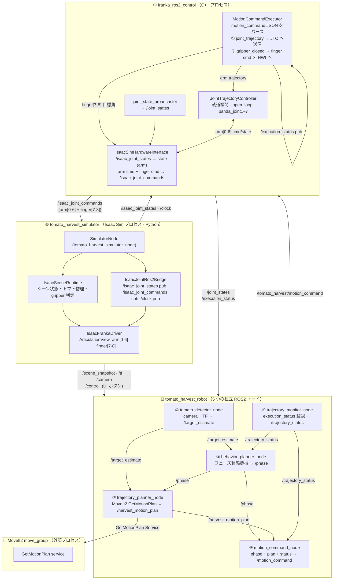

---

## ROS2 インタフェース一覧

### Topics

| トピック名 | 型 | 方向 | 発行者 | 購読者 | 内容 |
|---|---|---|---|---|---|
| `/tomato_harvest/scene_snapshot` | `std_msgs/String` (JSON) | sim → robot | SimulatorNode | behavior_planner_node | シーン状態 全フィールド |
| `/tomato_harvest/control` | `std_msgs/String` | UI → all | IsaacControlPanelWindow | SimulatorNode · behavior_planner_node | `start` / `stop` / `reset` |
| `/tomato_harvest/target_estimate` | `std_msgs/String` (JSON) | robot 内部 | tomato_detector_node | behavior_planner_node · trajectory_planner_node | トマト推定位置・姿勢 |
| `/tomato_harvest/phase` | `std_msgs/String` | robot 内部 | behavior_planner_node | trajectory_planner_node · motion_command_node | 現在の `HarvestTaskPhase` 文字列 |
| `/tomato_harvest/harvest_motion_plan` | `std_msgs/String` (JSON) | robot 内部 | trajectory_planner_node | motion_command_node | `HarvestMotionPlan`（全フェーズ分の MoveIt2 軌道） |
| `/tomato_harvest/execution_status` | `std_msgs/String` (JSON) | cpp → robot | MotionCommandExecutor | trajectory_monitor_node | 軌道実行ステータス（`running` / `succeeded` / `aborted`） |
| `/tomato_harvest/trajectory_status` | `std_msgs/String` | robot 内部 | trajectory_monitor_node | behavior_planner_node · motion_command_node | `ok` / `aborted` |
| `/tomato_harvest/motion_command` | `std_msgs/String` (JSON) | robot → cpp | motion_command_node | MotionCommandExecutor | MoveIt2 軌道 + gripper_closed（常に両フィールドを含む） |
| `/camera/fixed/image_raw` | `sensor_msgs/Image` | sim → robot | SimulatorNode | tomato_detector_node | 固定カメラ画像 |
| `/tf` | `tf2_msgs/TFMessage` | sim → robot | SimulatorNode | tomato_detector_node | base / camera / tomato TF |
| `/joint_states` | `sensor_msgs/JointState` | JTC → robot | joint_state_broadcaster | trajectory_planner_node | arm 7 関節 実測値 |
| `/isaac_joint_states` | `sensor_msgs/JointState` | sim → HWI | IsaacJointRos2Bridge | IsaacSimHardwareInterface | arm 7 関節 Isaac Sim 実測値 |
| `/isaac_joint_commands` | `sensor_msgs/JointState` | HWI → sim | IsaacSimHardwareInterface | IsaacJointRos2Bridge | arm[0-6] + finger[7-8] 全関節指令値 |
| `/clock` | `rosgraph_msgs/Clock` | sim → JTC | IsaacJointRos2Bridge | JTC (参考用) | Isaac Sim シミュレーション時刻 |

### Actions

| アクション名 | 型 | クライアント | サーバー | 内容 |
|---|---|---|---|---|
| `/joint_trajectory_controller/follow_joint_trajectory` | `control_msgs/FollowJointTrajectory` | MotionCommandExecutor (CPP 内部) | JointTrajectoryController | アーム軌道追従（CPP 内部 I/F）|

### Services

| サービス名 | 型 | クライアント | サーバー | 内容 |
|---|---|---|---|---|
| `/move_group/get_motion_plan` | `moveit_msgs/GetMotionPlan` | trajectory_planner_node | MoveIt2 move_group | 軌道計画 |

---

## 各ノードの責務と内部構成

### SimulatorNode (`tomato_harvest_simulator_node`)

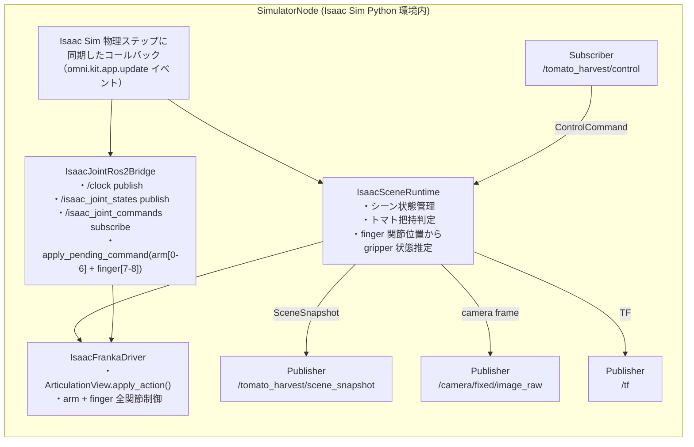

**責務:**
- Isaac Sim の物理ステップに同期して `IsaacSceneRuntime` を 1 tick 進める
- シーン状態（`SceneSnapshot`）を `/tomato_harvest/scene_snapshot` へ publish
- `IsaacJointRos2Bridge` を通じて `/isaac_joint_commands`（arm[0-6] + finger[7-8]）を受け取り `IsaacFrankaDriver` へ適用
- finger 関節位置から gripper 状態を推定し、トマト把持判定を `IsaacSceneRuntime` で実施

---

### tomato_detector_node

**責務:** カメラ画像と TF を入力にトマト位置を推定し、`/tomato_harvest/target_estimate` へ publish する。DETECTING フェーズ中のみ稼働する。

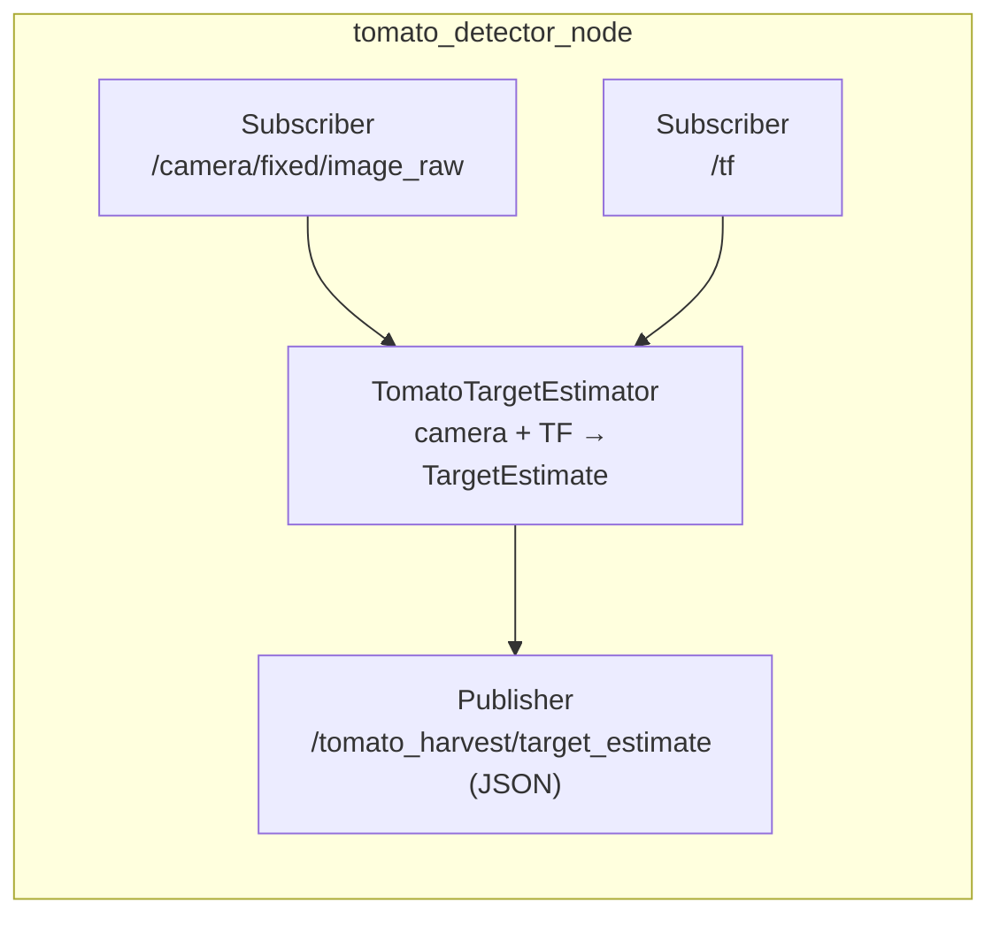

| 入力 | 出力 |
|---|---|
| `/camera/fixed/image_raw`、`/tf` | `/tomato_harvest/target_estimate` (JSON) |

---

### behavior_planner_node

**責務:** フェーズ状態機械を保持し、入力イベントに応じてフェーズ遷移のみを行う。motion_command の生成は行わない。

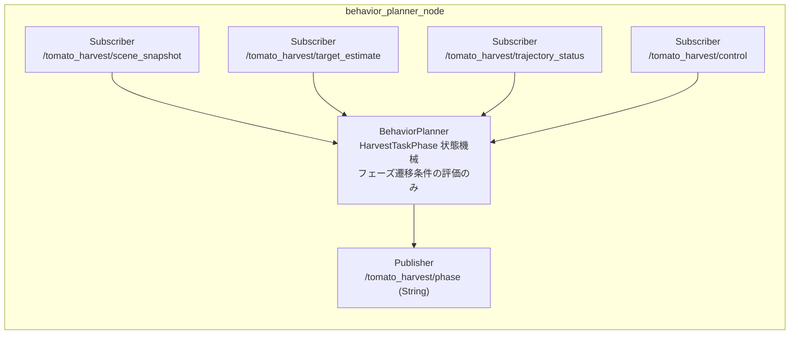

**フェーズ遷移表（主要）:**

| 現フェーズ | 遷移条件 | 次フェーズ |
|---|---|---|
| DETECTING | target_estimate 受信 | TARGET_FOUND |
| TARGET_FOUND | harvest_motion_plan 受信 | PLANNING |
| PLANNING | phase=PLANNING 受信後 | MOVING_TO_PREGRASP |
| MOVING_TO_PREGRASP | trajectory_status=ok + phase_reached | MOVING_TO_GRASP |
| MOVING_TO_GRASP | trajectory_status=ok + phase_reached | AT_GRASP |
| AT_GRASP | grasp_settle 完了 | GRASP_EVALUATION |
| GRASP_EVALUATION | grasp 成功判定 | DETACHING |
| DETACHING | trajectory_status=ok | MOVING_TO_PLACE |
| MOVING_TO_PLACE | trajectory_status=ok | PLACED |
| PLACED | settle 完了 | RETURNING_HOME |
| RETURNING_HOME | trajectory_status=ok | COMPLETE |
| 任意 | trajectory_status=aborted | 同フェーズ（再計画待ち）|

---

### trajectory_planner_node

**責務:** `TARGET_FOUND` フェーズ受信時に MoveIt2 `GetMotionPlan` を呼び出し、全フェーズ分の `HarvestMotionPlan` を生成して publish する。abort 検知時は現在 joint_state から再計画する。

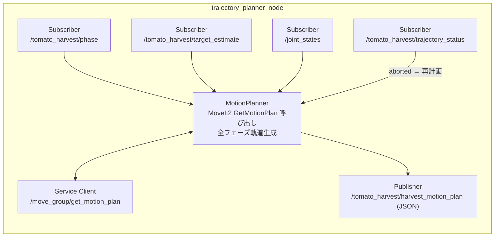

**再計画トリガ:** `trajectory_status=aborted` + 現フェーズの組み合わせで自動再計画。MOVING_TO_PLACE フェーズでは現在 joint_state から place 軌道のみを再計画する。

---

### trajectory_monitor_node

**責務:** C++ `MotionCommandExecutor` が publish する `/tomato_harvest/execution_status` を監視し、abort を検知したら `/tomato_harvest/trajectory_status` へ通知する。

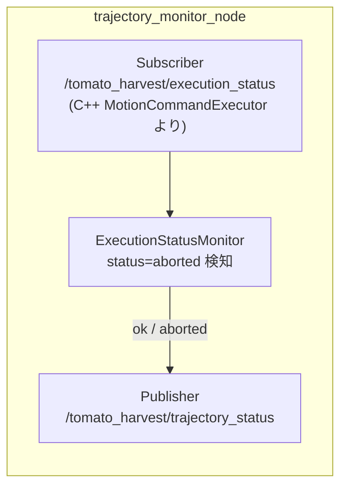

| 入力 | 出力 |
|---|---|
| `/tomato_harvest/execution_status` (JSON: `{status: "running"\|"succeeded"\|"aborted"}`) | `/tomato_harvest/trajectory_status` (String: `"ok"\|"aborted"`) |

---

### motion_command_node

**責務:** 現フェーズ・`HarvestMotionPlan`・trajectory_status を合成し、`/tomato_harvest/motion_command` を生成・publish する。常に `joint_trajectory`（MoveIt2 軌道または停止軌道）と `gripper_closed` の両フィールドを含む。

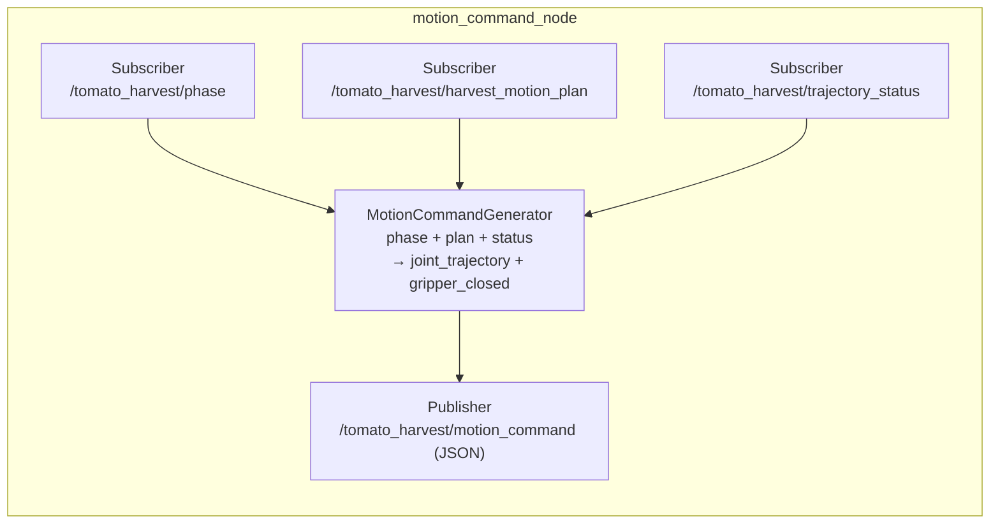

**フェーズ別 motion_command 出力仕様:**

| フェーズ | `joint_trajectory` | `gripper_closed` | 備考 |
|---|---|---|---|
| MOVING_TO_PREGRASP | MoveIt2 移動軌道（pregrasp） | `true` | グリッパー閉のまま接近 |
| MOVING_TO_GRASP | MoveIt2 移動軌道（grasp） | `false` | グリッパー開で把持位置へ |
| AT_GRASP | MoveIt2 **停止**軌道（現在位置） | `true` | 把持直後、arm をホールド |
| GRASP_EVALUATION | MoveIt2 **停止**軌道（現在位置） | `true` | 把持評価中もホールド |
| DETACHING | MoveIt2 移動軌道（pull） | `true` | 閉じたまま引き抜き |
| MOVING_TO_PLACE | MoveIt2 移動軌道（place） | `true` | 閉じたまま置き場へ |
| PLACED | MoveIt2 **停止**軌道（現在位置） | `false` | 置き完了、グリッパー開放 |
| RETURNING_HOME | MoveIt2 移動軌道（home） | `false` | 開いたまま帰還 |

> **停止軌道:** 現在の joint_state を単一ウェイポイントとして velocity=0 で構築した MoveIt2 軌道。`MotionCommandExecutor` 側では通常の移動軌道と同一フォーマットで受け取る。

#### `motion_command` JSON 構造

```json
{
  "command_name": "move_to_pregrasp",
  "planner_name": "moveit2",
  "target_pose": { "x": 0.45, "y": -0.12, "z": 0.38, "roll": 0.0, "pitch": 90.0, "yaw": 0.0 },
  "gripper_closed": true,
  "phase_motion_plan": {
    "phase_id": "moving_to_pregrasp",
    "phase_goal_pose": { "x": 0.45, "y": -0.12, "z": 0.38 },
    "active_waypoints": [{ "x": 0.45, "y": -0.12, "z": 0.38 }],
    "joint_trajectory": {
      "joint_names": ["panda_joint1", "panda_joint2", "panda_joint3", "panda_joint4", "panda_joint5", "panda_joint6", "panda_joint7"],
      "points": [
        { "positions_rad": [0.0, -0.4, 0.0, -2.1, 0.0, 1.7, 0.8], "time_from_start_sec": 0.0 },
        { "positions_rad": [0.1, -0.3, 0.0, -2.0, 0.0, 1.8, 0.8], "time_from_start_sec": 1.2 }
      ]
    }
  }
}
```

| フィールド | 内容 |
|---|---|
| `command_name` | フェーズ対応コマンド名（`move_to_pregrasp` / `move_to_grasp` / `pull_to_detach` / `move_to_place` / `move_home`） |
| `planner_name` | MoveIt2 プランナー識別子（`moveit2` など） |
| `target_pose` | フェーズのゴール姿勢（ワールド座標系） |
| `gripper_closed` | `true`=閉 / `false`=開（常に非 null） |
| `phase_motion_plan.joint_trajectory` | MoveIt2 が生成した 7 関節の時系列軌道（常に非 null、停止フェーズは単一ウェイポイント） |

---

### franka_ros2_control (`franka_ros2_control` C++ ノード群)

既存 `packages/franka_ros2_control` から移設し、`MotionCommandExecutor` を追加。

| コンポーネント | 型 | 実装状況 | 役割 |
|---|---|---|---|
| `ros2_control_node` | C++ プロセス | 実装済み | controller_manager ホスト |
| `MotionCommandExecutor` | rclcpp Node | **未実装（新規追加予定）** | `/tomato_harvest/motion_command` を subscribe し、arm 軌道を JTC へ送信 / gripper_closed を finger[7-8] 指令値として HWI 経由で送信。実行ステータスを `/tomato_harvest/execution_status` へ publish |
| `IsaacSimHardwareInterface` | ros2_control HardwareInterface plugin | 実装済み | `/isaac_joint_states` → state (arm only), command → `/isaac_joint_commands` (arm[0-6] + finger[7-8]) |
| `JointTrajectoryController` | controller plugin | 実装済み | アーム軌道補間・open_loop 追従（panda_joint1–7） |
| `joint_state_broadcaster` | controller plugin | 実装済み | `/joint_states` を publish |

**`MotionCommandExecutor` の責務:**
- `/tomato_harvest/motion_command` (JSON) を subscribe
- `phase_motion_plan.joint_trajectory` を JTC の FollowJointTrajectory action へ goal として送信（アーム制御）
- `gripper_closed` フラグに基づき finger[7-8] の目標関節角を算出し HWI へ書き込み（gripper 制御）
- 軌道実行ステータス（`running` / `succeeded` / `aborted`）を `/tomato_harvest/execution_status` へ publish

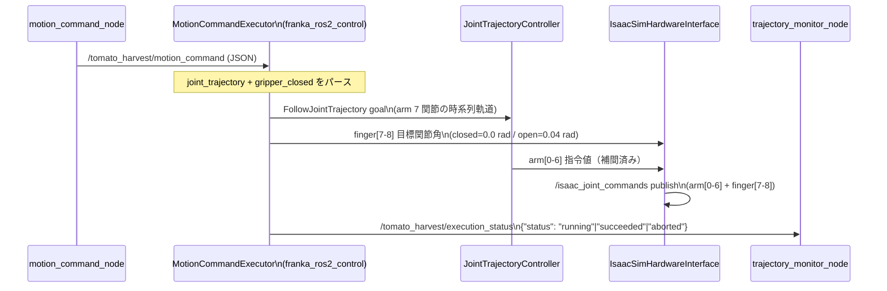

---

## 起動シーケンス

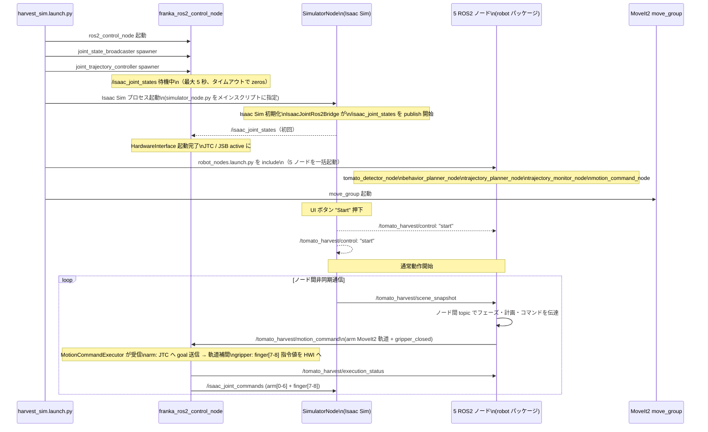

---

## ノード間データフロー（ハーベスト 1 サイクル）

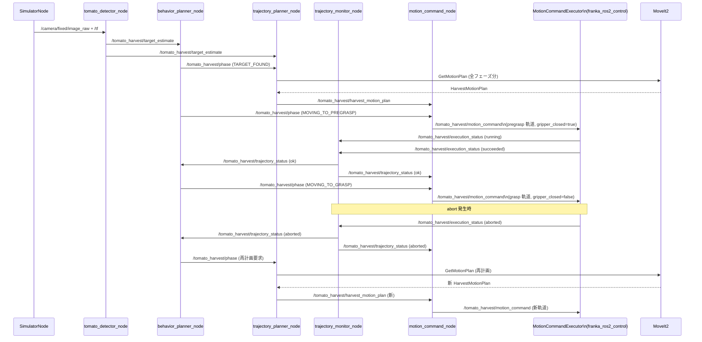

---

## 現行実装との対応

| 現行クラス / モジュール | 目標の配置先 | 移行の要点 |
|---|---|---|
| `app/application.py` `TomatoHarvestApplication` | **`launch/harvest_sim.launch.py`** に解体 | `step()` ループ → ROS2 ノード個別起動に置き換え |
| `robot/robot_node.py` `RobotNode` | **廃止** | 5 つの独立ノードに分解 |
| `robot/runtime.py` `HarvestRuntime` / `HarvestRuntime.step()` | **廃止** | 各ノードが直接ロジッククラスを呼び出す |
| `robot/behavior_planner/` | `behavior_planner_node.py` が内部利用 | フェーズ遷移ロジックとして継続使用 |
| `robot/motion_planner/` | `trajectory_planner_node.py` が内部利用 | MoveIt2 計画ロジックとして継続使用 |
| `robot/perception/` | `tomato_detector_node.py` が内部利用 | TomatoTargetEstimator として継続使用 |
| `robot/trajectory_tracking/coordinator.py` | **廃止** | trajectory_monitor_node + MotionCommandExecutor に分解 |
| `robot/trajectory_tracking/ros2_action_trajectory_port.py` | **廃止** | MotionCommandExecutor が直接 motion_command を受信 |
| `simulator/scene_runtime.py` | `simulator/` パッケージ | 変更なし |
| `simulator/isaac_franka_driver.py` | `simulator/` パッケージ | 変更なし |
| `simulator/isaac_joint_ros2_bridge.py` | `simulator/` パッケージ | 変更なし |
| `api/bridge.py` `BridgeProtocol` / `RobotNodeBridge` / `Ros2LoopbackBridge` | **廃止** | topic に直接分解 |
| `api/bridge.py` `CONTROL_TOPIC` 等定数 | **`msg/contracts.py` へ移動** | simulator_node が参照するため残存 |
| `api/bridge.py` `InMemoryRos2Bridge` | テスト用として残存 | ユニットテスト専用 |
| `api/contracts.py` | **`msg/contracts.py`** へリネーム | robot / simulator 共通型。JSON シリアライズは当面継続 |
| `api/hardware_control.py` | **`msg/hardware_control.py`** へリネーム | simulator 側が引き続き参照 |
| `api/trajectory_execution.py` | **廃止** | trajectory_tracking/ 廃止で参照元消滅 |
| `robot/api/perception.py` | **`robot/msg/perception.py`** へリネーム | tomato_detector_node が参照 |
| `robot/api/planner.py` | **`robot/msg/planner.py`** へリネーム | trajectory_planner_node が参照 |
| `robot/api/trajectory_tracking.py` | **廃止** | trajectory_tracking/ 廃止で参照元消滅 |
| `packages/franka_ros2_control/` | **`src/franka_ros2_control/`** に移設 | `MotionCommandExecutor` を新規追加 |

---

## 移行上の注意点

| 項目 | 現行 | 目標 |
|---|---|---|
| ロボット制御の同期 | 単一プロセス内 30 Hz タイマー駆動 | ROS2 topic の非同期通信（ノード間ラグあり） |
| gripper 制御 | `allow_direct_drive=False` による no-op（未解決） | `MotionCommandExecutor` が `gripper_closed` を受け取り finger[7-8] 目標角を算出 → `/isaac_joint_commands` で simulator へ送信 |
| アーム軌道送信 | `Ros2ActionTrajectoryPort` → FollowJointTrajectory action（robot_node 内部） | `motion_command` に `joint_trajectory` を埋め込み `MotionCommandExecutor` が受信・実行 |
| replan 検知 | `TrajectoryTrackingCoordinator` が abort を検知し `HarvestRuntime.replan_active_motion()` を呼び出す | `trajectory_monitor_node` が `execution_status=aborted` を検知し `trajectory_planner_node` が自動再計画 |
| motion_command の null フィールド | arm 軌道と gripper コマンドが別メッセージ、一方が null になり得る | 常に `joint_trajectory`（停止軌道含む）と `gripper_closed` の両フィールドを持つ |
| シーン snapshot の輸送 | JSON-over-String（bridge 経由） | 当面継続、将来は `tomato_harvest_msgs/SceneSnapshot` カスタムメッセージに移行 |
| テスト | `InMemoryRos2Bridge` を使うユニットテスト群 | 各ノードの入出力 topic 単位のテストに移行推奨 |
