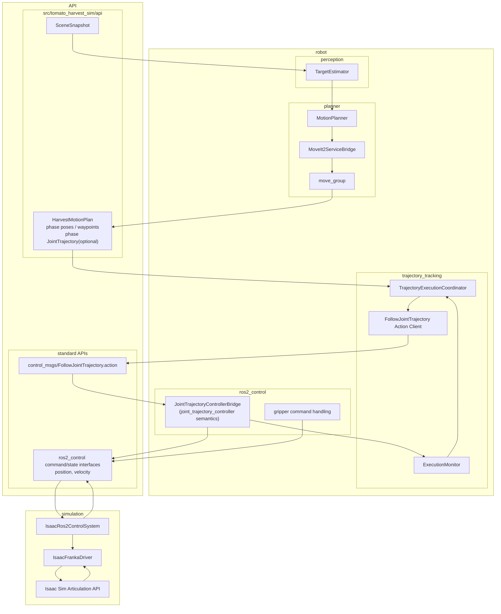
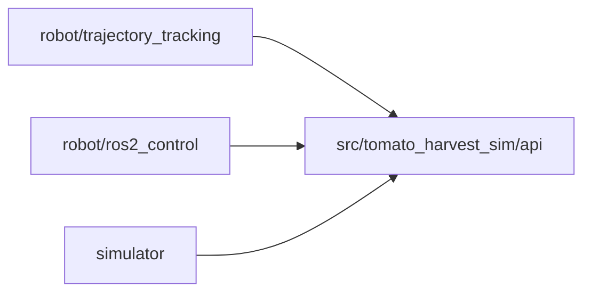
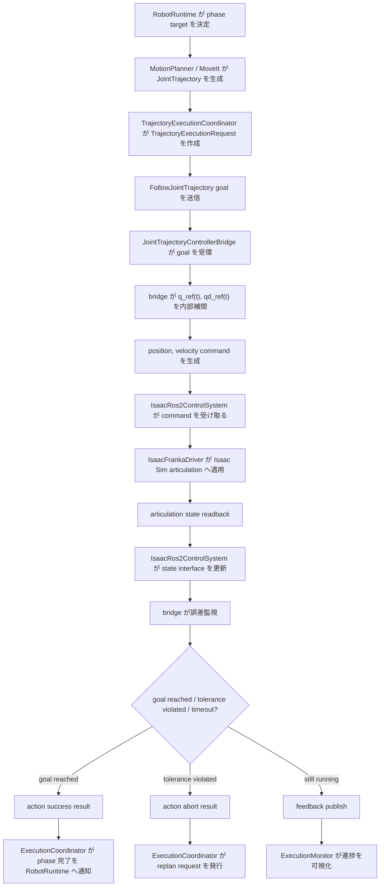
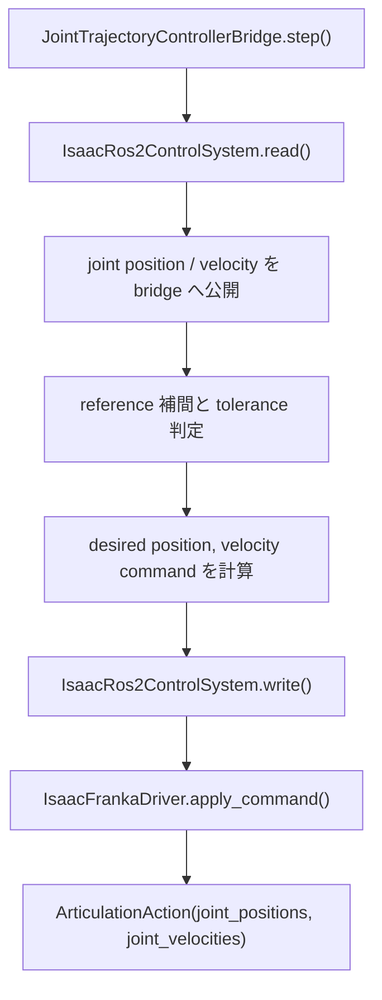

# ROS2 Control Trajectory Execution Architecture

## 目的
- Franka arm の joint trajectory 実行を、独自 `TrajectoryTracker` の周期 PD 制御から `ros2_control` + `joint_trajectory_controller` へ置き換える。
- command interface は `position, velocity` を採用し、MoveIt の `FollowJointTrajectory` action と整合する構成にする。
- simulator 側の責務を `Isaac Sim API` と `ros2_control hardware adapter` に限定し、trajectory execution semantics は robot 側へ戻す。

## 前提
- MoveIt は引き続き planner と time-parameterized `JointTrajectory` の生成を担当する。
- arm の execution semantics は `joint_trajectory_controller` に合わせる。
- 現実装では外部 `controller_manager` / `joint_trajectory_controller` ノードを別プロセスで起動せず、`robot/ros2_control/JointTrajectoryControllerBridge` がその意味論を `HardwareControlPort` 上で in-process に再現する。
- gripper は今回は現状どおり別 controller とし、arm の `position, velocity` 経路を先に安定化する。
- fallback の第一選択は waypoint IK ではなく、`FollowJointTrajectory` abort 後の current-state replanning とする。

## 変更後アーキ図


## 変更後の責務分離
### `robot/perception`
- `SceneSnapshot` と camera / tf から `TargetEstimate` を生成する。
- execution policy を持たない。

### `robot/planner`
- `HarvestMotionPlan` と phase ごとの `JointTrajectory` を生成する。
- MoveIt / planning scene / time parameterization を担当する。
- 実行監視や low-level control を持たない。

### `robot/trajectory_tracking`
- `TrajectoryExecutionCoordinator`
  - 現在 phase に対応する trajectory goal を選ぶ。
  - `FollowJointTrajectory` action goal の送信、cancel、result 解釈を担当する。
  - action abort 時に `replan request` を発行する。
- `ExecutionMonitor`
  - `FollowJointTrajectory` feedback、`joint_states`、controller state を集約する。
  - phase 完了、abort、timeout、stale goal を判定する。

### `robot/ros2_control`
- `JointTrajectoryControllerBridge`
  - `position, velocity` command interface で arm trajectory を実行する。
  - path / goal tolerance、goal time tolerance、action result を `joint_trajectory_controller` 相当の意味論で扱う。
  - `TrajectoryExecutionPort` と `HardwareControlPort` の間をつなぐ。
- gripper command handling
  - transport は `HardwareControlPort` を共有するが、arm trajectory の進行とは独立に gripper 開閉を維持する。

### `simulator`
- `IsaacRos2ControlSystem`
  - `ros2_control` の hardware/system adapter。
  - state interface:
    - arm `position`
    - arm `velocity`
    - gripper `position`
  - command interface:
    - arm `position`
    - arm `velocity`
    - gripper `position`
- `IsaacFrankaDriver`
  - adapter から Isaac Sim articulation API を呼ぶ。
  - command apply と readback を行う。
- `Isaac Sim Articulation API`
  - simulator 依存の最下層。

## `trajectory_tracking` と `ros2_control` の責務境界
### `trajectory_tracking` が持つべき責務
- task phase に応じて「どの trajectory goal を今実行するか」を決める。
- `HarvestMotionPlan` から execution request を構成する。
- `FollowJointTrajectory` action の goal 送信、cancel、result 解釈を行う。
- action abort / reject / timeout を受けて、replan request を `RobotRuntime` へ返す。
- phase 完了条件を判定し、task state machine を進める。
- debug 可視化のために、current active goal、feedback summary、result summary を保持する。

### `trajectory_tracking` が持ってはいけない責務
- `q_ref(t)` の時間補間を自前実装すること。
- joint error から `qdot_cmd` を直接生成すること。
- low-level PID / PD gain を持つこと。
- path tolerance / goal tolerance を独自意味論で再定義すること。
- Isaac Sim API を直接呼ぶこと。

### `ros2_control` が持つべき責務
- controller 相当の update 周期を管理する。
- `joint_trajectory_controller` 相当の trajectory 時間補間と tracking を実行する。
- `position` / `velocity` command interface へ controller output を流す。
- state interface から joint position / velocity を読み、controller へ返す。
- `FollowJointTrajectory` action の success / abort / feedback を標準意味論で返す。

### `ros2_control` が持ってはいけない責務
- harvest task phase の状態遷移を持つこと。
- perception / planner の結果選択を持つこと。
- current-state replanning の意思決定を持つこと。
- simulator 固有の business rule を持つこと。

### 境界の要約
- `trajectory_tracking` は `what and when to execute` を持つ。
- `ros2_control` は `how to execute` を持つ。
- `simulator` は `how to read/write Isaac Sim` を持つ。

## `src/tomato_harvest_sim/api` に置くべきもの
### 置くべきもの
- robot と simulator の越境契約だけを置く。
- 具体例:
  - `SceneSnapshot`
  - `JointStateSnapshot`
  - `JointTrajectory`
  - `TrajectoryExecutionRequest`
  - `TrajectoryExecutionFeedback`
  - `TrajectoryExecutionResult`
  - `HardwareStateSample`
  - `HardwareCommandSample`
  - `BridgeProtocol`
  - `TrajectoryExecutionPort`
  - `HardwareControlPort`

### `api` に置く理由
- robot と simulator のどちらにも属さない境界契約だから。
- `ros2_control` を実機 adapter に差し替えるときも同じ契約を維持しやすいから。
- `trajectory_tracking` が simulator 実装詳細を知らずに済むから。

### 置いてはいけないもの
- `joint_trajectory_controller` の内部状態。
- PID gain や controller parameter の実体。
- MoveIt service client 実装。
- Isaac Sim articulation 操作コード。
- `trajectory_tracking` の phase 固有 state machine。

## フォルダ構成案
### 推奨案
```text
src/tomato_harvest_sim/
  api/
    contracts.py
    trajectory_execution.py
    hardware_control.py
  robot/
    api/
      perception.py
      planner.py
      trajectory_tracking.py
    perception/
    planner/
    trajectory_tracking/
      coordinator.py
      action_client.py
      execution_monitor.py
    ros2_control/
      controller_manager.py
      joint_trajectory_controller_bridge.py
      controller_state.py
  simulator/
    isaac_ros2_control_system.py
    isaac_franka_driver.py
```

### `src/tomato_harvest_sim/robot/ros2_control` を追加すべき理由
- `ros2_control` は `trajectory_tracking` の detail ではなく、別責務だから。
- 将来的に arm controller 以外に gripper controller、controller_manager wrapper、parameter loader を置きやすいから。
- `trajectory_tracking` の責務を orchestration に限定しやすいから。
- `robot/trajectory_tracking/ros2_control` に入れると、`trajectory_tracking` が low-level controller を内包している誤解を生みやすいから。

### `src/tomato_harvest_sim/robot/trajectory_tracking/ros2_control` を避ける理由
- フォルダ上の依存方向が逆に見える。
- `ros2_control` の役割が `trajectory_tracking` の private helper に見えてしまう。
- 将来 controller 実装が増えたときに、tracking と control infrastructure が再び混ざる。

### 判断
- `src/tomato_harvest_sim/robot/ros2_control` を追加するのが推奨。
- `src/tomato_harvest_sim/robot/trajectory_tracking/ros2_control` は非推奨。
- 境界契約は `src/tomato_harvest_sim/api` に置き、`robot/trajectory_tracking` と `robot/ros2_control` の両方がその契約に依存する構成にする。

## 主なインターフェース
### robot 内
- `HarvestMotionPlan`
- `JointTrajectory`
- `TrajectoryExecutionRequest`
  - phase 名
  - trajectory
  - controller name
  - optional goal tolerance override
- `TrajectoryExecutionFeedback`
  - accepted
  - active
  - result code
  - current error summary
  - controller state timestamp

### robot -> simulator
- `ros2_control` hardware interface
  - read:
    - joint position
    - joint velocity
  - write:
    - desired joint position
    - desired joint velocity

### 境界 IF の依存方向


## 処理フロー


## Simulator 視点の制御フロー


## 現行構成からの主変更点
- なくなるもの
  - `TrajectoryTracker` の独自 PD gain 調整責務
  - `trajectory_tracking` 側の `goal_timeout` / `path_tolerance_violation` の独自判定
  - trajectory segment ごとの waypoint IK fallback
- 新しく増えるもの
  - `FollowJointTrajectory` action client
  - `JointTrajectoryControllerBridge`
  - Isaac Sim 向け `ros2_control` system adapter
- 責務移動
  - `q_ref(t)` 補間: `TrajectoryTracker` -> `JointTrajectoryControllerBridge`
  - tolerance / goal monitoring: `TrajectoryTracker` -> action/controller 相当層
  - robot 側に残すもの: phase orchestration、goal dispatch、abort 後の replanning

## 推奨する実装順
1. simulator 側に `IsaacRos2ControlSystem` を追加する。
2. `position` / `velocity` state readback と command write の adapter を通す。
3. `JointTrajectoryControllerBridge` で `position, velocity` command interface を駆動する。
4. robot 側に `FollowJointTrajectoryActionClient` を追加する。
5. 既存 `TrajectoryTrackingCoordinator` の arm trajectory 実行経路を action client 呼び出しへ置き換える。
6. 既存の独自 timeout / path tolerance 判定を削除し、abort -> replan のみに寄せる。
7. debug visualization を controller state / action feedback ベースへ更新する。

## テスト観点
- controller 相当層が `position, velocity` command を両方出すこと。
- state interface の `position` / `velocity` readback が action feedback と整合すること。
- path tolerance violation で action abort になること。
- goal 到達で success になり、robot runtime が次 phase へ進むこと。
- replan request は action abort を受けたときだけ発行されること。
- simulator 側 driver が無効な command を受けても controller 相当層が停止しないこと。

## 判断
- 独自 PD executor を改善し続けるより、`ros2_control` の `joint_trajectory_controller` に execution semantics を委譲する方が妥当である。
- 特に今回のように `goal_timeout` と gain tuning が問題になっている場合、制御則の品質だけでなく、MoveIt と同じ abort / tolerance 意味論へ寄せられる点が大きい。
- `position, velocity` interface は、現在の Isaac Sim driver が持っている `joint_positions` と `joint_velocities` の両経路を活かしやすく、今回の移行第一段として適している。
