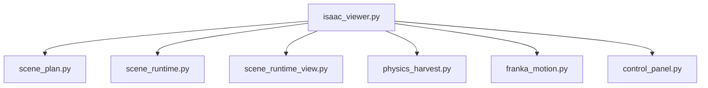
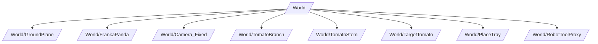
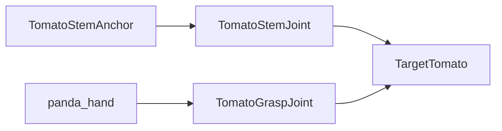
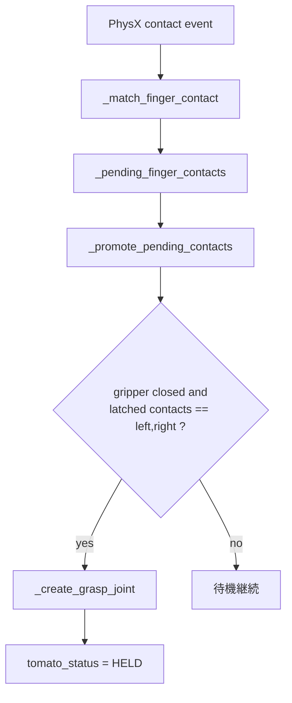
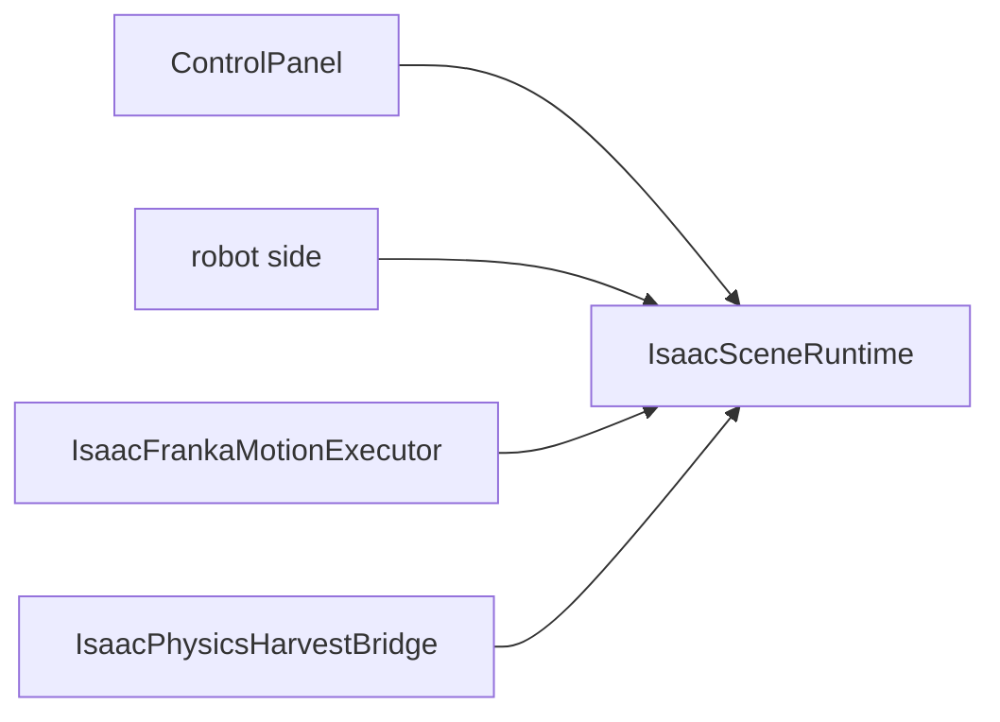

# Simulator README

このディレクトリは、Isaac Sim 上でトマト収穫シミュレータを構成する simulator side の実装をまとめたものである。  
役割は、3D scene の構築、Start / Stop / Reset の UI、scene 状態の正本管理、Franka への動作反映、物理把持と detach の再現である。

## 用語

### prim パス
- USD / Isaac Sim 上のオブジェクトの住所である。
- 例:
  - `/World`
  - `/World/FrankaPanda`
  - `/World/TargetTomato`
  - `/World/Camera_Fixed`
- ファイルパスに近い概念で、親子関係を持つ。

### PhysX
- Isaac Sim が使う物理エンジンである。
- このリポジトリでは、次の挙動を PhysX で扱う。
  - トマトの剛体化
  - 地面 / トレーとの衝突
  - finger とトマトの接触検出
  - stem との固定 joint
  - 把持後の grasp joint

## モジュール構成

- `isaac_viewer.py`
  - Isaac Sim viewer の起動入口
  - stage 作成、camera 生成、control panel 接続を担当する
- `scene_plan.py`
  - prim パス、pose、照明、tray サイズなどの scene 構成をまとめる
- `scene_runtime.py`
  - simulator side の状態正本
  - camera 状態、トマト状態、tool pose、motion target を保持する
- `scene_runtime_view.py`
  - runtime 状態を 3D scene 表示に反映する
- `physics_harvest.py`
  - PhysX ベースの把持、detach、落下、reset を扱う
- `franka_motion.py`
  - Franka articulation に joint trajectory / IK を反映する
- `control_panel.py`
  - Start / Stop / Reset / camera 切替 UI とその制御を担当する

## scene の基本構成

レビュー用 scene は `isaac_viewer._build_scene()` で構築される。  
主な prim は `scene_plan.py` の `ReviewScenePlan` で定義される。

### scene 構築の流れ
1. 空の stage を作る
2. `/World` を作る
3. PhysicsScene を作る
4. ground を置く
5. light を置く
6. 公式 Franka USD を参照追加する
7. branch / stem / tomato / tray を置く
8. fixed camera / hand camera を置く
9. 必要なら PhysX 収穫ブリッジを接続する

## runtime の責務

`scene_runtime.py` の `IsaacSceneRuntime` が simulator side の状態正本である。

主な責務:
- `READY / RUNNING / STOPPED` の scene phase を管理する
- active camera を管理する
- tomato の状態を管理する
  - `ATTACHED`
  - `HELD`
  - `DETACHED`
  - `PLACED`
  - `FALLEN`
- robot tool pose と target pose を管理する
- robot から受け取った motion command を simulator 側状態へ反映する
- Reset 時に scene を初期化する

`scene_runtime.py` は simulator side の論理状態を持つが、実際の PhysX 接触判定や joint の生成は `physics_harvest.py` が行う。

## control panel の責務

`control_panel.py` は 3DView 上の `Tomato Harvest Controls` を管理する。

表示・操作できるもの:
- `Start`
- `Stop`
- `Reset`
- `Fixed Camera`
- `Hand Camera`
- scene / robot / task / tomato の状態表示

補足:
- 物理把持モードでは `Start` 時に `RESET -> 少し待機 -> START` の順に実行する
- `Reset` では camera を `fixed_camera` に戻す

## PhysX 収穫モデル

### 主要オブジェクト

`physics_harvest.py` の `PhysicsHarvestScenePaths` は、物理処理で参照する prim パスの束である。

- `ground_prim_path`
  - 地面
- `tray_prim_path`
  - トレー
- `tomato_prim_path`
  - トマト本体
- `stem_anchor_prim_path`
  - 枝側の見えない固定支点
- `stem_joint_prim_path`
  - 枝とトマトをつなぐ fixed joint
- `grasp_joint_prim_path`
  - hand とトマトをつなぐ fixed joint
- `hand_mount_prim_path`
  - `panda_hand` の prim パス

### 3つの物理要素

- `stem_anchor`
  - 枝側の固定基準点
  - 実装: `_define_stem_anchor()`
- `stem_joint`
  - 枝側固定点とトマトを結ぶ joint
  - 実装: `_create_stem_joint()`
- `grasp_joint`
  - hand とトマトを結ぶ joint
  - 実装: `_create_grasp_joint()`

### scene 準備

`IsaacPhysicsHarvestBridge.prepare_scene()` は次を行う。

1. ground / tray に static collision を付ける
2. `TomatoStemAnchor` を作る
3. tomato に collision / rigid body / mass を付ける
4. `TomatoStemJoint` を作る
5. contact report を subscribe する

### 把持成功判定

把持成功判定は `IsaacPhysicsHarvestBridge.finalize_physics_step()` が行う。

判定材料:
- `gripper_closed == True`
- PhysX contact report で `left` と `right` の両 finger 接触が取れているか
- 一瞬の接触消失に備えた `recent_contacts` / `latched_contacts`
- 必要時のみ geometry fallback

flow:

補足:
- 接触イベントだけで左右 finger 両接触が安定しない場合は、
  `_augment_contacts_from_grasp_geometry()` が finger 幾何位置から補完する
- geometry fallback は、物理接触がまったく無いときには使わない

## detach と place の判定

`finalize_physics_step()` は、把持後も状態を監視する。

### detach
- `grasp_joint` が有効
- かつ `stem_anchor` と `tomato` の距離が `DETACH_DISTANCE_M` 以上

になると、`TomatoStatus.DETACHED` を報告する。

### place / fall
- `grasp_joint` が有効
- かつ gripper を開いた

とき、
- place pose 近傍なら `PLACED`
- そうでなければ `FALLEN`

と判定する。

## reset の仕様

`IsaacPhysicsHarvestBridge.reset_scene()` は次を行う。

1. contact 状態をクリアする
2. `grasp_joint` を削除する
3. `stem_anchor` を初期 tomato pose に戻す
4. tomato を初期 pose に戻す
5. tomato の速度を 0 にする
6. `stem_joint` を再生成する
7. tomato 状態を `ATTACHED` に戻す

つまり Reset 後は、必ず「枝についた初期トマト」に戻る。

## simulator side の処理境界

- `scene_runtime.py`
  - simulator の論理状態を持つ
- `franka_motion.py`
  - articulation を実際に動かす
- `physics_harvest.py`
  - PhysX 接触 / joint / detach / place を扱う
- `control_panel.py`
  - ユーザー操作を scene へ伝える

## 現状仕様として重要な前提

- hand camera は `panda_hand` 配下にぶら下げる
- tomato は 1 個のみ
- branch / stem / tomato / tray は simulator 側固定 scene として生成する
- Reset 時のみ tomato は初期位置へ戻す
- Start を押しただけでは active camera を強制変更しない
- 把持成功は「左右 finger の安定接触 + gripper closed」で判定する

## 読み始める順番

このディレクトリを追うときの推奨順:

1. `scene_plan.py`
2. `isaac_viewer.py`
3. `scene_runtime.py`
4. `control_panel.py`
5. `physics_harvest.py`
6. `franka_motion.py`
